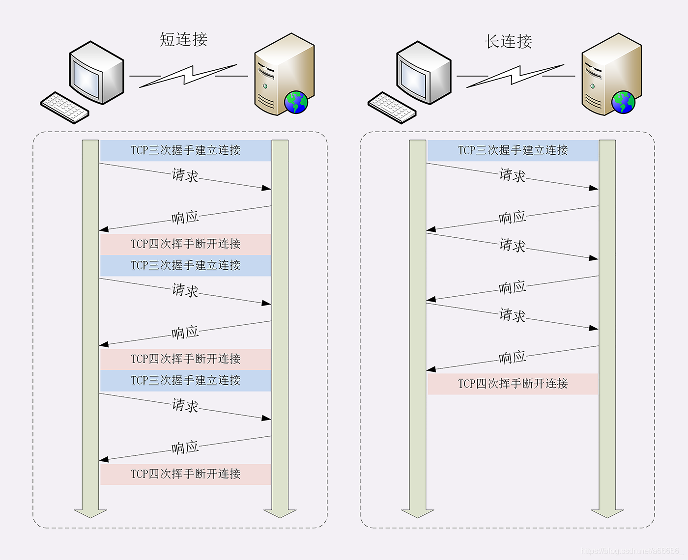
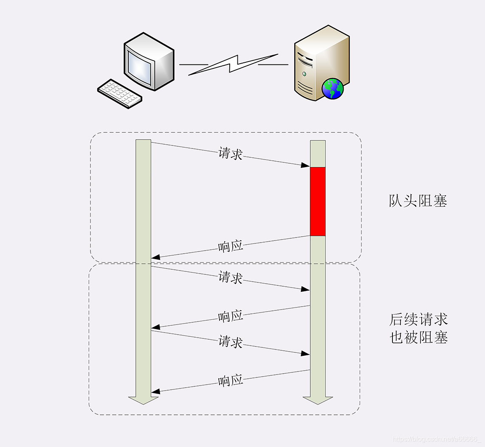

## 短连接 长连接
早期的HTTP协议也被成为是"无连接"。不会与服务器保持长期的连接状态，所以也成为短连接

到HTTP1.1就出现了长连接的通信方式，也叫持久连接、连接保活、连接复用

短连接以及长连接都可以用下图解释

其实蛮好理解的，短连接就是http每一次**请求-应答**前都要建立连接，然后断开连接，想要再次连接-应答就要再次建立连接

长连接就是客户端不让你断开连接，你就一直连着不断开

不管客户端是否显式要求长连接，如果服务器支持长连接，他总会在响应报头里放一个"Connection:keep-alive"字段，告诉客户端支持长连接

:::tip
因为TCP连接长时间不关闭，服务器必须在内存里保存它的状态，这就占用了服务器的资源。如果有大量的空闲长连接只连不发，就会很快耗尽服务器的资源，导致服务器无法为真正的用户提供服务。所以，长连接也需要在恰当的时间关闭，不能永远保持与服务器的连接，这在客户端或者服务器都可以做到。

客户端在请求头加上"Connection:close"字段，告诉服务器：这次通信后就关闭连接。服务器看到这个字段，就知道客户端要主动关闭连接，于是在响应报文也加上这个字段，发送之后就调用Socket API关闭TCP连接

另外，客户端和服务器都可以在报文里附加通用头字段keep-alive:timerout=value，限定长连接的超时时间。但这个字段的约束力并不强，通信双方可能并不会遵守，所以不太常见
:::

服务端通常不会主动关闭连接，但也可以使用一些策略。拿Nginx来举例，它有两种方式：
1. 使用keepalive_timeout指令，设置长连接的超时时间，如果在一段时间内连接上没有任何数据收发就主动断开连接，避免空闲了解占用系统资源
2. 使用keepalive_requests指令，设置长连接可发送的最大请求次数。比如设置为1000，那么当Nginx在这个连接上处理了1000个请求后，也会主动断开连接

## 队头阻塞

队头阻塞与短连接和长连接无关，而是由HTTP基本的请求-应答模型所导致的。因为HTTP规定报文必须一发一收，这就像星星了一个先进先出的队列

队列里的请求没有轻重缓急的优先级，只有入队的先后顺序，排在最前面的请求被优先处理。如果对首的请求因为处理的太慢耽误了时间，那么队列里后面的所有请求也不得不跟着一起等待，结果就是其他的请求承担了不应有的时间成本

## 性能优化

对于队头阻塞，有什么办法可以优化

有两种办法，**一种是并发连接，另一种是域名分片**

并发连接，也就是同时对一个域名发起多个长连接，用数量来解决质量的问题。但是这种方式也存在缺陷。如果每个客户端都想自己快，建立了很多谅解，用户数*并发数就会是天文数字。服务器的资源根本就扛不住，或者被服务器认为是恶意攻击，反而会造成拒绝服务。所以HTTP协议建议客户端使用并发，但是不能滥用并发。RFC2616里明确限制了每个客户端最多并发2个链接

HTTP协议和浏览器不是限制并发链接数量了吗？那么我就多开几个域名，比如 shard1.chrono.com、shard2.chrono.com，而这些域名都指向同一台服务器 www.chrono.com