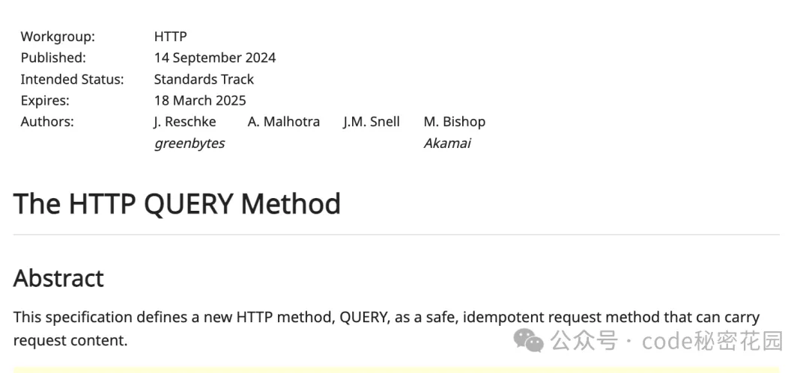

在传统的HTTP协议中，GET 和 POST 是最常用于请求数据的两种方法。然而，他们各自有着一定的局限性。特别是当请求数据量较大时,通过GET方法将参数嵌入URL中显的不够灵活。另一方面，尽管POST方法允许在请求体中传递大量数据，却无法保证操作的幂等性和安全性。

为了弥补这些不足，HTTP工作组提出了一种新的方法--QUERY,该方法既能承载大量请求数据，又能保证请求的幂等性和安全性



## QUERY方法的定义
QUERY是一种安全且幂等的HTTP请求方法，它允许携带请求内容。与GET方法不同，QUERY 方法并不请求服务器放回指定URI资源的表示，而是要求服务器根据请求请求内容进行查询操作。简单来说，QUERY方法通过请求体来定义查询操作，并将操作结果作为响应返回

### 使用场景
当请求参数较多或数据量较大时，通过URI传递参数显的困难。这时，QUEYR 方法能够更好的解决此问题。举个例子
```shell
GET /search?q=example&limit=10&sort=desc HTTP/1.1
Host: conardli.top
```
如果查询参数非常多，可能会导致URL长度超出限制，或者在某些系统中无法正常传递。这时可以使用QUERY方法；
```shell
QUERY /search HTTP/1.1
Host: conardli.top
Content-Type: application/json

{
    "q": "ConardLi",
    "limit": 17,
    "sort": "desc"
}
```
以上代码展示了如何通过请求体传递参数，避免了 URL 过长的问题。

### 幂等性和安全性
与POST 方法不同，QUERY 方法明确表示查询操作是安全的，不会改变服务器上的资源状态。这意味着，无论请求多少次，服务器资源的状态都不会因为QUERY请求而发生变化。

另外，QUERY 方法的幂等性保证了相同的请求会得到相同的结果，这对于缓存和自动重试等操作非常有用

## 缓存机制
QUERY 方法的响应是可缓存的，缓存机制与其他HTTP方法类似。为了提高缓存效率，应对请求内容进行规范化处理，例如移除内容编码、基于格式规范化请求内容等

## Accept-Query响应头
服务器可以通过在响应中包含 Accept-Query 头字段来明确支持 QUERY 方法，并指定可用的查询格式媒体类型。例如：
```shell
Accept-Query: application/json,application/xml
```
## 示例
以下是一些 QUERY 方法的典型使用示例

### 简单查询直接响应
```shell
QUERY /contacts HTTP/1.1
Host: conardli.top
Content-Type: example/query
Accept: text/csv

select surname, givenname, email limit 17

# 响应
HTTP/1.1 200 OK
Content-Type: text/csv

surname, givenname, email
Smith, John, john.smith@conardli.top
Jones, Sally, sally.jones@conardli.top
Dubois, Camille, camille.dubois@example.net
```
### 带有 Location 和 Content-Location 的响应
```shell
QUERY /contacts HTTP/1.1
Host: conardli.top
Content-Type: example/query
Accept: text/csv

select surname, givenname, email limit 17

# 响应
HTTP/1.1 200 OK
Content-Type: text/csv
Content-Location: /contacts/responses/42
Location: /contacts/queries/17

surname, givenname, email
Smith, John, john.smith@conardli.top
Jones, Sally, sally.jones@conardli.top
Dubois, Camille, camille.dubois@example.net
```
### 简单查询间接响应（303 See Other）
```shell
QUERY /contacts HTTP/1.1
Host: conardli.top
Content-Type: example/query
Accept: text/csv

select surname, givenname, email limit 17

# 响应
HTTP/1.1 303 See Other
Location: http://conardli.top/contacts/query123
```
随后，客户端可以通过 GET 请求 Location 返回的资源来获取查询结果：
```shell
GET /contacts/query123 HTTP/1.1
Host: conardli.top
Accept: text/csv

# 响应
HTTP/1.1 200 OK
Content-Type: text/csv

surname, givenname, email
Smith, John, john.smith@conardli.top
Jones, Sally, sally.jones@conardli.top
Dubois, Camille, camille.dubois@example.net
```

## 最后
与其他HTTP方法类似，QUERY方法也需要注意一些安全性问题。例如,避免在URL中暴漏敏感信息，尽量使用请求体传递查询参数。当服务器创建临时资源来标识 QUERY 请求结果时，应该避免在 URI 中以明文形式暴漏原始请求内容

QUERY 方法的引入为 HTTP 协议提供了更灵活的查询机制，解决了大数据量请求传递的难题，同时保证了请求的安全性和幂等性。对于开发者来说，这是一种非常常用的方法，可以在各种应用场景中发挥作用


## 资料
[HTTP 将增加一个新的方法类型！](https://mp.weixin.qq.com/s/x6S8LDvOjXeEf8zO5TNTHw)