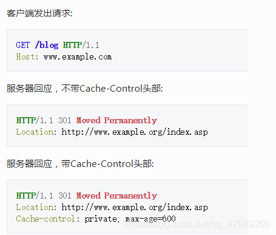
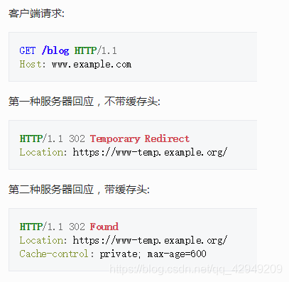
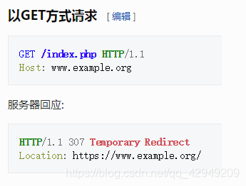
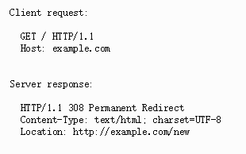
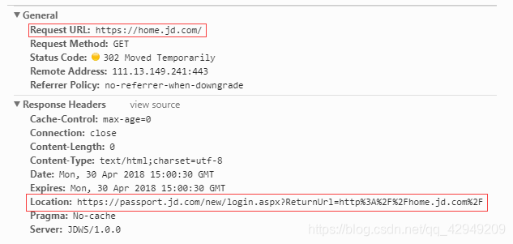
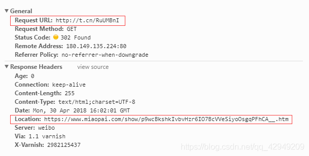

## 状态码的解释

### 301 Moved Permanently(永久移动)

被请求的资源已永久移动到新位置，并且将来任何对此资源的引用都应该使用本响应返回的若干个URI之一。如果可能，拥有链接编辑功能的客户端应当自动把请求的地址修改为从服务器反馈回来的地址。除非额外指定，否则这个响应也是可缓存。新的永久性的URI应当在响应的Locaiton域中返回。除非这是一个HEAD请求，否则响应的实体中应当包含指向新的URI的超链接及简短说明。如果这不是一个GET或HEAD请求，因此浏览器禁止自动进行重定向，除非得到用户的确认，因为请求的条件可能因此发生变化，对于某些使用HTTP/1.0协议的浏览器，当它们发送了POST请求得到了一个301响应的话，接下来重定向请求将会变成GET请求。

### 302 Fount(发现)

要求客户端执行临时重定向(原始描述短语为"Moved Temporarily")。由于这样的重定向是临时的，客户端应该继续向原有地址发送以后的请求。只有在Cache-Control或者Expires中进行了指定的情况下，这个响应才可以缓存的。新的临时性的URI应当在响应的Location域中返回。除非这是一个HEAD请求，否则响应的实体中应当包含指向新的URI的超链接和简短说明。如果这不是一个GET请求或Head请求，那么浏览器禁止自动进行重定向，除非得到用户的确认，因为请求的条件可能因此发生变化。意：虽然RFC 1945和RFC 2068规范不允许客户端在重定向时改变请求的方法，但是很多现存的浏览器将302响应视作为303响应，并且使用GET方式访问在Location中规定的URI，而无视原先请求的方法。因此状态码303和307被添加了进来，用以明确服务器期待客户端进行何种反应。

### 307 Temporary Redirect(临时重定向)

在这种情况下，请求应该与另一个URI重复，但后续的请求应仍使用原始的URI。与302相反，当重新发出原始请求时，不允许更改请求方法。例如：应该使用另一个POST请求来重复POST请求

### 308 Permanent Redirect(永久重定向)
请求和所有将来的请求应该使用另一个URI重复。307和308重复302和301的行为，但不允许HTTP方法更改。例如，将表单提交给永久重定向的资源可能会顺利进行

### 301/302/303/307/308的区别

301, 302是http1.0的内容，303，307，308是http1.1的内容

301，302本来规范中是不允许重定向时改变请求的方法的(将POST改为GET)，但是许多浏览器却允许重定向改变请求方法(这是一种不规范的实现)

303的出现正式为了给上面的301，302这种行为作出规范(将错就错)，也就是允许重定向时改变请求方法。此外303请求禁止被缓存

大多数的浏览器处理302响应时的方式恰恰就是上述规范要求客户端处理303响应时应当做的，所以303基本用的少，一般用302

307，308的出现也是给上面的行为作出规范，不过是不允许重定向时改变请求方法

---|Permanent|Temporary
---|---|---
Allows changing the request method from POST to GET | 301 | 302
Does not allow changing the request method from POST to GET | 308 | 307

注：永久（Permanent）和临时（Temporary）的区别

永久是指原来访问的资源已经永久删除了，客户端应该根据新的URI访问重定向

临时是指访问的资源可能暂时先用location的URI访问，但是旧资源还在，下次你再来访问可能就不用重定向了。

故301和302的区别

301表示搜索引擎在抓取新内容的时候也将旧的网址交换为重定向之后得地址;302表示旧地址A的资源还在(仍然可以访问)，这个重定向只是临时的从旧地址跳转到地址B，搜索引起会抓取新的内容而保存旧的网址。

## 使用场景

因为301与302的区别，所以导致产生302网址劫持，故不建议使用重定向(然而浏览器默认是使用302重定向)

### 使用301的场景(一般是资源位置永久更改)
1. 域名到期不想续费(或者发现了更适合网址的域名)，想换个域名
2. 在搜索引擎的搜索结果中出现了不带www的域名，而带www的域名却没有收录，这个时候可以用301重定向来告诉搜索引擎我们的目标域名是哪一个
3. 空间服务器不稳定，换空间的时候

注：另外，返回301请求码进行跳转被谷歌认为是将网站地址由 HTTP 迁移到 HTTPS的最佳方法(然而大家都用302。。。。)

### 使用302的场景(一般是普通的重定向需求:临时调整)
1. 未登录前先使用302重定向到登录页面，登录成功后在跳回到原来请求的页面

举个例子，比如我未登录京东钱我就访问京东的个人界面，然后就会重定向到登录界面，可以通过浏览器的dev-tool查看状态码

我们可以发现响应的状态码为302，并且返回了location为登录界面的url，并且附带了RetrunUrl方便我们登录后跳回到个人界面

2. 像微博之类的使用短域名，用户浏览后需要重定向到真是的地址之类

例如我访问一个微博的秒拍视频链接：http://t.cn/RuUMBnI，然后重定向到了实际的视频地址miaopai.com，状态码为302。

### 使用307场景

很少用，与302类似，只不过是针对POST方法的请求不允许更改方法

不过我在访问百度时，发现用了307状态码

### 使用308的场景

很少用，与301类似，只不过是针对POST方法的请求不允许更改方法

## 参考

[http 301, 302 303, 307 308区别](https://blog.csdn.net/qq_42949209/article/details/108615708)

[http中响应状态码](https://zhuanlan.zhihu.com/p/60669395)

