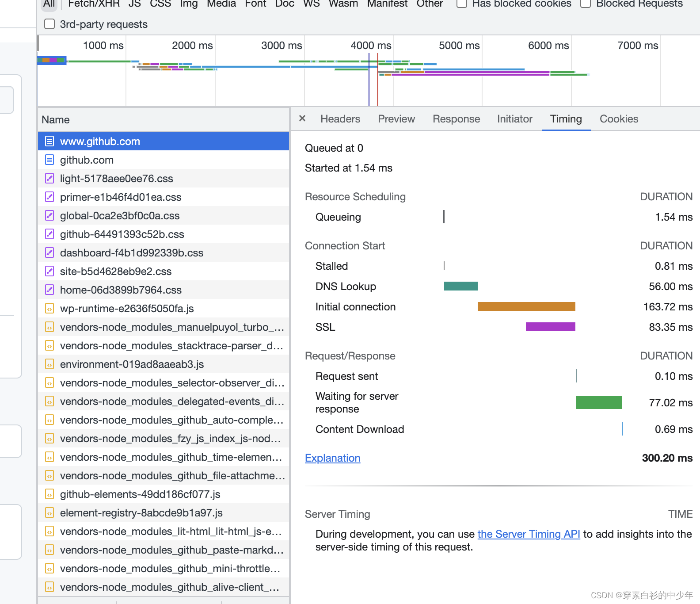
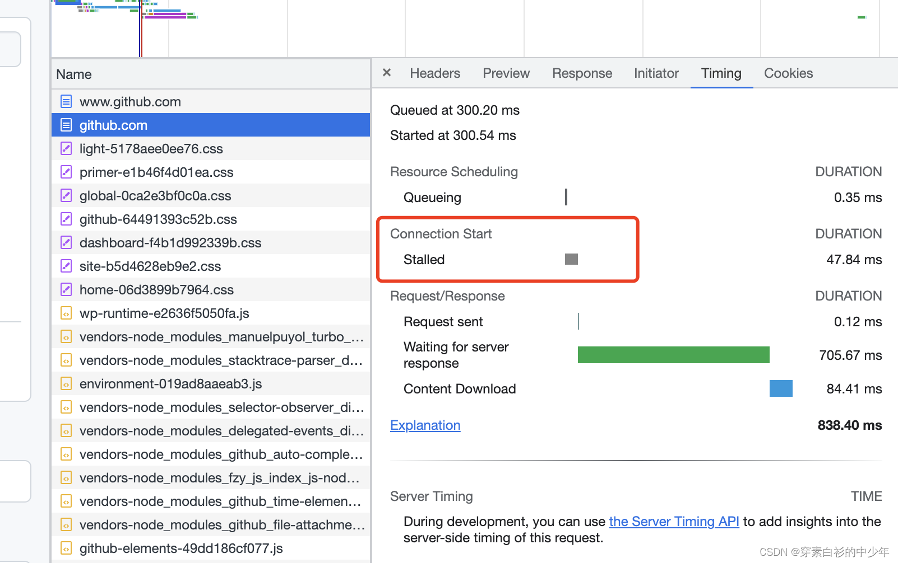
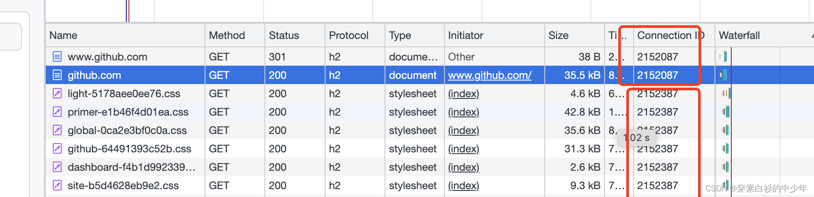
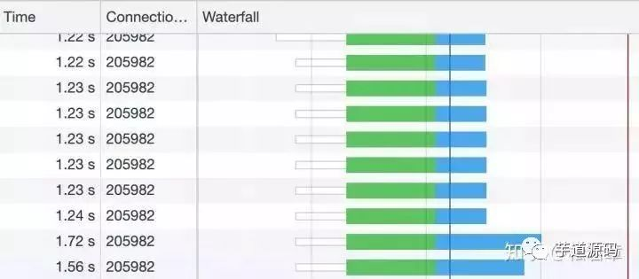
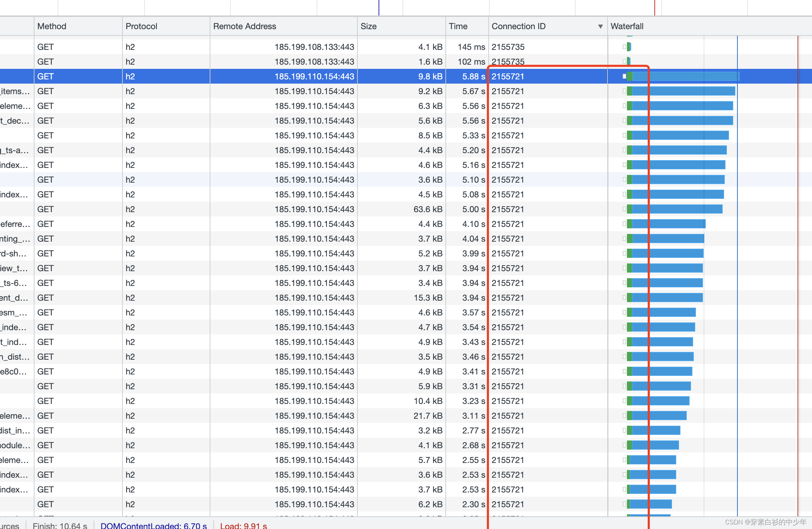

## 文档阅读
[网络协议概论](https://developer.chrome.com/docs/devtools/network/#queued-or-stalled-requestsdevelopers.google.com)

## 整理输出
曾经有这么一道面试题:从URL在浏览器被输入到页面展现的过程中发生了什么？

相信大多数准备过的同学都能回答出来,但是如果继续问:收到的HTML如果包含几十个图片标签，这些图片以什么方式、什么顺序、建立了多少连接、使用什么协议呗下载下来呢？

要搞懂这个问题，我们需要先解决下面五个问题:
1. 现代浏览器在与服务器建立了一个 TCP 连接后是否会在一个 HTTP 请求完成后断开？什么情况下会断开？
2. 一个 TCP 连接可以对应几个 HTTP 请求？
3. 一个 TCP 连接中 HTTP 请求发送可以一起发送么（比如一起发三个请求，再三个响应一起接收）？
4. 为什么有的时候刷新页面不需要重新建立 SSL 连接？
5. 浏览器对同一 Host 建立 TCP 连接到数量有没有限制？

## 第一个问题
**现代浏览器与服务器建立了一个TCP连接后是否会在一个HTTP请求完成后断开?什么情况下会断开？**

在HTTP/1.0中，一个服务器在发送完一个HTTP响应后，会断开连接。

但是这样每次请求都会重新建立和断开TCP连接，代价过大。

所以虽然标准中没有设定，某些服务器对Connection:keep-alive的Header进行了支持

意思是说，完成这个HTTP请求之后，不要断开HTTP请求使用的TCP连接。

这样的好处是链接可以被重新使用，之后发送HTTP请求的时候不需要重新建立TCP连接，以及如果维持连接，那么SSL的开销也可以避免

两张图片是我短时间内两次访问 GitHub: Where the world builds software · GitHub 的时间统计：

头一次访问/请求，有初始化连接和 SSL 开销，

接下来的请求，初始化连接和 SSL 开销消失了，说明使用的是同一个 TCP 连接。

而且从连接ID也可以知道，如下：

持久连接:既然维持TCP连接好处那么多，HTTP1.1就把Connection头写进标准，并且默认开启持久连接，除非请求中写明Connection: close，那么浏览器与服务器之间会维持一段时间的TCP连接，不会一个请求结束就断掉

**所以第一个问题的答案是：默认情况下建立TCP不会断开，只有在请求报头中声明Connection：close才会在请求完成后关闭连接**

## 第二个问题
**一个TCP连接可以对应几个HTTP请求**

了解了第一个问题之后，其实这个问题已经有了答案，如果维持连接，一个TCP连接可以发送多个HTTP请求(6个)
> 短连接通常是不会维持连接的，也就是短连接只支持一个http请求，不过我们在平时项目开发，通常不是很关注这个问题--到底是使用短连接还是长链接，但是作为高级技术人员、技术管理应该保持知识的全名

## 第三个问题
**一个TCP连接中HTTP请求发送可以一起发送吗？**

HTTP/1.1存在一个问题，单个TCP连接同一时刻只能处理一个请求

两个请求的生命周期不能重叠，任意两个 HTTP 请求从开始到结束的时间在同一个 TCP 连接里不能重叠。

虽然 HTTP/1.1 规范中规定了 Pipelining 来试图解决这个问题，但是这个功能在浏览器中默认是关闭的。

先来看一下 Pipelining 是什么，RFC 2616 中规定了：
:::tip
一个支持持久连接的客户端可以在一个连接中发送多个请求（不需要等待任意请求的响应）。收到请求的服务器必须按照请求收到的顺序发送响应。
:::
至于标准为什么这么设定，我们可以大概推测一下原因:由于HTTP/1.1是个文本协议，同时返回的内容并不能区分对应于哪个发送的请求，所以顺序必须维持一致。

比如你向服务器发送了两个请求 GET/query?q=A 和 GET/query?q=B，服务器返回了两个结果，浏览器是没有办法根据响应结果来判断响应对应于哪一个请求的。

Pipelining 这种设想看起来比较美好，但是在实践中会出现许多问题：
- 一些代理服务器不能正确的处理 HTTP Pipelining。

- 正确的流水线实现是复杂的。

- Head-of-line Blocking 连接头阻塞「TCP存在的特性，队头阻塞，这是TCP的缺陷之一」：在建立起一个 TCP 连接之后，假设客户端在这个连接连续向服务器发送了几个请求。按照标准，服务器应该按照收到请求的顺序返回结果，假设服务器在处理首个请求时花费了大量时间，那么后面所有的请求都需要等着首个请求结束才能响应。

所以现代浏览器默认是不开启 HTTP Pipelining 的。

但是，HTTP2 提供了 Multiplexing 多路传输特性「多路复用技术，但是跟服务端的多路复用技术不是一个概念，只是名字相同而已」，可以在一个 TCP 连接中同时完成多个 HTTP 请求。

至于 Multiplexing 具体怎么实现的就是另一个问题了。我们可以看一下使用 HTTP2 的效果。

绿色是发起请求到请求返回的等待时间，蓝色是响应的下载时间，可以看到都是在同一个 Connection，并行完成的。「这里的时间/瀑布并不是完全一样的，基本是（绿色：等待时间）是一样的，但是（蓝色：下载时间）跟文件内容大小成正相关，思考一下就会明白，应当如此」

所以这个问题也有了答案：在 HTTP/1.1 存在 Pipelining 技术可以完成这个多个请求同时发送，但是由于浏览器默认关闭，所以可以认为这是不可行的。

在 HTTP2 中由于 Multiplexing 特点的存在，多个 HTTP 请求可以在同一个 TCP 连接中并行进行。

那么在 HTTP/1.1 时代，浏览器是如何提高页面加载效率的呢？主要有下面两点
- **维持和服务器已经建立的TCP连接，在同一连接上顺序处理多个请求**。(可由开发人员控制吗？TBD,个人此时想法，应可控制，但是很可能是浏览器已经做了这样，不需要开发人员干预)
- **和服务器建立多个TCP连接**(同样，这应也是前端客户端，如浏览器或者App的SDK已经封装了，TBD)

## 第四个问题
**为什么有的时候刷新页面不需要重新建立SSL连接**

在第一个问题的讨论中已经有答案了，TCP连接有的时候会被浏览器和服务端维持一端时间。

TCP不需要重新建立，SSL自然也会用之前的

## 第五个问题
**浏览器对同一Host建立TCP连接到数量有没有限制**

假设我们还处在 HTTP/1.1 时代，那个时候没有多路传输，当浏览器拿到一个有几十张图片的网页该怎么办呢？

肯定不能只开一个 TCP 连接顺序下载，那样用户肯定等的很难受，但是如果每个图片都开一个 TCP 连接发 HTTP 请求，那电脑或者服务器都可能受不了，要是有 1000 张图片的话总不能开 1000 个TCP 连接吧，你的电脑同意 NAT 也不一定会同意。

所以答案是：有。

**Chrome最多允许对同一个Host建立6个TCP连接，不同的浏览器有一些区别**

那么回到最开始的问题，收到的 HTML 如果包含几十个图片标签，

这些图片是以什么方式、什么顺序、建立了多少连接、使用什么协议被下载下来的呢？

如果图片都是HTTPS连接并且在同一个域名下，那么浏览器在SSL握手之后会和服务器商量能不能用HTTP2，如果能的话就使用Multiplexing功能在这个连接上进行多路传输。

不过也未必会所有挂在这个域名的资源都会使用一个 TCP 连接去获取，但是可以确定的是 Multiplexing 很可能会被用到。

如果发现用不了 HTTP2 呢？或者用不了 HTTPS（现实中的 HTTP2 都是在 HTTPS 上实现的，所以也就是只能使用 HTTP/1.1）。

那浏览器就会在一个 HOST/站点 上建立多个 TCP 连接，连接数量的最大限制取决于浏览器设置，这些连接会在空闲的时候被浏览器用来发送新的请求。

如果所有的连接都正在发送请求呢？那其他的请求就只能等等了。「页面表现就是加载加载/响应比较慢，甚至超时」

## 资料
[TCP 连接与HTTP 请求](https://blog.csdn.net/william_n/article/details/127266819)

[HTTP请求是如何断开TCP连接的](https://blog.csdn.net/qq_14868375/article/details/81705252)