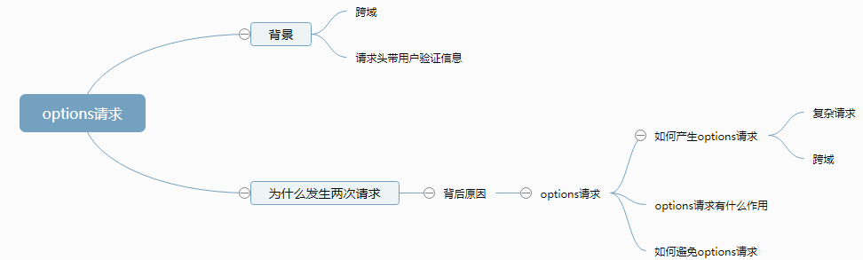

## options是什么
http的请求方式包括OPTIONS、GET、POST、HEAD、PUT、DELETE、TRACE和CONNECT等八种请求方式。其中，get与post只是我们最常用的请求方式。

**options请求的官方定义**:OPTIONS方法是用于请求获得由Request-URI标识的资源在请求/响应的通信过程中可以使用的功能选项。通过这个方法，客户端可以在采取具体资源请求之前，决定对该资源采取何种必要措施，或者了解服务器的性能

**也就是说**：在发生正式的请求之前，先进行一次预检请求。看服务器返回一些信息，浏览器拿到之后，看后台是否允许访问

## 为什么会产生options请求
- 原因
  1. 客户端发送了复杂请求。复杂请求对应简单请求
  2. 客户端的请求跨域
- 简单请求
  1. 请求方法只能是GET或HEAD或POST
  2. 当请求方法是POST时，Content-Type必须是application/x-www-form-urlencoded、multipart/form-data、text/plain中的一个值
  3. 请求头没有自定义HTTP头部。请求头限制这几个字段：Accept、Accept-Language、Content-Language、Content-Type、Last-Event-ID。

## options请求的作用
官方将头部带自定义信息的请求方式称为带预检的跨域请求。在实际调用接口之前，会首先发出一个options请求，检测服务器是否支持真实的请求进行跨域请求。真实请求在options请求中，**通过request-header将 Access-Control-Request-Headers与Access-Control-Request-Method发送给后台，另外浏览器会自行加上一个Origin请求地址**。服务端在接收到预检请求后，根据资源权限配置，在response-header头部加入access-control-allow-headers(允许跨域请求的请求头)、access-control-allow-methods(允许跨域请求的请求方式)、access-control-allow-origin(允许跨域请求的域)。**另外，服务端还可以通过Access-Control-Max-Age来设置一定时间内无须再进行预检请求，直接用之前的预检请求的协商结果即可**。浏览器再根据服务端返回的信息，进行决定是否再进行真实的跨域请求。这个过程对于用户来说，也是透明的。

另外在HTTP响应头，凡是浏览器请求中携带了身份信息，而响应头中没有返回Access-Control-Allow-Credentials: true的，浏览器都会忽略此次响应。

**总结：只要是带自定义header的跨域请求，在发送真实请求前都会先发送OPTIONS请求，浏览器根据OPTIONS请求返回的结果来决定是否继续发送真实的请求进行跨域资源访问**。所以复杂请求肯定会两次请求服务端。也就是说，浏览器会先询问服务器，当前网页所在域名是否在服务器的许可名单之中，服务器允许之后，浏览器才会发出正式的XMLHttpRequest请求，否则会报错。

## options请求如何避免
1. 使用代理，避开跨域
2. 将复杂跨域请求更改为简单跨域请求
3. 不是用带自定义配置的header头部
4. 后端解决，设置不进行options预检

## 资料
[HTTP中的options请求](https://www.cnblogs.com/smalldong/p/14278718.html)