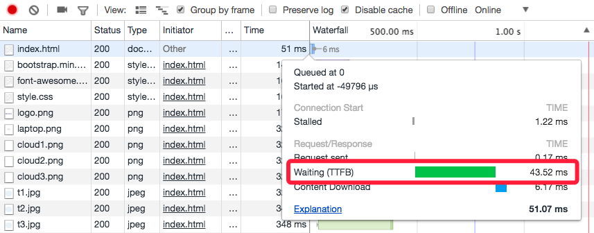
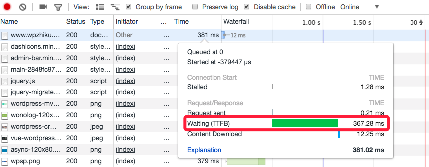

关注网页前端性能的朋友，在优化网页性能的时候都会遇到网站加载**Waiting(TTFB)时间过长**的问题。对于没有优化过的WordPress站点，TTFB时间经常超过了页面内容的下载时间，为用户带来不必要的等待时间。这个问题主要原因在服务端，不熟悉服务器运维的朋友优化起来可能会不知道从哪里下手，今天我们来分析一下TTFB时间过程的原因和解决办法

## 什么是Waiting(TTFB)时间
TTFB是Time to First Byte的缩写，指的是浏览器开始接收到服务器响应数据的时间(后台处理时间+重定向时间),是反映服务端响应速度的重要指标。就像你问朋友了一个问题，你的朋友思考了一会儿才给你答案，你朋友思考的时间就相当于TTFB。你朋友思考的时间越短，就说明你朋友越聪明或者你的问题越熟悉。对服务器来说，TTFB时间越短，就说明服务器响应越快

## TTFB时间多长算长？
因为每个服务器的硬件和网络环境都不尽相同，每个服务器的TTFB时间也不相同。如果你想知道你的服务器优化可以到什么程度，大家可以上传一些静态的HTML页面到服务器，然后打开这些静态页面，看一下这些页面的TTFB时间，大多数服务器的TTFB时间都在50ms一下，这个时间是我们优化的时候可以追求的时间。下面两个途中的TTFB时间分别是本站所在服务器的静态和动态网页的TTFB等待时间

静态网页Waiting(TTFB)时间

动态网页Waiting(TTFB)时间

根据我们的测试，TTFB时间如果超过了500ms，用户在打开网页的时候就会感觉到明显的等待。我们可以把500ms以上认为是TTFB时间过长。可见wrokdpress智库的服务器还不算差

## TTFB过长原因
我们知道，对于动态网页来说，服务器收到用户一个页面的请求时，首先要从数据库中读取该页面需要的数据，然后把这些数据传入到模板中，模板渲染后，在返回给用户。由于查询数据和渲染模板需要一定的时间，在这个过程没有完成之前，浏览器就一直处于等待接收服务器响应的状态。有些服务器的性能比较低，或者优化没做好，这个时间就会比较长

当然如果服务器与用户之间的网络不好，(比如，服务器在欧洲，用户在中国，用户打开网页的时候，请求需要跨越千山万水才能达到服务器)，服务器接收到用户请求的时间过程，也是导致TTFB时间过程的原因

有时候，页面在用户的浏览器中保存过多的cookie，每次请求，这些Cookie都要发送到服务器，服务器都要处理这些Cookie，这有是导致TTFB时间过长的原因之一

## Waiting(TTFB)时间过长的解决办法
知道了原因，解决办法就显而易见了，那就是缩短服务器响应时间，最简单直接并且有效的办法就是使用缓存，把PHP和MySql的执行时间最小化，一些缓存插件可以把SQL查询结果缓存起来，把几十次查询结果转换为几次；一些缓存插件可以直接把用户所请求的页面静态化，用户打开网页时，相当于直接从服务器下载了静态页面

如果是网络原因，换一个服务器是比较直接的解决办法。如果因为一些原因不能换服务器，可以使用CDN，把页面同步到离用户比较近的CDN节点上,也是一个不错的解决办法

如果是Cookie的原因，可以通过修改应用程序，删除一些不必要的Cookie，或者精简Cookie内容，缩短Cookie的有效期，都是解决办法

本站使用的是 Cachify 插件 Memcached 缓存方式，直接把用户请求过的页面，缓存到了内存中，网站加载 Waiting (TTFB) 时间达到了 50 ms 左右，感兴趣的朋友可以用谷歌浏览器的调试工具查看一下。

## 资料
[网站加载 Waiting (TTFB) 时间过长的原因和解决办法](https://www.wpzhiku.com/wating-ttfb-too-long/)
