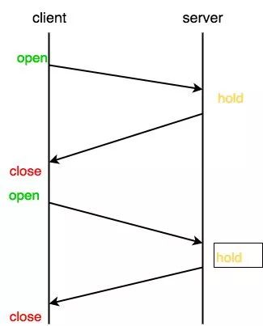

WebSocket协议，实现了客户端与服务端的双向通信的能力。介绍WebSocket之前，还是让我们先了解下轮询实现推送的方式

## 短轮询
段轮询的实现思路就是浏览器端每隔几秒钟发送HTTP请求，服务端收到请求后，不论是否有数据更新，都直接进行响应。在服务的响应完成，就会关闭这个TCP连接，代码实现也最简单，就是利用XHR，通过setInterval定时向后端发送请求，以获取最新数据
```
setInterval(function() {
    fetch(url).then(res => {
        // success code
    })
}, 3000)
```

优点: 实现简单

缺点:会造成数据在一小段时间内不同步和大小无效的请求,安全性差、浪费资源

## 长轮询
客户端发送请求后服务器端不会理解返回数据，服务器端会阻塞请求连接不会立即断开，知道服务器端有数据更新或是连接超时才返回，客户端才再次发出请求新建连接、如此反复从而获取最新数据



客户端代码如下
```
function async() {
    fetch(url).then(res => {
        async();
        // success code
    }).catch(() => {
        // 超时
        asynnc();
    })
}
```

## WebSocket
前面提到的短轮询(Pollinng)和长轮询(Long-Polling),都是先有客户端发起ajax请求，才能进行通信，走的是HTTP协议，服务器端无法主动向客户端推送信息

当出现类似体育赛事、聊天室、实时位置之类的场景时，轮询就显得十分低效和浪费资源，因为要不断发送请求，连接服务器。WebSocket 的出现，让服务器端可以主动向客户端发送信息，使得浏览器具备了实时双向通信的能力。

没用过 WebSocket 的人，可能会以为它是个什么高深的技术。其实不然，WebSocket 常用的 API 不多也很容易掌握，不过在介绍如何使用之前，让我们先看看它的通信原理。

### 通信原理

当客户端要和服务端建立WebSocket连接时，在客户端和服务器的握手过程中，客户端首先会向服务端发送一个HTTP请求，包含一个Upgrade请求头来告知服务端客户端想建立一个WebSocket连接。

在客户端建立一个WebSocket连接非常简单

```
let ws = new WebSocket('ws://localhost:9000');
```

类似HTTP和HTTPS, ws相对应的也有wss用以建立安全连接，本地以ws为例

```
Accept-Encoding: gzip, deflate, br
Accept-Language: zh-CN,zh;q=0.9
Cache-Control: no-cache
Connection: Upgrade	// 表示该连接要升级协议
Cookie: _hjMinimizedPolls=358479; ts_uid=7852621249; CNZZDATA1259303436=1218855313-1548914234-%7C1564625892; csrfToken=DPb4RhmGQfPCZnYzUCCOOade; JSESSIONID=67376239124B4355F75F1FC87C059F8D; _hjid=3f7157b6-1aa0-4d5c-ab9a-45eab1e6941e; acw_tc=76b20ff415689655672128006e178b964c640d5a7952f7cb3c18ddf0064264
Host: localhost:9000
Origin: http://localhost:9000
Pragma: no-cache
Sec-WebSocket-Extensions: permessage-deflate; client_max_window_bits
Sec-WebSocket-Key: 5fTJ1LTuh3RKjSJxydyifQ==		// 与响应头 Sec-WebSocket-Accept 相对应
Sec-WebSocket-Version: 13	// 表示 websocket 协议的版本
Upgrade: websocket	// 表示要升级到 websocket 协议
User-Agent: Mozilla/5.0 (Macintosh; Intel Mac OS X 10_14_0) AppleWebKit/537.36 (KHTML, like Gecko) Chrome/76.0.3809.132 Safari/537.36
```
响应头如下：

```
Connection: Upgrade
Sec-WebSocket-Accept: ZUip34t+bCjhkvxxwhmdEOyx9hE=
Upgrade: websocket
```
此时响应行(Genneral)中可以看到状态码status code 是101 Switching Protocols，表示该连接已经从HTTP协议转换为WebSocket通信协议。转换成功后，该连接并没有中断，而是建立了一个全双工通信，后续发送和接收消息都会走这个连接通道。

注意,请求头中有个Sec-WebSocket-Key字段，和响应头中的Sec-WebSocket-Accept是配套应用，它的作用是提供了基本防护，比如恶意的连接或者无效的连接。Sec-WebSocket-Key是客户端随机生成的一个base64编码，服务器会使用这个编码，并更具一个固定的算法
```
GUID = "258EAFA5-E914-47DA-95CA-C5AB0DC85B11";    //  一个固定的字符串
accept = base64(sha1(key + GUID));	// key 就是 Sec-WebSocket-Key 值，accept 就是 Sec-WebSocket-Accept 值

```
其中 GUID 字符串是 RFC6455（https://tools.ietf.org/html/rfc6455#p-5.5.2）官方定义的一个固定字符串，不得修改。

客户端拿到服务端响应的 Sec-WebSocket-Accept 后，会拿自己之前生成的 Sec-WebSocket-Key 用相同算法算一次，如果匹配，则握手成功。然后判断 HTTP Response 状态码是否为 101（切换协议），如果是，则建立连接，大功告成。

### 实现简单聊

客户端
```
function connectWebsocket() {
    ws = new WebSocket('ws://localhost:9000');
    // 监听连接成功
    ws.onopen = () => {
        console.log('连接服务端WebSocket成功');
        ws.send(JSON.stringify(msgData));	// send 方法给服务端发送消息
    };
 
    // 监听服务端消息(接收消息)
    ws.onmessage = (msg) => {
        let message = JSON.parse(msg.data);
        console.log('收到的消息：', message)
        elUl.innerHTML += `<li class="b">小秋：${message.content}</li>`;
    };
 
    // 监听连接失败
    ws.onerror = () => {
        console.log('连接失败，正在重连...');
        connectWebsocket();
    };
 
    // 监听连接关闭
    ws.onclose = () => {
    	console.log('连接关闭');
    };
};
connectWebsocket();
```
从上面可以看到 WebSocket 实例的 API 很容易理解，简单好用，通过 send() 方法可以发送消息，onmessage 事件用来接收消息，然后对消息进行处理显示在页面上。当 onerror 事件（监听连接失败）触发时，最好进行执行重连，以保持连接不中断。

服务端 Node: （这里使用 ws 库）
```
const path = require('path');
const express = require('express');
const app = express();
const server = require('http').Server(app);
const WebSocket = require('ws');
 
const wss = new WebSocket.Server({ server: server });
 
wss.on('connection', (ws) => {
 
  // 监听客户端发来的消息
  ws.on('message', (message) => {
    console.log(wss.clients.size);
    let msgData = JSON.parse(message);
    if (msgData.type === 'open') {
      // 初始连接时标识会话
      ws.sessionId = `${msgData.fromUserId}-${msgData.toUserId}`;
    } else {
      let sessionId = `${msgData.toUserId}-${msgData.fromUserId}`;
      wss.clients.forEach(client => {
        if (client.sessionId === sessionId) {
          client.send(message);	 // 给对应的客户端连接发送消息
        }
      })
    }
  })
 
  // 连接关闭
  ws.on('close', () => {
    console.log('连接关闭');
  });
});
```

## 参考
[WebSocket 原理浅析与实现简单聊天](https://blog.csdn.net/weixin_39843414/article/details/105672024)