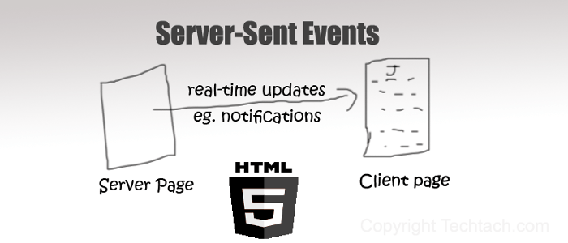
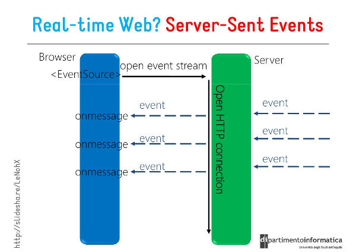

服务器向浏览器推送消息，除了WebSocket，还有一种方法：Server-Sent Events(以下简称SSE).本文介绍它的用法



## SSE本质
严格来说，HTTP协议无法做到服务主动推送消息。但是，有一种变通的方法，就是服务器向客户端声明，接下来要发送的是流信息(streaming).

也就是说，发送的不是一次性的数据包，而是一个数据流，会连续不断的发送过来。这时，客户端不会关闭连接，会一直等着服务器发过来的新的数据流，视频播放就是这样的的例子。本质上，这种通信就是以流信息的方式，完成一次用时很长的下载。

SSE就是利用这种机制，使用流信息向浏览器推送信息。它给予HTTP协议，目前除了IE/Edge,其他浏览器都支持。

## SSE的特点
SSE与WebSocket作用类似，都是建立浏览器与服务器之间的通信渠道，然后服务器向浏览器推送消息。

<span style="color: red">**总体来说，WebSocket更强大和灵活。因为它是全双工通信，可以双向通信;SSE是单向通道，只能服务器向浏览器发送，因为流信息本质上就是下载。如果浏览器向服务器发送消息，就变成了另一个HTTP请求。**</span>



但是，SSE也有自己的有点。

- SSE使用HTTP协议，现有的服务器软件都支持。WebSocket是一个独立协议
- SSE属于轻量级，使用简单；WebSocket协议相对复杂。
- SSE 默认支持断线重连，WebSocket需要自己实现
- SSE 一般只用来传送文本，二进制数据需要编码后传送，Websocket默认支持传送二进制数据
- SSE支持自定义发送的消息类型

因此，两者各有特点，适合不同的场合

## 客户端API
### EventSource对象
SSE的客户端API部署在EventSource对象。下面的diamante可以检测浏览器是否支持SSE
```js
if('EventSource' in window) {
    // ...
}
```
使用SSE时,浏览器首先生成一个EventSource实例，向浏览器发起连接
```js
var source = new EventSource(url)
```
上面的url可以与当前网址同域，也可以跨域。跨域时，可以指定第二个参数，打开 withCredentials 属性，表示是否一起发送Cookie
```js
var source = new EventSource(url, { withCredentials: true })
```
EventSource实例的readyState属性，表示连接额当前状态。该属性只读，可以取以下至值
- 0：相当于常量EventSource.CONNECTING，表示连接还未建立，或者断线正在重连。
- 1：相当于常量EventSource.OPEN，表示连接已经建立，可以接受数据。
- 2：相当于常量EventSource.CLOSED，表示连接已断，且不会重连。
### 基本用法
连接一旦建立，就会出发open事件，可以在onopen属性定义回调函数。
```js
source.onopen = function(event) {
    // ...
}

// 另一种写法
source.addEventListener('open', function(event) {
    // ...
}, false);
```
客户端收到服务器发来的数据，就会触发message事件，可以在onmessage属性的回调函数。
```js
source.onmessage = function(event) {
    var data = event.data;
    // handle message
}

// 另一种写法
source.addEventListener('message', function(event) {
    var data = event.data;
    // handle message
}, false);
```
上面代码中，事件对象的data属性就是服务器端传回的数据(文本格式)。

如果发生通信错误(比如连接终端)，就会触发error事件，可以在onerror属性定义回调函数
```js
source.onerror = function(event) {
    // handle error event
}

// 另一种写法
source.addEventListener('error', function(event) {
    // handle error event
}, false)
```
close 方法用于关闭SSE连接
```js
source.close()
```
### 自定义事件
默认情况下，服务器发来的数据，总是触发浏览器EventSource实例的message事件。开发者还可以自定义 SSE 事件，这种情况下，发送回来的数据不会触发message事件。
```js
source.addEventListener('foo', function(event){
    var data = event.data;
    // handle message
}, false)
```
上面代码中，浏览器对SSE的foo事件进行监听。如何实现服务器发送foo事件，请看下文

## 服务器实现
### 数据格式
服务器向浏览器发送的SSE数据，必须是UTF-8编码的文本，具有如下HTTP头信息
```js
Content-Type: text/event-stream
Cache-Control: no-cache
Connection: keep-alive
```
上面三行之中，第一行Content-Type 必须指定MIME类型为 event-steam

:::tip
每一次发送的消息，由若干个message组成，每个message之间用\n\n分隔。每个message内部由若干含组成，每一行都是如下格式
```js
[field]:value\n
```
上面的field可以取四个值
- data
- event
- id
- retry
:::
此外，还可以有冒号开头的行，表示注释。通常，服务器每隔一段时间就会向浏览器发送一个注释，保持连接不中断
```js
:This is a comment
```
下面是一个例子
```js
: this is a test stream\n\n

data: some text\n\n

data: another message\n
data: with two lines \n\n
```
## data字段
数据内容用data字段表示。
```js
data: message\n\n
```
如果数据很长，可以分成多行，最后一行用\n\n结尾，前面行都用\n结尾
```js
data: begin message\n
data: continue message\n\n
```
下面是一个发送JSON数据的例子
```js
data: {\n
data: "foo": "bar",\n
data: "baz", 555\n
data: }\n\n
```
### id字段
数据标识符用id字段表述，相当于每一条数据的编号
```js
id: msg1\n
data: message\n\n
```
浏览器用lastEventId属性读取这个值。一旦连接断线，浏览器回发送一个HTTP头，里面包含一个特殊的Last-Event-ID头信息，将这个值发送回来，用来帮助浏览器重建连接。因此，这个头信息可以被视为一种同步机制

### Event字段
event字段表示自定义的事件类型，默认是message事件。浏览器可以用addEventListener()监听该事件。
```js
event: foo\n
data: a foo event\n\n

data: an unnamed event\n\n

event:bar\n
data: a bar event\n\n
```
<span style="color:red">上面的代码创造了三条信息。第一条的名字是foo,触发浏览器的foo事件；第二条未取名，表示默认类型，触发浏览器的message事件；第三条是bar,触发浏览器的bar事件</span>


下面是另一个例子
```js
event: userconnect
data: {"username": "bobby", "time": "02:33:48"}

event: usermessage
data: {"username": "bobby", "time": "02:34:11", "text": "Hi everyone."}

event: userdisconnect
data: {"username": "bobby", "time": "02:34:23"}

event: usermessage
data: {"username": "sean", "time": "02:34:36", "text": "Bye, bobby."}
```
### retry字段
服务器可以用retry字段，指定浏览器重新发起连接的时间间隔
```js
retry: 10000\n
```
两种情况会导致浏览器重新发起连接：一种是时间间隔到期，二是由于网络错误等原因，导致连接出错。

## Node服务器实例
SSE要求服务器与浏览器保持连接。对于不同的服务器软件来说，所消耗的资源是不一样的。Apache服务器，每个连接就是一个线程，如果要维持大量连接，势必要消耗大量资源。Node则是所有连接都在同一个线程，因此消耗的资源会小得多，但是这要求每个连接不能包含很耗时的操作，比如磁盘的IO读写

下面是Node的SSE服务器实例
```js
let http = require('http');

http.createServer(function(req, res) {
    let fileName = '.' + req.url;
    if(fileName === './steam') {
        res.writeHead(200, {
            'Content-Type': 'text/event-stream',
            'Cache-Control': 'no-cache',
            'Connection':'keep-alive',
            'Access-Control-Allow-Origin': '*'
        })
        res.write("retry: 10000\n");
        res.write("event: connecttime\n");
        res.write("data: " + (new Date()) + "\n\n");
        res.write("data: " + (new Date()) + "\n\n");

        interval = setInterval(function () {
            res.write("data: " + (new Date()) + "\n\n");
        }, 1000);

        req.connection.addListener("close", function () {
        clearInterval(interval);
        }, false);
    }
}).listen(8844, '127.0.0.1')
```
请将上面的代码保存为server.js，然后执行下面的命令。
```js
$ node server.js
```
上面的命令会在本机的8844端口，打开一个 HTTP 服务。

然后，打开这个网页，查看客户端代码并运行。

## 资料
[Server-Sent Events 教程](https://www.ruanyifeng.com/blog/2017/05/server-sent_events.html)