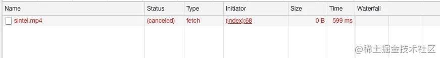
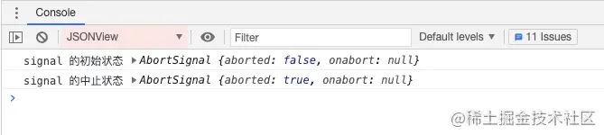
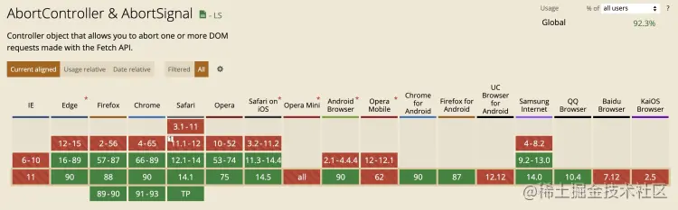
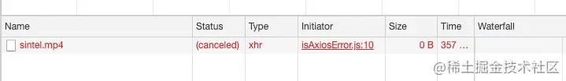
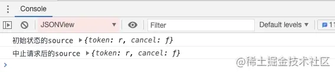
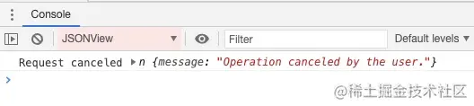

## AbortController
[AbortController](https://developer.mozilla.org/zh-CN/docs/Web/API/AbortController)接口表示一个控制器对象，可以根据需要终止一个或多个请求。

- AbortController():AbortController()构造函数创建一个新的AbortController对象实例
- signal：signal属性返回一个AbortSignal对象实例，它可以用来with/about一个Web(网络)请求
- abort()：终止一个尚未完成的Web(网络)请求，它能够终止fetch请求，任何响应Body的消费者和流

## Fetch中断请求
Fetch是Web提供的一个用于获取资源的接口，如果要终止fetch请求，则可以使用Web提供的AbortController接口

首先我们使用AbortController()构造函数创建一个控制器，然后使用AbortController.signal属性获取其关联AbortSignal对象的引用。当一个fetch request初始化时候，我们把AbortSignal作为一个选项传递到请求对象(如下：{signal})。这将信号与控制器与获取请求相关联，然后允许我们通过调用AbortController.abort()终止请求。

```javascript
const controller = new AbortController();
let signal = controller.signal;
console.log('signal的初始状态', signal);

const download = document.querySelector('.download');
const abortBtn = document.querySelector('.abort');

download.addEventListener('click', fetchVideo);

abortBtn.addEventListener('click', function() {
  controller.abort();
  console.log('signal的终止状态', signal);
})

function fetchVideo() {
  // ...
  fetch(url, {signal}).then(function(){
    // ...
  }).catch(function(e) {
    reports.textContent = 'Download error:' + e.message
  })
}
```
当我们中止请求后，网络请求变成了如下所示的情况



我们再来看看AbortSignal中止前和中止后的状态



可以看到，AbortSignal对象的aborted属性由初始时false变成终止后的true

[线上运行示例(来源MDN)](https://codesandbox.io/s/abortcontroller-cancel-request-f4wzo?file=/index.html:1334-1344)

AbortController有兼容问题



## axios中断请求
axios中断请求有两种方式

### 方式一
使用CancelToken.souce工厂方法创建一个cancel token 代码如下
```javascript
const CancelToken = axios.CancelToken;
const source = CancelToken.source();

axios.get('https://mdn.github.io/dom-examples/abort-api/sintel.mp4', {
  cancelToken: source.token
}).catch(function(thrown) {
  // 判断请求是否已中止
  if(axios.isCancel(thrown)){
    // 参数thrown是自定义信息
    console.log('Request canceled', thrown.message)
  } else {
    // 处理错误
  }
})

// 取消请求(message 参数是可选的)
source.cancel('Operation canceled by the user.')
```

中止后的网络请求变成如下所示



我们再来看看初始时和中止后的source状态



可以看到，初始时和中止后的source状态并没有发生改变,那么我们是如何判断请求的终止状态呢？**axios为我们提供了一个isCancel()方法，用于判断请求的终止状态。isCancel()方法的参数，就是我们在中止请求时自定义信息**



### 方式二
通过传递一个executor函数到CancelToken的构造函数来创建一个canceltoken;

```javascript
const cancelToken = axios.cancelToken;
let cancel;

axios.get('/user/12345', {
  cancelToken: new CancelToken(function executor(c) {
    // executor函数接收一个cancel函数作为参考
    cancel = c;
  })
})

// 取消请求
cacel('Operation canceled by the user.')
```
浏览器运行结果与方式一一直，此处不在赘述

[线上运行示例](https://codesandbox.io/s/axios-cancel-request-qp0q7?file=/index.html:2889-2897)

## umi-request中断请求
umi-request基于fetch封装，兼具fetch与axios的特点，中止请求与fetch和axios一致不在过多赘述，详细可以官方文档[终止请求](https://github.com/umijs/umi-request/blob/master/README_zh-CN.md#%E9%80%9A%E8%BF%87-abortcontroller-%E6%9D%A5%E4%B8%AD%E6%AD%A2%E8%AF%B7%E6%B1%82)

需要注意的是AbortController在低版本浏览器polfill有问题，umi-request在某些低版本并未提供AbortController的放置中止请求

### umi项目中使用CancelToken中止请求
umi项目默认的请求库是umi-request,因此我们可以使用umi-request提供的方法来中止请求。另外，在umi项目中可以搭配使用dva，因此下面简单介绍下在dva中使用CancelToken中止请求的流程

1. 在services目录下的文件中编写请求参数和取消请求参数

  ```javascript
  import request from '@/utils/request';
  const CancelToken = request.CancelToken;
  let cancel:any;

  // 合同文件上传OSS
  export async function uploadContractFileToOSS(postBody: Blob): Promise<any> {
    return request('/fms/ossUpload/financial_sys/contractFil', {
      method: 'POST',
      data: postBody,
      requestType: 'form',
      // 传递一个executor函数到CancelToken的构造函数来啊创建一个cancel tokens
      cancelToken: new CancelToken(c => {
        cancel = c;
      })
    })
  }

  // 取消合同文件上传
  export async function cancelUploadFile() {
    return cancel && cancel();
  }
  ```

2. 在models中编写Effect

  ```javascript
  *uploadContractFileToOSS({ payload }: AnyAction, { call, put }: EffectsCommandMap): any {
    const response = yield call(uploadContractFileToOss, payload);
    yield put({
      type: 'save',
      payload: {
        uploadOSSResult: response?.data,
      }
    })
    return response?.data
  }

  *cancelUploadFile(_: AnyAction, { call }: EffectsCommandMap): any {
    const response = yield call(cancelUploadFile)
    return response
  },

  ```

3. 在页面中通过dispatch函数触发响应的action

  ```javascript
  // 发起请求
  dispatch({
    type: 'contract/fetchContractFiles',
    payload: {
      contractId: `${id}`,
    }
  })

  // 取消请求
  dispatch({
    type: "contract/cancelUploadFile"
  })
  ```

4. 在utils/request.js中统一处理中止请求的拦截

  ```javascript
  const errorHandler = (error: { response: Response }): Response => {
    const {response} = error;
    notification.destroy();

    if (response && response.status) {
      const errorText = codeMessage[response.status] || response.statusText;
      const { status, url } = response;

      notification.error({
        message: `请求错误 ${status}: ${url}`,
        description: errorText,
      });
    }else if (error?.['type'] === 'TypeError') {
      notification.error({
        description: '您的网络发生异常，无法连接服务器',
        message: '网络异常',
      });
    } else if (error?.['request']?.['options']?.['cancelToken']) {
      notification.warn({
        description: '当前请求已被取消',
        message: '取消请求',
      });
    } else if (!response) {
      notification.error({
        description: '您的网络发生异常，无法连接服务器',
        message: '网络异常',
      });
    } else {
      notification.error({
        description: '请联系网站开发人员处理',
        message: '未知错误',
      });
    }
    return response;
  }
  ```

## 资料
[如何中断已发出去的请求](https://juejin.cn/post/7033906910583586829)