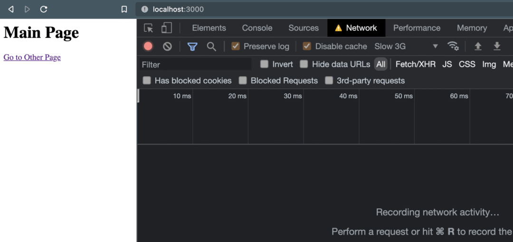
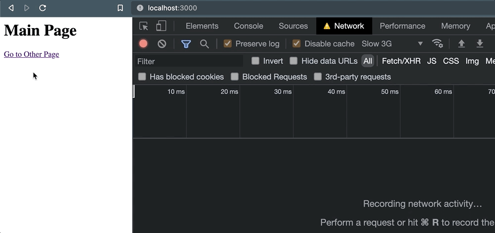

在某些情况下，当用户跳转到其他页面或者提交一个表单的时候，我需要发送一个HTTP请求，用于把一些数据记录到日志中。思考如下场景--- 当一个链接被点击时，需要发送一些信息到外部服务器
```html
<a href="/some-other-page" id="link">Go to page</a>

<script>
    document.getElementById('link').addEventListener('click', e => {
        fetch('/log', {
            method: 'POST',
            header: {
                'Content-Type': 'application/json'
            }, 
            body: JSON.stringify({
                some: 'data'
            })
        })
    })
</script>
```
这个示例并不复杂。链接的跳转行为仍然会正常执行(我并没有使用e.preventDefault()去阻止)。但是在这个行为发生之前，点击事件会触发一个POST请求。我们只需要它发送到我们正在访问的服务即可，而不需要等待这个请求返回。

咋一看你可能觉得处理这个请求是同步的，请求发送后，在我们继续跳转页面的同时，其他服务器也成功的处理这个请求。但事实上并非如此

## 浏览器不能保证继续保持HTTP请求的打开状态
当页面因为某些原因被终止时，浏览器是没法保持正在进行中的HTTP请求能够成功完成([了解更多](https://developers.google.com/web/updates/2018/07/page-lifecycle-api)关于页面的"终止"以及页面生命周期的其他状态)。这些请求的可信度取决于多个因素---网络连接、程序性能甚至是外部服务器自身的配置。

因此这种情况发出的数据可靠性很糟，如果你的业务决策依赖这些日志数据，你可能会带来一个潜在的重大隐患。

为了说明这种场景的不可靠性，我编写了一个基于Express的简单应用，并使用以上代码实现了一个页面。当点击链接时，浏览器会导航到/other,但此之前，会触发一个POST请求。

开始之前，我们会将开发者工具的"网络"标签打开，使用"低速3G"连接速度。一单页面加载完成，我就清除日志，事情看起来相当正常。


5
但是一旦我点击了连接，事情就不对了。当页面导航发生的时，POST请求就被取消了



这使得我们对外部服务实际上能够处理这个请求没有足够的欣欣。为了验证这个行为，当我以编程方式使用window.location导航时，相同的情况发生了
```js
document.getElementById('link').addEventListener('click', (e) => {
+ e.preventDefault();

  // Request is queued, but cancelled as soon as navigation occurs. 
  fetch("/log", {
    method: "POST",
    headers: {
      "Content-Type": "application/json"
    }, 
    body: JSON.stringify({
      some: 'data'
    }),
  });

+ window.location = e.target.href;
});
```
无论导航是如何或何时发生的，以及活动页面是如何终止的，那些未完成的请求都有被抛弃的风险。

## 但是他们为什么会被取消呢？
<span style="color: red">问题的根源在于，默认情况下XHR请求(通过fetch或XHRHttpRequest)是异步非阻塞的。一旦请求进入队列，请求的实际工作就会交给后台的浏览器API</span>

从性能考虑，这是正确的行为——你并不会希望主线程被请求给堵塞。但是这会带来一个风险，就是当页面进入“终止”状态时，这些请求会被抛弃，这就导致了在后台运行的服务不能保证正确完成。这是谷歌对于这个特定生命周期状态的总结[2]：

> 页面浏览器开始卸载页面并对其内存清理时，该页面进入终止状态。在此状态下，不会执行任何新的任务，同时正在处理中的任务如果运行时间过程可能会被杀死

简单来说，<span style="color: blue">浏览器的设计是基于这样的假设:只要页面关闭时，后台队列中的任何进程都不需要在继续执行</span>

## 所以我们有没有别的选择？

## 指示了就蓝旗保持为完成的请求


### 使用fetch的keepalive标志

### 使用Navigator.sendBeacon()方法

### 给ping属性荣誉提名

## 那么，该如何选择？
是使用keep-alive标志的fetch,还是用sendBeacon来发送页面终止时的请求需要权衡。一下建议或许可以帮助你在不同情况下做出正确的选择

- 以下情况可以选择feat()+keepalive
    - 你需要简单的发送自定义的headers的请求
    - 你需要使用GET而非POST
    - 你需要兼容老旧的浏览器(IE),并已经有了一个fetch方法的polyFill
- 以下情况使用sendBeacon()或许更好
    - 你只需要发送一个简单的服务请求，而不需要太多的定制化
    - 你喜欢更简约更优雅的代码方式
    - 你需要保证该请求不会和其他更重要的请求竞争资源


## 资料
[原文](https://mp.weixin.qq.com/s/3moKMIZD8JcgRsO5VXn01Q)

[如何在页面跳转或关闭时优雅的发送ajax请求](https://www.cnblogs.com/cangqinglang/p/12403027.html)