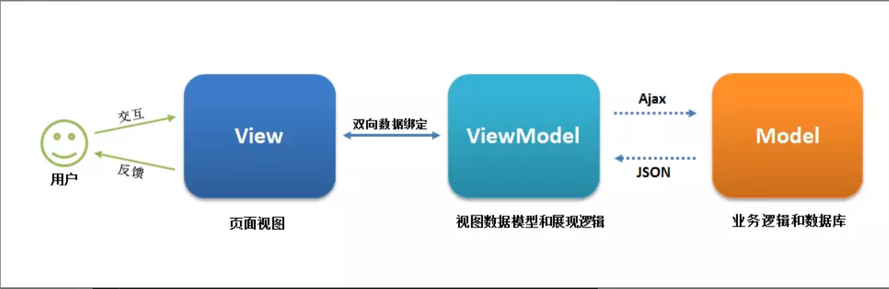
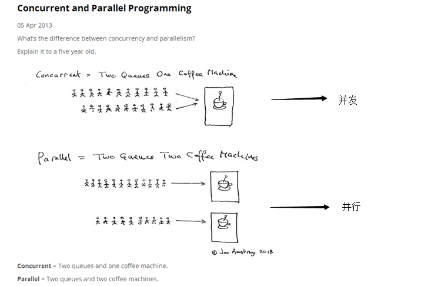

## XMLHttpRequest

浏览器通过XMLHttpRequest对象进行http通信

传统Ajax指的是XMLHttpRequest(XHR),最早出现的向后端发送请求技术，隶属于原始js中，核心使用XMLHttpRequest对象，多个请求如果有先后关系的话，就会出现回调地狱

一个简单http请求
```js
let xhr = new XMLHttpRequest();
xhr.open('GET', '/url', true);
xhr.send();
```

一个稍微完整的http请求
```js
let xhr = new XMLHttpRequest();
// 请求成功回调函数
xhr.onload = e => {
    console.log('request success');
}
// 请求结束
xhr.onloaded = e => {
    console.log('request loadend');
}
// 请求出错
xhr.onerror = e => {
    console.log(request error);
}
// 请求超时
xhr.ontimeout = e => {
    console.log('request timeout');
}

//请求回调函数XMLHttpRequest标准又分为Leavel 1和Leavel 2，这是Level1的回调处理方式
// xhr.onreadystatechange = () => {
//  　　if (xhr.readyState !== 4) {
//  　　　　return;
//  　　}
//  　　const status = xhr.status;
//  　　if ((status >= 200 && status < 300) || status === 304) {
//  　　　　console.log('request success');
//  　　} else {
//  　　　　console.log('request error');
//  　　}
//  };

xhr.timeout = 0; // 设置超时事件，0 表示用不超时
/ 初始化请求
xhr.open('GET/POST/DELETE/...', '/url', true || false);
// 设置期望的返回数据类型 'json' 'text' 'document' ...
xhr.responseType = '';
// 设置请求头
xhr.setRequestHeader('', '');
// 发送请求
xhr.send(null || new FormData || 'a=1&b=2' || 'json字符串');
```

readyState

- <span style="color: red;font-weight: bold;">0: 请求初始化</span>

- <span style="color: red;font-weight: bold">1: 服务器建立连接</span>

- <span style="color: red;font-weight: bold">2: 请求已接受</span>

- <span style="color: red;font-weight: bold">3: 请求处理中</span>

- <span style="color: red;font-weight: bold">4：请求已完成</span>

## Jquery ajax

Ajax是一种与服务器交换数据的技术，可以在不重新载入整个页面的情况下更新页面的一部分

```
$.ajax({
    type: 'POST',  // GET 或 POST
   url: url,　　　 // 发送请求的 URL
   data: data,　　// 要发送到服务器的数据
   dataType: dataType, // 预期的服务器响应的数据类型
   success: function () {}, // 请求成功时运行的函数
   error: function () {}　　 // 请求失败要运行的函数
});
```

缺点：
1. 针对MVC的变成，不符合前端MVVM的浪潮
2. <span style="color: red">基于原生XHR开发，而XHR本身的架构不清晰</span>
3. Jquery整个项目太大，单纯使用Ajax却要引入整个jquery，非常不合理
4. 不符合关注分离的原则
5. 配置和调用方便非常婚礼，而且基于事件的异步模型不友好

**MVVM 的核心是 ViewModel 层，它就像一个中转站（value converter），负责转换Model中的数据对象来让数据变得更容易管理和使用，该层向上与视图层进行双向数据绑定，向下与Model层通过接口请求进行数据交互，起呈上启下作用。View 层展现的不是 Model层的数据，而是ViewModel 的数据，由 ViewModel 负责与Model层交互，这就完全解耦了View层和Model层，这个解耦是至关重要的，它是前后端分离方案实施的最重要一环。**



## axios

axios是一个基于Promise的http请求库，可以用在浏览器和node.js中，本质上也是对原生XHR的封装，只不过它是Promise的实现版本，负荷最新的ES规则

```js
const axios = require('axios');

axios.get('/url', {params})    // or axios.post ...
        .then(function(response){
                console.log(response)
        })
        .catch(function(error){
           console.log(error) 
        })

// Want to use async/await? Add the `async` keyword to your outer function/method
async function getUser(){
    try{
        const response = await axios.get('/user')
        console.log(response)                   
    }catch(error){
         console.error(error)  
    }  
}
```

1. 从浏览器中创建XMLHttpRequest
2. 支持Promise API
3. 客户端支持防止CSRF
4. 提供了一些并发请求的接口(重要，方便了很多操作)
5. 从node.js创建http请求
6. 拦截请求和响应
7. 转换请求和响应数据
8. 取消请求
9. 自动转换json数据

**防止CSRF（跨站请求伪造）：就是让你的每个请求都带一个从cookie中拿到的key，根据浏览器同源策略，假冒的网站是拿不到你 cookie 中的key的，这样，后台就可以轻松辨别出这个请求是否是用户在假冒网站上的误导输入，从而采取正确的策略。**

## fetch

```js
// 一个简单的fetch请求
fetch('http://example.com/movies.json').then(response => {
    return response.json();
}).then(myJson => {
    console.log(myJson);
})

// 一个带有参数的fetch请求
postData('http://example.com/answer',{answer: 42})
    .then(data => console.log(data))  // JSON from 'response.json()' call
    .catch(error => console.error(error))

function postData(url, data) {
  // Default options are marked with *
  return fetch(url, {
       body: JSON.stringify(data),  // must match 'Content-Type' header
       cache: 'no-cache',  // * default, no-cache, reload, force-cache, only-if-cached
        headers: {
            'user-agent': 'Mozilla/4.0 MDN Example',
             'content-type': 'application/json'
        },
        method: 'POST', // *GET, POST, PUT, DELETE, etc.
        mode: 'cors', // no-cors, cors, *same-origin
        redirect: 'follow', // manual, *follow, error
        referrer: 'no-referrer', // *client, no-referrer    
  })    
  .then(response => response.json()) // parses response to JSON      
```

fetch号称是AJAX的替代品,是在ES6出现的，使用了ES6中的promise对象。Fetch是基于promise设计的。Fetch的代码解构比起ajax简单多了，参数有点想jquery ajax。但是一定要记住,**fetch不是ajax的进一步封装，而是原生JS，没有使用XMLHttpRequest对象**

fetch的优点
1. 符合关注分析，没有将输入、输出和用事件来跟踪的状态混杂在一个对象中。
2. 更好更方便的写法

　坦白说，上面的理由对我来说完全没有什么说服力，因为不管是Jquery还是Axios都已经帮我们把xhr封装的足够好，使用起来也足够方便，为什么我们还要花费大力气去学习fetch？

我认为fetch的主要优势就是：
1. 语法简洁，更加语义化
2. 基于标准 Promise 实现，支持 async / await
3. 同构方便，使用[isomorphic-fetch](https://github.com/matthew-andrews/isomorphic-fetch)
4. 更加底层，提供的 API 丰富 （request， response）
5. 脱离了 XHR，是 ES  规范中新的实现方式。

最近在使用fetch的时候，也遇到了不少的问题：
fetch是一个低层次的API，你可以把它考虑成原生的XHR，所以使用起来并不是那么舒服，需要进行封装。

　　例如：

　　1、fetch 只对网络请求报错，对400,500都当作成功的请求，服务器返回400， 500 错误码时并不会 reject，只有网络错误这些导致请求不能完成时， fetch 才会被 reject。需要封装去处理。

　　2、fetch 默认不会带 cookie，需要添加配置项： fetch(url, {credentials: 'include'})

　　3、fetch 不支持 abort （xhr 有个 xhr.abort 方法可以直接阻断请求），不支持超时控制，使用 setTimeout 及 Promise.reject 的实现的超时控制并不能阻止请求，请求过程继续在后台运行，造成了流量的浪费。

　　4、fetch 没有办法原生监测请求的进度，而 XHR 可以。

　　5、fetch 兼容性并不太好，IE 不支持

　　PS：xhr send 完之后，本质请求已经发送了， 进入网络传输了，流量浪费已经发生了，abort只是在你未来某个时机调用，不想要这个请求了，那么即使远端服务器返回数据了，我浏览器拿到了，也不执行回调，因为已经abort了这个请求。（流量浪费已经发生了，只是abort 可以更好地控制要不要执行请求的回调。）

 

总结：axios既提供了并发的封装，也没有fetch的各种问题，而且体积也较小，当之无愧现在最应该选用的请求的方式。

## 并发 & 并行



并发：在操作系统中，指一个时间段中有几个程序都处于已启动运行到运行完毕之间，且这几个程序都是在同一个处理机上运行，但 任一个时刻点上 只有一个程序 在处理机上运行。

并行：在操作系统中，一组程序 按独立异步 的速度执行，无论从微观还是宏观，程序都是 一起执行的。