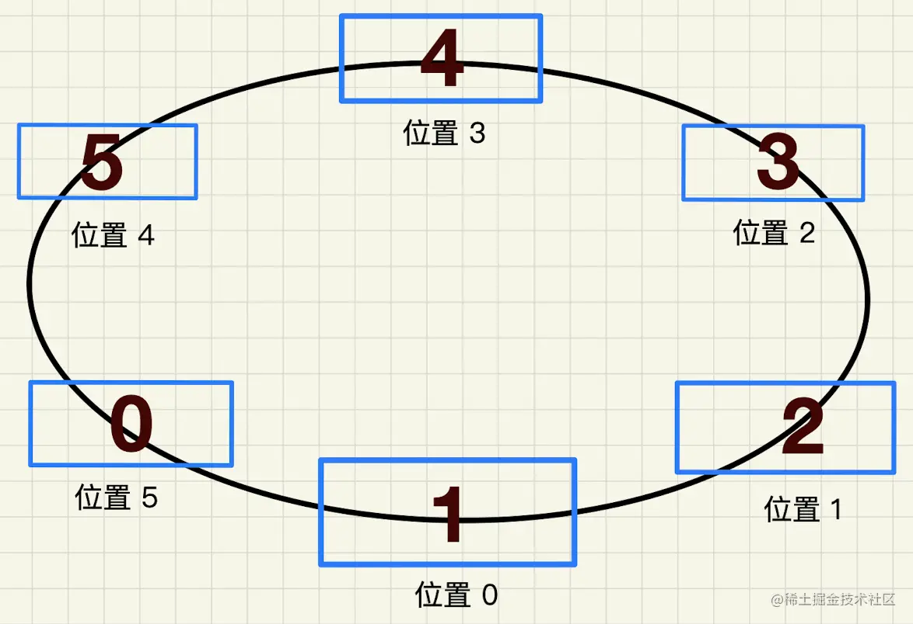

在开发移动端官网时，设计师想要实现标签沿着轨道运动的效果(如下),点击标签时沿轨道运动，点击的标签到位置1，其他依次排列，并伴随轮播，每个位置的标签样式不同。


设计思路如下

## 一、标签动还是轨迹动
### 标签动：不同类名设置宽高、定位属性，点击时改变标签赋值的类型；要愤青标签的顺序和位置的顺序


此时的位置顺序为[0, 1,2,3,4,5]

当标签运行时



此时标签位置顺序为5,0, 1,2,3,4 
>(标签0在5的位置)

即：我们需要拿到当前点击标签的顺序值，这个标签到位置1，其他的依次排列，如点击标签4,则标签顺序为[2,3,4,5,0,1],点击标签5，顺便变[1,2,3,4,5,0]

代码以vue+css为例HTML
```html
<ul class="label_ul">
    <li
        class="label_li"
        :class="`label${indexList[index]}`"
        :data-order="indexList[index]"
        ref="labelLi"
        @click="handleLabelChange($event, index)"
        v-for="(item, index) in labelList"
        :key="index"
    >
        <div>{{item.name}}</div>
    </li>
</ul>
```
在data中存储当前的位置信息，indexList存储位置数组,初始值为[0,1,2,3,4,5]，之后点击动作即改变位置数组
```js
// css
.label_ul {
    .label_li {
        postition: absolute;
        transition: all 300ms ease-in-out 0s;
    }
    label0 {
        width: 108px;
        height: 56px;
        top: 128px;
        left: calc(50% - 53px);
        z-index: 5;
        font-size: 18px;
        box-shadow: 0px 2px 0 px 0px #2d63fb inset
    }
    .label1 {...}
    .label2 {...}
}


// js
mthod: {
    handleLabelChange(e, index) {
        this.order = e.currentTarget.dataset.order; // 获取当前标签位置
        this.currentIndex = index; // 获取点击当前标签的index
    }
    watch: {
        currentIndex(n) {
            if(n === 0) {
                this.indexList = [0, 1,2,3,4,5];
            } else if (n == 1) {
                this.indexList = [5, 0, 1, 2, 3, 4];
            } else if (n == 2) {
                this.indexList = [4, 5, 0, 1, 2, 3];
            } else if (n == 3) {
                this.indexList = [3, 4, 5, 0, 1, 2];
            } else if (n == 4) {
                this.indexList = [2, 3, 4, 5, 0, 1];
            } else if (n == 5) {
                this.indexList = [1, 2, 3, 4, 5, 0];
            } //此处标签个数比较固定，直接判断，可归纳为indexList[n]=0;
        }
    }
}
```
优化1：如果点击2/4，会直接达到位置0，期望效果,先到位置1/5,在到0


解决办法：当判断位置为2时，移到位置1，即将indexList末尾删除移到首位;当判断为位置4时，移动到位置5,即将indexList首位删除移到末尾
```js
watch: {
    currentIndex(n) {
        if (this.order == 2) {
          let num = this.indexList.pop();
          this.indexList.unshift(num);
        } else if (this.order == 4) {
          let num = this.indexList.shift();
          this.indexList.push(num);
        }
        if (n == 0) {
          this.indexList = [0, 1, 2, 3, 4, 5];
        } else if (n == 1) {
          this.indexList = [5, 0, 1, 2, 3, 4];
        } else if (n == 2) {
          this.indexList = [4, 5, 0, 1, 2, 3];
        } else if (n == 3) {
          this.indexList = [3, 4, 5, 0, 1, 2];
        } else if (n == 4) {
          this.indexList = [2, 3, 4, 5, 0, 1];
        } else if (n == 5) {
          this.indexList = [1, 2, 3, 4, 5, 0];
        } //此处标签个数比较固定，直接判断，可归纳为indexList[n]=0;
    }
}
```
优化2：为了防止连续点击位置错乱，可以加个防抖函数

### 轨道动：一个标签与轨道为一个整体，标签沿着轨道运动实际为轨道的旋转
1. 布局轨道与标签
    
    ```html
    <div class="track">
        <div class="label"></div>
    </div>
    ```
2. 将轨道旋转、压缩、变为椭圆
    
    ```css
    .track {
        width: 315px;
        height: 315px;
        transform: scaleY(0.5) rotate(180deg);
        border-radius: 50%;
    }
    .label {
        width: 108px;
        height: 56px;
        position: absolute;
        top: -28px;
        left: calc(50% - 54px);
        box-shadow: 0px 2px 0px 0px #2d63fb inset;
        transform: rotateZ(-180deg) scaleY(2);//先旋转，角度和轨道相反，后变为二倍
    }
    ```
    **轨道transform中先scaleY(),后旋转，标签中为了不受影响要和轨道的相反**

    **transform是有顺序的，因为CSS3D完全是由CSS2D演化而来的，并没有3d空间，所以就会按照顺序进行渲染，transform会造成整个坐标轴的转换，因此顺序十分重要**
3. 此时标签的旋转则为轨道整体的运动，要需要改变旋转角度就可以
    
4. 重叠多个标签轨道，轨道border因此即可

## 与轮播联动
在点击标签的事情中,获取当前点击的标签索引值，在利用轮播事件


## 资料
[标签沿着轨道运动效果](https://juejin.cn/post/7018068789740699684?utm_source=gold_browser_extension)