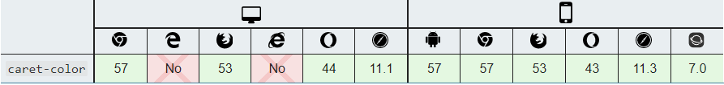

## 简易 div 输入框
HTML5 规范引入了 contenteditable 属性，它几乎可以用在任何元素上，只要添加这一属性，即可变为可编辑区域，[查看详情](https://blog.csdn.net/shenwen522519753/article/details/104051358)

一个简单的&lt;div&gt;输入框
```html
<style>
    .editdiv {
        min-height: 50px;
        background: #eee;
        /* 
        清除编辑器获取焦点时的默认样式：
        -webkit-tap-highlight-color:rgba(0,0,0,0);
        -webkit-user-modify:read-write-plaintext-only;
        outline:none;
        */
        /* 设置光标颜色：*/
        caret-color: green;
        /* 防止全局设置 -webkit-user-select: none 后不会获取焦点 */
        -webkit-user-select:text;
    }
    /* 设置提示文字 */
    .editdiv:empty::before {
        content: attr(placeholder);
        color: #999;
    }
    .editdiv:focus::before {
        content: none;
    }
</style>

<div contenteditable="true" class="editdiv" placeholder="请输入...."></div>
<!-- true  指定元素是可编辑的 -->
<!-- false 指定元素是不可编辑的 -->

<script>
//兼容处理，统一换行时的元素渲染
document.execCommand("defaultParagraphSeparator", false, "div"); 
</script>
```
### 设置光标颜色
使用CSS3新增caret-color属性来定义插入光标的样色
```css
input {
    caret-color: red;
}
```
浏览器支持


## 1. 移动光标到开始或者结尾
```js
/*
* type: 'start'移动到开头，'end'移到到结尾
*/
function moveEnd(el,type) {
  el.focus(); 
  if (window.getSelection) {               //ie11 10 9 ff safari
    var range = window.getSelection();     //创建range
    range.selectAllChildren(el);           //选择el子项
    if(type=='start'){
      range.collapseToStart();             //光标移至开头
    }else{
      range.collapseToEnd();               //光标移至最后
    }
  }
  else if (document.selection) {                  //ie10 9 8 7 6 5
    var range = document.selection.createRange(); //创建选择对象
    range.moveToElementText(el);                  //range定位到ele
    if(type=='start'){
      range.collapse();                           //光标移至开头
    }else{
      range.collapse(false);                      //光标移至最后
    }
    range.select();
  }
}
``` 
## 2. 在光标处插入内容
```js
/*
* el   编辑框元素
* html 要插入的内容，可以是 html 代码
*/
function insertCont(el,html){
  el.focus();
  if(document.selection){   //IE 10,9,8,7                             
    document.selection.createRange().pasteHTML(html);
  }else if(window.getSelection){
    var sel = window.getSelection();
    if (sel.getRangeAt && sel.rangeCount) {
      var range = sel.getRangeAt(0);
      range.deleteContents();
      var div = document.createElement("div");
      div.innerHTML = html;
      var frag = document.createDocumentFragment(), node, lastNode;
      while ( (node = div.firstChild) ) {
        lastNode = frag.appendChild(node);
      }
      range.insertNode(frag);
      if (lastNode) {
        range = range.cloneRange();
        range.setStartAfter(lastNode);
        range.collapse(true);
        sel.removeAllRanges();
        sel.addRange(range);
      }
    }
  }
}
```
:::tip
上面代码中 el.focus() 比较关键，用来确定操作目标元素，不然的话，鼠标点击页面任何地方都可插入内容。因为这里使用的是整个页面选区操作。其实有2中更简便的方法：

document.execCommand('insertHTML',false, '<span>html</span>');

document.execCommand('insertText',false,'文本')

缺点是IE浏览器只支持 'insertText' 而不支持 'insertHTML'。
:::

[contentEditable 中光标控制](https://blog.csdn.net/shenwen522519753/article/details/104071606)