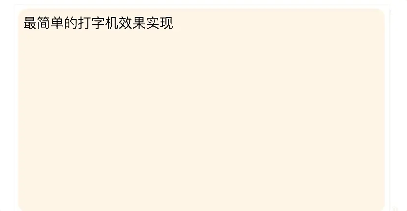

在Web应用中,实现动画效果的方法比较多,Javascript中可以通过定时器setTimeout实现,css3可以使用transition和animation来实现，html5中的canvas也可以实现。除此之外，html5还提供了一个专门用于请求动画的API，即requestAnimationFrame(RAF),顾名思义就是"请求动画帧"

## 打字机效果的N种实现
### 实现一: setTimeout()
setTimeout版本的实现很简单，只需把要展示的文本进行切割，使用定时器不断向DOM元素里追加文本即可，同时，使用::after伪元素在DOM元素后面产生光标闪烁的效果。代码和效果图如下
```html
<!-- 样式 -->
<style type="text/css">
  /* 设置容器样式 */
  #content {
    height: 400px;
    padding: 10px;
    font-size: 28px;
    border-radius: 20px;
    background-color: antiquewhite;
  }
  /* 产生光标闪烁的效果 */
  #content::after{
      content: '|';
      color:darkgray;
      animation: blink 1s infinite;
  }
  @keyframes blink{
      from{
          opacity: 0;
      }
      to{
          opacity: 1;
      }
  }
</style>

<body>
  <div id='content'></div>
  <script>
    (function () {
    // 获取容器
    const container = document.getElementById('content')
    // 把需要展示的全部文字进行切割
    const data = '最简单的打字机效果实现'.split('')
    // 需要追加到容器中的文字下标
    let index = 0
    function writing() {
      if (index < data.length) {
        // 追加文字
        container.innerHTML += data[index ++]
        let timer = setTimeout(writing, 200)
        console.log(timer) // 这里会依次打印 1 2 3 4 5 6 7 8 9 10
      }
    }
    writing()
  })();
  </script>
</body>
```


setTimeout()方法的返回值是一个唯一的数值(ID),上面代码中，我们也做了setTimeout()返回值的打印，那么这个数值有什么用呢？？

如果你想要终止setTimeout()方法的执行，那就必须使用clearTimeout()方法来终止，而使用这个方法的时候，系统必须知道你到底要终止的是哪一个setTimeout()方法(因为你可能同时调用了好几个 setTimeout()方法)，这样clearTimeout()方法就需要一个参数，这个参数就是setTimeout()方法的返回值(数值)，用这个数值来唯一确定结束哪一个setTimeout()方法。

### 实现二setInterval()

## CSS3动画和JS动画的比较


[从打字机效果的 N 种实现看JS定时器机制和前端动画](https://segmentfault.com/a/1190000038915675)