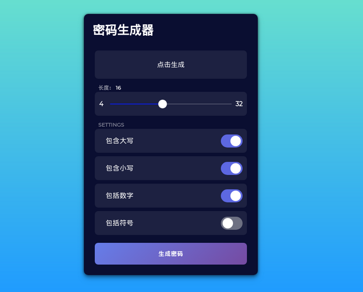
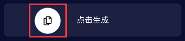

自己实现
```js
const symbols = '~!@#$%^&*()_+{}":?><;.,';
let list = [
    String.fromCharCode(Math.floor(Math.random() * 26 + 65)),
    String.fromCharCode(Math.floor(Math.random() * 26 + 96)),
    String.fromCharCode(Math.floor(Math.random() * 10 + 48)),
    symbols[Math.floor(Math.random() * symbols.length)]
]

let str = ''
for(let i = 0; i < 8; i++) {
    str += list[Math.floor(Math.random() * 4)]
}
console.log(str)
```
---
[原文-js 密码生成器](https://segmentfault.com/a/1190000020876869)

最近参考网上的一些密码生成器，模仿着做了一个类似的密码生成器，密码主要由"大写"，"小写"，"数字"，"符号"组成，具体样式如图：



## 开发过程
该文主要记录js开发流程，css样式会在文章结尾的github文件中给出，主要用来记录学习js开发流程

### 滑动效果
1. 设置样式属性
2. 监听input[ranger]滑动，并且改变尾随颜色
3. 设置输入密码生成器的数字

(js: setAttribute()方法添加指定的属性，并为其赋指定的值)
```js
// 范围滑动属性
// 填充:拖动滑块时看到的尾随颜色
// background: 默认范围滑块北京
const sliderProps = {
    fill: '#0B1EDF',
    background: 'rgba(255, 255, 255, 0.214)'
}

// 选择范围滑块容器
const slider = document.querySelector('.range__slider');
// 显示范围滑块值的文本。
const sliderValue = document.querySelector('.length__title');
// 使用事件监听器应用填充并更改文本的值
slider.querySelector("input").addEventListener("input", event => {
    //setAttribute() 方法添加指定的属性，并为其赋指定的值
    sliderValue.setAttribute("data-length", event.target.value);
    applyFill(event.target);
});
//选择范围输入并将其传递给applyFill函数
applyFill(slider.querySelector("input"));

//此函数负责创建尾随颜色并设置填充。
function applyFill(slider) {
    const percentage = (100 * (slider.value - slider.min)) / (slider.max - slider.min);
    const bg = `linear-gradient(90deg, ${sliderProps.fill} ${percentage}%, ${sliderProps.background} ${percentage +
    0.1}%)`;
    slider.style.background = bg;
    sliderValue.setAttribute("data-length", slider.value);
}
```
### 生成随机的密码字母的函数名称对象
fromCharCode() 可接受一个指定的 Unicode 值，然后返回一个字符串。
注意：该方法是 String 的静态方法，字符串中的每个字符都由单独的 Unicode 数字编码指定。使用语法：
```js
// 将用于创建随机密码字母的所有函数名称的对象
const randomFunc = {
    lower: getRandomLower,
    upper: getRandomUpper,
    number: getRandomNumber,
    symbol: getRandomSymbol
}

// 生成函数
// 所有的函数负责返回一个随机值，我们将使用它来创建密码。

function getRondomLower() {
    //fromCharCode() 可接受一个指定的 Unicode 值，然后返回一个字符串。
    // 注意：该方法是 String 的静态方法，字符串中的每个字符都由单独的 Unicode 数字编码指定。使用语法： String.fromCharCode()。
    return String.fromCharCode(Math.floor(Math.random() * 26 ) + 97);
}

function getRandomUpper() {
    return String.fromCharCode(Math.floor(Math.random() * 26) + 65);
}

function getRandomNumber() {
    return String.fromCharCode(Math.floor(Math.random() * 10) + 48);

}
function getRandomSymbol() {
    const symbols = '~!@#$%^&*()_+{}":?><;.,';
    return symbols[Math.floor(Math.random() * symbols.length)];
}
```
### 选择必须DOM元素
```js
//选择所有必需的DOM元素
const resultEl = document.getElementById("result");
const lengthEl = document.getElementById("slider");

//代表根据用户创建不同类型密码的选项的复选框
const uppercaseEl = document.getElementById("uppercase");
const lowercaseEl = document.getElementById("lowercase");
const numberEl = document.getElementById("number");
const symbolEl = document.getElementById("symbol");
// 按钮来生成密码
const generateBtn = document.getElementById("generate");
// 按钮来复制文本
const copyBtn = document.getElementById("copy-btn");
//视图框容器
const resultContainer = document.querySelector(".result");
// 单击生成按钮后显示的文本信息
const copyInfo = document.querySelector(".result__info.right");
//单击复制按钮后出现文本
const copiedInfo = document.querySelector(".result__info.left");
```
### 监听页面鼠标移动并且设置复制按钮位置，并且复制密码
js 复制方法
```js
textarea.select();
document.execCommand('copy');
```

```js
//更新COPY按钮的CSS属性
//获取结果视图框容器的边界
let resultContainerBound = {
    left: resultContainer.getBoundingClientRect().left,
    top: resultContainer.getBoundingClientRect().top,
};
//这将根据鼠标位置更新复制按钮的位置
resultContainer.addEventListener("mousemove", e => {
    copyBtn.style.setProperty("--x", `${e.x - resultContainerBound.left}px`);
    copyBtn.style.setProperty("--y", `${e.y - resultContainerBound.top}px`);
});

//复制剪贴板中的密码
copyBtn.addEventListener("click", () => {
    const textarea = document.createElement("textarea");
    const password = resultEl.innerText;
    if (!password || password == "CLICK GENERATE") {
        return;
    }
    textarea.value = password;
    document.body.appendChild(textarea);
    textarea.select();
    document.execCommand("copy");
    textarea.remove();

    copyInfo.style.transform = "translateY(200%)";
    copyInfo.style.opacity = "0";
    copiedInfo.style.transform = "translateY(0%)";
    copiedInfo.style.opacity = "0.75";
});
```
### 生成密码
利用遍历循环生成对应的字符串，利用截取对应的长度进行生成密码

```js
// 该函数负责生成密码，然后将其返回
function generatePassword(length, lower, upper, number, symbol) {
    let generatedPassword = "";
    const typesCount = lower + upper + number + symbol;
    const typesArr = [{ lower }, { upper }, { number }, { symbol }].filter(item => Object.values(item)[0]);
    if (typesCount === 0) {
        return "";
    }
    for (let i = 0; i < length; i++) {
        typesArr.forEach(type => {
            const funcName = Object.keys(type)[0];
            generatedPassword += randomFunc[funcName]();
        });
    }
    return generatedPassword.slice(0, length);
}

```

### 源码
```js
//这是一个简单的密码生成器应用，可以生成随机密码，也许您可​​以用它们来保护您的帐户。
//我尽力使代码尽可能简单，请不要介意变量名。


//每次刷新时清除控制台
console.clear();

//范围滑块属性。
//填充：拖动滑块时看到的尾随颜色。
// background：默认范围滑块背景

const  sliderProps = {
    fill:'#0B1EDF',
    background: 'rgba(255, 255, 255, 0.214)'
};

//选择范围滑块容器,
const slider = document.querySelector(".range__slider");
//显示范围滑块值的文本。
const sliderValue = document.querySelector(".length__title");
//使用事件监听器应用填充并更改文本的值。
slider.querySelector("input").addEventListener("input", event => {
    //setAttribute() 方法添加指定的属性，并为其赋指定的值
    sliderValue.setAttribute("data-length", event.target.value);
    applyFill(event.target);
});
//选择范围输入并将其传递给applyFill函数
applyFill(slider.querySelector("input"));

//此函数负责创建尾随颜色并设置填充。
function applyFill(slider) {
    const percentage = (100 * (slider.value - slider.min)) / (slider.max - slider.min);
    const bg = `linear-gradient(90deg, ${sliderProps.fill} ${percentage}%, ${sliderProps.background} ${percentage +
    0.1}%)`;
    slider.style.background = bg;
    sliderValue.setAttribute("data-length", slider.value);
}

//将用于创建随机密码字母的所有函数名称的对象
const  randomFunc = {
    lower: getRondomLower,
    upper: getRandomUpper,
    number: getRandomNumber,
    symbol: getRandomSymbol
};

// 生成函数
// 所有的函数负责返回一个随机值，我们将使用它来创建密码。

function getRondomLower() {
    //fromCharCode() 可接受一个指定的 Unicode 值，然后返回一个字符串。
    // 注意：该方法是 String 的静态方法，字符串中的每个字符都由单独的 Unicode 数字编码指定。使用语法： String.fromCharCode()。
    return String.fromCharCode(Math.floor(Math.random() * 26 ) + 97);
}

function getRandomUpper() {
    return String.fromCharCode(Math.floor(Math.random() * 26) + 65);
}

function getRandomNumber() {
    return String.fromCharCode(Math.floor(Math.random() * 10) + 48);

}
function getRandomSymbol() {
    const symbols = '~!@#$%^&*()_+{}":?><;.,';
    return symbols[Math.floor(Math.random() * symbols.length)];
}


//选择所有必需的DOM元素
const resultEl = document.getElementById("result");
const lengthEl = document.getElementById("slider");

//代表根据用户创建不同类型密码的选项的复选框
const uppercaseEl = document.getElementById("uppercase");
const lowercaseEl = document.getElementById("lowercase");
const numberEl = document.getElementById("number");
const symbolEl = document.getElementById("symbol");
// 按钮来生成密码
const generateBtn = document.getElementById("generate");
// 按钮来复制文本
const copyBtn = document.getElementById("copy-btn");
//视图框容器
const resultContainer = document.querySelector(".result");
// 单击生成按钮后显示的文本信息
const copyInfo = document.querySelector(".result__info.right");
//单击复制按钮后出现文本
const copiedInfo = document.querySelector(".result__info.left");

//更新COPY按钮的CSS属性
//获取结果视图框容器的边界
let resultContainerBound = {
    left: resultContainer.getBoundingClientRect().left,
    top: resultContainer.getBoundingClientRect().top,
};
//这将根据鼠标位置更新复制按钮的位置
resultContainer.addEventListener("mousemove", e => {
    copyBtn.style.setProperty("--x", `${e.x - resultContainerBound.left}px`);
    copyBtn.style.setProperty("--y", `${e.y - resultContainerBound.top}px`);
});

//复制剪贴板中的密码
copyBtn.addEventListener("click", () => {
    const textarea = document.createElement("textarea");
    const password = resultEl.innerText;
    if (!password || password == "CLICK GENERATE") {
        return;
    }
    textarea.value = password;
    document.body.appendChild(textarea);
    textarea.select();
    document.execCommand("copy");
    textarea.remove();

    copyInfo.style.transform = "translateY(200%)";
    copyInfo.style.opacity = "0";
    copiedInfo.style.transform = "translateY(0%)";
    copiedInfo.style.opacity = "0.75";
});

//单击生成时，将生成密码ID
generateBtn.addEventListener("click", () => {
    const length = +lengthEl.value;
    const hasLower = lowercaseEl.checked;
    const hasUpper = uppercaseEl.checked;
    const hasNumber = numberEl.checked;
    const hasSymbol = symbolEl.checked;
    resultEl.innerText = generatePassword(length, hasLower, hasUpper, hasNumber, hasSymbol);
    copyInfo.style.transform = "translateY(0%)";
    copyInfo.style.opacity = "0.75";
    copiedInfo.style.transform = "translateY(200%)";
    copiedInfo.style.opacity = "0";
});

generateBtn.addEventListener("click", () => {
    const length = +lengthEl.value;
    const hasLower = lowercaseEl.checked;
    const hasUpper = uppercaseEl.checked;
    const hasNumber = numberEl.checked;
    const hasSymbol = symbolEl.checked;
    resultEl.innerText = generatePassword(length, hasLower, hasUpper, hasNumber, hasSymbol);
    copyInfo.style.transform = "translateY(0%)";
    copyInfo.style.opacity = "0.75";
    copiedInfo.style.transform = "translateY(200%)";
    copiedInfo.style.opacity = "0";
});

// 该函数负责生成密码，然后将其返回。
function generatePassword(length, lower, upper, number, symbol) {
    let generatedPassword = "";
    const typesCount = lower + upper + number + symbol;
    const typesArr = [{ lower }, { upper }, { number }, { symbol }].filter(item => Object.values(item)[0]);
    if (typesCount === 0) {
        return "";
    }
    for (let i = 0; i < length; i++) {
        typesArr.forEach(type => {
            const funcName = Object.keys(type)[0];
            generatedPassword += randomFunc[funcName]();
        });
    }
    return generatedPassword.slice(0, length);
}
```
并且大家希望看到其他css，js代码，可以查看我的github地址：
[https://github.com/panpanxiong3/Front-end-effect-link](https://github.com/panpanxiong3/Front-end-effect-link)