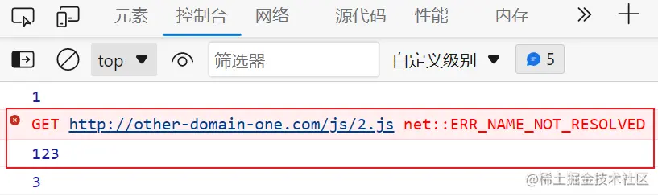
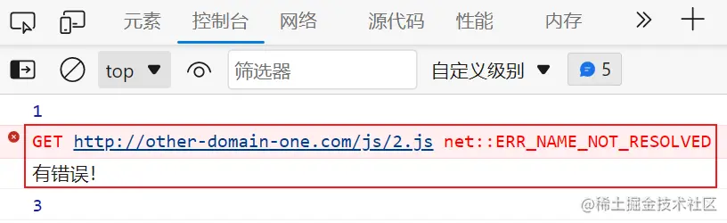
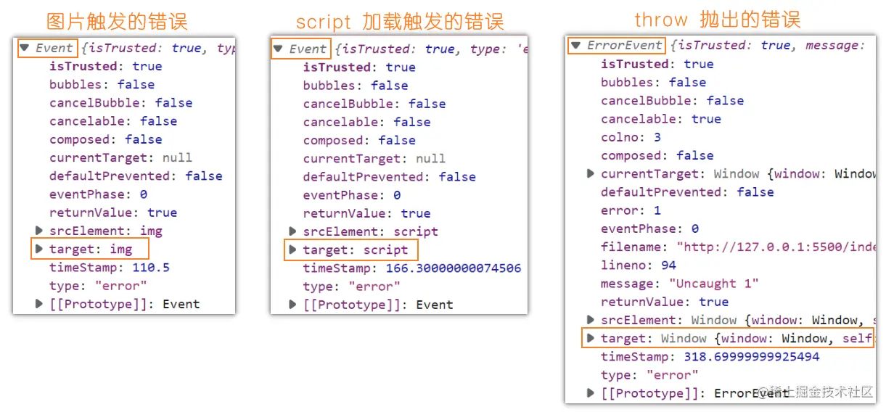
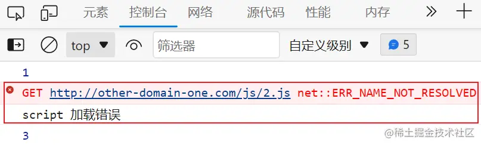
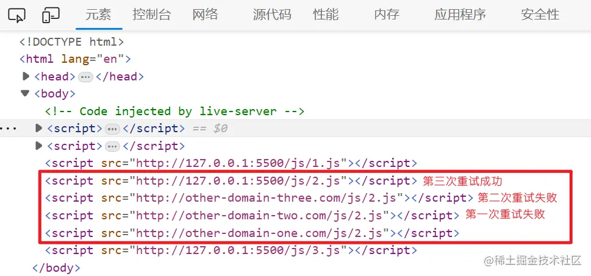
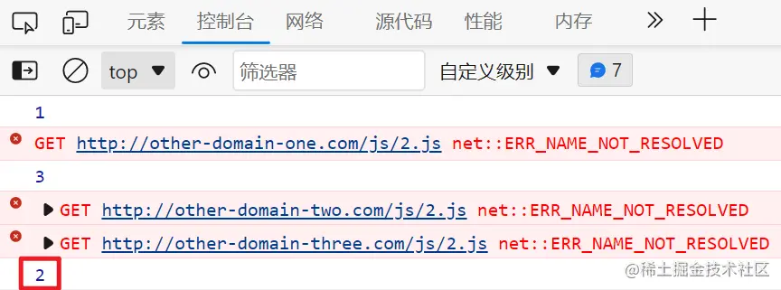
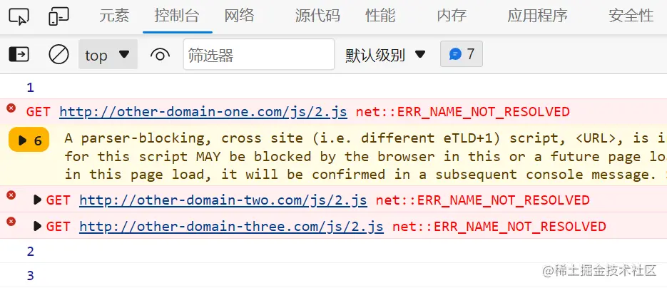

## JS加载失败的危害
我们都知道，现代的网页离不开 JS，它可以让页面变得更加动态和交互。

但是，JS 也有可能加载失败，导致页面样式错乱，甚至白屏无法使用。

这对用户体验是非常不利的，尤其是对于单页应用，如果 JS 加载不出来，用户就无法继续浏览页面了。

那么，JS 加载失败的原因有哪些呢？

可能是网络不稳定，可能是服务器出错，可能是跨域问题，也可能是其他未知的因素。

我们无法控制这些原因，但我们可以通过一个简单的方法来解决加载失败的问题：重试！

## JS加载失败的解决方案
重试就是当 JS 加载失败时，重新请求一次或多次，直到成功为止。

这样可以增加加载成功的概率，也可以避免用户看到错误的页面。

那么，怎么实现重试呢？其实只需要解决两个问题：

- 什么时候重试？
- 如何重试？

### 什么时候重试
要知道什么时候重试,我们就要知道什么时候JS加载失败。

最贱的就是给script标签加一个onerror事件。当出现错误的时候script会触发这个事件。

为了方便测试，我们本地有三个 JS，名字分别为 1、2、3，分别输出 1、2、3。

```html
<script onerror="console.log(123)" src="http://127.0.0.1:5500/js/1.js"></script>
<script onerror="console.log(123)" src="http://other-domain-one.com/js/2.js"></script>
<script onerror="console.log(123)" src="http://127.0.0.1:5500/js/3.js"></script>
```


这样做虽然可以，但不是最好的，会比较麻烦，又特别是在工程化的环境里边，这些 script 都是自动生成的，要加上 onerror 事件的话就会很复杂。

那么有没有更好的方法呢？当然有！我们可以利用事件委托的原理，在 window 上监听 error 事件，然后判断是否是 script 标签引起的错误。

> <span style="color: red">注意：这里我们要在第三个参数传入true，表示在捕获阶段触发时间，因为error事件不会冒泡</span>

```html
<script src="http://127.0.0.1:5500/js/1.js"></script>
<script src="http://other-domain-one.com/js/2.js"></script>
<script src="http://127.0.0.1:5500/js/3.js"></script>
<script>
  window.addEventListener('error', (event) => {
    console.log('有错误！');
  }, true)
</script>
```

但是我们能这么写吗？同学们思考几秒钟。

其实是不行的，因为当前面的 JS 失败的时候，error 事件还没有注册，所以应该在最上方。

```html
<script>
  window.addEventListener('error', (event) => {
    console.log('有错误！');
  }, true) 
</script>
<script src="http://127.0.0.1:5500/js/1.js"></script>
<script src="http://other-domain-one.com/js/2.js"></script>
<script src="http://127.0.0.1:5500/js/3.js"></script>
```


可以看到，我们已经触发error时间了。

但是这样还不够精确，因为error事件可能由其他原因引起的，比如图片加载失败或JS代码中抛出异常

我们怎么区分呢？我们打印一些error的event值，看看他们区别



可以看到，图片和script引起的错误都是 Event 对象，而JS代码中抛出的错误是 ErrorEvent 对象。

并且 Event 对象中有一个target 属性，指向触发错误的元素

所以我们可以根据这两个特性来判断是否是script标签引起的错误

```html
<script>
    window.addEventListener('error', event => {
        // 拿到触发错误的标签
        const tag = event.target;
        // 便签的名称必须是'SCRIPT' 与 event 错误类型不能是ErrorEvent
        if(tag.tagName === 'SCRIPT' && !(event instanceof ErrorEVENT)) {
            console.log('script 加载错误');
        }
    }, true)
</script>
```


这样我们可以准确的捕获到script加载失败的情况了

### 如何重试
实现重试，我们就要重新创建一个script元素，并且修改它的src属性为一个新的域名

为什么要修改域名呢？因为之前加载失败的域名可能已经失效了，所以我们准备一些备用的域名，在加载失败的时候依次尝试

那么我们需要记录以下三个信息：

1. 备用域名列表
2. 要重试的 script 的路径
3. 已经重试过几次（ 为了知道下一次要重试的备用域名是什么 ）。

根据这些信息，我们可以写出以下代码：

```html
<script>
    // 备用域名列表
    const domains = [
        'other-domain-two.com',
        'other-domain-three.com',
        'other-domain-four.com',
        '127.0.0.1:5500',
    ];
    // 重试信息
    const retryInfo = {};
    window.addEventListener('error', event => {
        const tag = event.target;
        if(tag.tagName === 'SCRIPT' && !(event instanceof ErrorEvent)) {
            // 首先我们要知道谁失败了，他请求的js是什么
            // 可以通过 url.pathname得到请求的js的名字
            const url = new URL(tag.src);
            // 我们判断一下重发的信息里有没有重试这个js
            if(!retryInfo[url.pathname]) {
                // 没重试过就给它添加一个
                retryInfo[url.pathname] = {
                    times: 0, // 第几次重试从0开始
                    nextIndex: 0, // 重试的域名叶冲0开始
                }
            }
             // 取出要重试的信息
            const info = retryInfo[url.pathname];
            // 这里我们要判断一下，重试的次数是否小于域名的列表长度，防止所有域名都失败时一直重复重试
            if (info.times < domains.length) {
                // 重试就要生成一个新的元素
                const script = document.createElement('script')
                // 那我们要重试呢就是替换一下失败的域名，所以可以利用 url.host，把要重试的域名替换它，
                url.host = domains[info.nextIndex]
                // 然后将新的 url 添加到新的 script 的 src 里
                script.src = url.toString()
                // 将新的 script 呢加入到失败的 script 之前
                document.body.insertBefore(script, tag)
                // 最后不要忘记重试信息的索引都要加 1
                info.times++
                info.nextIndex++;
            }
        }
    }， true)
</script>
```




可以看到 2 已经输出了，但是顺序不对，应该是 1、2、3 的顺序，JS 的执行顺序是很重要的，因为他们之间可能有依赖关系，比如说 3 里有依赖 2 的东西，那么先加载 3 就会出现问题了。

出现这个问题的原因就在于新加入的这个元素没有阻塞后续的加载，也就是说我们创建的这个元素必须要它阻塞页面后续的加载。

这里就用到了一个同学们一定接触过，但是早就不使用的东西，同学思考一下，看能不能想到。

其实它叫做 document.write()，这个就会阻塞页面的加载。

```html
<script>
  const domains = [
    'other-domain-two.com',
    'other-domain-three.com',
    '127.0.0.1:5500',
  ];
  const retryInfo = {};
  window.addEventListener('error', (event) => {
    const tag = event.target;
    if (tag.tagName === 'SCRIPT' && !(event instanceof ErrorEvent)) {
      const url = new URL(tag.src);
      if (!retryInfo[url.pathname]) {
        // 没重试过就给它添加一个
        retryInfo[url.pathname] = {
          times: 0, // 第几次重试从 0 开始
          nextIndex: 0, // 重试的域名也从 0 开始
        };
      }
      const info = retryInfo[url.pathname];
      if (info.times < domains.length) {
        const script = document.createElement('script')
        url.host = domains[info.nextIndex]
        // 阻塞页面后续的加载
        // 因为我们是写在 script 标签里 所以要转译一下，否则会被认为是 script 标签的结束
        document.write(`<script src="${url.toString()}"></script>`)
        info.times++
        info.nextIndex++;
      }
    }
  }, true) 
</script>
```


现在再看顺序就正常了，这里的警告是因为 document.write() 有阻塞，但是我们要的就是阻塞，所以就不用管他了。

## 总结
现在我们的问题已经解决了，但其实仍然可以再深入的去挖掘，比如 script 元素有 defer 怎么办？有 async 怎么办？这里就不展开叙述了。

还有精力的话可以再学一下工程化，在笔面试的时候直接就会惊呆面试官，当面吊打！


[原文](https://juejin.cn/post/7246948333277184061)