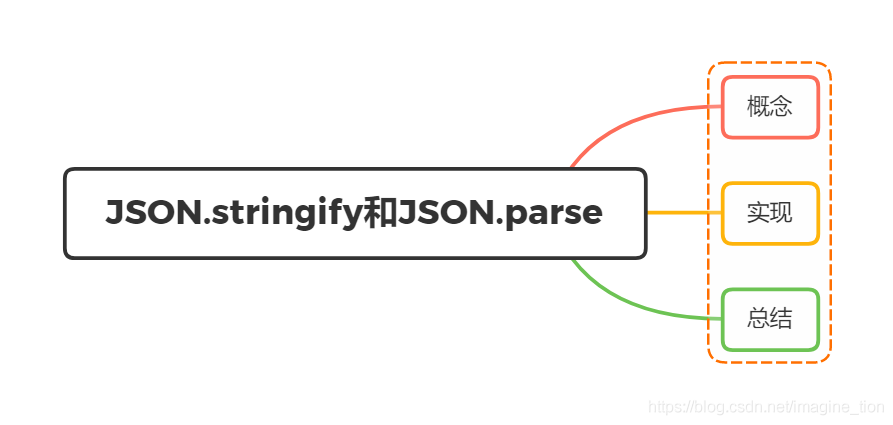

## 概念
1. JSON.stringify

    JSON.stringify()方法将一个JavaScript对象或值转换为JSON字符串，如果指定了一个replacer函数，则可以选择性的替换值，或者指定replacer是数组，则可选择性的仅包含数组指定的属性

    > JSON.stringify(value[, replacer[, space]])

    - Boolean | Number | String 类型会自动转换成对应的原始值
    - undefined、任意函数以及symbol，会被忽略（出现在非数组对象的属性值中时），或者被转换成 null（出现在数组中时）。
    - 不可枚举的属性会被忽略。
    - 如果一个对象的属性值通过某种间接的方式指回该对象本身，即循环引用，属性也会被忽略。
2. JSON.parse

    JSON.parse() 方法用来解析JSON字符串，构造由字符串描述的JavaScript值或对象。提供可选的 reviver 函数用以在返回之前对所得到的对象执行变换(操作)。

    > JSON.parse(text[, reviver])

    用来解析JSON字符串，构造由字符串描述的JavaScript值或对象。提供可选的reviver函数用以在返回之前对所得到的对象执行变换(操作)。

## 实现(简化版)
### JSON.stringify
```js
function jsonStringify(obj) {
    let type = typeof obj;
    if(type !== 'object') {
        if (/string|undefined|function/.test(type)) {
            obj = '"' + obj + '"';
        }
        return String(obj);
    } else {
        let json = [];
        let arr = Array.isArray(obj);
        for(let k in obj) {
            let v = obj[k];
            let type = typeof v;
            if (/string|undefined|function/.test(type)) {
                v = '"' + v + '"';
            } else if(type === 'object') {
                v = jsonStringify(v);
            }
            json.push((arr ? '' : '"' + k + '":') + String(v));
        }
        return (arr ? '[' : '{') + String(json) + (arr ? ']' : '}')
    }
}
jsonStringify({x : 5}) // "{"x":5}"
jsonStringify([1, "false", false]) // "[1,"false",false]"
jsonStringify({b: undefined}) // "{"b":"undefined"}"
```
### JSON.parse
1. 利用eval函数

    ```js
    function jsonParse(opt) {
        return eval('(' + opt + ')');
    }
    jsonParse(jsonStringify({x: 5}))
    jsonParse(jsonStringify([1, 'false', false]))
    jsonParse(jsonStringify({b: undefined}))
    ```
    避免在不必要的情况下使用eval， eval()是一个危险的函数，他执行的代码拥有者执行者的权利。如果你用eval()运行的字符串代表被恶意方(不怀好意的人)操控修改，您最终可能会在你的网页/扩展程序的权限下，在用户计算机上运行恶意代码
2. 正常实现

    JSON的设计让我们在读到一个字符后就确定后面如何解析，具体来说：

    当我们在扫描文本流的过程中遇到一个左花括号({)时，我们知道需要从当前字符开始，解析出一个对象，而解析对象的过程则是解析出多对key/value，每解析完一对，如果我们遇到右花括号(})，则对这个对象的解析就结束了，而如果遇到的不是右花括号，则我们需要解析下一对 key/value，直到遇见右花括号。而解析出一对 key/value，则是必须先解析出一个字符串，然后一个冒号（:），然后是这个 key 对应的值。

    同理，当我们遇到一个左方括号（[）时，我们需要从这个字符开始解析出一个数组；而解析数组，则是解析出多个由逗号分隔的值，直到解析完一个值后遇到的不是逗号而是右方括号（]），则这个数组解析完毕。

    而当我们遇到一个双引号（"）时，则需要从当前位置开始解析出一个字符串。

    遇到字母 “n” 的话，则是从当前位置开始往后读 4 个字符，且读到的 4 个字符组成的字符串必须是“null”，否则就应该报错。

    遇到字母 “f” 的话，则是从当前位置开始往后读 4 个字符，且读到的 4 个字符组成的字符串必须是“null”，否则就应该报错。

    遇到字母 “n” 的话，则是从当前位置开始往后读 5 个字符，且读到的 5 个字符组成的字符串必须是“false”，否则就应该报错。

    剩下的就是数值了。

    JSON 中对于以上几种类型都定义为值，而我们可能从任何位置开始遇到一个值，而在 JSON 中解析这个值只需要看其第一个字符是什么就可以了，这也是 JSON 容易解析的另一个原因，不像一般的编程语言，**JSON 的解析不需要先做 tokenize。

    为了减少复杂度，我们只解析没有任何多余空白内容的合法 JSON 字符串，暂时不考虑出错的问题，另外所有的 key 和字符串内都没有转义符，即形如以下：
    ```js
    var jsonstr =  '{"a":1,"b":true,"c":false,"foo":null,"bar":[1,2,3]}'
    var i = 0
    ```
    为了简便，我们暂时使用一个全局变量 i 来保存我们解析到哪里了，或者说下一步要从哪里开始解析，i 一开始当然是0了

    然后我们先来实现一个解析出一个值的函数，名为 parseValue，同时，它解析完一个“值”后，会把 i 移动到下一个即将开始解析的位置，我们所有的函数都依赖这个全局变量i：
    ```js
    function parseValue() {
        if(str[i] === '{') {
            return parseObject();
        } else if(str[i] === '[') {
            return parseArray();
        } else if(str[i] === 'n') {
            return parseNull();
        }else if (str[i] === 't') {
            return parseTrue()
        } else if (str[i] === 'f') {
            return parseFalse()
        } else if (str[i] === '"') {
            return parseString()
        } else {//如果不考虑出错的话，不是以上所有的情况即
            return parseNumber()
        }
    }
    ```
    接下来，我们只需要一步步实现 parseValue 函数所调用到的这几个函数就行了。
    ```js
    // 所有的函数都是从i位置开始解析出一个对应的值
    // 同时把i移动到解析完成后的下一个位置
    function parseString() {
        var result = '';
        i++; // 开始解析之前，i是指向字符开始的双引号的，但字符的内容是不包含这个双引号
        while(str[i] !== '"') {
            result += str[i++];
        }
        i++; // 移动i到解析完成后的下一个位置
        return result;
    }
    function parseNull() {
        // 简单粗暴，直接往后读出长度为4的字符串出来，
        // 如果不是null, 则直接报错
        var content = str.substr(i, 4);
        if(content === 'null') {
            i += 4;
            return null;
        } else {
            throw new Error('Unexpected char at pos: ' + i);
        }
    }
    function parseFalse() {
        // 基本同上
        var content = str.substr(i, 5);

        if(content === 'false') {
            i += 5;
            return false;
        } else {
            throw new Error('Unexpected char at pos: ' + i)
        }
    }
    function parseTrue() {
        // 基本同上
        var content = str.substr(i, 4)

        if (content === 'true') {
            i += 4
            return true
        } else {
            throw new Error('Unexpected char at pos: ' + i)
        }
    }
    function parseNumber() {
        var numStr = '';
        // 此处只要判断i位置还是数字字符，就继续读
        // 为了方便，写了另一个helper函数
        while(isNumberChar(str[i])) {
            numStr += str[i++];
        }
        return parseFloat(numStr)
    }
    // 判断字符c是否为组成JSON中数值的符号
    function isNumberChar(c) {
        var chars = {
            '-': true,
            '+': true,
            'e': true,
            'E': true,
            '.': true
        }
        if (chars[c]) {
            return true
        }
        if (c >= '0' && c <= '9') {
            return true
        }
        return false
    }
    // 解析数组，就很容易了
    // 掐头去尾
    // 然后一个值一个逗号
    // 如果解析完一个值后没遇到逗号，说明解析完了
    // 现在你知道没有多余的逗号有多好解析了吧~
    function parseArray() {
        i++;
        var result = []; // [1234, 'lsdf', true, false]
        while(str[i] !== ']') {
            result.push(parseValue());
            if(str[i] === ',') {
                i++;
            }
        }
        i++;
        return result;
    }
    // 解析对象，一如既往的简单
    // 掐头去尾
    // 然后一个key，是字符串
    // 一个冒号
    // 一个值，可能是任意类型，所以调用parseValue
    // 最后，如果解析完一组k/v对，遇到了逗号，则解析下一组，没遇到逗号，则解析完毕
    function parseObject() {
        i++;
        var result = {};
        while(str[i] !== '}') {
            var key = parseString();
            i++;//由于只考虑合法且无多余空白的JSON，所以这里就不判断是不是逗号了，正常应该是发现不是逗号就报错的
            var value = parseValue();
            if(str[i] === ',') {
                i++;
            }
        }
        i++; 
        return result;
    }
    ```
    最后，<span style="color: blue">JSON数据的整个内容其实就表示了一个值，所以我们只要把i置为0，然后从头开始解析出来一个值就完事了</span>
    ```js
    function parse(json) {
        i = 0; 
        jsonStr = json;
        return parseValue;
    }
    ```
## 总结
- 转换过程和解析过程是递归的，所以我们可以的处结论，即JSON数据是递归的
- JSON格式里没有换，实际上，JSON格式表达了一棵树，一颗多叉树


## 资料
[JavaScript基础：手写实现JSON.stringify和JSON.parse](https://blog.csdn.net/imagine_tion/article/details/115610670)

[自己实现一个JSON.Stringify 方法](https://juejin.cn/post/6999236593579982885)