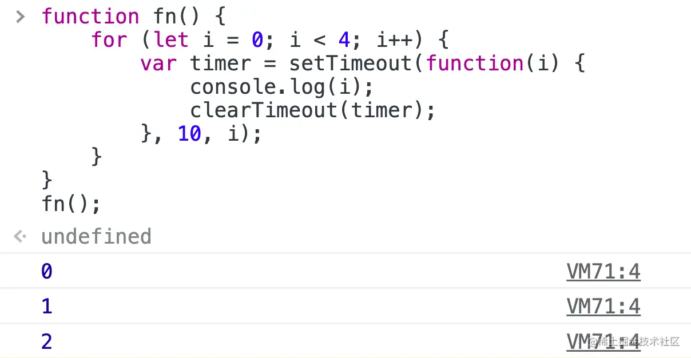
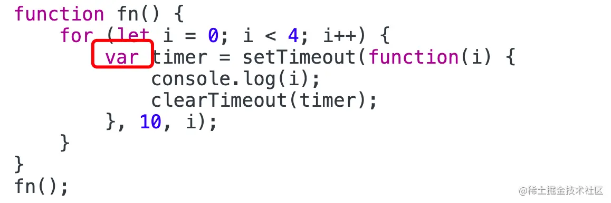
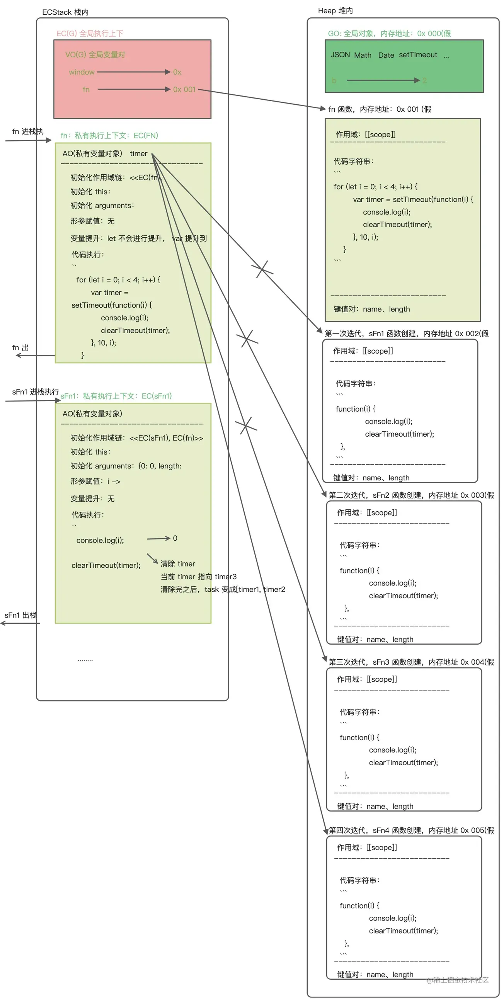

在使用setTimeout()方法的时候，都是传两个参数一个参数是函数，第二个参数是毫秒数，表示异步处理过多少毫秒执行第一个函数参数.

后来有看到有人给setTimeout()传第三个参数，不清楚传第三个参数是干嘛的，于是就学习了一下。第三个或者更多参数都是第一个函数的参数,详情请看https://developer.mozilla.org/en-US/docs/Web/API/WindowOrWorkerGlobalScope/setTimeout

```
function test(x, y) {
  console.log(x, y)
}

setTimeout(test, 1000, 2, 3)
```
上面的例子将传2，3给test函数并打印出来。

<span style="color: blue">**注意：setTimeout()函数返回值是一个数值，每次执行返回值不一样， 是唯一的标识，方便clearTimeout()函数对该表示的定时器进行删除**</span>

## 前言
```js
function fn() {
    for(let i = 0; i < 4; i++) {
        var timer = setTimeout(function(i) {
            console.log(i);
            clearTimeout(timer);
        }, 10, i)
    }
}
fn();
```
请问这段代码执行会输出什么？

## 结果是什么：
我们在浏览器运行一下这段代码，结果是0、1、2。你答对了吗。


为什么这段代码输出的是0、1、2,而不是0、1、2、3

## 执行函数
问题就出在 timer 前面这个 var 上。


var定义的变量，是不会生成"块级作用域"的，按照之前文章的思路([前端基石:函数的底层执行机制](https://juejin.cn/post/7083522201160253476))，我们来一步步执行代码

1. 函数创建
    - 一个函数的创建会在Heap堆内存中开辟一块空间来存储函数。对象在创建会在堆内存中存储对象的键值对，二函数在堆内存中存储三部分东西:
        - 作用域[[scope]](这里是window)
        - 函数字符串
        - 键值对
2. 变量提升，fn提升到最前面
3. 代码执行(函数执行)
    1. 函数执行
    2. 函数进行初始化操作
    3. 函数存储的字符串执行，将堆内存中存在的代码字符串从上往下顺序进行执行
    4. 出栈释放

## 异步队列执行
异步队列会按照task的顺序依次执行，<span style="color: blue">当执行timer0的时候会执行clearTimerout(timer3),把timer3从task列表里去掉，最终只有timer0、timer1、timer2三个得到执行，因此只会console出0、1、2</span>



## 资料
[原文](https://www.cnblogs.com/erduyang/p/7384622.html)

[前端基石：一段代码隐含了多少基础知识？](https://juejin.cn/post/7088161682027085860)
