## swiper
swiper很多时候,我们可能只用到了它的10%b不到的功能，显然是不划算的，也会有性能方面的顾虑

随着CSS的不断发展,现场纯CSS也几乎能够实现这样一个swiper了,实现更加简单，更加清凉，性能也更好，完全足够日常使用，最近在项目中也碰到了一个swiper需求，刚好练一下 一起看看

## 一、css滚动吸附
swiper有个最大的特征就是滚动吸附。相信很多同学已经想到了，那就是CSS scroll snap，这里简单介绍一下

**看似属性很多，其实CSS scroll snap最核心的概念有两个，一个是scroll-snap-type，还一个是scroll-snap-align，前者是用来定义吸附的方向和吸附程序的，设置【滚动容器】上，后者用来定义吸附点的对齐方式的，设置在【子元素】上**

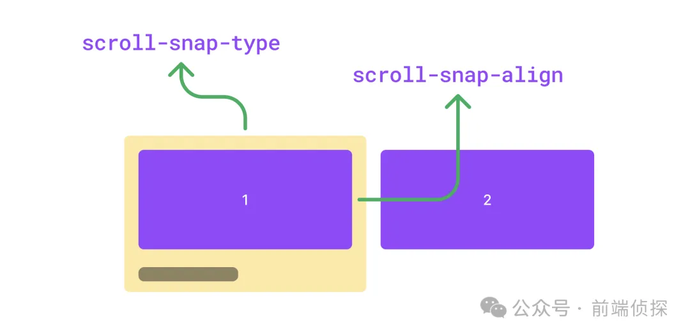

有了这两个属性，就可以轻松的实现滚动吸附效果了，下面举个例子
```html
<div class="swiper">
    <div class="swiper-item">
        <div class="card"></div>
    </div>
    <div class="swiper-item">
        <div class="card"></div>
    </div>
    <div class="swiper-item">
        <div class="card"></div>
    </div>
</div>
```
简单修饰一下，让swiper可以横向滚动
```css
.swiper {
    diplay: flex;
    overflow: auto;
}
.swiper-item {
    width: 100%;
    display: flex;
    justify-content: center;
    flex-shrink: 0
}
.card {
    width: 300px;
    height: 150px;
    border-radius: 12px;
    background-color: #9747ff;
}
```
效果如下

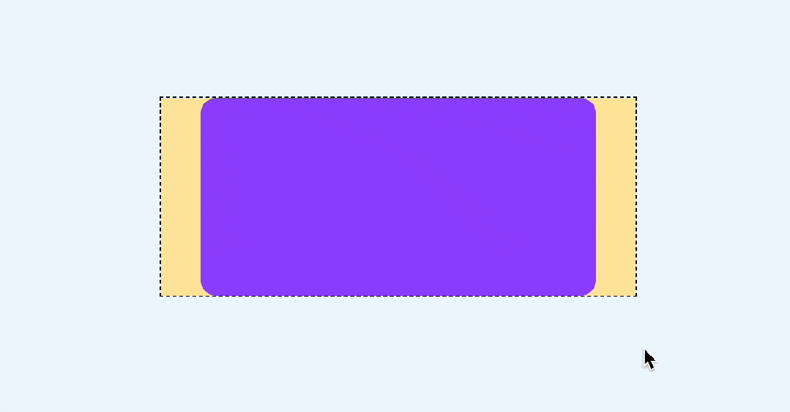

然后加上scroll-snap-type 和 scroll-snap-align
```css
.swiper {
    scroll-snap-type: x mandatory;
}
.swiper-item {
    scroll-snap-align: center;
}
```
这样就能实现滚动吸附了

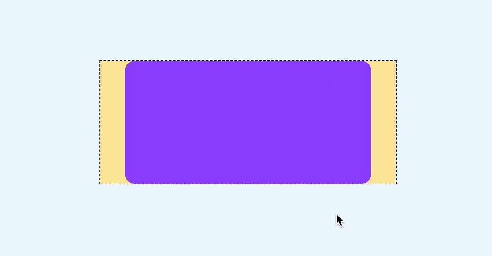

注意这里还有一个细节，如果滑动的非常快，是可以从第一个直接滚动到最后一个的，就像这样

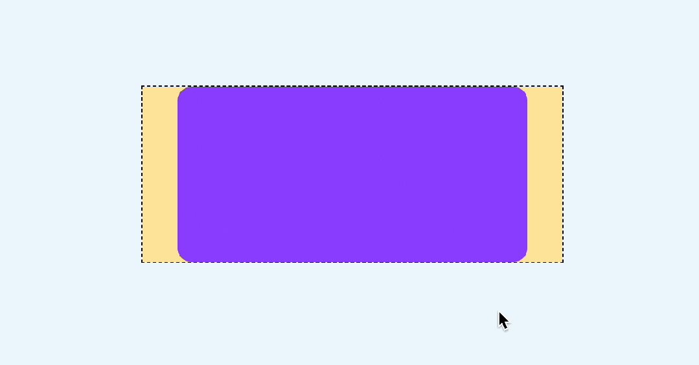

如果不想跳过，也就是每次滑动只会滚动一屏，可以设置scroll-snap-stop属性，它可以决定是否"跳过"吸附点，默认是normal，可以设置为always，标识每次滚动都会停止在最近的一个吸附点
```css
.swiper-item {
    scroll-snap-align: center;
    scroll-snap-stop: always;
}
```
这样无论滚动有多快，都不会跳过任何一屏了

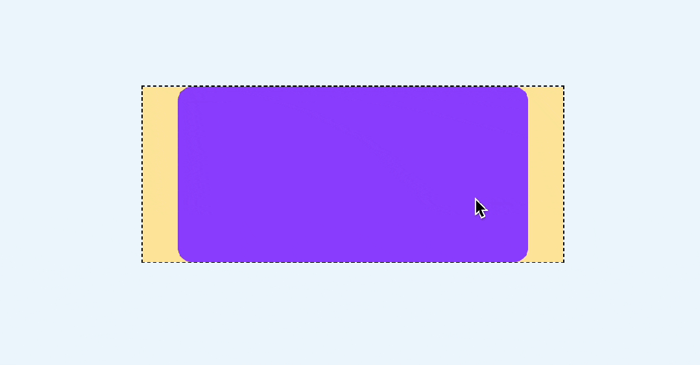

还有一点，现在是有滚动条的，显然是多余的

这里可以用 ::webkit-scrollbar 去除滚动条
```css
::-webkit-scrollbar {
    width: 0;
    height: 0
}
```
如果在某些移动端无效，可以参考之前这篇文章，有更多的解决办法

[裁剪的3种方式，CSS 如何隐藏移动端的滚动条？](https://mp.weixin.qq.com/s?__biz=MzIyMDc1NTYxNg==&mid=2247488113&idx=1&sn=f06c609923be4a013fe07e73908436cd&chksm=97c671bea0b1f8a83c8f943cb7f6f2e2c51c7e31c95a7dc6d251eec7a9d24b894617ba471d4d&scene=21#wechat_redirect)

滑动基本上就这样了，下面来实现比较重要的指示器

## 二、CSS滚动驱动动画
首先我们加几个圆形的指示器
```html
<div class="swiper">
  <div class="swiper-item">
    <div class="card"></div>
  </div>
  <div class="swiper-item">
    <div class="card"></div>
  </div>
  <div class="swiper-item">
    <div class="card"></div>
  </div>
  <!--指示器-->
  <div class="pagination">
    <i class="dot"></i>
    <i class="dot"></i>
    <i class="dot"></i>
  </div>
</div>
```
```css
.pagination {
  position: absolute;
  display: inline-flex;
  justify-content: center;
  bottom: 10px;
  left: 50%;
  transform: translateX(-50%);
  gap: 4px;
}
.dot {
  width: 6px;
  height: 6px;
  border-radius: 3px;
  background: rgba(255, 255, 255, 0.36);
  transition: 0.3s;
}
```
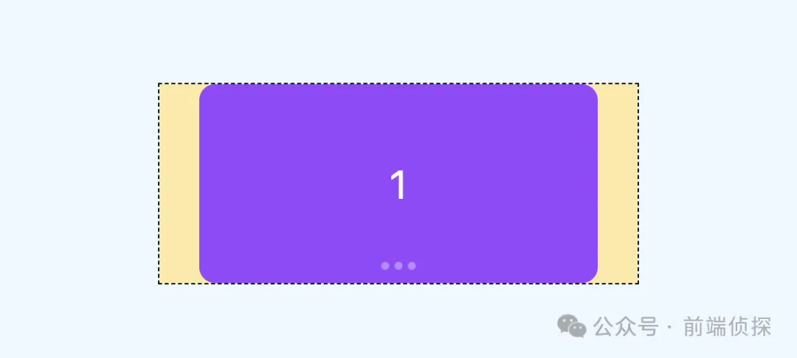

那么，如何让下方的指示器跟随滚动而变化呢？

这就需要用到 CSS 滚动驱动动画了，关于这个特性，可以参考之前这篇文章

[CSS 滚动驱动动画终于正式支持了~](https://juejin.cn/post/7259026189904805944)

在这里，我们可以再单独绘制一个高亮的状态，刚好覆盖在现在的指示器上，就用伪元素来代替
```css
.pagination::before {   234
    content: ' ';
    position: asbolute;
    width: 6px;
    height: 6px;
    border-radius: 3px;
    background-color: #f24822;
    left: 0;
}
```
效果如下
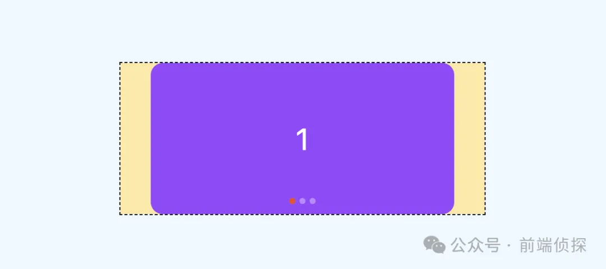

然后给这个高亮状态一个动画，从第一个指示器移动到最后一个

```css
.pagination:after {
    animation: move 3s linear forwards;
}
@keyframes move {
    to{
        left: 100%;
        transform: translateX(-100%);
    }
}
```
现在这个红色的圆会自动从左到右运动，效果如下

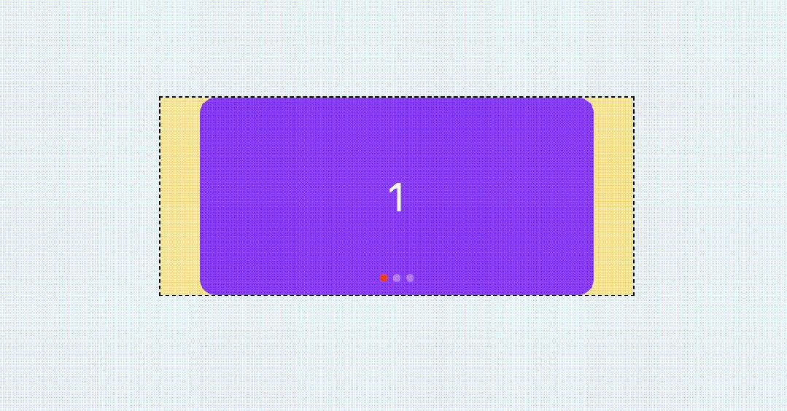

**最后，让这个动画和滚动关联起来，也就是滚动多少，这个红色的圆就运动多少**
```css
.swiper {
    scroll-timeline: --scroller x;
}
.pagination::after {
    animation: move 3s linear forwards;
    animation-timeline: --scroller;
}
```
这样就基本实现了指示器的联动

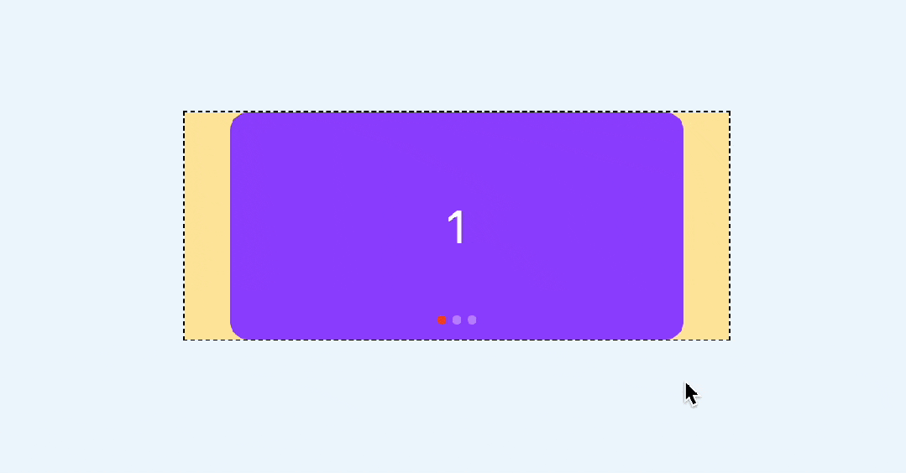

当然，你还可以换一种动画形式，比如steps

```css
.pagination::after {
    animation: move 3s steps(3, jump-none) forwards;
    animation-timeline: --scroller;
}
```
效果如下

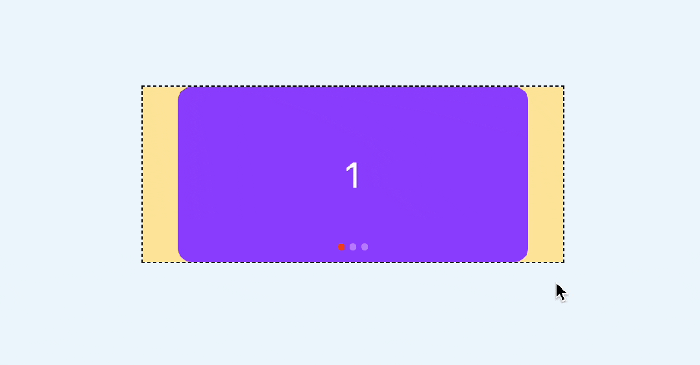

你也可以访问一下在线demo

[CSS swiper (juejin.cn)](https://code.juejin.cn/pen/7391010495207047205)

## 三、CSS时间线范围
上面的指示器实现其实是通过覆盖的方式实现的,这就意味着无法实现这种有尺寸变化的效果，例如：

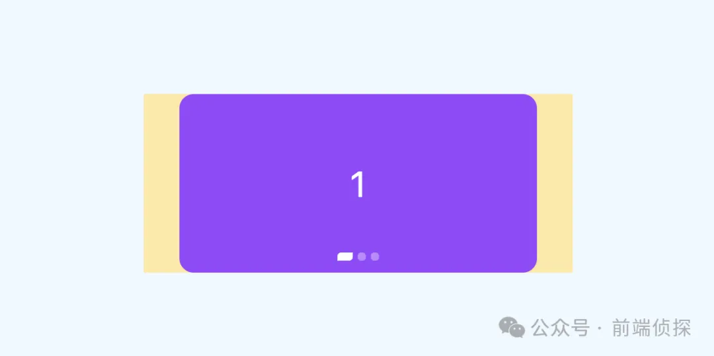

这种情况下，每个指示器的变化是独立的，而且尺寸变化还会相互挤压

那么，有没有办法实现这样的效果呢？当然也所有的，需要用到css时间线范围，也就是 timeline-scope

[https://developer.mozilla.org/en-US/docs/Web/CSS/timeline-scope](https://developer.mozilla.org/en-US/docs/Web/CSS/timeline-scope)

这是什么意思呢?默认情况下，CSS滚动驱动作用范围只能影响到子元素，但是通过 timeline-scope，可以让任意元素都可以收到滚动驱动的影响。简单举个例子
```html
<div class="content">
  <div class="box animation"></div>
</div>

<div class="scroller">
  <div class="long-element"></div>
</div>
```
这是两个元素，右边的是滚动容器，左边的是一个可以旋转的矩形

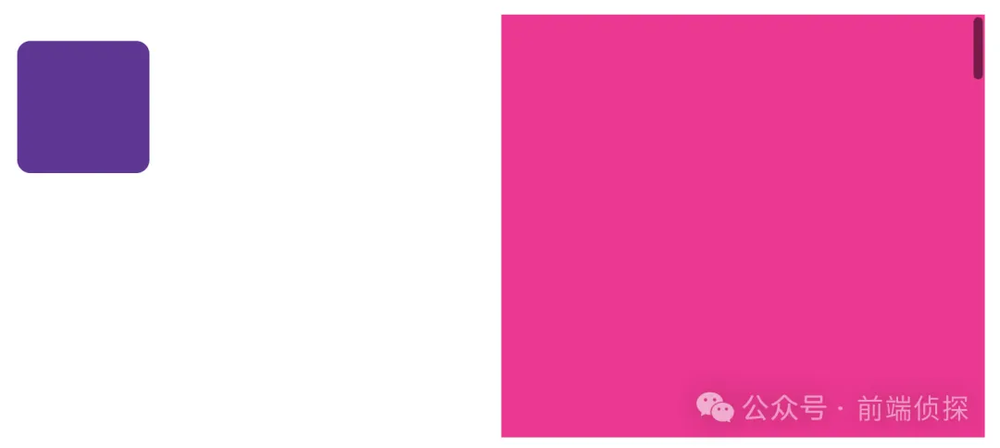

我们可以在他们共同的父级，比如body定义一个timeline-scope

```css
body{
  timeline-scope: --myScroller;
}
```
然后，滚动容器的滚动和矩形的动画就可以通过这个变量关联起来了
```css
.scroller {
    overflow: scroll;
    scroll-timeline-name: --myScroller;
    background: deepink;
}
.animation {
    animation: rotate-appear:
    animation-timeline: --myScroller;
}
```
效果如下

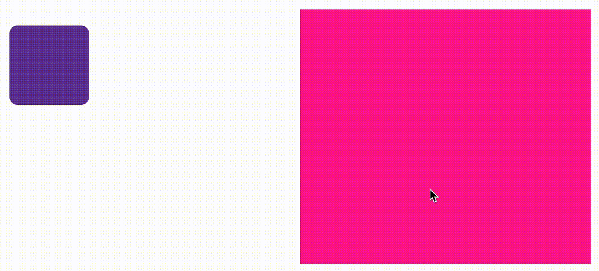

我们回到这个例子中来，很明显每个卡片对应一个一个指示器，但是他们从结构上又不是包含关系,所以这里也可以给每个卡片和指示器一个相关联的变量，具体实现如下

```html
<div class="swiper-container" style="timeline-scope: --t1,--t2,--t3;">
  <div class="swiper" style="--t: --t1">
    <div class="swiper-item">
      <div class="card">1</div>
    </div>
    <div class="swiper-item" style="--t: --t2">
      <div class="card">2</div>
    </div>
    <div class="swiper-item"  style="--t: --t3">
      <div class="card">3</div>
    </div>
  </div>
  <div class="pagination">
    <i class="dot" style="--t: --t1"></i>
    <i class="dot" style="--t: --t2"></i>
    <i class="dot" style="--t: --t3"></i>
  </div>
</div>
```
然后，给每个指示器添加一个动画
```css
@keyframes move {
    50% {
        width: 12px;
        border-radius: 3px 0px;
        border-color: rgba(0, 0,0, 0.12);
        background: #fff;
    }
}
```
效果如下

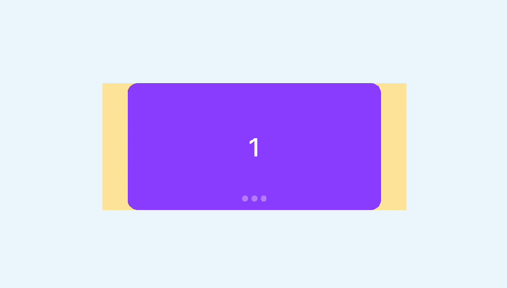

然后我们需要将这个动画和卡片的滚动关联起来，由于是需要监听卡片的位置状态，比如只有第二个出现在视区窗口范围内时，第二个指示器才会变化，所以这里要用到 view-timeline，关键实现如下
```css
.swiper-item {
    view-timeline:var(--t) x;
}
.dot {
    animation: move 3s;
    animation-timeline: var(--t);
}
```
这样就实现了我们想要的效果

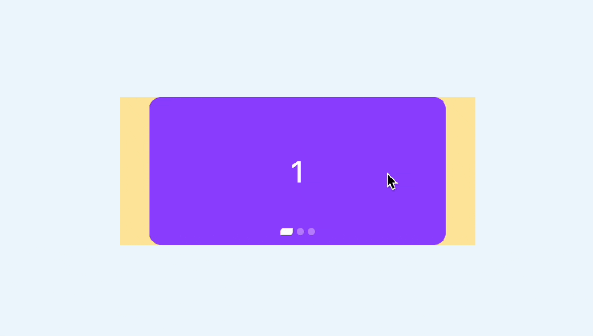

你也可以访问以下在线demo

[CSS swiper timeline scope (juejin.cn)[2]]( https://code.juejin.cn/pen/7391018122460954636)

## 自动播放
由于是页面滚动，CSS无法直接控制，所以要换一种方式。通过我们会借助JS定时器实现，但是控制比较麻烦

还记得之前这篇文章吗？

[还在用定时器吗？借助 CSS 来监听事件](https://mp.weixin.qq.com/s?__biz=MzIyMDc1NTYxNg==&mid=2247486014&idx=1&sn=e99c4311196e37e24303c565efdde212&chksm=97c669f1a0b1e0e7dc368f35b049538eec02364bb8efc69f963c1583405e4b5a79011220e34e&scene=21#wechat_redirect)

没错，我们这里也可以用这个原理实现。

给容器定义一个无关紧要的动画

```css
.swiper {
    animation: scroll 3s infinite;
}
@keyframes scroll {
    to {
        transform: opacity: .99
    }
}
```
然后监听animationiteration事件，这个事件表示每次动画循环就触发一次，也就相当于每3秒执行一次
```js
swiper.addEventListener('animationiteration', ev => {
    // 轮播逻辑
    if(ev.target.offsetWidth + ev.target.scrollLeft >= ev.target.scrollWidth) {
        // 滚动到最右边直接回到0
        ev.target.scrollTo({
            left: 0,
            behavior: 'smooth'
        })
    } else {
        // 每次滚动一屏
        ev.target.scrollBy({
            left: ev.target.offsetWidth,
            behavior: 'smooth'
        })
    }
})
```
相比定时器的好处就是，可以直接通过CSS控制播放和暂定，比如我们要实现当鼠标房子啊轮播上是自动暂停，可以这样来实现，副作用更小
```css
swiper:hover,.swiper:active {
    animation-play-state: paused; 
}
```
最终效果如下

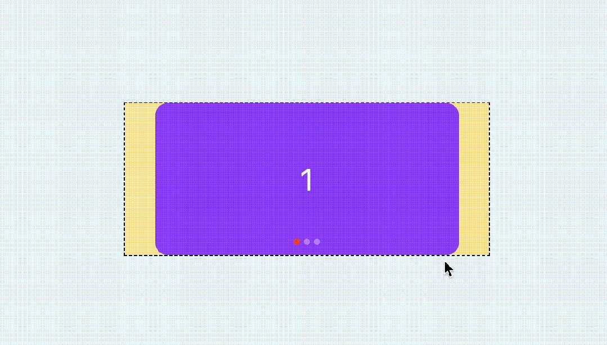

demo

[CSS swiper autoplay (juejin.cn)](https://code.juejin.cn/pen/739102505507989099)


## 回调事件
swiper很多时候不仅仅只是滚动，还需要有个回调事件，以便于其他处理。这里由于是滚动实现，素以有必要监听scroll事件。

实现很简单，只需要监听滚动便宜和容器本身的尺寸就可以了，具体实现如下
```js
swiper.addEventListener('scroll', (ev) => {
    const index =  Math.floor(swiper.scrollLeft / swiper.offsetWidth)
    console.log(index)
})
```
效果如下
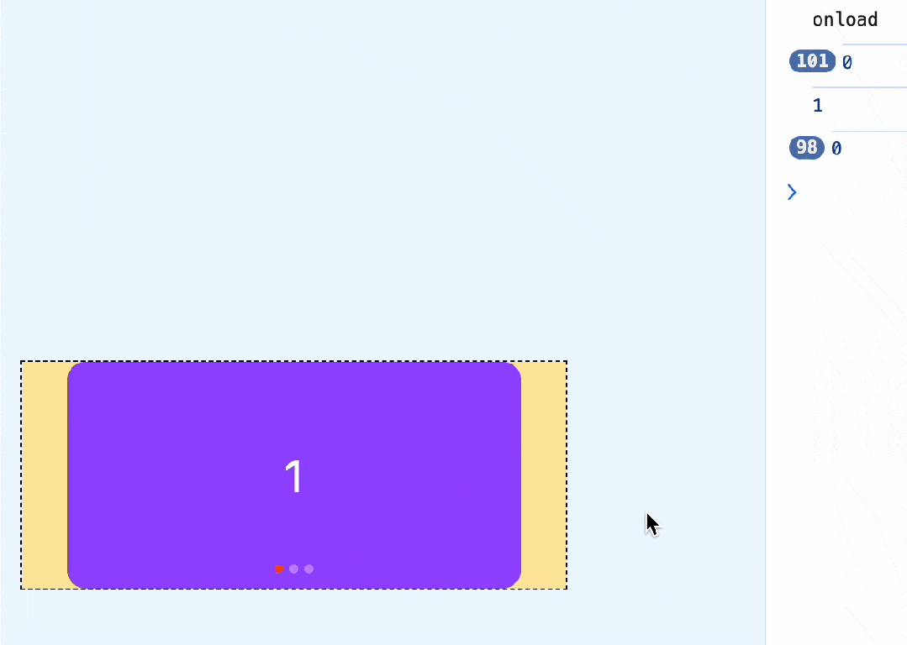

你可能觉得出发次数太多了，我们可以限制一下，只有改变的时候才触发
```js
swiper.addEventListener('scroll', (ev) => {
    const index = Math.floor(swiper.scrollLeft / swiper.offsetWidth)
    // 和上次不相同的时候才打印
    if(swiper.index !== index) {
        swiper.index = index;
        console.log(index);
    }
})
```


还可以继续优化，当滑动超过一半时，就认为已经滑到了下一个卡片了，只需要在原有基础上加上0.5就行了
```js
swiper.addEventListener('scroll', (ev) => {
    const index = Math.floor(swiper.scrollLeft / swiper.offsetWidth + 0.5);
    if (swiper.index!== index) {
        swiper.index = index
        console.log(index)
    }
})
```

如果在vue这样的框架里，就可以直接这样实现了
```js
const current = ref(0);
const scroll = (ev: Event) => {
    const swiper = ev.target.as HTMLDivElement;
    if(swiper) {
        current.value = Math.floor(swiper.scrollLeft / swiper.offsetWidth + 0.5);
    }
}
const emits = defineEmits(['change']);
watch(current, v => {
    emits('change', v);
})
```

## 兼容性处理
前面提到的CSS滚动驱动动画兼容性不是很好，需要Chrome 115+,所以对于不支持的浏览器，你也可以用监听回调事件的方式来实现指示器联动，就像这样
```js
swiper.addEventListener('scroll', (ev) => {
    const index = Math.floor(swiper.scrollLeft / swiper.offsetWidth + 0.5);
    if(swiper.index !== index) {
        swiper.index = index;
        console.log(index);
        if(!CSS.supports('animation-timeline', 'scroll()')) {
            document.querySelector('.dot[data-current="true"]').dataset.current = false
            document.querySelectorAll('.dot')[index].dataset.current = true
        }
    }
})
```
对于 CSS部分，还需要用CSS support判断一下，这样一来，不支持浏览器就不会自动播放动画了
```css
@supports (animation-timeline: scroll()) {
  .dot{
    animation: move 1s;
    animation-timeline: var(--t);
  }
}
@supports not (animation-timeline: scroll()) {
  .dot[data-current="true"]{
    width: 12px;
    border-radius: 3px 0px;
    border-color: rgba(0, 0, 0, 0.12);
    background: #fff;
  }
}
```
这样既使用了最新的浏览器特性，又兼顾了不支持的浏览器，下面是Safari的效果

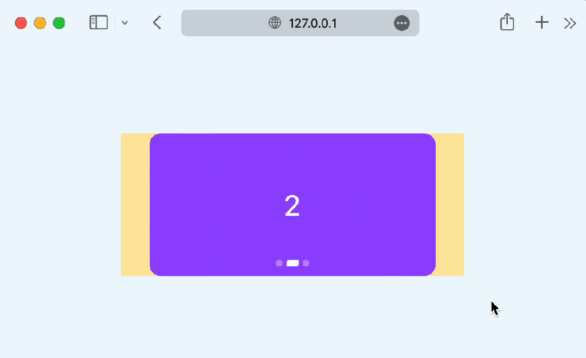

对比一下支持 animation-timeline的浏览器(chrome 115+)

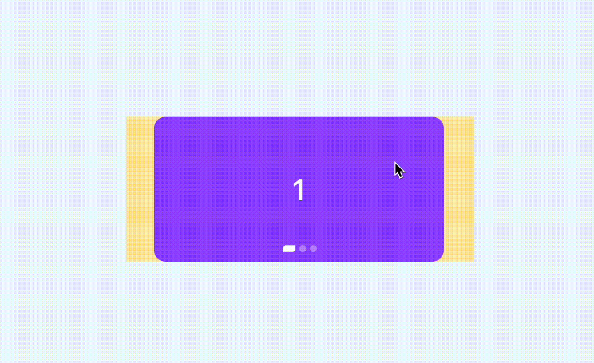
你会发现，这种效果更加细腻，指示器是完全跟随滚动进度变化的

## 总结
做好兼容，CSS也是可以尝试最新特性的，下面总结一下要点
- swiper非常强大，我们平时可能只用到它的10%不到的功能，非常不划算
- CSS发展非常迅速，完全可以借助CSS替代部分swiper
- 滚动吸附比较容易，需要借助CSS scroll snap完成
- 指示器联动可以用 css滚动驱动 动画 实现，让指示器唯一动画和滚动关联起来，也就是滚动多少，指示器就偏移多少
- 默认情况下，CSS 滚动驱动作用范围只能影响到子元素，但是通过timeline-scope，可以让任意元素都可以受到滚动驱动的影响。
- 利用timeline-scope，我们可以将每个卡片的位置状态和每个指示器的动画状态联动起来
- 自动播放可以借助animationiteration回调事件，相比JS定时器，控制更加方便，副作用更小
- 回调事件需要监听scroll实现，只需要监听滚动偏移和容器本身的尺寸的比值就行了
- 对于不兼容的浏览器，也可以通过回调事件手动关联指示器的状态
- 兼容性判断，JS可以使用CSS.supports，CSS可以使用@supports

当然，swiper的功能远不止上面这些，但是我们平时遇到的需求可能只是其中的一小部分，大可以通过CSS方式去实现，充分发挥浏览器的特性，量身定制才会有足够的性能和体验。


## 资料
[终于可以不用 swiper.js 了！](https://mp.weixin.qq.com/s/BOY6XVGtL_C_4JtmU7Uv3A)