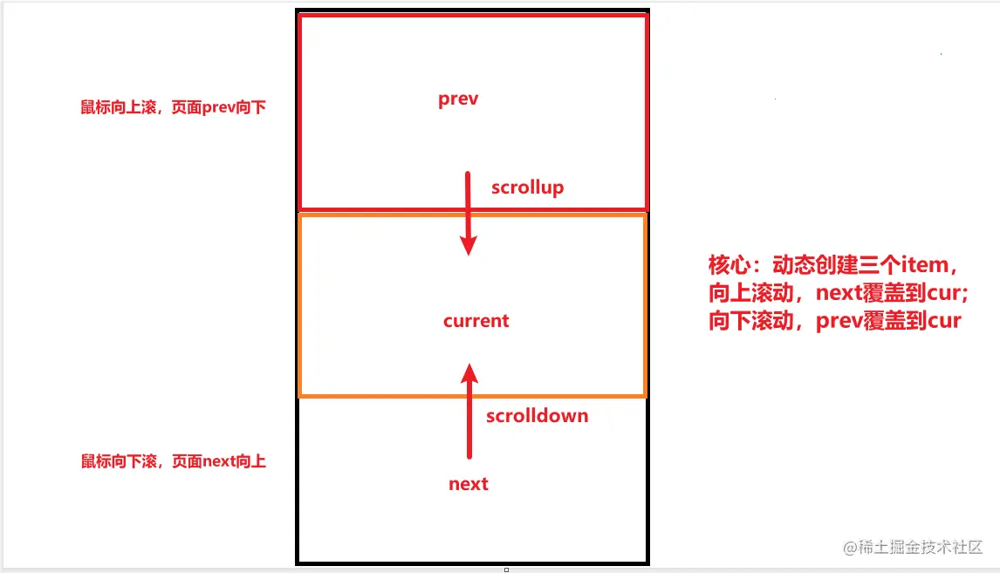
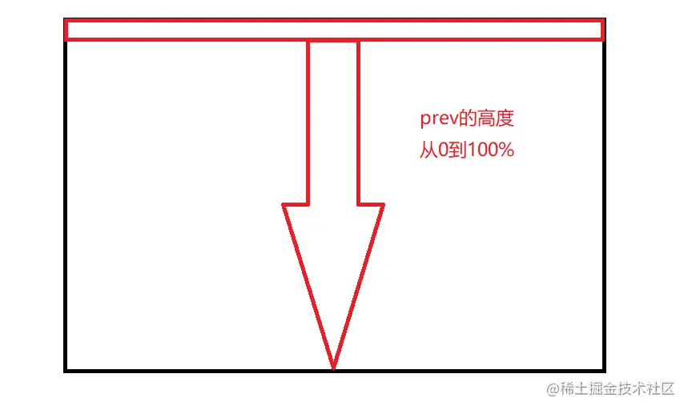
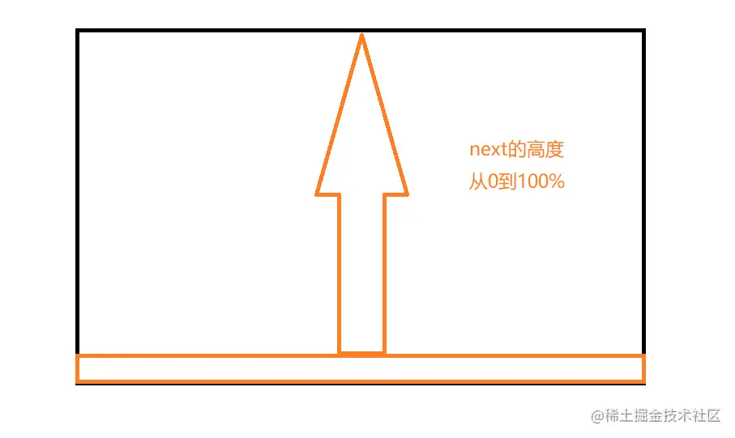

## 效果


## 实现无限视差滚动原理






## HTML
HTML也没啥内容，简单就一个最外层的div盒子，监听最外层div的 wheel 事件，里面的子元素上下移动，子元素上面可以加一些元素、slogan之类的
```html
<!DOCTYPE html>
<html lang="en">

<head>
    <meta charset="UTF-8">
    <meta name="viewport" content="width=device-width, initial-scale=1.0">
    <title>无限视差滚动</title>
    <link rel="stylesheet" href="./index.css">
</head>

<body>
    <!-- container最外层盒子 -->
    <div class="scroll-container"></div>
    <script src="./index.js"></script>

</body>

</html>
```
## CSS
- prev盒子
    prev盒子的定位是top:0,再将高度从0增加到100%，就有从上到下的效果

    将.item.prev img初始设置维transform: translateY(-10%) 再到 item.cur img 的transform: translateY(10%),实现轻微向下的动作

- next盒子

    next盒子的定位是bottom:0;，再将高度从0增加到100%，就有从下到上的效果

    将.item.next img初始设置为transform: translateY(10%)再到item.cur img的transform: translateY(-10%)，实现轻微向上的动作

```css
* {
    margin: 0;
    padding: 0;
}


/* 最外层盒子 */

.scroll-container {
    position: relative;
    width: 100%;
    height: 100vh;
    margin: 0 auto;
}


/* 每张图片的外框item */

.item {
    position: absolute;
    width: 100%;
    height: 100%;
    overflow: hidden;
    transition: 1s ease-in-out;
}


/* 图片 */

.item img {
    position: absolute;
    width: 100%;
    height: 100vh;
    object-fit: cover;
    transition: 1s;
}


/* 上一个和下一个框 */

.item.prev,
.item.next {
    z-index: 1;
    height: 0;
}


/* 设置从下往上滑的图片和图片外框底部对齐 */

.item.next {
    bottom: 0;
}


/* 上一张图和下一张图 */

.item.prev img {
    transform: translateY(-10%);
}

.item.next img {
    bottom: 0;
    transform: translateY(10%);
}


/* 向上滚动 */

.scroll-up .item.prev {
    height: 100%;
}

.scroll-up .item.prev img {
    transform: translateY(0);
}

.scroll-up .item.cur img {
    transform: translateY(10%);
}


/* 向下滚动 */

.scroll-down .item.next {
    height: 100%;
}

.scroll-down .item.next img {
    transform: translateY(0);
}

.scroll-down .item.cur img {
    transform: translateY(-10%);
}
```
## Javascript
- 监听鼠标滚轮

    通过e.deltaY来判断纵向滚动距离，如果e.deltaY > 0表示向下滚动，给外层盒子加上scroll-down类名，如果e.deltaY < 0表示向上滚动，给外层盒子加上scroll-up类名

    isAnimating表示是否正在动画中，用来减少触发次数，一次滚动只触发一次。
- 动态创建子元素

    根据下标获取图片的url动态创建img插入到item,在讲item插入到最外层盒子

- 滚动结束

    使用transitionend事件是在CSS transition结束后触发，常用于监听transition事件

    将isAnimating设置为false，移除类名，重新初始化

```js
window.onload = function() {

    //存放图片的数组
    const images = [
        './images/img1.jpg',
        './images/img2.jpg',
        './images/img3.jpg',
        './images/img4.jpg',
        './images/img5.jpg'
    ]

    //获取最外层div盒子
    const scrollContainer = document.querySelector('.scroll-container');


    let currentIndex = 0;

    //动态创建子元素
    function createItem(index) {
        //从images数组中获取下标为index的图
        const imgUrl = images[index];

        //动态创建div盒子，将图片作为其子元素，再将div盒子加到最外层scrollContainer
        const item = document.createElement('div');
        item.classList.add('item');
        item.innerHTML = ``;
        scrollContainer.appendChild(item);
        return item;
    }

    //每次滚动的时候，调用初始化函数
    function resetElements() {
        scrollContainer.innerHTML = '';
        //上一张图片下标
        const prevIndex = currentIndex - 1 < 0 ? images.length - 1 : currentIndex - 1;
        //下一张图片的下标
        const nextIndex = currentIndex + 1 > images.length - 1 ? 0 : currentIndex + 1;

        //创建上一张图片item
        createItem(prevIndex).classList.add('prev');
        //创建当前图片item
        createItem(currentIndex).classList.add('cur');
        //创建下一张图片item
        createItem(nextIndex).classList.add('next');
    }

    resetElements();

    //表示是否正在动画中
    let isAnimating = false;

    //监听滚动事件
    scrollContainer.addEventListener('wheel', (e) => {
        if (!e.deltaY) return;

        //当前正在滚动时，跳出
        if (isAnimating) return;

        isAnimating = true;

        if (e.deltaY > 0) { //向下滚动
            scrollContainer.classList.add('scroll-down');
            //改变当前图片的下标
            currentIndex = currentIndex + 1 > images.length - 1 ? 0 : currentIndex + 1;
        } else { //向上滚动
            scrollContainer.classList.add('scroll-up');
            //改变当前图片的下标
            currentIndex = currentIndex - 1 < 0 ? images.length - 1 : currentIndex - 1;
        }
    })


    // 滚动结束之后
    scrollContainer.addEventListener('transitionend', () => {
        //表示当前为滚动
        isAnimating = false;

        // 滚动结束移除类名
        scrollContainer.classList.remove('scroll-down');
        scrollContainer.classList.remove('scroll-up');
        resetElements();
    })

}
```


## 资料
[原文](https://juejin.cn/post/7245980207315075130)