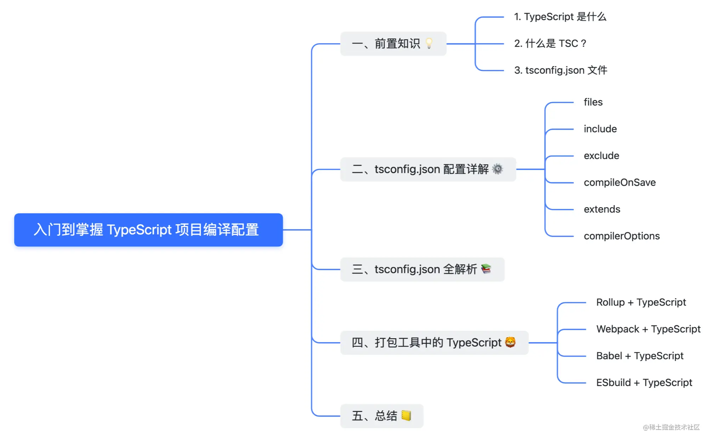
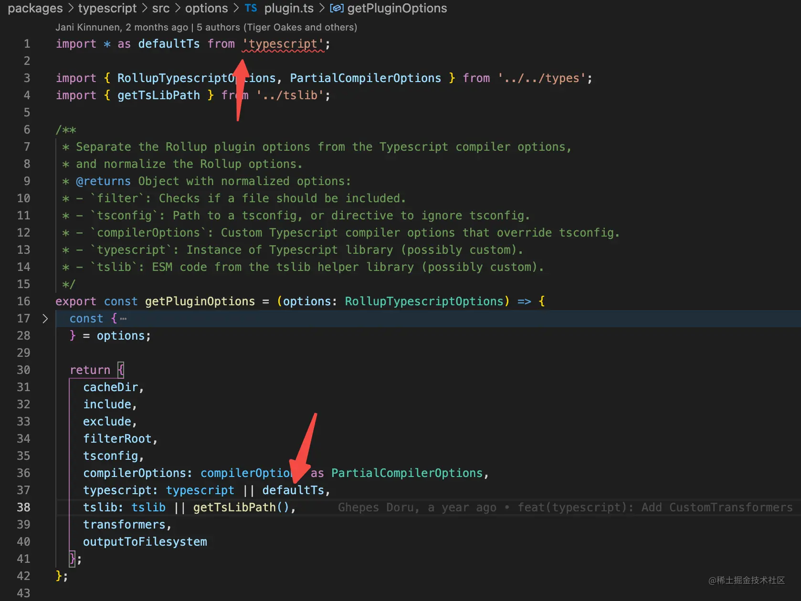
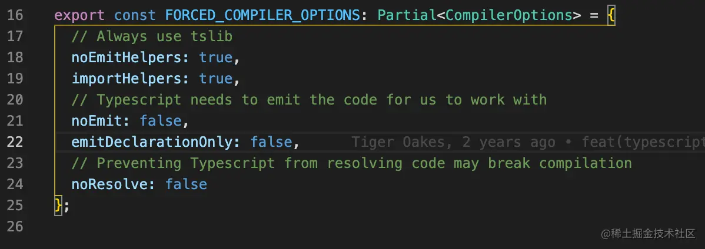
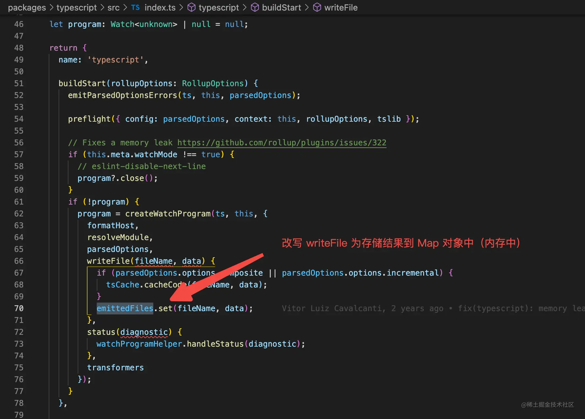
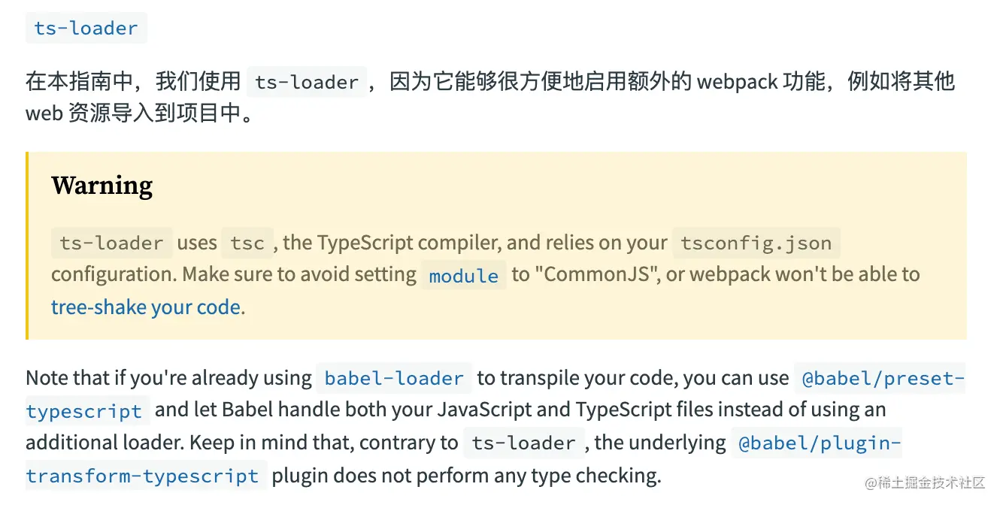
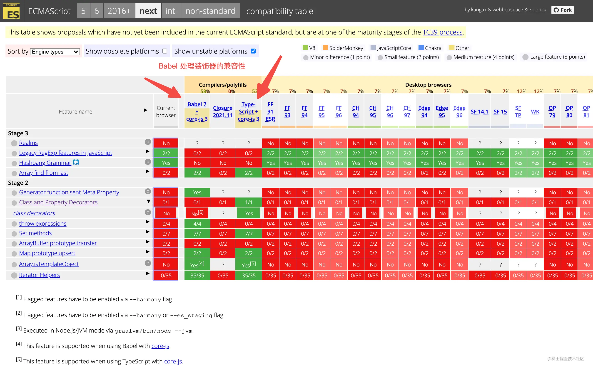

## 前置知识
### 1.1TypeScript是什么？
[TypeScript 官网](www.typescriptlang.org)

**TypeScript是一种基于JavaScript的强类型编程语言，它使得在前端项目开发过程中更加严谨且流畅，一定程度上保证了大型前端项目程序的健壮性**。

- TypeScript是由微软开发的一款开源的编程语言
- TypeScript是Javascript的超集，遵循最新的ESM规范，TypeScript扩展了Javascript的语法
- TypeScript更像后端Java、C#这样面向对象语言，可以让JS开发大型企业级项目

<span style="color:red">但是TypeScript并不可以直接运行，而是需要转换成Javascript代码才可以在Node.js或浏览器环境下执行，因此我们需要通过"编译器"将TS代码转换为JS代码</span>

### 1.2什么是tsc
tsc的全称是Typescript Compiler,也就是将TypeScript转码为Javascript代码的编译器

tsc的全局安装方式
```js
npm install typescript -g
```
当我们编译一份index.ts文件时，会使用下面的命令
```js
tsc ./index.ts
```
这样就可以得到一份编译成为Javascript代码的 ./index.js文件

<span style="color: blue">tsc实际上就是将TS转为JS的编译(器)脚手架工具，如果是一个TS的前端工程项目，那么就可以通过项目中的tsconfig.json文件来自定义配置TS编译的相关规则</span>

项目中的tsconfig.json文件，我们一般会通过如下快捷命令生成
```js
tsc --init
```
执行完后，会在项目根目录生成一个简单的初始化tsconfig.json配置描述文件，如果没有特别的要求，该初始化配置就足以支持你愉快的使用TS开发了

更多的相关TS编译配置和使用说明可以通过tsc -h查看

### 1.3tsconfig.json文件
tsconfig.json 文件是用于描述将 TypeScript 转为 JavaScript 代码的配置文件。

IDE（代码编辑器）将会根据 tsconfig.json 文件来对当前项目中支持不同程度的类型约束，同时也是对 TSC 编译 TypeScript 代码过程做一些预定义、约束入口和编译输出目录等配置。

因此对于一个支持 TypeScript 编程语言的工程来说，tsconfig.json 文件就是编码的基础。

## tsconfig.json 配置详解

## tsconfig.json 全解析
上面针对 tsconfig.json 中一些常见配置做了详细解释，将一些不常用的配置字段组合在一起，做一个 Checklist 如下：
```js
{
  "compilerOptions": {
    /* 基本选项 */
    "target": "es6", // 指定 ECMAScript 目标版本: 'ES3' (default), 'ES5', 'ES2015', 'ES2016', 'ES2017', or 'ESNEXT'
    "module": "commonjs", // 指定使用模块: 'commonjs', 'amd', 'system', 'umd' or 'es2015'
    "lib": [], // 指定要包含在编译中的库文件
    "allowJs": true, // 允许编译 javascript 文件
    "checkJs": true, // 报告 javascript 文件中的错误
    "jsx": "preserve", // 指定 jsx 代码的生成: 'preserve', 'react-native', or 'react'
    "declaration": true, // 生成相应的 '.d.ts' 文件
    "declarationDir": "./dist/types", // 生成的 '.d.ts' 文件保存文件夹
    "sourceMap": true, // 生成相应的 '.map' 文件
    "outFile": "./", // 将输出文件合并为一个文件
    "outDir": "./dist", // 指定输出目录
    "rootDir": "./", // 用来控制输出目录结构 --outDir.
    "removeComments": true, // 删除编译后的所有的注释
    "noEmit": true, // 不生成输出文件
    "importHelpers": true, // 从 tslib 导入辅助工具函数
    "isolatedModules": true, // 将每个文件做为单独的模块 （与 'ts.transpileModule' 类似）.

    /* 严格的类型检查选项 */
    "strict": true, // 启用所有严格类型检查选项
    "noImplicitAny": true, // 在表达式和声明上有隐含的 any类型时报错
    "strictNullChecks": true, // 启用严格的 null 检查
    "noImplicitThis": true, // 当 this 表达式值为 any 类型的时候，生成一个错误
    "alwaysStrict": true, // 以严格模式检查每个模块，并在每个文件里加入 'use strict'

    /* 额外的检查 */
    "noUnusedLocals": true, // 有未使用的变量时，抛出错误
    "noUnusedParameters": true, // 有未使用的参数时，抛出错误
    "noImplicitReturns": true, // 并不是所有函数里的代码都有返回值时，抛出错误
    "noFallthroughCasesInSwitch": true, // 报告switch语句的fallthrough错误。（即，不允许switch的case语句贯穿）

    /* 模块解析选项 */
    "moduleResolution": "node", // 选择模块解析策略： 'node' (Node.js) or 'classic' (TypeScript pre-1.6)
    "baseUrl": "./", // 用于解析非相对模块名称的基础目录
    "paths": {}, // 模块名到基于 baseUrl 的路径映射的列表
    "rootDirs": [], // 根文件夹列表，其组合内容表示项目运行时的结构内容
    "typeRoots": [], // 包含类型声明的文件列表
    "types": [], // 需要包含的类型声明文件名列表
    "allowSyntheticDefaultImports": true, // 允许从没有设置默认导出的模块中默认导入。
    "esModuleInterop": true, // 支持合成模块的默认导入
  
    /* Source Map Options */
    "sourceRoot": "./", // 指定调试器应该找到 TypeScript 文件而不是源文件的位置
    "mapRoot": "./", // 指定调试器应该找到映射文件而不是生成文件的位置
    "inlineSourceMap": true, // 生成单个 soucemaps 文件，而不是将 sourcemaps 生成不同的文件
    "inlineSources": true, // 将代码与 sourcemaps 生成到一个文件中，要求同时设置了 --inlineSourceMap 或 --sourceMap 属性

    /* 其他选项 */
    "experimentalDecorators": true, // 启用装饰器
    "emitDecoratorMetadata": true // 为装饰器提供元数据的支持
  },
  /* 指定编译文件或排除指定编译文件 */
  "include": ["src/**/*"],
  "exclude": ["node_modules", "**/*.spec.ts"],
  "files": ["index.ts", "test.ts"],
  // 从另一个配置文件里继承配置
  "extends": "@tsconfig/recommended",
  // 让 IDE 在保存文件的时候根据 tsconfig.json 重新生成文件
  "compileOnSave": true // 支持这个特性需要Visual Studio 2015， TypeScript 1.8.4 以上并且安装 atom-typescript 插件
}
```
## 打包工具中的TypeScript
前文讲到了为什么不推荐直接使用TSC作为项目的打包编译工具，那么接下来就简单看看在常见的几款打包工具中针对TypeScript的编译方案是如何设计的？

### 4.1Rollup + TypeScript
在Rollup打包中，我们一般只需要添加[@rollup/plugin-typescript](https://github.com/rollup/plugins/tree/master/packages/typescript/#readme)插件即可，该插件会默认读取项目根目录下的tsconfig.json配置文件

Rollup的配置就像这样:
```js
// file: rollup.config.js
import typescript from '@rollup/plugin-typescript';

export default {
    input: 'src/index.ts',
    output:  {
        dir: 'output',
        format: 'cjs'
    },
    plugins: [typescript()]
}
```
结合其源码:


因为typescript声明了是peerDependencies，因此会采用项目中安装的typescript版本，即是使用我们项目中的TS编译器。

通过阅读@rollup/plugin-typescript源码，可以看到该插件会模式使我们自己项目中的tsconfig.json文件作为TSC编译的配置，但是会做一些配置预设覆盖：

会调用ts.parseJsonConfigFileContent()方法，将 FORCED_COMPILER_OPTIONS 值 merge 到用户的自定义配置中。



通过英语解释看到，因为需要TSC编译获得JS产物，所以会将noEmit设置为false，也就是TSC编译会输出文件，但为什么我们在输出目录中没有看到对应的TSC产物？



但是如果开启了declaration,则会将TSC解析得到的*.d.ts文件输出到指定目录

### 4.2Webpack+TypeScript
在[webpack中的TypeScript](https://webpack.docschina.org/guides/typescript/)官方文档中，指明了需要安装:typescript和ts-loader两个模块

配置webpack并支持TypeScript的配置如下
```js
// file: webpack.config.js
const path = require('path');

module.exports = {
    entry: './src/index.ts',
    module: {
        rules: [
            {
                test: /\.tsx?$/,
                use: 'ts-loader',
                exclude: /node_modules/,
            }
        ]
    },
    resolve: {
        extensions: ['.tsx', '.ts', '.js']
    },
    output: {
        filename: 'bundle.js',
        path: path.resolve(__dirname, 'dist'),
    }
}
```
可以看出Webpack主要依赖ts-loader实现对TypeScrpt语法的编译支持，在看看对Ts-loader的介绍



换句话说，ts-loader实际调用了TSC来编译TS文件，TSC的配置依赖于你项目中的tsconfig.json文件。

如果使用了Babel，则可以使用[@babel/preset-typescript](https://babeljs.io/docs/en/babel-preset-typescript)来处理，但Bbel不会做TS类型校验，在打包工具Rollup和webpack中都可以引入babel，那么接下来看看Babel如何处理typescript的吧

### 4.3 Babel+ TypeScript
Babel处理TS需要安装@babel/preset-typescript模块，然后在babel项目配置文件中声明
```js
// 配置说明https://babeljs.io/docs/en/babel-preset-typescript
{
    "presets": ["@babel/preset-typescript"]
}
```
但Babel中只会对TS代码转为JS代码(通过parse TS文件为AST,并直接移除类型，然后打印目标代码)，不会去做TS类型检查，所以Babel编译TS文件相较于TSC的速度更快！

同时，因为Babel会根据不同的兼容环境，按需引入pollyfill，比TSC直接引入core-js更优雅，因此使用了Babel打包的体积更小

TS类型检查工作可以交给代码编译器承担，当然同事可以新增TS检查的命令
```js
//package.json
{
    "script": {
        "tsCheck": "tsc --noEmit"
    }
}
```
可以把类型检查放到待定的npm scripts声明周期之前，另外其实也可以将类型检查放到git commit阶段，用于做必要的TS类型检查，保证项目的正确性

### 4.4 ESbuild + TypeScript
通过Vite体会到了ESbuild带来的开发热更新『极速』体验，针对TS项目，ESbuild和Babel是相同的编译策略，即<span style="color: red">仅编译，不校验类型</span>

> Vite使用esbuild将TypeScript转译到Javascript,约是tsc速度的20~30倍，同时HMR更新反映到浏览器的时间小宇50ms---Vite docs

但在 ESbuild 中需要启用 tsconfig 中的 isolatedModules 功能，然后在类型引入的时候需要替换，规则参考如下：

```js
// old
import { UserType } from './types';

// new
import type { UserType } from './types';
```
因为 ESbuild 是单独编译每个文件，无法判断引入的是 Type（类型） 还是 值，所以需要开发者显示地声明是“Type”。

同时还需要启用 esModuleInterop 功能，用于支持 ESM 模块合成默认导入，以兼容 CJS 和 ESM 规范。

另外 ESbuild 不支持：emitDecoratorMetadat、const enum 类型和 *.d.ts 文件

此外，关注到兼容性处理这方面，Bable 和 ESbuild 是类似的，因此会存在兼容性问题



对于装饰器处理不支持，因为 TS 是 JS 的超集，ESnext 的规范提案某些还不是稳定的，因此如果有这方面诉求的项目，可以借助 TSC 做预编译，例如使用 Rollup 的 typescript 插件 或 Webpack 的 ts-loader 方式。

## 总结
针对 TypeScript 项目的类型检查和编译流程算是完整过了一遍，相信已足以支撑大家在工作中自定义化配置 TS 前端项目！

另外，tsconfig.json 推荐配置策略如下：

1. <span style="color: blue">借助 extends 字段，并结合项目应用场景，继承官方推荐配置</span>
2. <span style="color: blue">针对项目特点，按需修改对应功能配置</span>
3. <span style="color: blue">建议启用 importHelpers、esModuleInterop，取消 noEmit 输出</span>
4. <span style="color: blue">TS 项目的打包构建，推荐使用 Webpack、Rollup、Bable 等专业工具来保证正确性和构建优化</span>


## 资料
[TypeScript 但你真的会 TS 编译配置](https://juejin.cn/post/7039583726375796749)