编译TypeScript代码用什么编译器？

那还用说，肯定是ts自带的compiler。

但其实babel也能编译ts代码，那用babel和tsc编译ts有什么区别呢？

我们分别来看一下

## tsc的编译流程
typescript compiler的编译流程是这样的

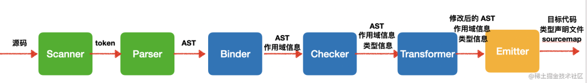

源码要先用Scanner进行词法分析，拆分成一个个不能细分的单词，叫做token。

然后Parser进行语法分析，组装成抽象语法树(Abstract Syntax Tree)AST;

之后做语义分析，包括用binder进行作用域分析，和有Checker做类型检查。如果有类型的错误，就是在Cheker这个阶段报的。

如果有Transformer插件(tsc支持custom transform),会在Checker之后调用，可以对AST做各种增删改

类型检查通过后就会用Emmiter把AST打印成目标代码，生成类型声明文件d.ts，还有sourcemap

:::tip
sourcemap的作用是映射源码和目标代码的代码位置，这样调试的时候打断点可以定位到相应的源码。线上报错的时候也能更加sourcemap定位源码报错的位置
:::
tsc生成AST可以用astexplorer.net可视化的查看

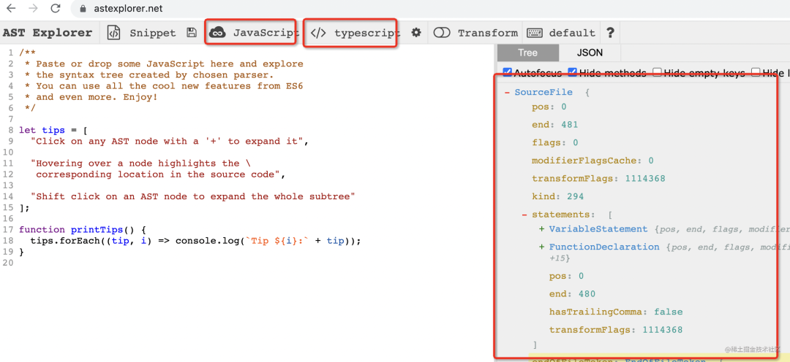

生成的目标代码和 d.ts 和报错信息也可以用 ts playground 来直接查看：

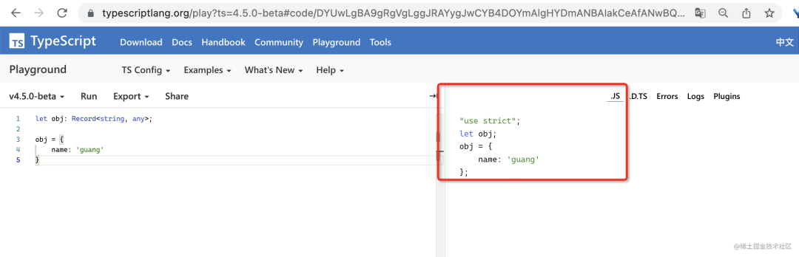
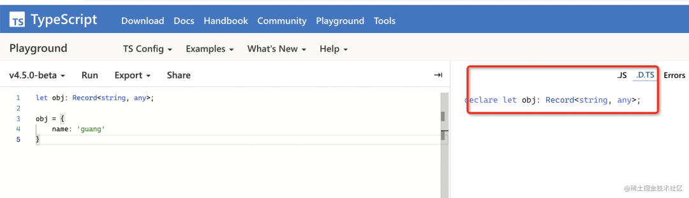
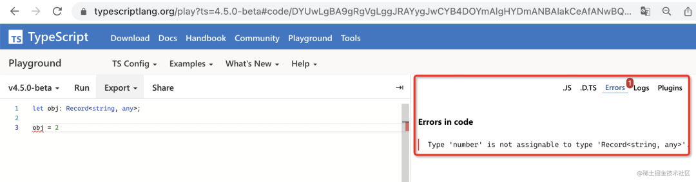

大概了解了 tsc 的编译流程，我们再来看下 babel 的：

## babel的编译流程
babel的编译流程是这样的：
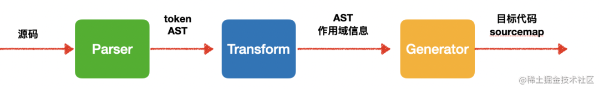

源码经过Parser做词法分析和语法分析，生成token和AST

AST会做语义分析生成作用域信息，然后调用Transformer进行AST转换。

最后会用 Generator把AST打印成目标代码并生成sourcemap。

babel的AST和Token也可以用astexplorer.net可视化查看

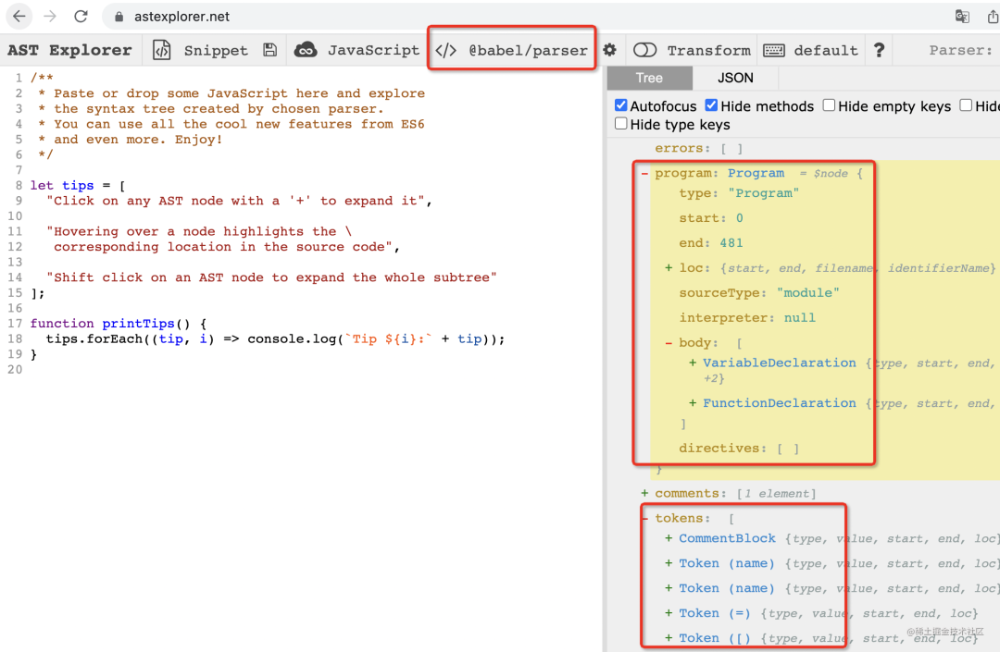

如果想看到 tokens，需要点开设置，开启 tokens：

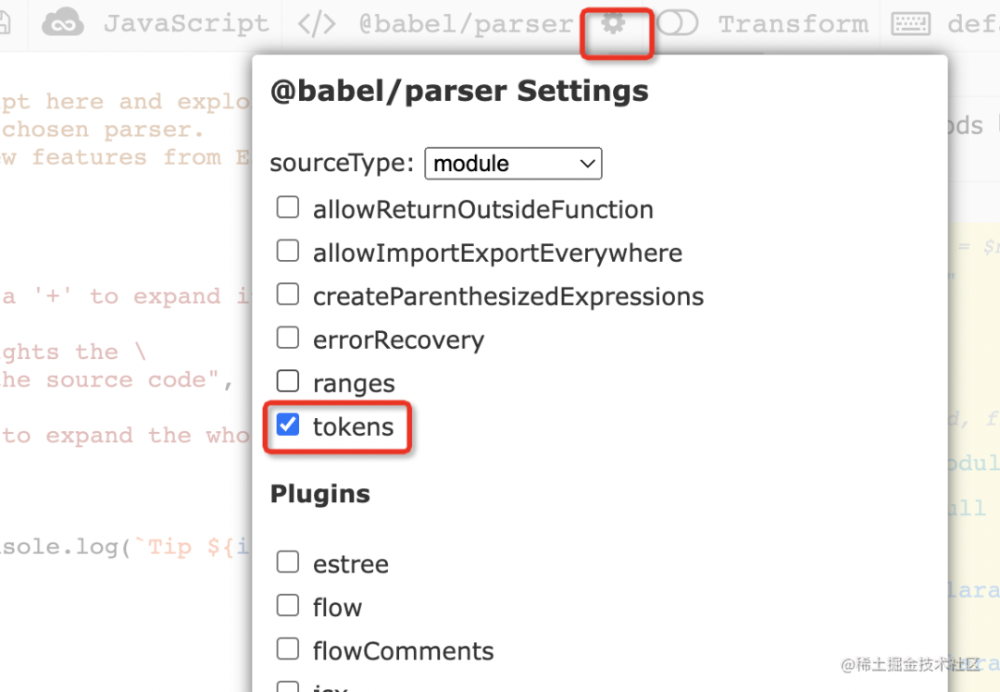

而且 babel 也有 playground（babel 的叫 repl） 可以直接看编译之后生成的代码：

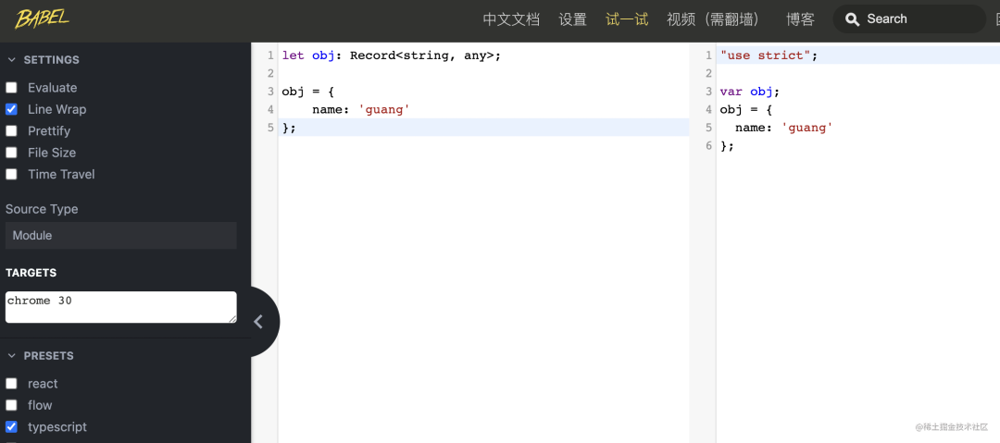

其实对比下tsc的编译流程，区别不大

Parser对应tsc的Scanner和Parser，都是做词法分析和语法分析，只不过babel没有细分

Transform阶段做语义和代码转换，对应tsc的Binder和Transformer。<span style="color: blue">**只不过babel不会做类型检查，没有Checker**</span>

Generator做目标代码和sourcemap，对应的tsc的Emmiter。<span style="color: blue">**只不过没有类型信息，不会生成d.ts**</span>

对比两者的编译流程，会发现babel除了不做类型检查和生成类型声明之外，tsc能做的事情，babel都能做。

看起来好像是这样，但是baben和tsc实现这些功能还是有区别的

## babel和tsc的区别

抛开类型检查和生成d.ts这两babel不支持的功能不谈，我们看下其他功能的对比，

分别对比下语法支持和代码生成两方面

### 语法支持

tsc默认支持最新的es规范的语法和一些还在草案阶段的语法(比如decorators)，想支持新语法就要生成tsc版本

babel是通过@babel/preset-env按照目标环境targets的配置自动引入需要用到的插件来支持标准语法，对于还在草案阶段的语法需要单独引入@babel/proposal-xxx的插件来支持。

所以如果只是用标准语法，那用tsc或者babel都行，但是如果想用一些草案阶段的语法，tsc可能很多都不支持，而babel却可以引入@babel/proposal-xx的插件来支持。

从支持语法特性上来说，babel更多一些

### 代码生成
tsc生成没有做polyfill的处理，想做兼容就需要在入口引入一下core-js(polyfill实现)
```js
import 'core-js';

Promise.resolve
```
babel的@babel-parset-env可以根据targets的配置来自动引入需要的插件，引入需要用到的core-js模块

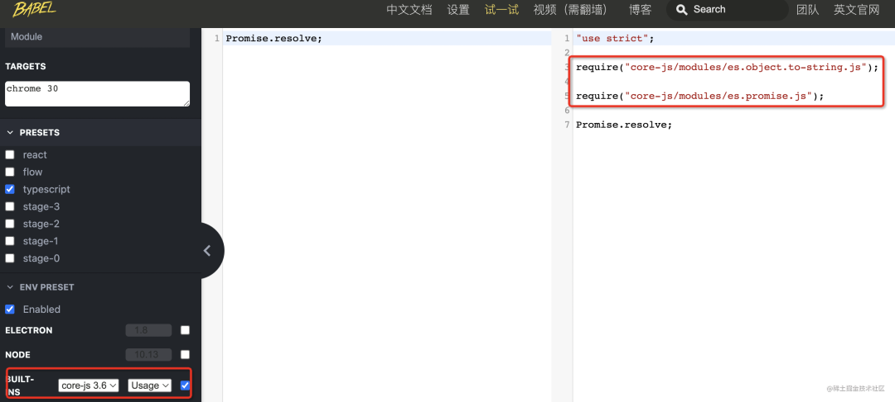

引入方式可以通过 useBuiltIns 来配置：

entry是在入口引入根据targets过滤处的所有需要用的core-js.

usage则是每个模块按照使用到了哪些来按需引入
```js
module.exports = {
    presets: [
        [
            '@babel/preset-typescript',
            '@babel/preset-env',
            {
                targets: '目标环境'，
                useBuiltIns: 'entry' // usage
            }
        ]
    ]
}
```
此外，babel会注入一些helper代码，可以通过@babel/plugin-transform-runtime插件抽离出来，从@babel/runtime包引入

使用transform-runtime之前
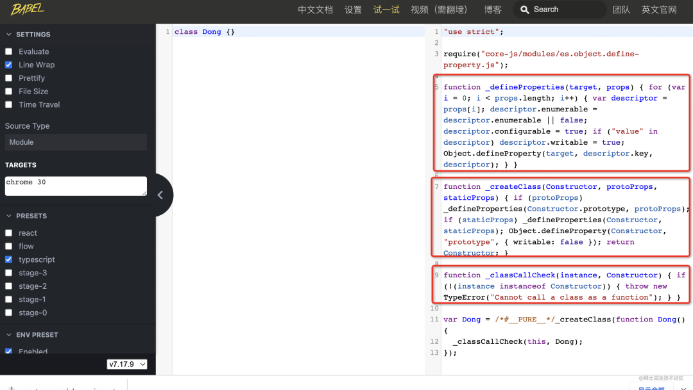

使用transform-runtime之后
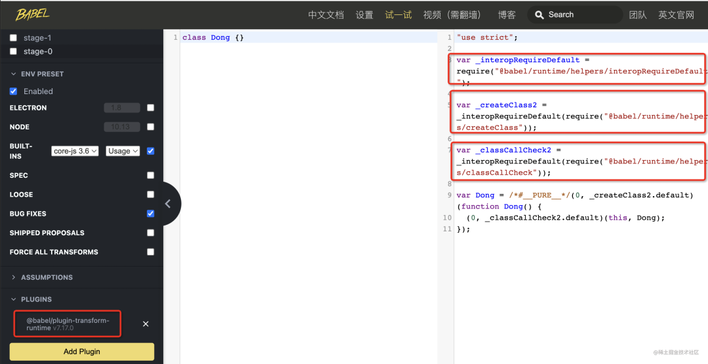

> transform runtime顾名思义就是transform to runtime，转换从runtime包引入heler代码的方法

所以一般babel都会这么配
```js
module.exports = {
    presets: [
        [
            '@babel/preset-typescript',
            '@babel/preset-env',
            {
                targets: '目标环境',
                useBuiltIns: 'usage' // ‘entry’
            }
        ]
    ],
    plugins: [ '@babel/plugin-transform-runtime']
}
```
当然，这里不是讲 babel 怎么配置，我们绕回主题，babel 和 tsc 生成代码的区别：

<span style="color: blue">**tsc 生成的代码没有做 polyfill 的处理，需要全量引入 core-js，而 babel 则可以用 @babel/preset-env 根据 targets 的配置来按需引入 core-js 的部分模块，所以生成的代码体积更小。**</span>

看起来用 babel 编译 ts 代码全是优点？

也不全是，babel 有一些 ts 语法并不支持：

## babel不支持的ts语法
babel是每个文件单独编译的，而tsc不是，tsc是整个项目一起编译，会处理类型声明文件，会做跨文件的类型声明合并，比如namespace和interface就可以跨文件合并。

所以babel编译ts代码有一些特性是没法支持的

### const enum不支持
enum编译之后是这样的：
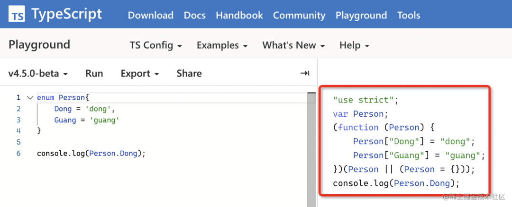

而const enum编译之后是直接替换用到enum的地方为对应的值，是这样的：

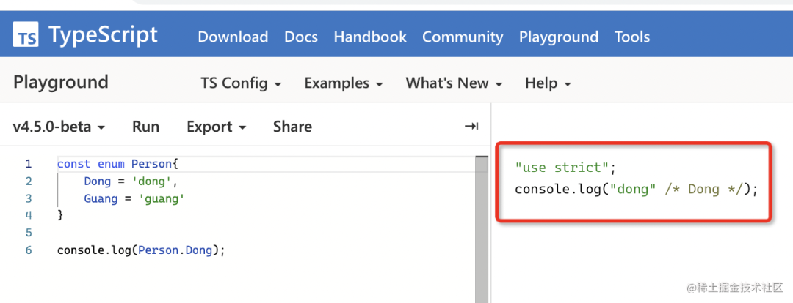

<span style="color: blue">const enum是在编译期间把enum的引用替换成具体的值，需要解析类型信息，而babel并不会解析，所以它会把const enum转换成enum来处理</span>
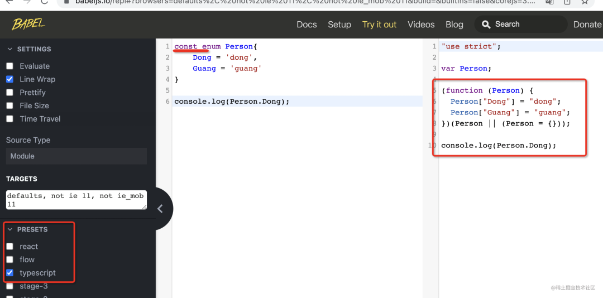

### namespace部分支持:不支持namespace的合并，不支持导出非const的值
比如这样一段ts代码：
```ts
namespace Guang {
    export const name = 'guang';
}
namespace Guang {
    export const name2 = name;
}
console.log(Guange.name2)
```
按理说Guange.name2 是「dong」,因为ts会自动合并同名namespace

ts编译之后的代码是这样：
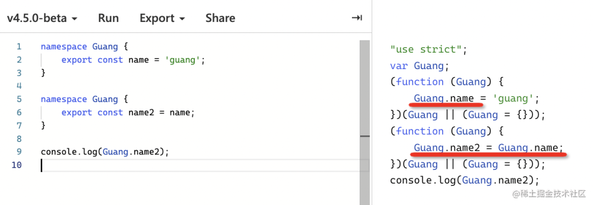

都挂到了Guang这个对象上，所以name2就能取到name的值

而babel对每个namespace都是单独处理的，所以是这样
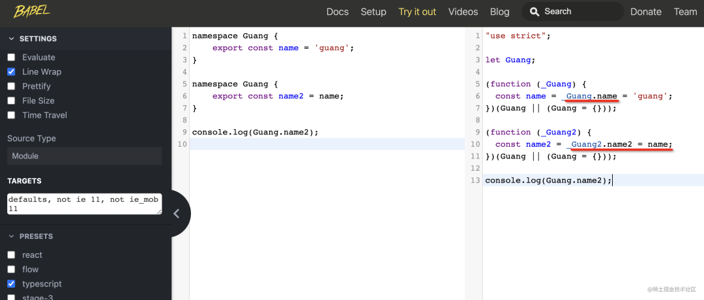

因为不会做namespace的合并，所以name为undefined。

还有namespace不支持导出非const得值

ts的namespace是可以导出const的值的，后面可以修改
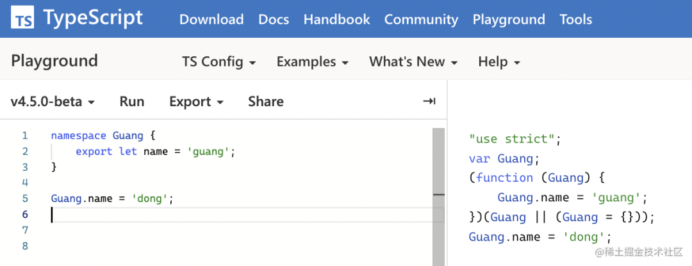

但babel并不支持
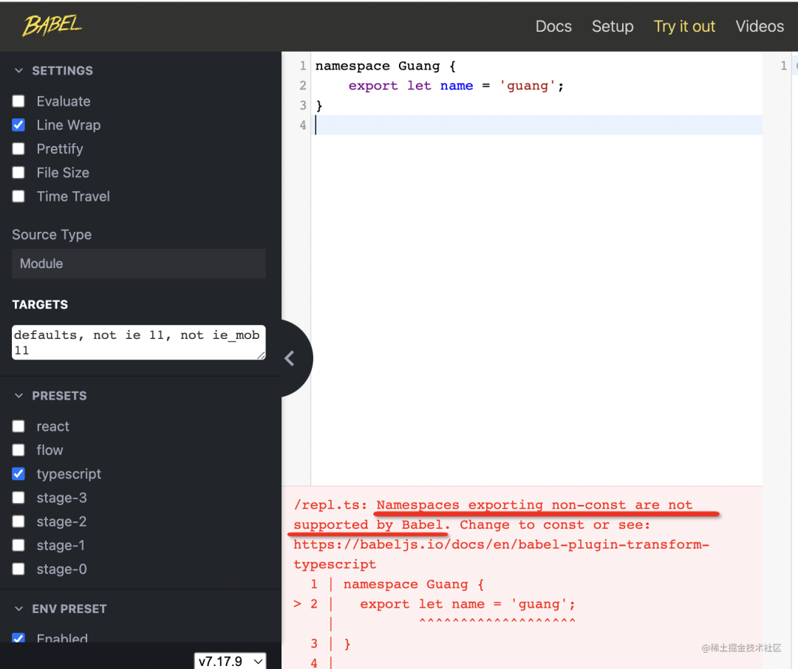

原因也是因为不会做namespace的解析，而namespace是全局的，如果在另一个文件修改了namespace导出的值，babel并不能处理。所以不支持namespace导出的做修改

除此之外，还有一些语法也不支持

### 部分语法不支持
像export = import = 这种过时的模块语法并不支持
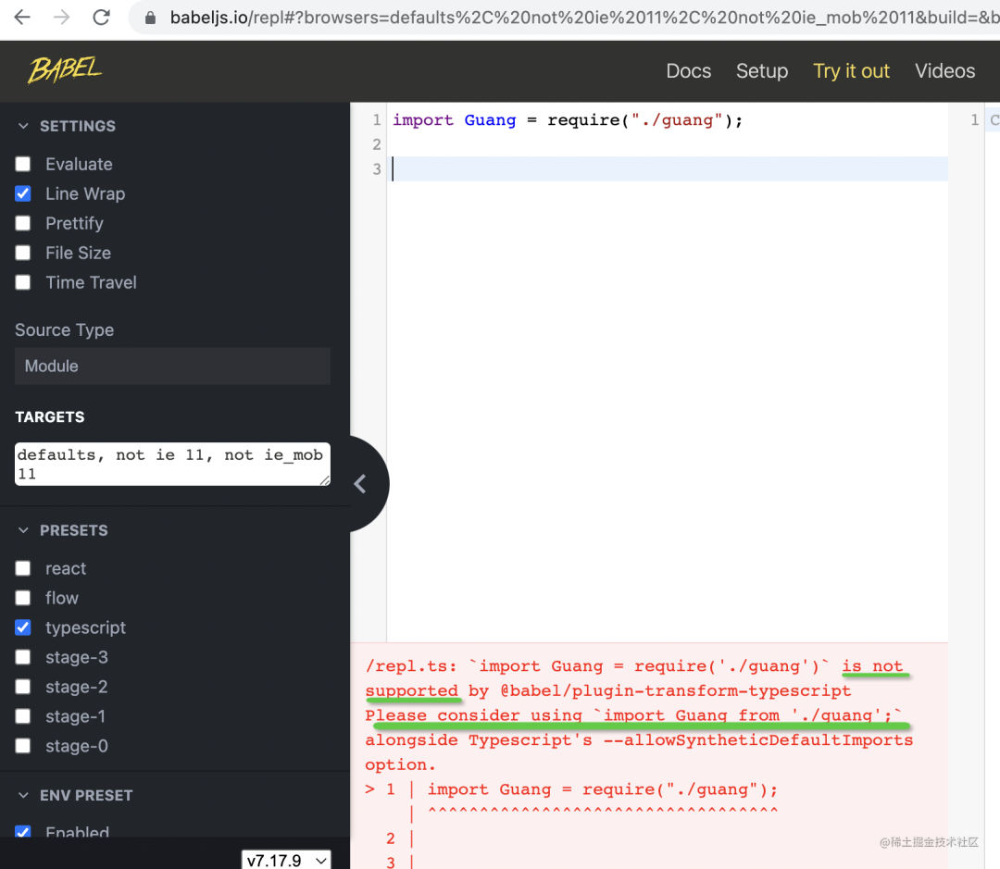

开启了jsx编译之后，不能用尖括号的方式做类型断言

我们知道，ts是可以做类型断言来修改某个类型到某个类型的，用as xx 或者尖括号的方式
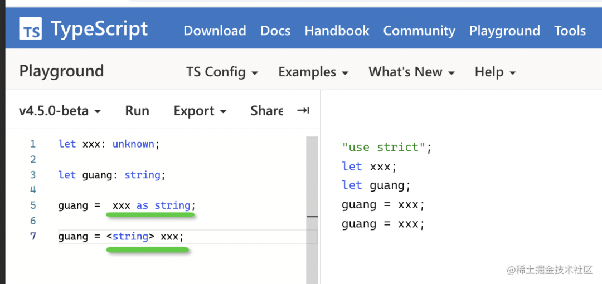

但是如果开启了 jsx 编译之后，尖括号的形式会和 jsx 的语法冲突，所以就不支持做类型断言了：
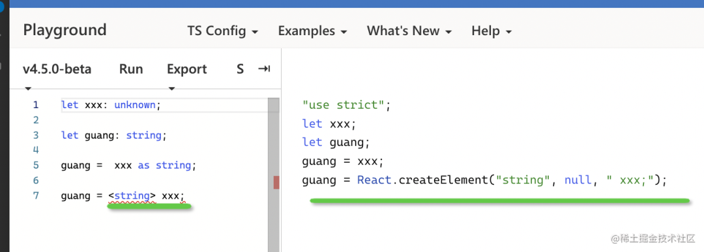

tsc 都不支持，babel 当然也是一样：

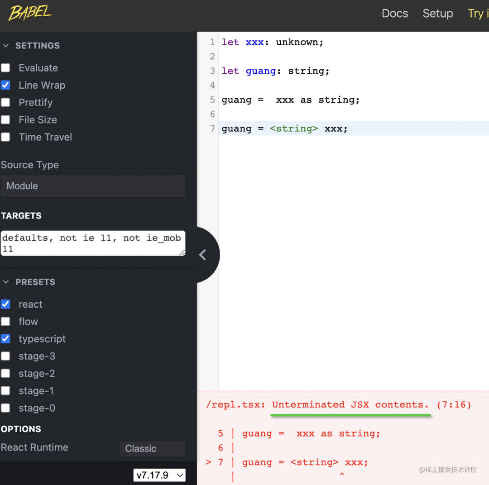

babel不支持ts这些特性，那是否可以用babel编译ts呢？

## babel还是tsc？
babel 不支持const enum(会作为enum处理)，不支持namespace的跨文件合并，导出非const得值，不支持过时的export = import = 的模块语法

其实这些影响不大，只要代码里没用到这些语法，完全可以用babel来编译ts

<span style="color: blue">babel编译ts代码的优点是可以通过插件支持更多的语法特性,而且生成的代码是按照targets的配置按需引入core-js的，而tsc没有这方面的处理，只能全量引入</span>

而且tsc因为要做类型检查所以比较慢的，而babel不做类型检查，编译会快很多。

那用babel编译，就不做类型检查了吗？

可以用tsc-noEmit来做类型检查，加上noEmit选项就不会生成代码了

如果你要生成d.ts，也要单独跑下tsc编译

## 总结
babel和tsc的编译流程大同小异，都是把源码转换成AST的Parser,都会做语义分析(作用域分析)和AST的transform，最后都会用Generator(或者Emitter)把AST打印成目标代码并生成sourcemap

<span style="color: red">但是babel不做类型检查，也不会生d.ts</span>

<span style="color: red">tsc支持最新的es标准特性和部分草案的特性(比如decorator)，而babel通过@babel/preset-env支持所有标准特性。也可以通过@babel/proposal-xx来支持各种非标准特性，支持的语言特性上babel更强一些。</span>

<span style="color: red">tsc没有做polyfill的处理，需要全量引入core-js，而babel的@babel/preset-env会根据targets的配置来按需引入core-js,引入方式受useBuiltIns影响(entry是在入口引入targets需要的，usage是每个模块引入用到的)</span>

<span style="color: red">但是babel因为是每个文件单独编译(tsc是整个项目一起编译)，而且也不解析类型，所以 const enum，namespace 合并，namespace 导出非 const 值并不支持。而且过时的 export =  的模块语法也不支持。</span>

但这些影响不大，完全可以用 babel 编译 ts 代码来生成体积更小的代码，不做类型检查编译速度也更快。

如果想做类型检查可以单独执行 tsc --noEmit。

当然，文中只是讨论了 tsc 和 babel 编译 ts 代码的区别，并没有说最好用什么，具体用什么编译 ts，大家可以根据场景自己选择。


## 资料
[编译ts代码用tsc还是babel](https://mp.weixin.qq.com/s/uSwgwCMahgeMKq1tiIYOww)