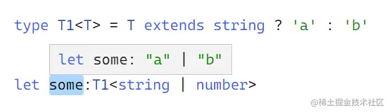

本文目标
- 更加深入的理解和掌握泛型
- 更加熟练这些内置工具类型在项目中的运用

## Exclude
Exclude&lt;T, U&gt;: 作用简单说就是把T里面的U去掉，在返回T里还剩下的。T 和 U必须是同种类型(具体类型/字面量类型)。如下
```ts
type T1 = Exclude<string | number, string>;
// type T1 = number;

// 上面这个肯定一看就懂，那下面这样呢？

type T2 = Exclude<'a' | 'b' | 'c', 'b' | 'd'>;
// type T2 = 'a' | 'c'; 
```
怎么就剩下 a | c了？这怎么执行的？

先看一张图


三元表达式大家都知道，不是返回a 就返回 b,这么算的话，这个some的类型应该是b才对呀，可这个结果是 a | b 又是怎么回事呢？这都是由于 TS 中的 拆分 或者说叫 分发机制导致的

<span style="color: red">简单说就是**联合类型并且是裸类型就会产生分发，分发就会把联合类型中的每一个类型单独拿去判断，最后返回结果组成的联合类型**</span>， a | b 就是这么来的，这个特性在本文后面会提到多次所以铺垫一下，这也是为什么反 Exclude 放在开头的原因

结合 Exclude 的实现和例子来理解下
```js
// 源码定义
type Exclude<T, U> = T extends U ? never : T;

// 例子
type T2 = Exclude<'a' | 'b' | 'c', 'b' | 'd'>;
// type T2 = 'a' | 'c'
```
上面例子中的执行逻辑：

- 由于分发会把联合类型中的每一个类型单独拿去判断的原因，会先把T，也就前面 a | b | c给拆分在单独放入 T extends U ? never : T 判断
- 一次判断 a(T就是a)  ，U 就是 b | d ，T 并没有继承自 U，判断为假，返回 T 也就是 a
- 第二次判断放入 b 判断为真，返回 never，ts 中的 never 我们知道就是不存在值的意思，连 undefined 都没有，所以 never 会被忽略，不会产生任何效果
- 第三次判断放入 c，判断为假，和 a 同理
- 最后将每一个单独判断的结果组成联合类型返回，never 会忽略，所以就剩下 a | c

:::tip
总之就是：如果 T extends U 满足分发的条件，就会把所有单个类型依次放入判断，最后返回记录的结果组合的联合类型
:::

## Extract
Extract&lt;T, U&gt;: 作用是取出T 里面的U，返回。作用和 Exclude 刚好相反，传参也是一样的

看例子理解 Extract
```js
type T1 = Extract<'a' | 'b' | 'c', 'a' | 'b'>;
// type T1 = 'a';

// 源码定义
type Extract<T, U> = T extends U ? T : never
```
和Exclude 源码对比也只是三元表达式返回的never：T 对调了一下，执行原理也是一样一眼过得，就不重复了

## Omit
<span style="color: red">Omit&lt;T, K&gt;：作用是把T(对象类型)里面的k去掉，返回T里还剩下的。</span>

Omit的作用和Exclude是一样的，都能把类型过滤并得到新类型。

<span style="color: red">不同的是Exclude主要是处理联合类型，且会触发分发，而Omit主要是处理对象类型，所以自然的这两参数也是不一样。</span>

用法一样
```js
// 这种场景type 和 interface 是一样的，后面就不重复说明了
type User = {
    name: string,
    age: number
}
type T1 = Omit<User, 'age'>;
// type T1 = { name: string }
```
源码定义
```js
// keyof any 就是  string| number | symbol
type Omit<T, K exdents keyof any> = { [P in Exclude<keyof T, K>]: T[P] }
```
- 首先第一个参数 T 要传对象类型, type 或 interface 都可以
- 第二个参数 K 限制了类型只能是  string | number | symbol, 这一点跟js里的对象是一个意思，对象类型的属性名只支持这三种类型
- in 是映射类型，用来映射遍历枚举类型。大白话就是循环、循环语法，需要配合联合类型来对类型进行遍历。in 的右边是可遍历的枚举类型，左边是遍历出来的每一项
- 用 Exclude 去除掉传入的树形后，在遍历剩下的树形，生成新的类型返回

示例解析
```js
type User = {
    name: string,
    age: number,
    gender: string
}
type Omit<T, K extends keyof any> = { [P in Exclude<keyof T, K>]: T[p]; }
type T1 = Omit<User, 'age'>;
// type T1 = { name: string, gender: string }
```
我们调用 Omit 传入的参数是正确的，所以就分析一下后面的执行逻辑：


- Exclude<keyof T, K> 等于 Exclude<'name'|'age'|'gender', 'age'>，返回的结果就是 'name'|'gender
- 然后遍历 'name'|'gender'，第一次循环 P 就是 name，返回 T[P] 就是 User['name']
- 第二次循环 P 就是 gender，返回 T[P] 就是 User['gender']，然后循环结束
- 结果就是 { name: string, gender: string }

## Pick


## 资料
[TS泛型进阶](https://juejin.cn/post/7170662948656906253?#heading-21)