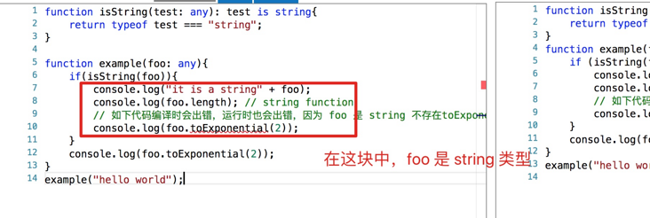
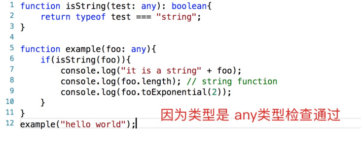

## 前言
TypeScript里有类型保护机制。要定义一个类型保护，我们只要简单的定义一个函数，它的返回值是一个类型谓词:
```js
function isString(test: any): test is string {
    return typeof test === 'string';
}
```
上述写法与写一个返回值为boolean值函数的区别在那里呢？
```js
fuction isString(test: any): boolean {
    return typeof test === 'string'
}
```
## 区别
### 使用is类型保护
```js
function isString(test: any): test is string {
    return typeof test === 'string';
}
function example(foo: any) {
    if(isString(foo)) {
        console.log('it is a string' + foo);
        console.log(foo.length); // string function
        // 如下代码编译时会出错,运行时也会出错，因为foo是string不存在toExponential方法
        console.log(foo.toExponential(2))
    }
    // 编译不会出错,但是运行时出错
    console.log(foo.toExponential(2))
}
example('hello world')
```


### 返回值为boolean
```js
function isString(test: any): boolean {
    return typeof test === 'string';
}
function example(foo: any) {
    if(isString(foo)) {
        console.log('it is a string' + foo);
        console.log(foo.length); // string function
        // foo 为 any，编译正常。但是运行时会出错，因为 foo 是 string 不存在toExponential方法
        console.log(foo.toExponential(2));
    }
}
example('hello world')
```


## 总结
- 在使用类型保护时，TS会进一步缩小变量的类型。例子中，将类型从any缩小至了string
- 类型保护的作用域仅仅在if后的块级作用域中生效

## 资料
[TypeScript 中的 is](https://segmentfault.com/a/1190000022883470)