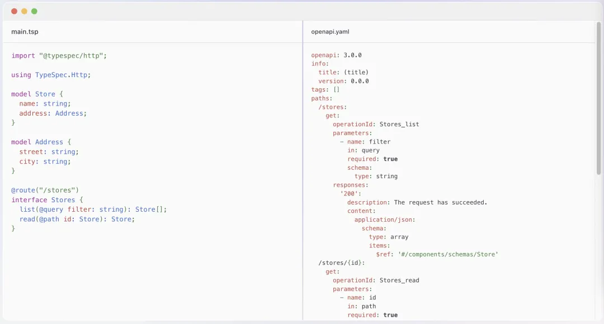
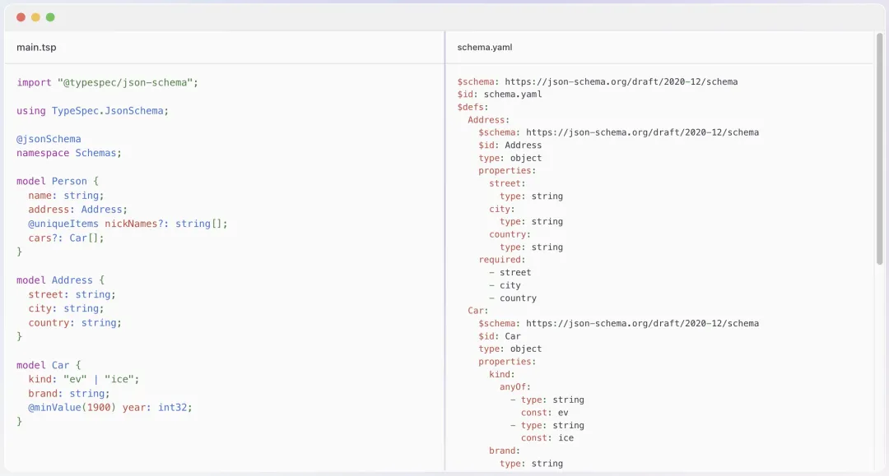
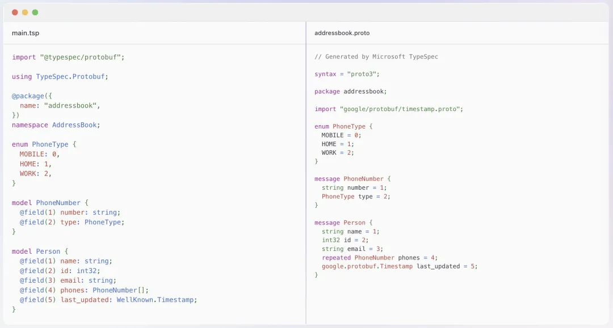
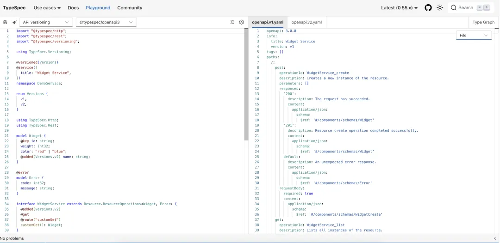
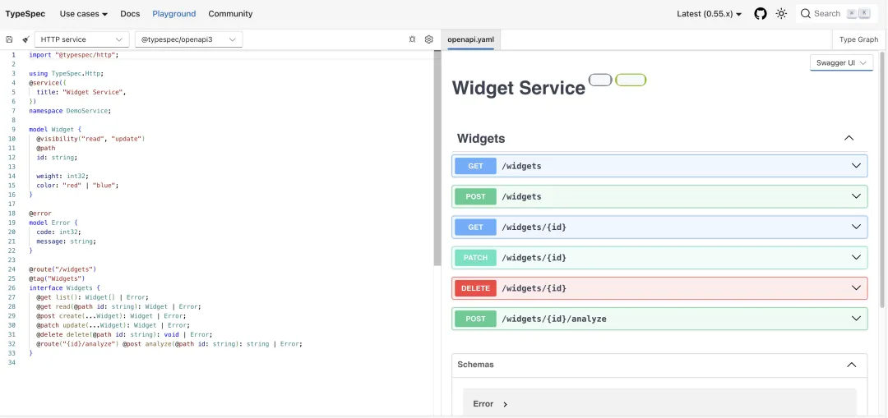
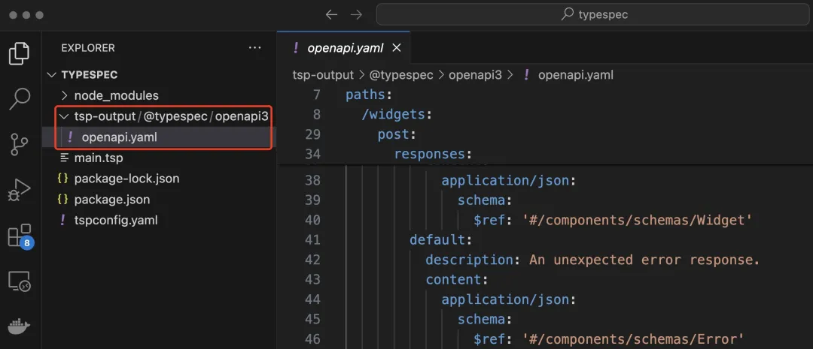

## TypeSpec是什么
[TypeSpec](https://typespec.io/)是一种高度可扩展的语言，可轻松描述REST、OpenAPI、grpc和其他协议中常见的API结构。TypeSpec 在生成多种不同的API描述格式、客户端和服务端代码、文档等方面表现出色。有了TypeSpec，你就可以摆脱那些拖慢你速度的手写文件，并在几秒内生成符合标准的API Schemas。

## TypeSpec的特点
- 简洁清凉：受Typescript的启发，TypeSpec是一种极简语言，可帮助开发人员以熟悉的方式描述API
- 易集成：编写TypeSpec，发布为各种格式，快速与其他生态系统集成
- 支持多种协议：TypeSpeck 标准库支持主流的Openapi3.0、JSON Schema 2020-12、Protobuf 和JSON RPC等协议
- 功能强大：受益于庞大的OpenAPI工具生态系统，可用于配置API网关、生成代码和验证数据
- 保证数据一致性：定义要在API中使用的通用模型，使用JSON Schema发射器获取类型的JSON Schema，并使用他们验证数据
- 友好的开发体验：在VSCode和Visual Studio编辑器中为了TypeSpec提供了全面的语言支持。比如语法高亮、代码补全功能

## TypeSpec 使用示例

- 生成OpenAPI描述文件

    

- 生成JSON Schema 

    

- 生成Protobuf

    

## TypeSpec Playground
要快速体验TypeSpec 的功能，推荐你使用TypeSpec 官方提供的 [playground](https://typespec.io/playground).该playground预设了 API versioning 、Discriminated unions、HTTP service、Rest frameswork、、Protobuf Kiosk 和 Json Schema 6 个不同的使用示例，并支持 File 和 Swagger UI 两种视图。

- File视图

    

- Swagger UI 视图

    

## TypeSpec 快速上手
### 1.安装 @typespec/compiler 编译器

```shell
npm install -g @typespec/compiler
```
### 2.安装VSCode扩展
在VSCode中搜索 TypeSpec 安装TypeSpec for VS Code扩展，或在浏览器中打开 TypeSpec for VS Code 网之后点击install

### 3.创建 TypeSpec 项目
首先新建一个新的目录，然后在项目的根目录下执行一下命令
```shell
tsp init
```


### 4.安装依赖项目
```shell
tsp install
```
成功执行上述命令后，在当前目录下会生成一下目录结构
```shell
.
├── main.tsp
├── node_modules
├── package-lock.json
├── package.json
└── tspconfig.yaml
```
之后，打开 main.tsp 文件，输入以下代码：
```js
import "@typespec/http";

using TypeSpec.Http;
@service({
  title: "Widget Service",
})
namespace DemoService;

model Widget {
  @visibility("read", "update")
  @path
  id: string;

  weight: int32;
  color: "red" | "blue";
}

@error
model Error {
  code: int32;
  message: string;
}

@route("/widgets")
@tag("Widgets")
interface Widgets {
  @get list(): Widget[] | Error;
  @get read(@path id: string): Widget | Error;
  @post create(...Widget): Widget | Error;
  @patch update(...Widget): Widget | Error;
  @delete delete(@path id: string): void | Error;
  @route("{id}/analyze") @post analyze(@path id: string): string | Error;
}
```
完成输入后，运行 tsp compile . 命令执行编译操作。成功编译后，在 tsp-output/@typespec/openapi3 目录下就会生成 openapi.yaml 文件：




