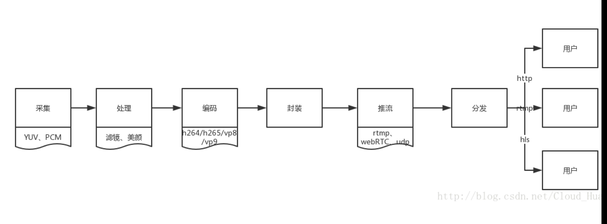
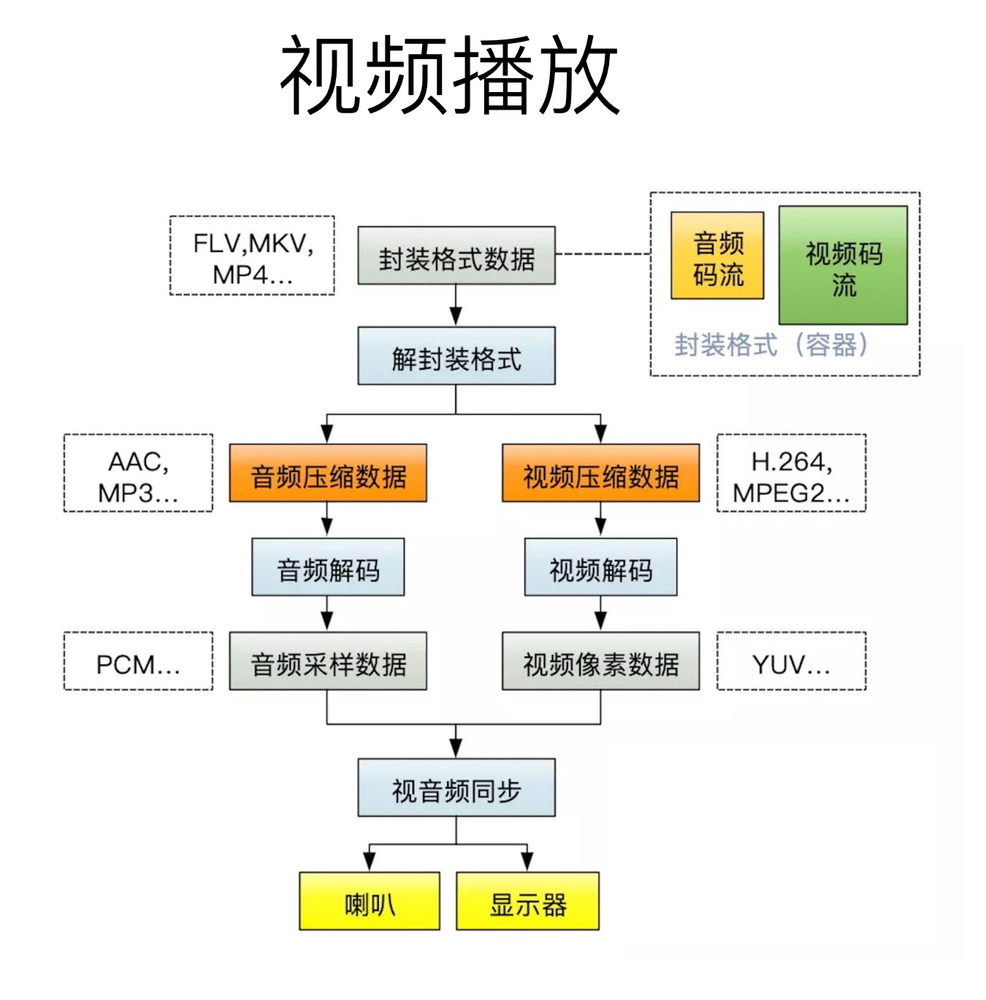
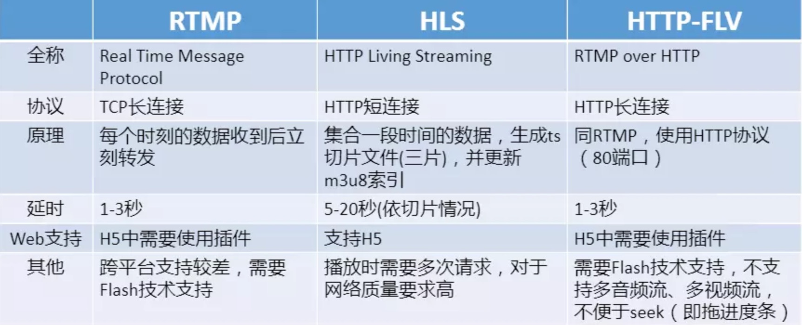

## 名称

1. **视频:** 连续的图象变化每秒超过24帧(Frame)画面以上时，根据视角暂留原理,人眼无法辨别单幅的静态画面，看上去是平滑连续的视角效果，这样连续的画面叫做视频
2. **帧(Frame):** 影像中常用的最小单位，相当于电影中胶片的每一格镜头， 一帧就是一副静止的画面，连续的帧就形成了视频

3. **I帧(关键帧):** 保留一副完整的画面，解码时只需要本帧数据就可以完成(因为包含完整画面)

4. **P帧(差别帧):** 保留这一帧跟之前帧的差别,解码时需要用之前缓存的画面叠加上本帧定义的差别，生成最终画面.(P帧没有完整画面数据，只有与前一帧的画面差别的数据).

5. **B帧(双向差别帧):** 保留的是本帧与前后帧的差别，解码B帧，不仅要取得之前的缓存画面，还要解码之后的画面，通过前后画面的与本帧数据的叠加取得最终的湖面.B帧压缩率高，但是解码时CPU会比较累

6. **GOP:**(Group of Pictures)画面组，一个GOP就是一组连续的画面，每个画面都是一帧，一个GOP就是很多帧的集合；直播的数据，其实就是一组图片，包括I帧、P帧、B帧，当用户第一次观看的时候，会寻找I帧，而播放器会到服务器寻找到最新的I帧反馈给用户。

7. **分辨率：** 又称解析度、解像度，可以从显示分辨率与图象分辨率两个方向来分类。显示分辨率（屏幕分辨率）是屏幕图象的精密度，是指显示器所能显示的像素有多少.由于屏幕上的点、线和面都是由像素组成的，显示器可显示的像素越多，画面就越惊喜，同样的屏幕区域内能显示的信息也就越多，所以分辨率是个非常重要的指标之一。

8. **码率：** 视频图片进行压缩后每秒的数据流

9. **帧率(FPS)** 每秒钟所传输图片的个数，也可以理解为处理器每秒刷新的次数，通常用FPS标识，当然帧数越高，画面也就越流畅


10. **采样率（samplerate）：** 采样就是把模拟信号数字化的过程，采样频率越高，记录这一段音频信号所用的数据量就越大，同时音频质量也就越高。

11. **位宽：** 每一个采样点都需要用一个数值来表示大小，这个数值的数据类型大小可以是：4bit、8bit、16bit、32bit 等等，位数越多，表示得就越精细，声音质量自然就越好，而数据量也会成倍增大。我们在音频采样过程中常用的位宽是 8bit 或者 16bit。

12. **声道数（channels）：** 由于音频的采集和播放是可以叠加的，因此，可以同时从多个音频源采集声音，并分别输出到不同的扬声器，故声道数一般表示声音录制时的音源数量或回放时相应的扬声器数量。声道数为 1 和 2 分别称为单声道和双声道，是比较常见的声道参数。
编码格式：指对视频画面内容，音频内容进行压缩的一种标准。编码的目的是压缩数据量，采用编码算法压缩冗余数据。

13. **封装格式：** 把编码后的音视频数据以一定格式封装到一个容器，用于存放视频、音频以及其他配置信息

14. **转码 ：** 指将一段多媒体包括音频、视频或者其他的内容从一种编码格式转换成为另外一种编码格式。

## 视频编码方式

名称 | 退出机构 | 退出时间 | 目前使用领域
--- | --- | --- | ---
HEVC(H.265) | MPEG/ITU-T | 2013 | 研发中
H.264 | MPEG/ITU-T | 2003 | 各个领域
MPEG4 | MPEG | 2001 | 不温不火
MPEG2 | MPEG | 1994 | 数字电视
VP9 | Google | 2013 | 研发中
VP8 | Google | 2008 | 不普及
VC-1 | Microsoft Int. | 2006 | 微软平台

## 音频编码方式

名称 | 退出机构 | 退出时间 | 目前使用领域
--- | --- | --- | ---
AAC | MPEG | 1997 | 各个领域
MP3 | MPEG | 1993 | 各个领域(旧)
WMV | Microsoft Inc. | 1999 | 微软平台
AC-3 | Dolby Inc. | 1992 | 电影

## 封装

封装其实就是打包，可以理解为用一个容器把压缩编码后的h.264和aac数据打包到一块。

所谓容器，就是把编码器生成的多媒体内容（视频，音频，字幕，章节信息等）混合封装在一起的标准。

容器使得不同多媒体内容同步播放变得很简单（时间戳）

而容器的另一个作用就是为多媒体内容提供索引，

也就是说如果没有容器存在的话一部影片你只能从一开始看到最后，不能拖动进度条

封装格式如下：
:::tip
1）AVI 格式（后缀为 .avi）

2）QuickTime File Format 格式（后缀为 .mov）

3）MPEG 格式（文件后缀可以是 .mpg .mpeg .mpe .dat .vob .asf .3gp .mp4等)

4）WMV 格式（后缀为.wmv .asf）

5）Real Video 格式（后缀为 .rm .rmvb）

6）Matroska 格式（后缀为 .mkv）

7）Flash Video 格式（后缀为 .flv）

8）MPEG2-TS 格式 (后缀为 .ts)

我们在流媒体传输，尤其是直播中主要采用的就是 FLV 和 MPEG2-TS 格式，分别用于 RTMP/HTTP-FLV 和 HLS 协议。
:::

## 直播推流



## 视频播放



## PCM，YUV数据详解
- PCM

    基本概念:声道、通道、采样率、采样位数、位速/比特率/码率、存储方式、字节序

    算法
    1. 分离PCM 16LE双声道音频采样数据的左声道和右声道
    2. 将PCM 16LE双声道音频采样数据的声音速度提高一杯
    3. 将PCM 16LE双声道音频采样数据转换为PCM8音频采样数据

- YUV

    和RGB转换公式，位深度，存储方式
    1. 分离YUV420P像素数据中的Y、U、V分量
    2. YUV420P像素数据的亮度减半
    3. 将YUV420P像素数据的周围加上边框
    4. 计算两个YUV420P像素数据的PSNR

[PCM，YUV数据详解](https://www.jianshu.com/p/d2f9be9809ad)
## RTMP&HLS&HTTP-FLV
播放协议、直播协议

RTMP：       rtmp://alcdn.r01.xiaoka.tv/live/7G_OZMRYjQXJXOw_

HTTP-FLV：http://alcdn.f01.xiaoka.tv/live/s90vDZpEN7xHyeg0.flv

HLS ：         http://alcdn.hls.xiaoka.tv/20191112/16d/c14/xSXAUFsXdgeqiTz6/index.m3u8




**Media Source Extensions 允许JavaScript动态地为&lt;audio&gt;和&lt;video&gt;创建媒体流，而不再只能是引用一个视频文件的url。这样就极大地丰富了前端对音视频的处理能力，也赋予了其更多灵活性。**


```
外网可用的实时视频流：

CCTV1高清： http://ivi.bupt.edu.cn/hls/cctv1hd.m3u8

CCTV3高清： http://ivi.bupt.edu.cn/hls/cctv3hd.m3u8

CCTV5+高清： http://ivi.bupt.edu.cn/hls/cctv5phd.m3u8

CCTV6高清： http://ivi.bupt.edu.cn/hls/cctv6hd.m3u8

CCTV7高清', http://ivi.bupt.edu.cn/hls/cctv7.m3u8

CCTV-8高清 , http://ivi.bupt.edu.cn/hls/cctv8hd.m3u8

CCTV-9高清 ', http://ivi.bupt.edu.cn/hls/cctv9.m3u8

CCTV-10高清 ',http://ivi.bupt.edu.cn/hls/cctv10.m3u8

CCTV-11高清 ', http://ivi.bupt.edu.cn/hls/cctv11.m3u8

CCTV-12高清 ', http://ivi.bupt.edu.cn/hls/cctv12.m3u8

CCTV-13高清 ', http://ivi.bupt.edu.cn/hls/cctv13.m3u8

CCTV-14高清 ', http://ivi.bupt.edu.cn/hls/cctv14.m3u8

CCTV-15高清 ',http://ivi.bupt.edu.cn/hls/cctv15.m3u8

北京卫视高清 ', http://ivi.bupt.edu.cn/hls/btv1hd.m3u8

北京文艺高清 ', http://ivi.bupt.edu.cn/hls/btv2hd.m3u8

湖南卫视高清 ', http://ivi.bupt.edu.cn/hls/hunanhd.m3u8

浙江卫视高清 ', http://ivi.bupt.edu.cn/hls/zjhd.m3u8

江苏卫视高清 ', http://ivi.bupt.edu.cn/hls/jshd.m3u8
```

## 录屏
1. puppeteer?

    puppeteer翻译是操纵木偶的人，利用这个工具，我们能做一个操纵页面的人。Puppeteer是一个Node.js的库，支持调用Chrome的API来操作用Web,相比 Selenium 或是PhantomJS,它最大的特点就是它的操作DOM可以完全在内存中进行模拟即在V8引擎中处理而不打开浏览器，而且关键是这个是chrome团队在维护，会拥有更好的兼容性和前景

2. mediaDevices
3. Recorder


[用JS创建一个录屏功能](https://www.jb51.net/article/228779.htm)

[炸裂，用JS创建一个录屏功能](https://segmentfault.com/a/1190000020266708)

[Js 录制屏幕](https://www.jianshu.com/p/f2f842e28f87)