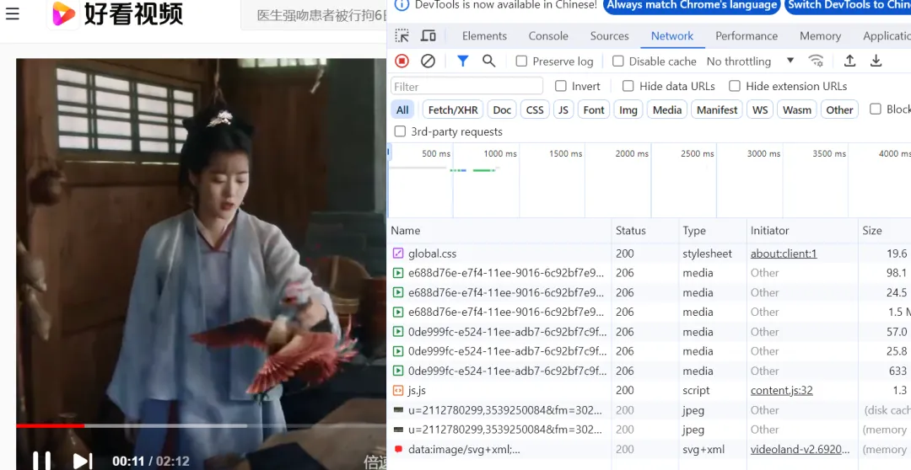
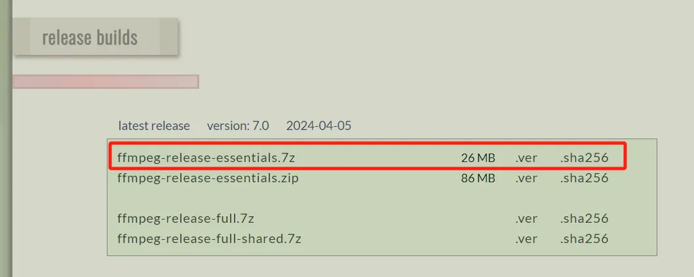
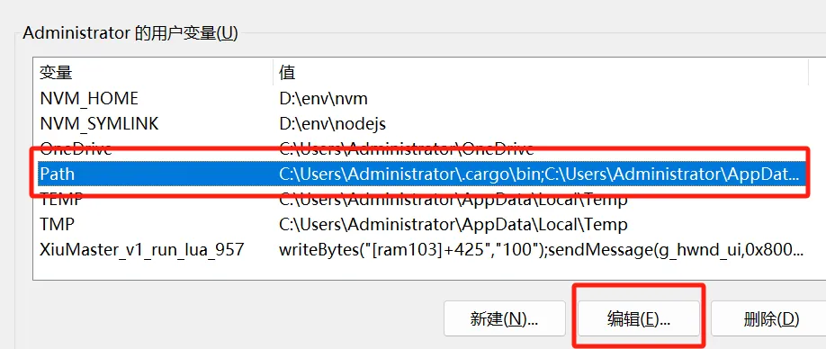
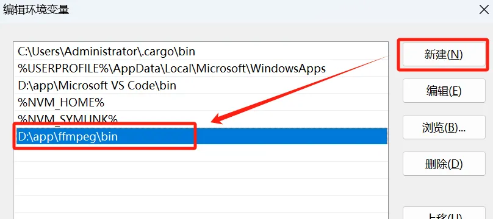
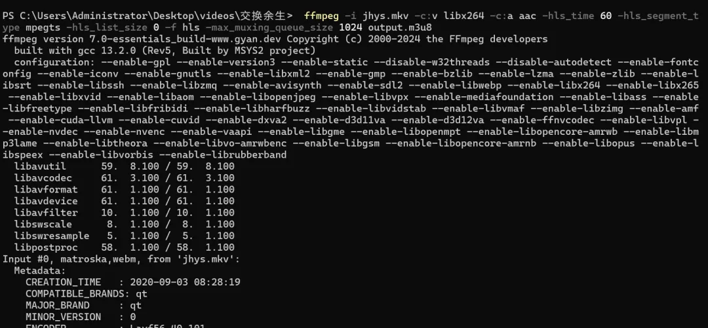
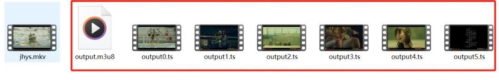
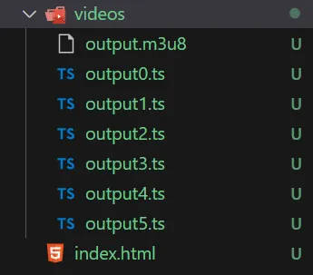
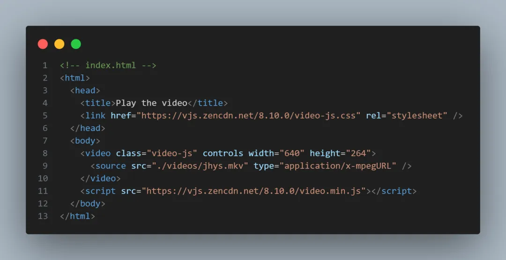
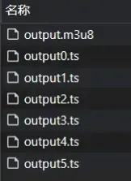

FFmpeg是一个开源的、跨平台的多媒体框架，它可以用来录制、转换和流式传输音频和视频。它包括了一系列的库和工具，用于处理多媒体内容，比如libavcodec(一个编解码库)、libavformat(一个音视频容器格式库)、libavutil(一个实用库)以及ffmpeg命令行工具本身

FFmpeg被广泛用于各种应用中，包括视频转换、视频编辑、视频压缩、直播流处理等。它支持多种音视频编解码器和容器格式，因此能够处理几乎所有类型的音视频文件。由于其功能强大和灵活性，FFmpeg称为了许多视频相关软件和服务的底层技术基础

很多网页都是用FFmpeg来进行视频切片，比如一个视频很大，如果通过一个链接去请求整个视频的话，那势必导致加载时间过长，严重阻碍了用户观感。

所以很多视频网站都会通过视频切片的方式来优化用户观感，就是一部分一部分的去加载出来，这样有利用用户体验



## 安装FFmpeg
### 安装包下载
首先到ffmpeg的安装网页[https://www.gyan.dev/ffmpeg/builds/](https://www.gyan.dev/ffmpeg/builds/)



下载解压后将文件夹改名为 ffmpeg

### 环境变量配置
环境变量配置是为了能在电脑上使用ffmpeg命令行




## 体验FFmpeg
先准备一个视频，比如我准备了一个视频，总共300多M

### 视频切片
并在当前目录下输入以下的命令
```shell
ffmpeg -i jhys.mkv
-c:v libx264 
 -c:a aac 
 -hls_time 60 
 -hls_segment_type mpegts 
 -hls_list_size 0 
 -f hls 
 -max_muxing_queue_size 1024 
output.m3u8
```
接着 ffmpeg 会帮你将这个视频进行分片



直到切片步骤执行完毕，我们可以看到视频已经切成了几个片了



在这个命令中
- -i：input_video.mp4 指定了输入视频文件
- -c:v libx264 -c:a aac 指定了视频和音频的编解码器
- -hls_segment-type mpegts 指定了M3U8片段的类型为MPEG-TS;
- -hls_list_size 0 设置 M3U8 文件中包含的最大片段数。这里设置为 0 表示没有限制。
- -f hls 指定了输出格式为 HLS。
- -max_muxing_queue_size 1024 设置了最大复用队列大小，以确保输出不会超过指定大小。
最后输出的文件为 output.m3u8

### 视频播放
创建一个简单的前端项目





可以看到浏览器会加载所有的视频切片


