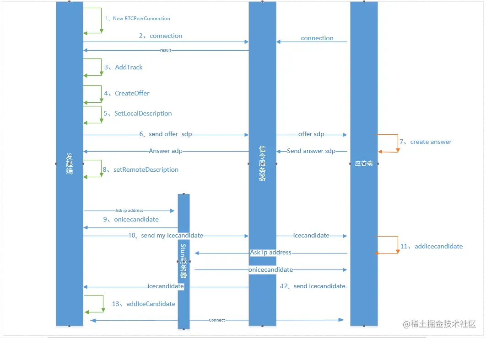

## 前言
- WebRTC可能对于大多数前端开发人员来说是陌生的，在日常的开发工作中一般不会有交集。但是如今火爆的C2C远程教学、云游戏等，都少不了WebRTC的影子。
- WebRTC(Web Real-Time Communication)是一个可以用在视频聊天，音频聊天或P2P文件分享等Web App中的API
- 我的理解：建立一个端对端的音视频通信通道，两端通过建立的通道进行数据通讯

## WebRTC三部曲
WebRTC主要由3个部分组成：
- getUserMedia:获取设备上可用媒体权限(视频、音频)，需要用户授权
- RTCPeerConnection:建立通讯通道用于传输视频、音频
- RTCDataChannel：建立通信的两端，通过RTCPeerConnection对象进行数据交换

## RTCPeerConnection建立连接的过程

在上图中，RTCPeerConnection建立连接的过程由发起端、Stun服务器、信令服务器、应答端组成，Stun服务器、信令服务器需要根据自己的业务场景去实现，不过Stun服务器有一些公开的服务器，比如google提供的服务

1. let rtcPeerConnection = new RTCPeerConnection({'iceServers': [{'url': 'stun:stun.google.com: 19302'}]}) 创建一个RTCPeerConnection对象
2. 连接信令服务器获取自己Id及连上信令服务器的其他端(这里可以看成有很多成员都在一个房间内，我们要知道这个房间内所有成员的名单)
3. 添加视频轨道，该轨道会传到到另一端(非连接的必要因素)
4. 创建一个offer，这个offer包含SDP对象，SDP对象中包含当前音视频的相关参数
5. setLocalDescription保存SDP对象
6. 将包含SDP信息的参数发送到信令服务器
7. 应答端收到发起端的SDP信息后会调用setRemoteDescription保存SDP信息，并且创建一个应答的answer(SDP对象)发送给发起端
8. 发起端收到answer后通过setRemoteDescription保存answer中SDP信息
9. 发起端与应答端根据SDP信息创建好了相对应的音视频channel,开启icecandidate的数据收集。（icecandidate可以理解为是获取对等端的IP地址、公网IP地址），发起端通过onicecandidate收到candidate信息。
10. 发送端将收到的candidate信息通过信令服务器发送给应答端
11. 应答端通过addicecandidate将candidate保存起来
12. 同10，应答端将candidate信息发送给发起端
13. 发起端将收到的candidate（该描述描述了连接的远程端的状态）通过addIceCandidate传递给浏览器的ICE代理
14. 这样发起端与应答端就建立起了P2P音视频通道，发起端通过onaddstream回调接口接收应答端发送过来的视频流。

## 结语
以上是在共工作实践理解的RTCPeerConnection建立连接的全过程

连接流程不是唯一的，此流程也可以反过来连接，由服务端创建一个offer发起连接 ，可以解决一些特定场景的需求，比如兼容ios safari不兼容的特性，来完成safari webRtc的链接会话等。
