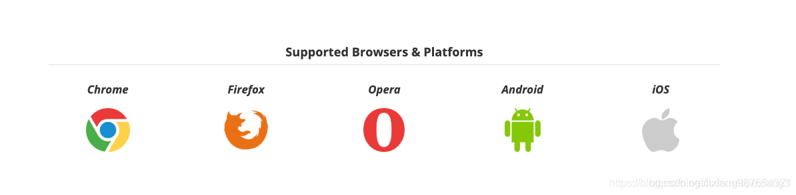
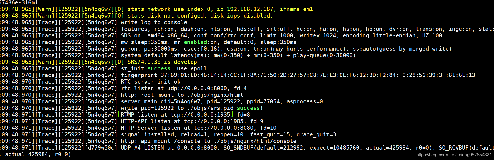
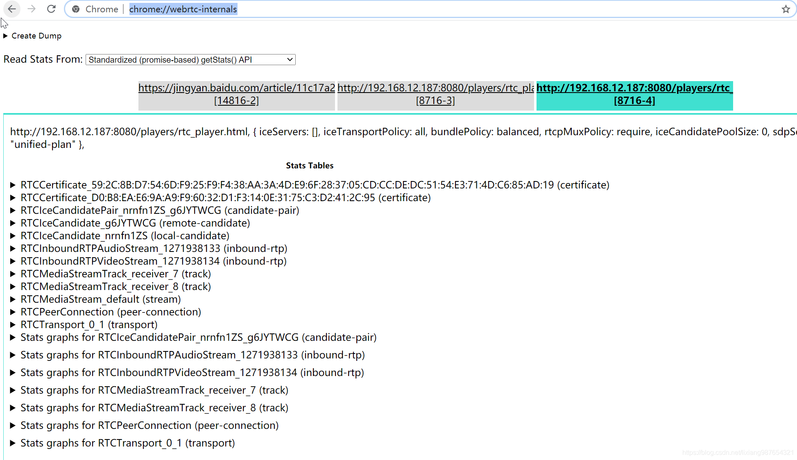
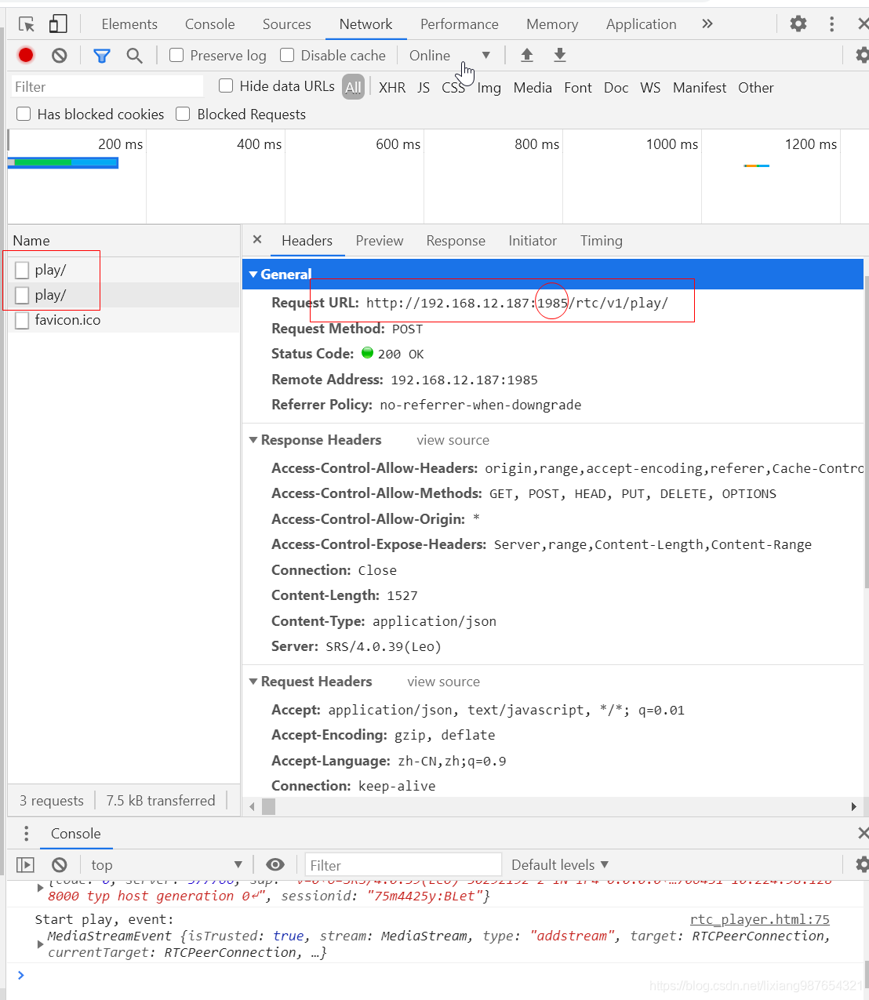

[原文地址](https://blog.csdn.net/lixiang987654321/article/details/108714690)

## 简介

### WebRTC概念
WebRtc是由Google主导的,由一组标准、协议和JavaScript API组成，用于实现浏览器之间(端到端之间)的音频、视频及数据共享.WebRtc不需要安装任何插件，通过简单的JavaScript API就可以使实时通信变成一种标准功能。

### 为什么使用webRtc
现在各大浏览器以及终端逐渐加大对webRtc技术支持.下图是webRTC官网给出的现在已经提供支持的浏览器和平台



## srs启动

webrtc需要srs的最低版本：SRS4.0.14,为了拉取到最新版本的srs，我们首先做的就是获取到最新的srs嗲吗，安装git步骤如下

centos安装git
```
#安装依赖
yum install curl-devel expat-devel gettext-devel openssl-devel zlib-devel
yum install gcc-c++ perl-ExtUtils-MakeMaker
#查看yum源仓库git信息
yum info git
#移除默认安装git
yum remove git
#安装git
yum install git
#查看git版本
git --version
```
webrtc需要srs的最低版本：SRS4.0.14，所以我们部署的srs的时候版本需要大于SRS4.0.14，如果使用git获取分支可以使用如下命令(进入到srs的git目录）：

```
#查看当前git分支信息(默认分支*指定,当前为3.0)
git branch -v
#rtc在4.0或develop分支上可以拉取到,切换到4.0
git checkout 4.0release
#再次查看当前所处分支
git branch -v
#如果要查看所有发布的git版本可以使用
git tag
```
webrtc是默认支持的（–rtc=on），所以直接编译即可：
```
./configure --with-hls --with-ssl --with-http-server --with-http-callback --with-http-api --with-ingest --with-stream-caster && make  
```
然后，我们可以使用默认的rtc配置(conf/rtc.conf)跑起来
```
cd srs-4.0.39/trunk
./objs -c conf/rtc.conf
```
默认rtc.conf配置如下
```
listen              1935;
max_connections     1000;
srs_log_tank        console;
srs_log_file        ./objs/srs.log;
daemon              off;

http_server {
    enabled         on;
    listen          8080;
    dir             ./objs/nginx/html;
}
#rtc用到的api服务端口
http_api {
    enabled         on;
    listen          1985;
}
stats {
    network         0;
}
#rtc的配置
rtc_server {
    enabled         on;
    # Listen at udp://8000
    listen          8000;
    #
    # The $CANDIDATE means fetch from env, if not configed, use * as default.
    #
    # The * means retrieving server IP automatically, from all network interfaces,
    # @see https://github.com/ossrs/srs/issues/307#issuecomment-599028124
	#拉取流地址:使用本机地址或如下配置
    candidate       $CANDIDATE;
}

vhost __defaultVhost__ {
	#vhost打开启用rtc
    rtc {
        enabled     on;
        bframe      discard;
    }
}
```
启动后，可以看到rtc监听的端口信息


## 推送rtmp视频
启动后我们需要采集本地的音视频，然后推送至srs中，srs通过协议转换生成webrtc协议

我们推送rtmp的流到srs中
```
rtmp:// 192.168.12.187:1935/live/1
```
我这里使用obs,你也可以使用ffmpeg推送rtmmp
```
ffmpeg -f dshow -i video="HD Camera":audio="麦克风阵列 (Realtek(R) Audio)" -vcodec libx264 -x264opts "bframes=0"  -r 25 -g 25 -preset:v ultrafast -tune:v zerolatency -codec:a aac -ac 2 -ar 44100 -f flv rtmp://192.168.50.150:1935/live/1 
```
推送流成功之后,我们可以使用srs自带的rtc_player播放器进行播放，直接请求srs服务的8080端口即可
```
http://192.168.12.187:8080/players/rtc_player.html
```

## webrtc播放
可以看到我们使用webrtc协议就可以播放该视频流了，视频流地址:webrtc://srs
```
webrtc://192.168.12.187/live/1
```
chrome的rtc调试模式打开(如调试黑屏问题candidate)
```
chrome://webrtc-internals
```


webrtc调试请求参数（可以看到是通过api接口的1985端口发出的，正式我们启用的）


webrtc提供的播放接口为：
```
http://192.168.12.187:1985/rtc/v1/play/
http://192.168.12.187:1985/rtc/v1/play/
```
请求参数：
```
{
	"api": "http://192.168.12.187:1985/rtc/v1/play/",
	"streamurl": "webrtc://192.168.12.187/live/1",
	"clientip": null,
	"sdp": "v=0\r\no=- 8774286378837017703 2 IN IP4 127.0.0.1\r\ns=-\r\nt=0 0\r\na=group:BUNDLE 0 1\r\na=msid-semantic: WMS\r\nm=audio 9 UDP/TLS/RTP/SAVPF 111 103 104 9 0 8 106 105 13 110 112 113 126\r\nc=IN IP4 0.0.0.0\r\na=rtcp:9 IN IP4 0.0.0.0\r\na=ice-ufrag:BLet\r\na=ice-pwd:cbGk3IU+Qdmq87i4JEEp1KGk\r\na=ice-options:trickle\r\na=fingerprint:sha-256 22:2E:04:F1:E1:12:0F:35:7B:16:C2:51:FC:79:D6:B8:49:78:6E:FE:B5:1A:8E:0F:91:85:61:C4:50:47:14:18\r\na=setup:actpass\r\na=mid:0\r\na=extmap:1 urn:ietf:params:rtp-hdrext:ssrc-audio-level\r\na=extmap:2 http://www.webrtc.org/experiments/rtp-hdrext/abs-send-time\r\na=extmap:3 http://www.ietf.org/id/draft-holmer-rmcat-transport-wide-cc-extensions-01\r\na=extmap:4 urn:ietf:params:rtp-hdrext:sdes:mid\r\na=extmap:5 urn:ietf:params:rtp-hdrext:sdes:rtp-stream-id\r\na=extmap:6 urn:ietf:params:rtp-hdrext:sdes:repaired-rtp-stream-id\r\na=recvonly\r\na=rtcp-mux\r\na=rtpmap:111 opus/48000/2\r\na=rtcp-fb:111 transport-cc\r\na=fmtp:111 minptime=10;useinbandfec=1\r\na=rtpmap:103 ISAC/16000\r\na=rtpmap:104 ISAC/32000\r\na=rtpmap:9 G722/8000\r\na=rtpmap:0 PCMU/8000\r\na=rtpmap:8 PCMA/8000\r\na=rtpmap:106 CN/32000\r\na=rtpmap:105 CN/16000\r\na=rtpmap:13 CN/8000\r\na=rtpmap:110 telephone-event/48000\r\na=rtpmap:112 telephone-event/32000\r\na=rtpmap:113 telephone-event/16000\r\na=rtpmap:126 telephone-event/8000\r\nm=video 9 UDP/TLS/RTP/SAVPF 96 97 98 99 100 101 122 102 121 127 120 125 107 108 109 124 119 123 118 114 115 116\r\nc=IN IP4 0.0.0.0\r\na=rtcp:9 IN IP4 0.0.0.0\r\na=ice-ufrag:BLet\r\na=ice-pwd:cbGk3IU+Qdmq87i4JEEp1KGk\r\na=ice-options:trickle\r\na=fingerprint:sha-256 22:2E:04:F1:E1:12:0F:35:7B:16:C2:51:FC:79:D6:B8:49:78:6E:FE:B5:1A:8E:0F:91:85:61:C4:50:47:14:18\r\na=setup:actpass\r\na=mid:1\r\na=extmap:14 urn:ietf:params:rtp-hdrext:toffset\r\na=extmap:2 http://www.webrtc.org/experiments/rtp-hdrext/abs-send-time\r\na=extmap:13 urn:3gpp:video-orientation\r\na=extmap:3 http://www.ietf.org/id/draft-holmer-rmcat-transport-wide-cc-extensions-01\r\na=extmap:12 http://www.webrtc.org/experiments/rtp-hdrext/playout-delay\r\na=extmap:11 http://www.webrtc.org/experiments/rtp-hdrext/video-content-type\r\na=extmap:7 http://www.webrtc.org/experiments/rtp-hdrext/video-timing\r\na=extmap:8 http://www.webrtc.org/experiments/rtp-hdrext/color-space\r\na=extmap:4 urn:ietf:params:rtp-hdrext:sdes:mid\r\na=extmap:5 urn:ietf:params:rtp-hdrext:sdes:rtp-stream-id\r\na=extmap:6 urn:ietf:params:rtp-hdrext:sdes:repaired-rtp-stream-id\r\na=recvonly\r\na=rtcp-mux\r\na=rtcp-rsize\r\na=rtpmap:96 VP8/90000\r\na=rtcp-fb:96 goog-remb\r\na=rtcp-fb:96 transport-cc\r\na=rtcp-fb:96 ccm fir\r\na=rtcp-fb:96 nack\r\na=rtcp-fb:96 nack pli\r\na=rtpmap:97 rtx/90000\r\na=fmtp:97 apt=96\r\na=rtpmap:98 VP9/90000\r\na=rtcp-fb:98 goog-remb\r\na=rtcp-fb:98 transport-cc\r\na=rtcp-fb:98 ccm fir\r\na=rtcp-fb:98 nack\r\na=rtcp-fb:98 nack pli\r\na=fmtp:98 profile-id=0\r\na=rtpmap:99 rtx/90000\r\na=fmtp:99 apt=98\r\na=rtpmap:100 VP9/90000\r\na=rtcp-fb:100 goog-remb\r\na=rtcp-fb:100 transport-cc\r\na=rtcp-fb:100 ccm fir\r\na=rtcp-fb:100 nack\r\na=rtcp-fb:100 nack pli\r\na=fmtp:100 profile-id=2\r\na=rtpmap:101 rtx/90000\r\na=fmtp:101 apt=100\r\na=rtpmap:122 VP9/90000\r\na=rtcp-fb:122 goog-remb\r\na=rtcp-fb:122 transport-cc\r\na=rtcp-fb:122 ccm fir\r\na=rtcp-fb:122 nack\r\na=rtcp-fb:122 nack pli\r\na=fmtp:122 profile-id=1\r\na=rtpmap:102 H264/90000\r\na=rtcp-fb:102 goog-remb\r\na=rtcp-fb:102 transport-cc\r\na=rtcp-fb:102 ccm fir\r\na=rtcp-fb:102 nack\r\na=rtcp-fb:102 nack pli\r\na=fmtp:102 level-asymmetry-allowed=1;packetization-mode=1;profile-level-id=42001f\r\na=rtpmap:121 rtx/90000\r\na=fmtp:121 apt=102\r\na=rtpmap:127 H264/90000\r\na=rtcp-fb:127 goog-remb\r\na=rtcp-fb:127 transport-cc\r\na=rtcp-fb:127 ccm fir\r\na=rtcp-fb:127 nack\r\na=rtcp-fb:127 nack pli\r\na=fmtp:127 level-asymmetry-allowed=1;packetization-mode=0;profile-level-id=42001f\r\na=rtpmap:120 rtx/90000\r\na=fmtp:120 apt=127\r\na=rtpmap:125 H264/90000\r\na=rtcp-fb:125 goog-remb\r\na=rtcp-fb:125 transport-cc\r\na=rtcp-fb:125 ccm fir\r\na=rtcp-fb:125 nack\r\na=rtcp-fb:125 nack pli\r\na=fmtp:125 level-asymmetry-allowed=1;packetization-mode=1;profile-level-id=42e01f\r\na=rtpmap:107 rtx/90000\r\na=fmtp:107 apt=125\r\na=rtpmap:108 H264/90000\r\na=rtcp-fb:108 goog-remb\r\na=rtcp-fb:108 transport-cc\r\na=rtcp-fb:108 ccm fir\r\na=rtcp-fb:108 nack\r\na=rtcp-fb:108 nack pli\r\na=fmtp:108 level-asymmetry-allowed=1;packetization-mode=0;profile-level-id=42e01f\r\na=rtpmap:109 rtx/90000\r\na=fmtp:109 apt=108\r\na=rtpmap:124 H264/90000\r\na=rtcp-fb:124 goog-remb\r\na=rtcp-fb:124 transport-cc\r\na=rtcp-fb:124 ccm fir\r\na=rtcp-fb:124 nack\r\na=rtcp-fb:124 nack pli\r\na=fmtp:124 level-asymmetry-allowed=1;packetization-mode=1;profile-level-id=4d001f\r\na=rtpmap:119 rtx/90000\r\na=fmtp:119 apt=124\r\na=rtpmap:123 H264/90000\r\na=rtcp-fb:123 goog-remb\r\na=rtcp-fb:123 transport-cc\r\na=rtcp-fb:123 ccm fir\r\na=rtcp-fb:123 nack\r\na=rtcp-fb:123 nack pli\r\na=fmtp:123 level-asymmetry-allowed=1;packetization-mode=1;profile-level-id=64001f\r\na=rtpmap:118 rtx/90000\r\na=fmtp:118 apt=123\r\na=rtpmap:114 red/90000\r\na=rtpmap:115 rtx/90000\r\na=fmtp:115 apt=114\r\na=rtpmap:116 ulpfec/90000\r\n"
}
```

webrtc播放请求回复：
```
{
	"code": 0,
	"server": 377766,
	"sdp": "v=0\r\no=SRS/4.0.39(Leo) 30292192 2 IN IP4 0.0.0.0\r\ns=SRSPlaySession\r\nt=0 0\r\na=ice-lite\r\na=group:BUNDLE 0 1\r\na=msid-semantic: WMS live/1\r\nm=audio 9 UDP/TLS/RTP/SAVPF 111\r\nc=IN IP4 0.0.0.0\r\na=ice-ufrag:75m4425y\r\na=ice-pwd:5k49gz6h45c56i27f1ltb735z9667dad\r\na=fingerprint:sha-256 37:69:01:ED:46:E4:E4:CC:1F:8A:71:50:2D:27:57:C8:7E:E3:0E:F6:12:3D:F2:84:F9:28:56:39:3F:81:6E:13\r\na=setup:passive\r\na=mid:0\r\na=sendonly\r\na=rtcp-mux\r\na=rtcp-rsize\r\na=rtpmap:111 opus/48000/2\r\na=ssrc:1271938135 cname:1wty44643861r274\r\na=ssrc:1271938135 label:audio-mt940p61\r\na=candidate:0 1 udp 2130706431 192.168.12.187 8000 typ host generation 0\r\na=candidate:1 1 udp 2130706431 172.17.0.1 8000 typ host generation 0\r\na=candidate:2 1 udp 2130706431 10.224.98.128 8000 typ host generation 0\r\nm=video 9 UDP/TLS/RTP/SAVPF 102\r\nc=IN IP4 0.0.0.0\r\na=ice-ufrag:75m4425y\r\na=ice-pwd:5k49gz6h45c56i27f1ltb735z9667dad\r\na=fingerprint:sha-256 37:69:01:ED:46:E4:E4:CC:1F:8A:71:50:2D:27:57:C8:7E:E3:0E:F6:12:3D:F2:84:F9:28:56:39:3F:81:6E:13\r\na=setup:passive\r\na=mid:1\r\na=sendonly\r\na=rtcp-mux\r\na=rtcp-rsize\r\na=rtpmap:102 H264/90000\r\na=ssrc:1271938136 cname:1wty44643861r274\r\na=ssrc:1271938136 label:video-lz539zd4\r\na=candidate:0 1 udp 2130706431 192.168.12.187 8000 typ host generation 0\r\na=candidate:1 1 udp 2130706431 172.17.0.1 8000 typ host generation 0\r\na=candidate:2 1 udp 2130706431 10.224.98.128 8000 typ host generation 0\r\n",
	"sessionid": "75m4425y:BLet"
}
```
经过测试webrtc在动画场景下是出现花屏的，这个应该不是udp导致的（我去掉bframe discard后不花屏，但是出现杂音和卡顿），具体的webrtc配置我们可以去srs的4.0版本上查看full.conf看具体说明：
```
https://github.com/ossrs/srs/blob/4.0release/trunk/conf/full.conf
```

我截取了webrtc部分的配置和说明，详见如下：
```
#############################################################################################
# WebRTC server section
#############################################################################################
rtc_server {
    # Whether enable WebRTC server.
    # default: off
    enabled         on;
    # The udp listen port, we will reuse it for connections.
    # default: 8000
    listen          8000;
    # The exposed candidate IPs, response in SDP candidate line. It can be:
    #       *           Retrieve server IP automatically, from all network interfaces.
    #       eth0        Retrieve server IP by specified network interface name. # TODO: Implements it.
    #       $CANDIDATE  Read the IP from ENV variable, use * if not set, see https://github.com/ossrs/srs/issues/307#issuecomment-599028124
    #       x.x.x.x     A specified IP address or DNS name, which can be access by client such as Chrome.
    # You can specific more than one interface name:
    #       eth0 eth1   Use network interface eth0 and eth1. # TODO: Implements it.
    # Also by IP or DNS names:
    #       192.168.1.3 10.1.2.3 rtc.me # TODO: Implements it.
    # And by multiple ENV variables:
    #       $CANDIDATE $EIP # TODO: Implements it.
    # default: *
    candidate       *;
    # The IP family filter for candidate, it can be:
    #       ipv4        Filter IP v4 candidates.
    #       ipv6        Filter IP v6 candidates.
    #       all         Filter all IP v4 or v6 candidates.
    # For example, if set to ipv4, we only use the IPv4 address as candidate.
    # default: ipv4
    ip_family        ipv4;
    # Whether use ECDSA certificate.
    # If not, use RSA certificate.
    # default: on
    ecdsa           on;
    # Whether encrypt RTP packet by SRTP.
    # @remark Should always turn it on, or Chrome will fail.
    # default: on
    encrypt         on;
    # We listen multiple times at the same port, by REUSEPORT, to increase the UDP queue.
    # Note that you can set to 1 and increase the system UDP buffer size by net.core.rmem_max
    # and net.core.rmem_default or just increase this to get larger UDP recv and send buffer.
    # default: 1
    reuseport       1;
    # Whether merge multiple NALUs into one.
    # @see https://github.com/ossrs/srs/issues/307#issuecomment-612806318
    # default: off
    merge_nalus     off;
    # Whether enable the perf stat at http://localhost:1985/api/v1/perf
    # default: on
    perf_stat       on;
    # The queue length, in number of mmsghdr, in messages.
    # For example, 30 means we will cache 30K messages at most.
    # If exceed, we will drop messages.
    # @remark Each reuseport use a dedicated queue, if queue is 2000, reuseport is 4,
    #       then system queue is 2000*4 = 8k, user can incrase reuseport to incrase the queue.
    # default: 2000
    queue_length    2000;
    # The black-hole to copy packet to, for debugging.
    # For example, when debugging Chrome publish stream, the received packets are encrypted cipher,
    # we can set the publisher black-hole, SRS will copy the plaintext packets to black-hole, and
    # we are able to capture the plaintext packets by wireshark.
    black_hole {
        # Whether enable the black-hole.
        # default: off
        enabled off;
        # The black-hole address for session.
        addr 127.0.0.1:10000;
    }
}
```
vhost下rtc启用配置：
```
vhost rtc.vhost.srs.com {
    rtc {
        # Whether enable WebRTC server.
        # default: off
        enabled     on;
        # The strategy for bframe.
        #       keep        Keep bframe, which may make browser with playing problems.
        #       discard     Discard bframe, maybe cause browser with little problems.
        # default: keep
        bframe      discard;
        # The strategy for aac audio.
        #       transcode   Transcode aac to opus.
        #       discard     Discard aac audio packet.
        # default: transcode
        aac         transcode;
        # The timeout in seconds for session timeout.
        # Client will send ping(STUN binding request) to server, we use it as heartbeat.
        # default: 30
        stun_timeout    30;
        # The strick check when process stun.
        # default: off
        stun_strict_check on;
        # The role of dtls when peer is actpass: passive or active
        # default: passive
        dtls_role  passive;
        # The version of dtls, support dtls1.0, dtls1.2, and auto
        # default: auto
        dtls_version auto;
        # Drop the packet with the pt(payload type), 0 never drop.
        # default: 0
        drop_for_pt 0;
    }
    # whether enable min delay mode for vhost.
    # default: on, for RTC.
    min_latency     on;
    play {
        # set the MW(merged-write) latency in ms.
        # @remark For WebRTC, we enable pass-timestamp mode, so we ignore this config.
        # default: 0 (For WebRTC)
        mw_latency      0;
        # Set the MW(merged-write) min messages.
        # default: 0 (For Real-Time, min_latency on)
        # default: 1 (For WebRTC, min_latency off)
        mw_msgs         0;
    }
    # For NACK.
    nack {
        # Whether support NACK.
        # default: on
        enabled on;
    }
    # For TWCC.
    twcc {
        # Whether support TWCC.
        # default: on
        enabled on;
    }
}
```
也可以在客户端指定webrtc服务器wlan的ip(如果docker获取不到ip可以通过设置环境变量方式$CANDIDATE)：
```
webrtc://192.168.12.187/live/1?eip=192.168.12.187
```
如果使用docker测试可以使用拉取对应镜像
```
#查看发布的所有的版本
git tag
#通过查看到的版本拉取对应的docker镜像(也可以使用杭州的镜像)
docker pull osrs/srs:v4.0.34
```
查看源码和对应文档可以进入srs-docker版本，切换到rts分支：
```
https://github.com/ossrs/srs-docker/tree/rtc
```