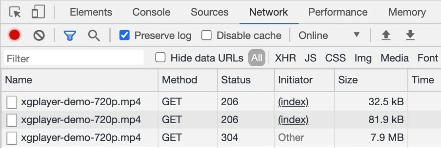
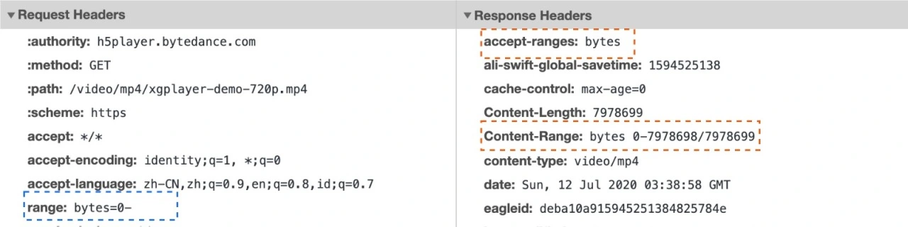
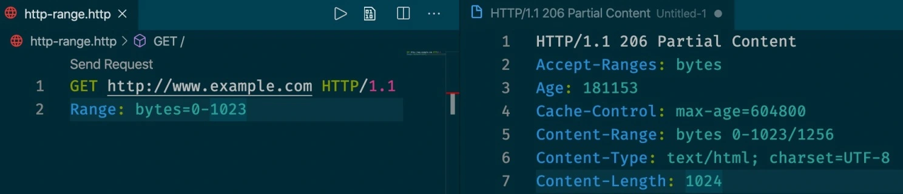
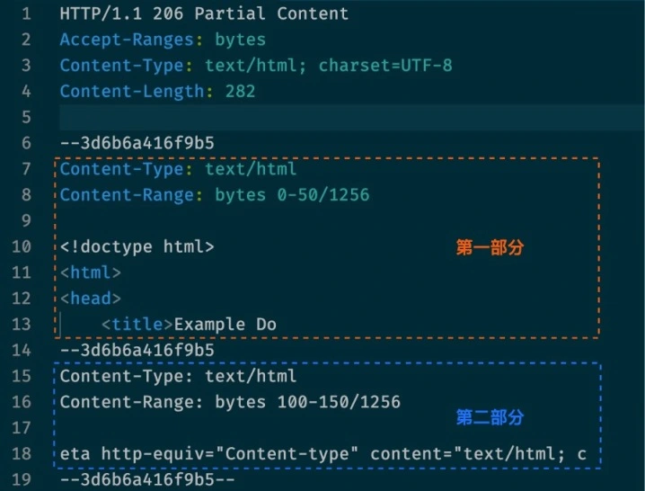

Web开发者们一直以来想在Web中使用音频和视频，但早些时候,传统的Web技术不能够在Web中嵌入音频和视频，所以一些像Flash、Silverlight的专利技术在处理这些内容上变得很受欢迎。这些技术能够正常的工作，缺有这一系列问题，包括无法很好的支持HTML/CSS特性、安全问题，以及可行性问题

幸运的是，<span style="color: blue">当HTML5标准公布后，其中包含许多的新特性，包括&lt;video&gt;和&lt;audio&gt;标签，以及一些JavaScript APIS用于对其进行控制。</span>随着通信技术和网络技术的不断发展，目前音视频已经成为大家生活中不可或缺的一部分。此外，伴随着 5G 技术的慢慢普及，实时音视频领域还会有更大的想象空间。

接下来本文将从八个方面入手，全方位带你一起探索前端 Video 播放器和主流的流媒体技术。阅读完本文后，你将了解以下内容：
- 为什么一些网页中的Video元素，其视频源地址是采用Blob URL的形式。
- 什么是HTTP Range请求及流媒体技术相关概念；
- 了解HLS、DASH的概念、自适应比特率流技术及流媒体加密技术
- 了解FLV文件结构、flv.js的功能特性与使用限制及内部的工作原理
- 了解MSE(Media Source Extensions)API及相关的使用
- 了解视频播放器的原理、多每次封装格式以及MP4与Fragmented MP4封装格式的区别

## 一、传统的播放模式
大多数 Web 开发者对 &lg;video&gt;都不会陌生，在以下 HTML 片段中，我们声明了一个 &lg;video&gt;元素并设置相关的属性，然后通过 &lg;source&gt;标签设置视频源和视频格式：
```html
<video id="mse" autoplay=true playsinline controls="controls">
    <source src="https://h5player.bytedance.com/video/mp4/xgplayer-demo-720p.mp4" type="video/mp4">
   你的浏览器不支持Video标签
</video>
```
上述代码在浏览器渲染之后，在页面中会显示一个 Video 视频播放器，具体如下图所示：


[图片来源](https://v2.h5player.bytedance.com/examples/)

通过 Chrome 开发者工具，我们可以知道当播放 xgplayer-demo-720p.mp4 视频文件时，发了 3 个 HTTP 请求：



此外，从图中可以清楚看到，头两个HTTP请求响应的状态码是206.这里我们来分析第一个 HTTP 请求的请求头和响应头：



在上面的请求头中，有一个range:bytes=0-首部信息，该信息用于检测服务器是否支持Range请求。如果在响应中存在Accept-Ranges首部(并且它的值不为none)，那么表示该服务器支持范围请求

在上面的响应头中,Accept-Ranges:bytes 表示界定范围的单位是butes.这里Content-Length也是有效信息，因为它提供了要下载的视频的完整大小

### 1.1从无服务器端请求特定的范围
假如服务器支持范围请求的话，你可以使用 Range 首部来生成该类请求。该首部指示服务器应该返回文件的哪一或哪几部分。

- 单一范围

    我们可以请求资源的某一部分。这里我们使用 [Visual Studio Code](https://marketplace.visualstudio.com/vscode) 中的 [REST Client](https://marketplace.visualstudio.com/items?itemName=humao.rest-client) 扩展来进行测试，在这个例子中，我们使用 Range 首部来请求 www.example.com 首页的前 1024 个字节。

    

    对于使用 REST Client 发起的 单一范围请求，服务器端会返回状态码为 206 Partial Content 的响应。而响应头中的 Content-Length 首部现在用来表示先前请求范围的大小（而不是整个文件的大小）。Content-Range 响应首部则表示这一部分内容在整个资源中所处的位置。

- 多重范围

    Range 头部也支持一次请求文档的多个部分。请求范围用一个逗号分隔开。比如：

    ```js
    $ curl http://www.example.com -i -H "Range: bytes=0-50, 100-150"
    ```
    对于该请求会返回以下响应信息：
    
    因为我们是请求文档的多个部分，所以每个部分都会拥有独立的 Content-Type 和 Content-Range 信息，并且使用 boundary 参数对响应体进行划分。

- 条件式范围请求

    当重新开始请求更多资源片段的时候，必须确保自从上一个片段被接收之后该资源没有进行过修改。

    If-Range 请求首部可以用来生成条件式范围请求：假如条件满足的话，条件请求就会生效，服务器会返回状态码为 206 Partial 的响应，以及相应的消息主体。假如条件未能得到满足，那么就会返回状态码为 200 OK 的响应，同时返回整个资源。该首部可以与 Last-Modified 验证器或者 ETag 一起使用，但是二者不能同时使用。
- 范围请求的响应

    与范围请求相关的有三种状态：
    - 在请求成功的情况下，服务器会返回 206 Partial Content 状态码。

    - 在请求的范围越界的情况下（范围值超过了资源的大小），服务器会返回 416 Requested Range Not Satisfiable （请求的范围无法满足） 状态码。

    - 在不支持范围请求的情况下，服务器会返回 200 OK 状态码。

剩余的两个请求，阿宝哥就不再详细分析了。感兴趣的小伙伴，可以使用 Chrome 开发者工具查看一下具体的请求报文。通过第 3 个请求，我们可以知道整个视频的大小大约为 7.9 MB。若播放的视频文件太大或出现网络不稳定，则会导致播放时，需要等待较长的时间，这严重降低了用户体验。

那么如何解决这个问题呢？要解决该问题我们可以使用流媒体技术，接下来我们来介绍流媒体。

## 流媒体
<span style="color: blue">流媒体是将一连串的每次数据压缩后，经过网上分段发送数据，在网上及时传输影音以供观赏的一种技术与过程，此技术是的数据包以像流水一样发送；如果不适用次技术，就必须在使用前下载整个媒体文件</span>


## 资料
[「1.4 万字」玩转前端 Video 播放器 | 多图预警](https://xie.infoq.cn/article/8d2b0ba59ea03dd458a902ef0)