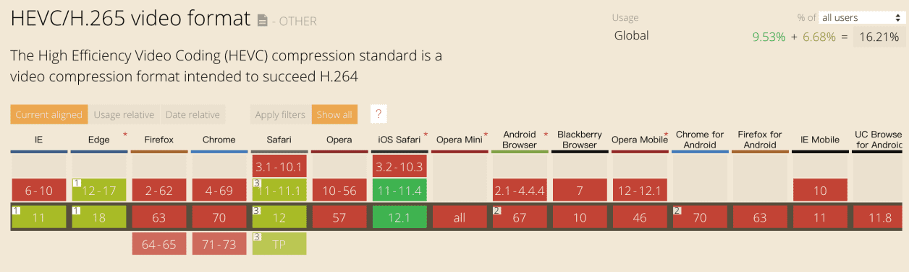
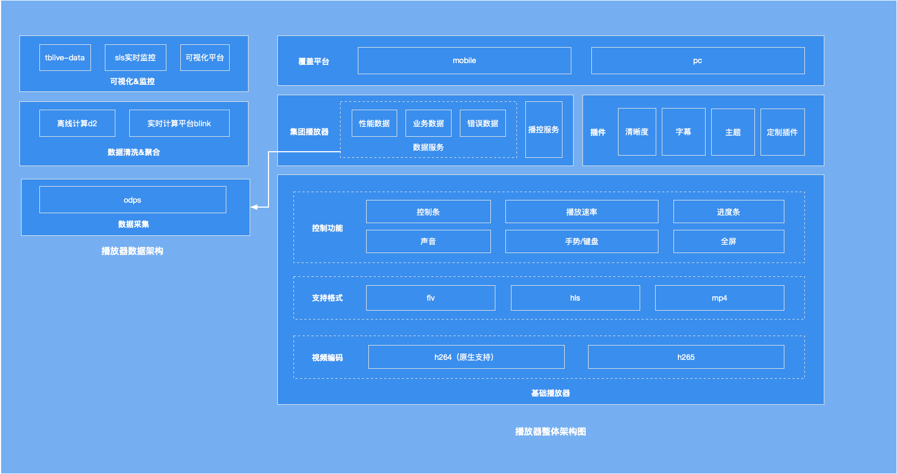
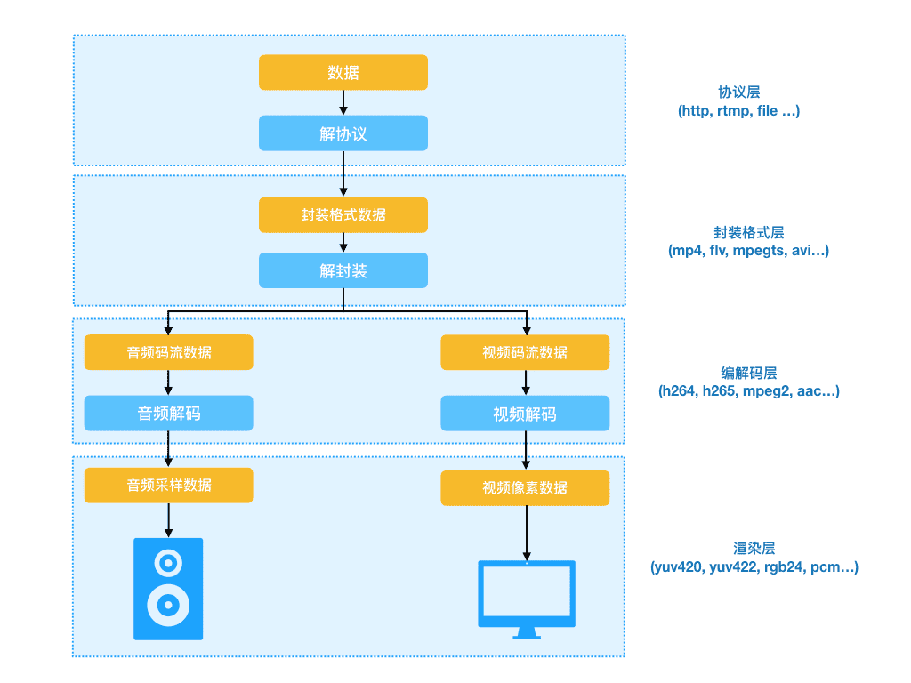
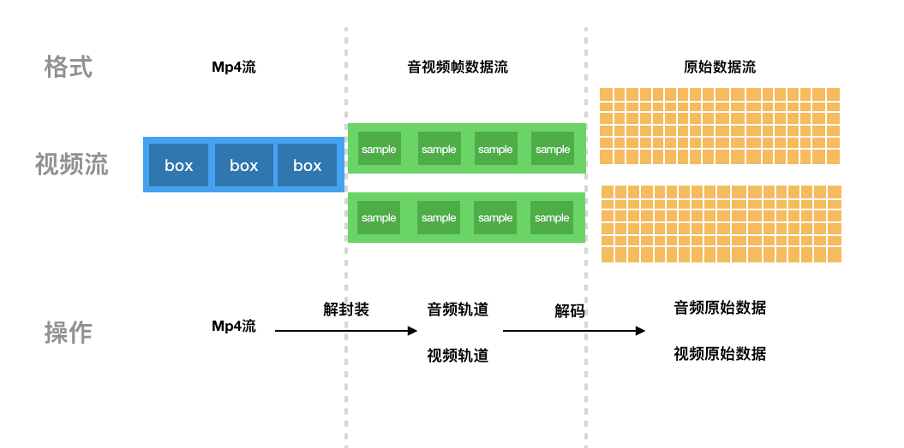
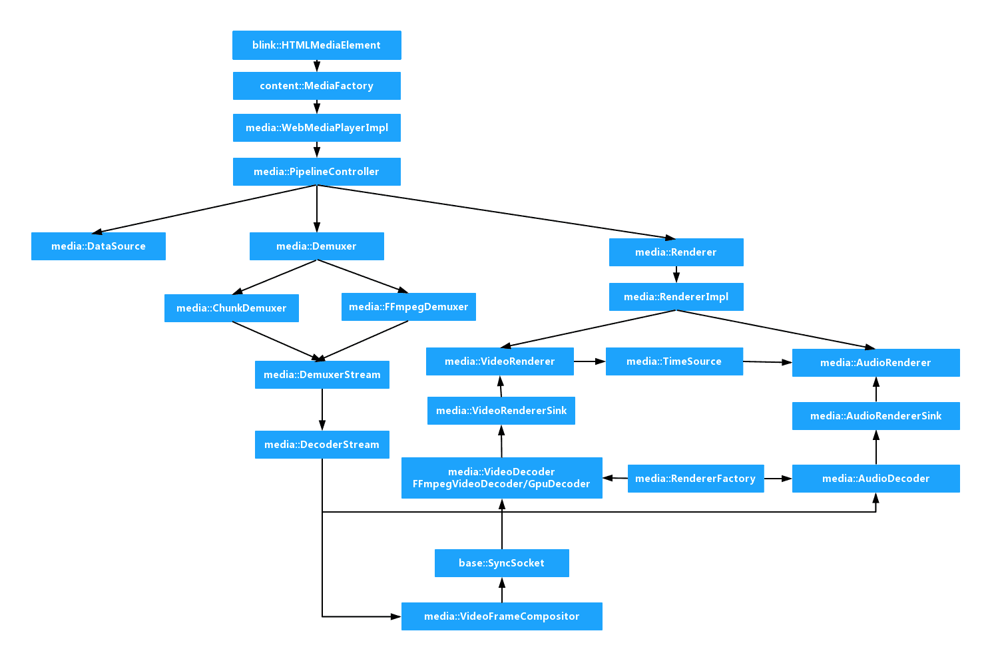
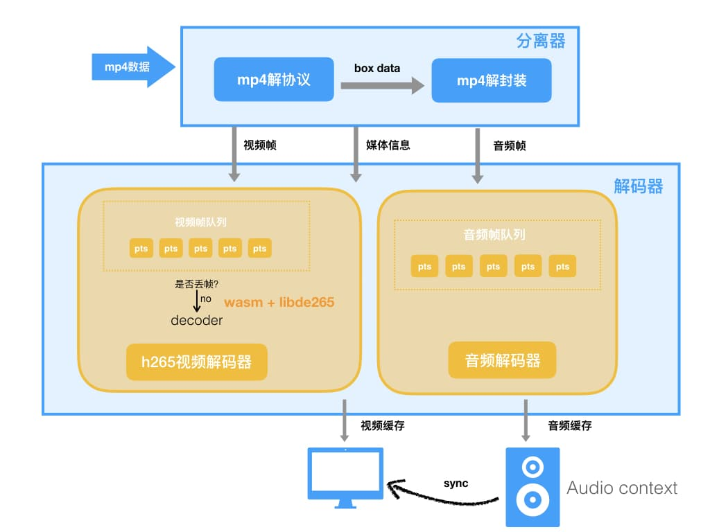
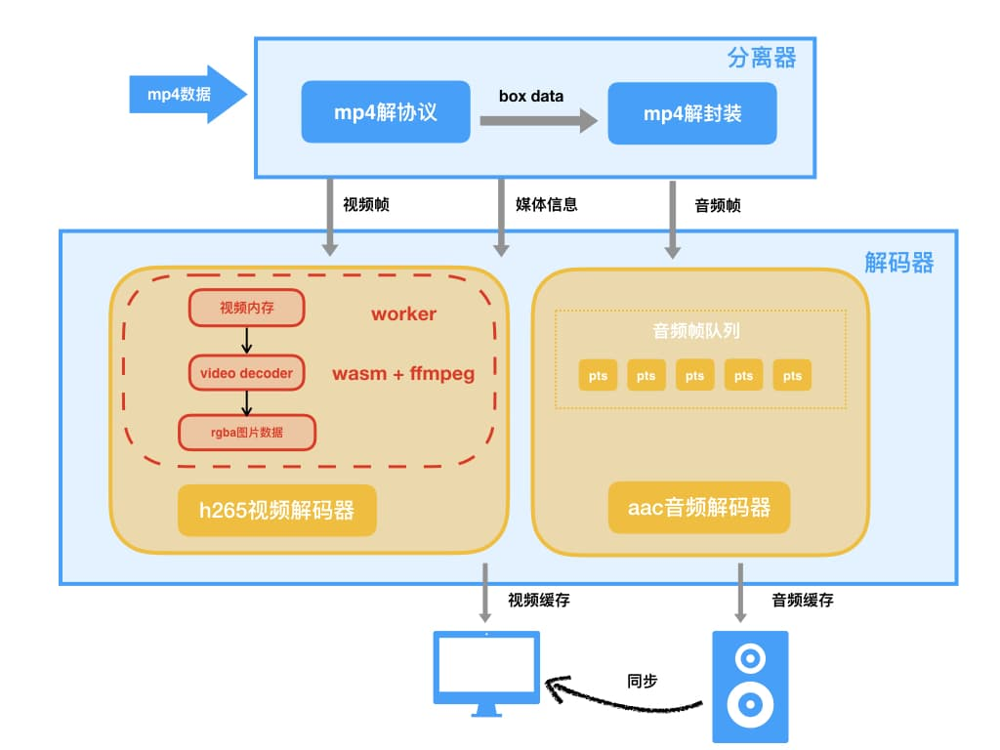
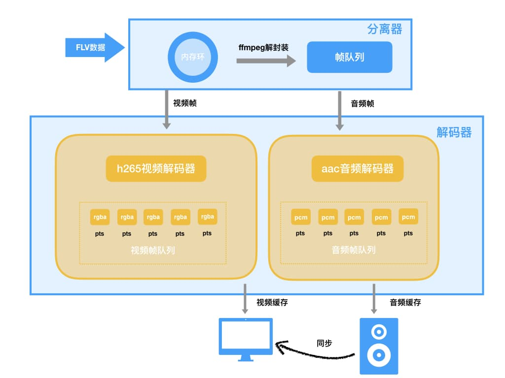
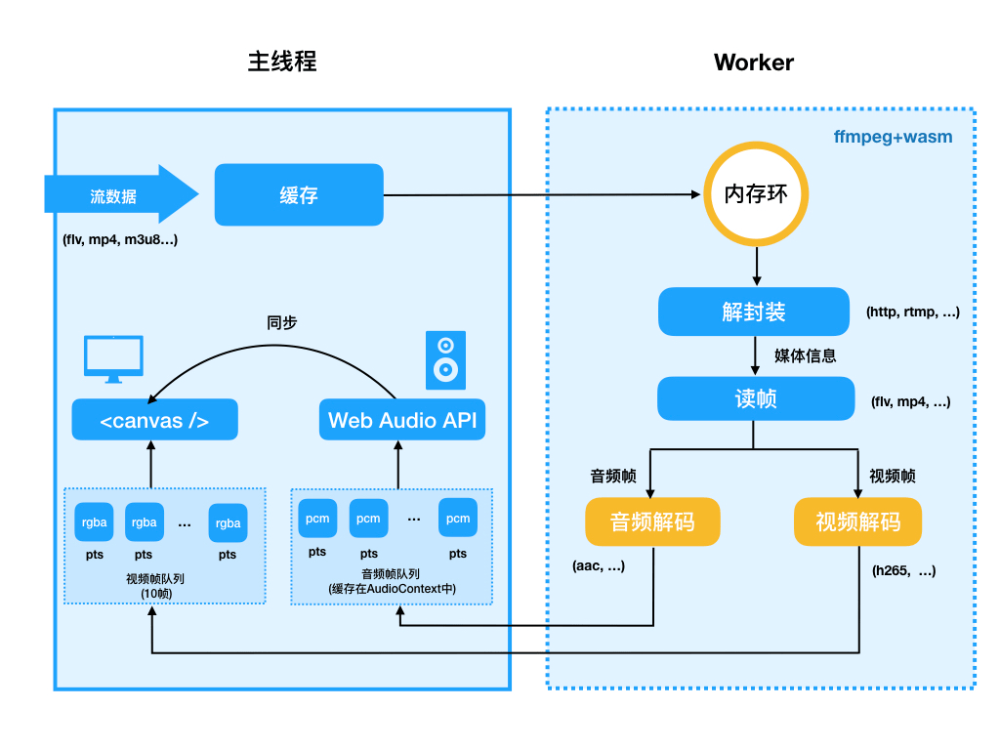
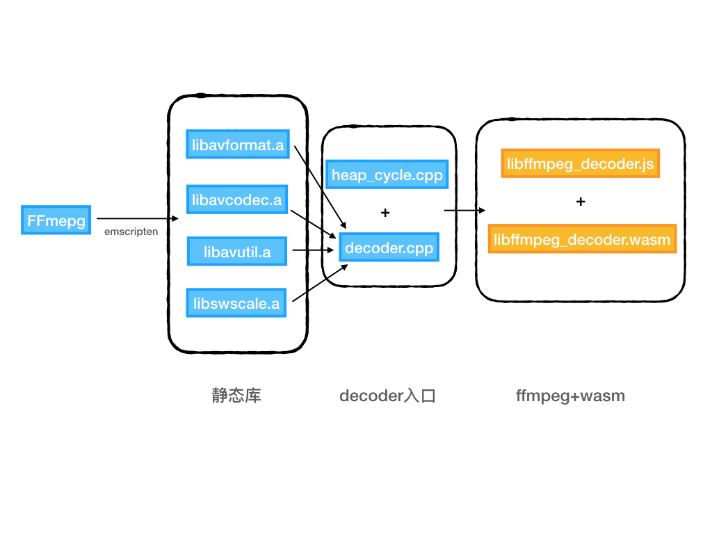

音视频编解码对于前端工程师是一个比较少的涉足的领域，涉及到流媒体技术中的文本、图形、图像、音频和视频多种理论知识的学习，才能够应用到具体实践中，<span style="color: blue">我们自研web播放器并支持h.265解码，在码率优化的大背景下(保持画质不变情况下，应用图像增强、roi区域检测、智能场景分类h265编解码等多种技术能力，将码流降低50%。到达减少带宽成本，提升视频服务QoE的目的)，真正做到了h265解码播放的全域覆盖。**本文主要分享了我们基于WebAssembly实现H.265d的解封装、解码和播放**</span>

## 背景
**H.265又称HEVC(全称High Efficiency Video Coding,高效视频编码)，是ITU-T H.264/MPEG-4 AVC标准的继任者。相比H.264,H.265拥有更高的压缩率，也就意味着同样码率(又称为比特率是指每秒传送的比特(bit)数。单位bps(Bit Per Second)，比特率越高，每秒传送数据越多，画质越清晰)，H.265的画质会更清晰，更高的压缩率就能使用更低的存储和传输成本**

- <span style="color: blue">**带宽成本**:在有限带宽下H.265能传输更高质量的网络视频，理论上，H.265最高只需H.264编码一半带宽即可传输相同质量视频。更低的带宽可以更好的降低存储和传输成本</span>
- <span style="color: blue">**转码成本**:但是当前主流浏览器均不支持H.265原生视频播放，因此通常视频生产端需要针对浏览器做一次H.264视频的转码来适配浏览器端如PC场景的播放，而增加了转码成本。如在淘宝直播中，假设以每天5万场直播计算，每场直播转码成本20元，一天就是100万的转码成本。</span>

为此，我们团队对浏览器端H.265视频播放的可行性及兼容性进行了一次探索，为移动端及PC端全量H.265做准备，也对浏览器端视音频处理、WebAssembly实践进行一次深入的尝试。

### H.264  vs H.265
H.264是当下应用的最为广泛的视频编码格式，<span style="color: blue">H.265标准围绕现在有的视频编码标准H.264,保留原来的某些技术，同事对一些相关技术加以改进。新技术使用先进的技术用以改善码流、编码质量、延时和算法复杂度之间的关系，达到最优化设置。</span>**H.265和H.264都是基于块的视频编码技术，主要差别在于编码单元的大小以及一些编码算法细节，H.265将图像划分为『编码树单元(coding tree Unit,CTU)』，而不是像H.264那样的16*16的宏块。**根据不同的编码设置，编码树单元的尺寸可以被设置为64×64或有限的32×32或16×16。一般来说区块尺寸越大，压缩效率就越好。具体的算法及相关细节这里不具体展开了，还有一些其他的压缩算法如因为H.265专利限制而生的开放编码格式如AV1等，读者可以参考其他相关文章。


如下图，可以看到同样主观画面质量，H.265(500K)仅需H.264(800K)一半左右的带宽码率。


### 浏览器现状
如下图，因为H.265专利及硬件支持情况不完善的原因，主流现在浏览器均不兼容H.265编码的视频播放（Edge新版本以插件方式支持），但是因为Apple对H.265的支持（这里作者认为这可能是一个很重要的标志，因为技术的发展很多时候不光是这个技术本身所决定的，而是很多因素共同作用的结果，商业也是其中很重要的一个因素），移动端ios safari在11.0版本以上支持原生播放。



<span tyle="color: red">想要在浏览器播放H.265视频原生的&lt;video/&gt;标签没有办法支持，但是因为视频格式本身是连续图像画面和音频的集合，参考chromium的源码及video标签内部的实现原理，可以通过&lt;canvas/&gt; + Web Audio API的结合来模拟实现一个虚拟的video标签来实现播放器功能</span>

### demo
因为直播流时效性的缘故，发布了一个播放H.265 mp4视频（该视频地址直接在浏览器中播放只有声音而没有画面）的在线demo，读者可以有一个直观感受。

地址：[https://g.alicdn.com/videox/mp4-h265/1.0.2/index.html](https://g.alicdn.com/videox/mp4-h265/1.0.2/index.html)
效果：


## 前期调研
### 播放器整体架构
基于传统播放器的架构，我们设计的播放器架构如下



### 音视频基础
因为前端领域对视频领域的设计场景不多，一个&lt;video/&gt;标签就可以满足大部分场景，但是经历了这几年直播和短视频的爆发，视频的需求和功能也变得越来越复杂，开发之前阅读了很多视音频领域相关的书籍和文章，在此先对视音频基础进行一个简单的介绍。

<span style="color: red">视频中我们通常说的视频格式,比如.mp4,.mov,.wmv,.m3u8,.flv等等被称为container。在一个视频文件中音频、视频是分开存储的，使用的压缩算法也不一样。其中container作为容器主要包含了video数据、audio数据、metadata(用于检索音视频payload格式等信息)。**每个格式的封装格式不一样。比如FLV格式的基本单元是tag，而MP4格式的基本单元是Box，辅助的meta信息用于检索找到对应的原始数据**</span>

<span style="color: blue">而我们平时听到H.264，H.265等视频编码被称为codec(Compress and decompress).**一个视频格式比如mp4可以使用任何标准化的压缩算法，这些信息都会被包含在一个视频文件的meta信息中来告诉播放器用什么编解码算法来播放**</span>

### 客户端播放器
一个传统的客户端播放器播放一个视频流经过了如下各个环节:

<span style="color: red">拉取数据=>解封装=>音视频解码=>采样/像素数据发送到设备进行播放</span>



对于流媒体,播放器客户端通过拉取以数据源(音视频流)为中心，进行管道式的传输。在此期间，对视频流的读取、转换、分类、复制等一些列操作处理，以封装的mp4为例，需要对流进行解封装、解码、渲染等步骤



### 浏览器Video标签
在探究的过程中，为了了解主流浏览器不支持H.265视频播放的原因，以及浏览器端实现播放器原理的了解，通过对Chromium浏览器官方文档及video标签实现源码的阅读，整理了一个流程图。



可以看到浏览器内部对视频流播放的实现，在经过pipelineController等数据传输管道的处理利用FFmpeg软解或Gpu硬解之后交给视频设备及音频设备进行同步渲染。<span style="color:red">其中H.265的视频因为硬解支持情况不完善，软解可能有性能风险，所以在chrome中被关闭了不支持，在chromium中可以通过参数打开。我们就依照这个思路，利用浏览器提供的接口来实现一个模拟的video标签。</span>

## 设计过程
开发思路按照从简单到复杂的过程，对任务进行拆分，来完成H.265视频点播及直播等各个场景的覆盖，以mp4短视频出发完成播放流程，再覆盖直播场景，考虑如网络抖动、内存控制等复杂因素，再针对直播m3u8等回放文件进行播放并开发视频seek、倍速等功能。

mp4播放=>flv播放=>hls播放=>加入seek、倍速等功能

### 可行性分析
- 思路：在最开始进行可行性分析时，参考了结合已有工具videoconverter.js和libde265.js对H.265视频ffmpeg的编译提取了hevc文件及mp3音频
- demo地址：https://sparkmorry.github.io/mse-learning/h265/
- 表现：将720P的mp4视频进行视频和音频的分离，通过 &lg;canvas /&gt; 绘制图像，通过 &lt;audio /&gt; 标签播放音频，画面在Macbook Pro上Chrome浏览器下在23fps左右。
- 问题
    - **不能达到解码性能标准**:720P的视频在Macbook Pro上仅在23fps左右，而原视频是25fps,不能达到解码性能标准，无法流畅播放
    - **无法做到音画同步**:该方案因为直接提取了hevc裸流文件，无法获取视频和音频每帧的pts时间戳，无法做到严格的音画同步。
- 解决方案：
    - 性能:因为libde265.js是asm.js,通过对libde265.js开源库的改造，打包WebAssembly测试性能情况
    - 音画同步:参考flv.js、hls.js等开源视频库的方案，根据曾经的实践经历，js在解封装方面的性能能够完成视频流文件解封装，获取每帧视频、音频播放的pts及原始数据交给解码器进行解码再渲染。
- 方案调整  



### MP4点播流播放
- 思路:根据商议过程调整的解决方案，通过js对mp4流进行解封装,因为音频解码的复杂度不高，也先用js进行解码，仅将视频解码模块用已有的三方模块libde265并替换为wasm解决性能问题，音视频解码模块都自身维护一段缓存区，负责存储解封装模块传过来的packet数据，解决音画同步问题
- 表现:通过开源libde265实现的视频解码模块，针对于720p的视频流，平均解码时间是45ms，不能满足每一帧音频播放时间间隔40ms
- 问题:视频解码性能仍然不够

- 解决方案
    - 丢帧:保证了音频同步，丢掉部分非参数帧，但损失了部分体验。。所以提升解码性能和改善播放策略才能有可能满足当前方案的可行性。提升解码性能和改善播放策略。
    - 提升解码性能：用解码性能更好的ffmpeg替换掉libde265。
    - 改善播放流程：因为每个requestAnimationFrame循环任务都是同步的，边解码边播放。引入用WebWorker线程。通过改善视频解码模块，解码器内部开启循环解码，当外部的视频播放设备需要播放下一帧时，直接从解码器解码完的帧缓存中读取下一帧数据。实现了worker和主线程并行执行。
- 方案调整：
    - demo地址：https://static-assets.cyt-rain.cn/h265/index.html
    - 设计流程

 

 ### FLV直播流播放
 - 思路:mp4视频流畅播放,但在直播场景(如FLV视频流)中，客户端需要和服务端建立长链接，不断接收流信息，借用FFmpeg本身对流媒体的支持，对视频数据进行解封装及解码
 - 表现:无法编译FFmpeg网络库，TCP无法建立连接
 - 问题
    - 无法编译FFmpeg网络库:TCP建立连接创建Socket时报错，Emscripten工具无法编译tcp连接相关配置
    - codec不支持:FLV官方协议不支持H.265
- 解决方案
    - 无法编译FFmpeg网络库:主线程利用fetch方法进行拉流，放到FFmpeg自定义缓冲区进行解封及解码。因为直播流长时间播放需要不停的开辟、释放内存空间，采用环形的数据缓冲区
    - FLV官方不支持H.265:对FFmpeg及编码端对H.265进行扩展，因为FFmpeg内部数据结构嵌套较深，替换js解封装函数直接用FFmpeg的解封装函数。
- 方案调整



## 当前方案
### 播放流程


1. <span style="color: red">因为FFmpeg支持多重格式解封装,只需要在主线程中通过浏览器API(通常是fetch方法)拉去原始流数据并放到缓存中，等初始缓存到一个阀值时开启Worker进行解封装及解码</span>
2. <span style="color: red">在子线程(Worker)中通过主线程fetch方法触发的数据回调接受数据存入环形缓冲区(内存环)中</span>
3. <span style="color: red">子线程将读取到的音频帧输送到主线程中，通过Web Audio API缓存音频数据，根据已解码的视频帧缓存队列循环解码保证缓存中一直缓存10帧rgba图像数据</span>
4. <span style="color: red">主线程中canvas根据音频播放回调的pts消费并渲染视频图像</span>
5. <span style="color: red">循环以上知道fetch接口返回流已结束</span>

### 编码器编译
<span style="color: red">通过Emscripten工具可以把C语言编写的FFmpeg库编译成wasm并在浏览器中应用到视音频解码中。</span>

我们的视频解码场景和通常的播放器一样，通过依赖FFmpeg的通用接口来实现解封装和解码的工作.先通过emscripten编译ffmpeg库，在通过静态库的方式依赖到解封装和解码入口程序中



## 测试表现
### 性能测试
#### 测试视频
因为flv直播视频受时效性影响较大，拿720P高清的H.265 mp4视频作为稳定输入测试

地址：https://gw.alicdn.com/bao/uploaded/LB1l2iXISzqK1RjSZFjXXblCFXa.mp4?file=LB1l2iXISzqK1RjSZFjXXblCFXa.mp4
视频参数：
```js
Input #0, mov,mp4,m4a,3gp,3g2,mj2, from 'https://gw.alicdn.com/bao/uploaded/LB1l2iXISzqK1RjSZFjXXblCFXa.mp4?file=LB1l2iXISzqK1RjSZFjXXblCFXa.mp4':
  Metadata:
    major_brand     : isom
    minor_version   : 512
    compatible_brands: isomiso2mp41
    encoder         : www.aliyun.com - Media Transcoding
  Duration: 00:01:00.10, start: 0.000000, bitrate: 907 kb/s
    Stream #0:0(und): Video: hevc (Main) (hvc1 / 0x31637668), yuv420p(tv, bt709, progressive), 1280x720, 854 kb/s, 25 fps, 25 tbr, 12800 tbn, 25 tbc (default)
    Metadata:
      handler_name    : VideoHandler
    Stream #0:1(und): Audio: aac (LC) (mp4a / 0x6134706D), 44100 Hz, stereo, fltp, 48 kb/s (default)
    Metadata:
      handler_name    : SoundHandler
```
#### 测试机器
- lenovo ThinkPad T430
    - CPU: Intel(R) Core(TM) i5-3230M CPU@2.60GHz  x64处理器
    - 内存: 8 GB
    - 系统: windows 10
- MacBook Pro (Retina, 15-inch, Mid 2015)
    - CPU: 2.2 GHz Intel Core i7
    - 内存: 16 GB
    - 系统: macOS 10.14.2

#### 性能情况
- MBP下表现

    decoder.wasm大小|decoder.js大小|平均每帧解码时长|内存占用|cpu占用
    ---|---|---|---|---
    1.4M|168K|26.79ms|17m|17~25%
- 针对两个pc笔记本进行了测试，平均每帧解码（包含yuv420转rgba）时长在各个浏览器的表现情况如下：

> 注：此处Native（原生）表示针对mac系统原生编译的FFmpeg作为依赖的解码器（相对不考虑具体如x86、arm等计算机架构的WebAssembly的跨平台方案而言）。

设备|Chrome|Safari|FireFox|Edge|Native
---|---|---|---|---|---
MacOS(i7)|26.79ms|22.19ms|24.77ms|-|5.08ms
windows(i5)|33.51ms|-|36.74ms|86.72ms|未测试

意味着最高能提供720P高清视频如下帧率视频流畅播放的能力：

设备|Chrome|Safari|FireFox|Edge|视频基准|Native
---|---|---|---|---|---|---
MacOS(i7)|37fps|45fps|40fps|-|25fps|196fps
windows(i5)|30fps|-|27fps|12fps|25fps|未测试

可以看到这两台机器中，在非高速运动等普通的如电商场景25fps帧率的高清720p视频已经能达到生产环境的标准，但是距离原生的速度还有一定距离。

### 浏览器兼容情况


## TODO
当前的技术方案已经能在大部分机器的主流浏览器上流畅的播放720P的高清直播流，但是在Edge浏览器及性能稍差的机器上还是存在高清视频解码性能不能满足流畅播放的风险，针对WebAssembly达到native速度的目标还有一定距离，尤其是汇编并行计算的支持，在视音频及大规模数据处理中是很常见的性能优化策略，作者整理了几个优化的方向，在未来还有更多探索的空间：

- 汇编

    FFmpeg中解码有较多利用汇编进行并行计算的优化，但是汇编指令是cpu specific的（比如x86指令和arm指令），而wasm是跨平台的基于栈的虚拟机。Emscripten不支持汇编的编译，考虑用clang等llvm前端将FFmpeg的.c和汇编.asm文件编译成LLVM IR（LLVM Intermediate Representation），然后通过fastcomp或者其他后端来编译测试。

- 硬解

    FFmpeg3.3以上开始支持自动硬解探测，支持的硬件设备根据不同操作系统及硬件会有不同的支持，具体参考：https://trac.ffmpeg.org/wiki/HWAccelIntro 。因为wasm是跨平台的虚拟指令集，支持程度还要待进一步探究。

- 多线程

    FFmpeg内部解码有多线程来提高解码性能，通过pthread可以支持跨平台的多线程支持的，但是如果不支持共享内存，则线程之间的数据传输会有很多性能消耗（深拷贝或者Transfered Object）。浏览器端共享内存通过SharedArrayBuffer来实现，因为有安全隐患，大部分主流浏览器关闭了SharedArrayBuffer、Chrome67+开始恢复。考虑到兼容性多线程的支持还要再进行尝试。

- WebGL渲染

    解码平均时长中有4ms左右(15%)在yuv转rgba上，通过WebGL可以用gpu加速图像的计算，但是同时与WebGL的数据交换又会产生一定的性能损耗，需要再测试查看性能结果

## 未来展望
通过H.265视频播放将开源视音频库FFmpeg的能力及WebAssembly性能的优势在浏览器端视音频处理上有了一次深入的尝试。视频作为一种多媒体形式，相比现有的文字、图像、音频都能有更生动及更丰富信息的表现。尤其经过了直播和短视频的爆发增长后，成为了一种基础的多媒体形式，也是网络及移动端手机性能等技术发展的体现。未来随着5G及更高性能的硬件设备的发展会被更广泛的应用到各个领域。浏览器在这场视频革命中也是不可或缺的一个环节，通过这次的探索，为未来浏览器端扩展视音频处理的通用能力提供了想象的空间，同时也在浏览器端通过WebAssembly向native性能及能力靠近的路上做了一个落地的尝试，虽然从测试情况看现在的表现还不如native，但是随着标准及技术的演进，为未来对性能要求比较高的图形图像及人工智能等相关方向在浏览器端处理一定会渐渐被广泛的应用起来，比如如下几个方向：

- 扩展浏览器端视频播放能力

    借助FFmpeg强大的编解码能力，除了H.265视频的播放，未来还可以在浏览器端兼容各种格式及编码类型的视频播放。如不同的编码格式AV1、不同的容器格式mov格式等等。

- 扩展浏览器端视音频处理能力

    借助FFmpeg及其他语言框架的现有能力，还可以在视音频领域做更多复杂的操作如视频滤镜、视频剪切、视频格式转换等功能，减少网络传输及存储的成本。

- 基于WebAssembly的高性能web应用

    借助WebAssembly的跨平台优势，可以将传统的其他语言的开源框架如图形相关开源库OpenGL、SDL等的能力移植到浏览器上来。借助性能上的优势也可以将传统的图像、3D等运算能力要求较高的应用扩展到浏览器端。
## 参考

Chromium媒体元素源码: https://github.com/chromium/chromium/tree/master/media

WebAssembly: https://webassembly.org/

优秀的开源视音频处理框架FFmpeg: https://www.ffmpeg.org/

基于LLVM编译的WebAssembly打包工具集Emscripten：https://emscripten.org/index.html

基于WebAssembly的ogg播放器：https://github.com/brion/ogv.js

基于FFmpeg的简单播放器：https://github.com/leixiaohua1020/simplest_ffmpeg_player

## 资料
[Web端H.265播放器研发解密](https://fed.taobao.org/blog/taofed/do71ct/web-player-h265/)

[前端视频提取FFmpeg + WebAssembly](https://juejin.cn/post/6854573219454844935)