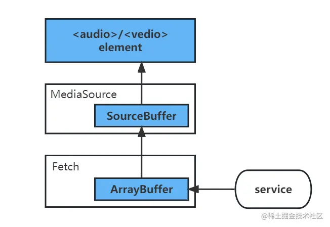
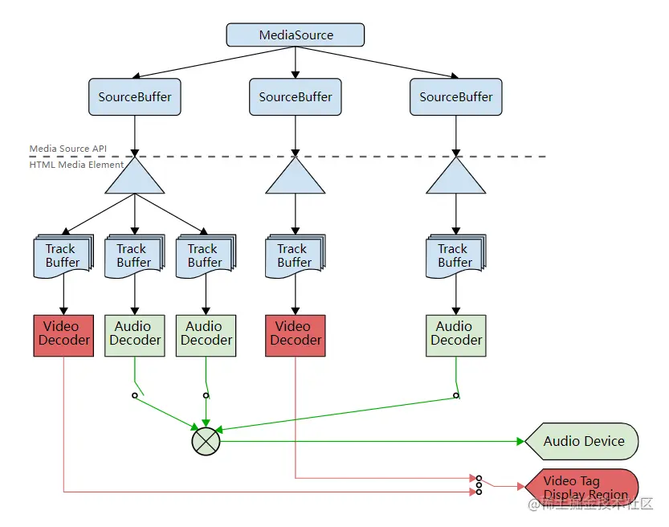

## 前言
在Javascript之外的后端语言中，流是一个很普遍的概念，通过流我们可以将数据分段传输，如此以来我们不必等到数据全部传输完毕在处理，当第一批数据传输到我们手上的时候，我们就可以开始使用了。

在前端领域，流则可以在网络请求中发挥巨大的作用,当传输一些音视频大文件时，请求的时间是很长的。如果用户是下载文件那么长耗时没什么问题，但如果用户想点播音视频呢，通过流我们不必等到传输完毕,可以在传输过程中处理数据并展示给用户，大大优化了体验。

在JS早期，想要实现流我们需要自己造轮子，如果JS也有了Stream API用于处理流，且Fetch更深全面支持了Stream API。其response.body中负责携带数据的ReadableStream就是一个二进制数据流。搭配专为流媒体播放而生的MediaSource API,使得前端也有了很强的流媒体能力。

## ReadableStream的处理
Fetch方法的response响应对象中，数据都以ReadableStream的二进制流存储，response对象提供了json()、formData()、text()等多重转换方法，通常情况下根据响应的ContentType,转换成我们想要的数据类型进行处理，一些简单的网络请求我们便会这样做，由于数据量娇小，转换时间往往较短。

除此之外我们还能通过Stream API,直接从ReadabledStream中读取数据，当HTTP(s)连接建立，我们拿到response的那一刻，数据传输就开始了，数据会以二进制流的形式不断添加到ReadableStream中。我们可以通过ReadableStream.getReader()获取一个流的读取器，此时该流会被锁定，只允许我们获得的这个读取器读取。在通过读取器的read()方法，循环读取流，分段拿去数据，实现流式传输，看一段示例代码：
```js
window.fetch(url, fetchOption).then((response) => {
    if(!response.ok) {
        throw new Error('网络连接失败');
    } else {
        const reader = response.body.getReader(); // 使用读取器

        // 声明处理函数
        const processRead = async (params) => {
            const {done, value} = params;
            if(!done) {
                // 此时value就是读取到的数据，再次进行处理
                // 处理完毕后递归进行下一次处理
                await reader.read().then(processRead);
            } else {
                console.log('可读流读取完毕')
            }
        }

        // 开始读取
        reader.read().then(processRead)
    }
})
```
上面的代码中，我们生命了一个processRead函数用来处理reader.read()产生的数据，每一次read都会返回一个{done:boolean, value: Uint8Array}对象。done标识了可读流是否读取完成，value则是当前读取到的分块数据，为Unit8Array的数组，接下来我们需要做的就是将其传递给我们的流媒体播放器消费

## MediaSource 接受音视频数据
从前面的操作中，我们得到了多个Unit8Array的音视频数据，该如何使用它呢？通常都会转化为Object.URL来供HTMLMediaElement消费：
```js
// value即为我们的Unit8Array数据
const blob = new Blob([value], {type: 'audio/mpeg'});

const url = window.URL.createObjectURL(blob);

<audio src={url}/>
```
<span style="color: red">但问题是我们有多个ArrayBuffer数据需要处理，很显然不可能将它们转换为多个URL，然后传递给audio,vedio标签消费掉。不过好在我们有专门处理流媒体播放的MediaSource API</span>

<span style="color: green">MediaSource的使用很简单，其内部创建SourceBuffer用于接收数据，且自身可以被传递到HTMLMediaElement对象上被消费，一段简单的例子</span>

```js
// 创建mediaSource并将其传递到audio标签上
const mediaSource = new MediaSource();
const url = window.URL.createObjectURL(mediaSource);

<audio src={url}/>

// 内部创建SourceBuffer接收数据
const sourceBuffer = mediaSource.addSourceBuffer('audio/mpeg');
sourceBuffer.appendBuffer(chunk1);
sourceBuffer.appendBuffer(chunk2);
sourceBuffer.appendBuffer(chunk3); // 可以流式接收数据
```
上面的流程，我可以用这样一张图来表示



这里的SourceBuffer是数据的主要接收者,一个MediaSource钟包含多个SourceBuffer实例,可以通过 MediaSource.sourceBuffers 这个只读属性访问。一个SourceBuffer代表一个媒体块，就像一个视频包含音频，影像，字符等多个媒体块，此时你可以通过多个SourceBuffer来分别操纵他们，你也可以通过其来控制媒体流的质量、切换清晰度音质等。援引W3C官方文档的一张图，可以清晰的显示他们的关系




```js
// 检查是否为 open 状态,否则添加监听器，等到open状态就绪后再传输
if(mediaSource.readyState == 'open') {
    createSourceBuffer();
} else {
    mediaSource.addEventListener('sourceopen', () => {
        createSourceBuffer();
    })
}

const createSourceBuffer = () => {
    const sourcebuffer = mediaSource.addSourceBuffer('audio/mpeg');

    window.fetch(url, fetchOption).then(response => {
        if(!response.ok) {
            throw new Error('网络连接失败');
        } else {
            const reader = response.body.getReader(); // 获取读取器

            // 声明处理函数
            const processRead = async params => {
                const {done, value} = params;
                if(!done) {
                    // 传输数据
                    sourcebuffer.appendBuffer(value);
                    // 读取完毕后递归进行下一次读取
                    await reader.read().then(processRead);
                } else {
                    console.log('可读流读取完毕');
                    // 关闭流式传输
                    sourceBuffer.abort();
                    mediaSource.endOfStream();
                }
            }
            // 开始读取
            reader.read().then(processRead);
        }
    })
}
```
需要注意的是在创建SourceBuffer时传入了一个'audio/mpeg'字符串，这是MIME类型字符串,标识了SouceBuffer所接收的数据类型，此外我们还可以额外指定编码方式，格式为 codecs="avc1.42E01E, mp4a.40.2"',不具体指明的话 SourceBuffer会自动帮你选择。具体的 MIME 类型查询和解码方式可以参考[MIME 常见类型](https://developer.mozilla.org/zh-CN/docs/Web/HTTP/Basics_of_HTTP/MIME_types/Common_types)和[codesc 查询](https://www.rfc-editor.org/rfc/rfc6381)

## 添加缓冲区
在上面的例子中，每当reader读取到新的分块value时，我们都直接执行了 SourceBuffer.appendBuffer() 来加载数据，但是 SourceBuffer 的读取是异步的，我们不能在读取的过程中加载数据，否则当传输速度大于读取速度时会产生报错。

所以在流式传输的生产者和消费者之间，添加一个缓冲区是很有必要的,能帮助我们解决异步冲突的问题，现在升级一下我们之前的示例，通过 SourceBuffer 的updateend 读取结束事件，配合缓冲区实现完整的流式传输

```js
let isDone = false; // 是否传输结束
let isReady = true; // 是否准备好下一下加载
let bufferList = []; // 缓冲区数组

const mediaSource = new MediaSource();
const url = window.URL.createObjectURL(mediaSource);

// 检测是否为open状态，否则添加监听器，等到open状态就绪后再传输
if(mediaSource.readyState === 'open') {
    createSourceBuffer();
} else {
    mediaSource.addEventListener('sourceopen', () => {
        createSourceBuffer();
    })
}

// 发送请求并开始传输
const createSourceBuffer = () => {
    const sourcebuffer = mediaSourceBuffer('audio/mpeg');

    // 传输完毕事件监听器
    sourceBuffer.addEventListener('updateend', () => {
        if(bufferList.length !== 0) {
            // 读取完毕后缓冲区有数据，从缓冲区读取
            sourceBuffer.appendBuffer(bufferList.shift());
        } else {
            // 缓冲区无数据
            if(isDone) {
                // 传输结束，关闭
                sourceBuffer.abort();
                mediaSource.endOfStream();
            } else {
                isReady = true;
            }
        }
    })

    window.fetch(url, fetchOption).then(response => {
        if(!response.ok) {
            throw new Error('网络连接失败');
        } else {
            const reader = response.body.getReader(); // 获取读取器

            // 声明处理函数
            const processRead = async params => {
                const {done, value} = params;
                if(!done) {
                    if(isReady) {
                        // 如果已准备好则直接读取
                        sourceBuffer.appendBuffer(value);
                        this.isReady = false;
                    } else {
                        // 否则加入缓冲区
                        bufferList = [...bufferList, value];
                    }
                    // 读取完毕后递归进行下一次读取
                    await reader.read().then(processRead)
                } else {
                    console.log('可读流读取完毕');
                    isDone = true;
                }
            }

            // 开始读取
            reader.read().then(procesRead);
        }
    })
}
```
## 总结
我们通过Stream API 和 Media Source Extention (MSE)的配合，实现了一个简单的流式传输，可以让用户无需等待，下载的同事一边播放音视频，优化了用户体验。但以上两个 API 在前端流媒体的应用，还有很多玩法，值得我们去探索


## 资料
[前端流式传输播放音视频](https://juejin.cn/post/7182849913846251575)