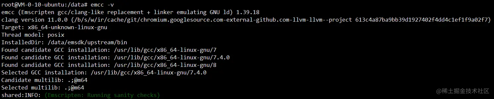
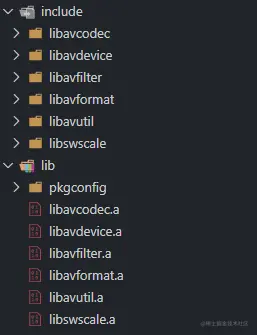
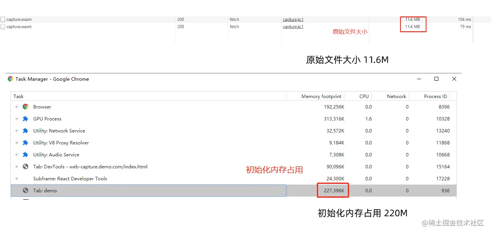
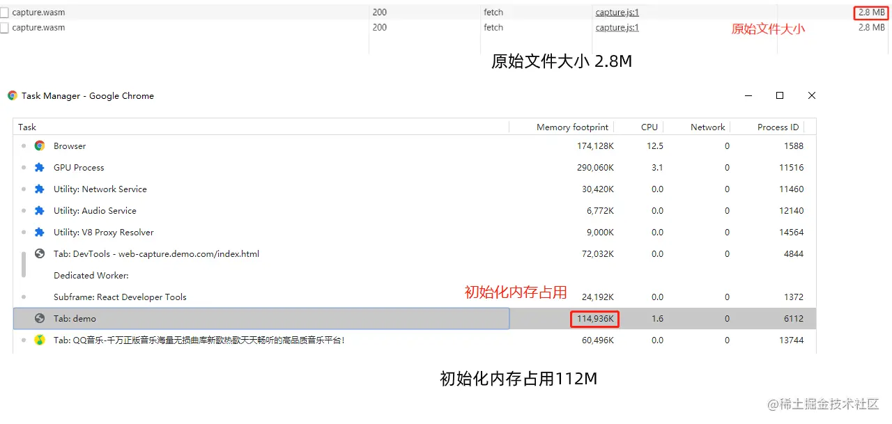
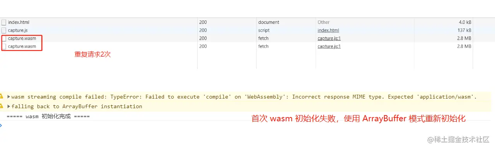
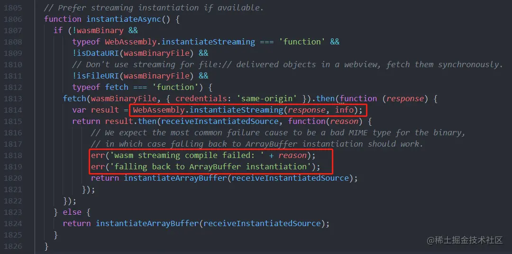

> 基于ffmpeg + webassembly 实现前端视频帧提取

现有的前端视频帧提取主要是基于 canvas + video 标签的方式，在用户本地选取视频文件后，将本地文件转为ObjjectUrl后设置到video标签的src属性中，在通过canvas的drawImage接口提取出当前时刻的视频帧。

<span style="color: red">受限于浏览器支持的视频编码格式，即使是支持最全的chrome浏览器也只能解析MP4/WebM 的视频文件和H.264/VP8的视频编码。在遇到用户自己压制和封装的一些视频格式的时候，由于浏览器的限制，就无法截取到正常的视频帧了</span>。如图1所示，一个mpeg4编码的视频，在QQ影音中可以正常播放，但是在浏览器中完全无法解析出画面


通常遇到这种情况只能将视频上传后由后端解码后提取视频图片，而WebAssembly的出现为前端完全实现视频帧截取提供了可能。于是我们的总体设计思路为:<span style="color: blue">**将ffmpeg 编译为webAssembly库，然后通过js调用相关的接口截取视频帧，再将截取到的图像信息通过canvas绘制出来**</span>


## 一、wasm模块
### 1.ffmpeg编译
首先在ubuntu系统中，按照[emscripten官网](https://emscripten.org/docs/getting_started/downloads.html)的文档按照emsdk(其他类型的linux系统也可以安装，不过要复杂一些，还是推荐使用ubunto系统进行安装)。安装过程中可能会需要访问 googlesource.com 下载依赖，所以最好找一台能够直接访问外网的机器，否则需要手动下载镜像进行安装。安装完成后可以通过emcc -v 查看版本，本文基于1.39.18版本，如图3。



接着在[ffmpeg官网](https://ffmpeg.org/download.html)下载ffmpeg源码release包。在尝试了多个版本编译之后，发现基于3.3.9版本编译时禁用掉swresample之类的库后能够成功编译，而一些较新的版本禁用之后依然会有编译内存不足的问题。所以本文基于 ffmpeg 3.3.9 版本进行开发。

下载完成后使用emcc进行编译得到编写解码器所需要的c依赖库和相关头文件，这里先初步禁用掉一些不需要用到的功能，后续对 wasm 再进行编译优化是作详细配置和介绍
```js
// 具体配置如下
emconfigure ./configure \
    --prefix=/data/web-catch-picture/lib/ffmpeg-emcc \
    --cc="emcc" \
    --cxx="em++" \
    --ar="emar" \
    --enable-cross-compile \
    --target-os=none \
    --arch=x86_32 \
    --cpu=generic \
    --disable-ffplay \
    --disable-ffprobe \
    --disable-asm \
    --disable-doc \
    --disable-devices \
    --disable-pthreads \
    --disable-w32threads \
    --disable-network \
    --disable-hwaccels \
    --disable-parsers \
    --disable-bsfs \
    --disable-debug \
    --disable-protocols \
    --disable-indevs \
    --disable-outdevs \
    --disable-swresample
make

make install
```
编译结果



### 2.基于ffmpeg的解码器编码
对视频进行解码和提取图像主要用到ffmpeg的解封装、解码和图像缩放转换相关的接口，主要依赖一下的库
```js
libavcodec --- 音视频编解码
libavformat --- 音视频解封装
libavutil --- 工具函数
libswscale --- 图像缩放&色彩转换
```
在引入依赖库后调用相关接口对视频帧进行解码和提取，主要流程如图5


### 3.wasm编译
在编写完相关解码器代码后,将需要通过emcc来解码器和依赖的相关库编译为wasm供js进行调用。emcc的编译选项可以通过emcc --help来获取详细的说明，具体的编译配置如下
```js
export TOTAL_MEMORY=33554432

export FFMPEG_PATH=/data/web-catch-picture/lib/ffmpeg-emcc

emcc capture.c ${FFMPEG_PATH}/lib/libavformat.a ${FFMPEG_PATH}/lib/libavcodec.a ${FFMPEG_PATH}/lib/libswscale.a ${FFMPEG_PATH}/lib/libavutil.a \
    -O3 \
    -I "${FFMPEG_PATH}/include" \
    -s WASM=1 \
    -s TOTAL_MEMORY=${TOTAL_MEMORY} \
    -s EXPORTED_FUNCTIONS='["_main", "_free", "_capture"]' \
    -s ASSERTIONS=1 \
    -s ALLOW_MEMORY_GROWTH=1 \
    -o /capture.js
```
主要通过 -O3 进行压缩，EXPORTED_FUNCTIONS 导出供 js 调用的函数，并 ALLOW_MEMORY_GROWTH=1 允许内存增长。

## js模块
### 1.wasm内存传递
在提取到视频帧后，需要通过内存传递的方式将视频帧的RGB数据传递给js进行绘制图像。这里wasm要做的主要有一下操作
:::tip
1. 将原始视频帧的数据转换为RGB数据
2. 将RGB数据保存为方便js调用的内存数据供js调用
:::
原始的视频帧数据一般是以YUV格式保存的，在解码处指定的时间的视频帧后需要转换RGB格式才能在canvas上通过js类绘制。上文提到的ffmpeg的libswscale就提供了这样的功能，通过sws将解码出的视频帧输出为AV_PIX_FMT_RGB24格式(即8位RGB格式)的数据，具体代码如下
```js
sws_ctx = sws_getContext(pCodecCtx->width, pCodecCtx->height, pCodecCtx->pix_fmt, pCodecCtx->width, pCodecCtx->height, AV_PIX_FMT_RGB24, SWS_BILINEAR, NULL, NULL, NULL);
```
在解码并转换视频帧数据后，还要将 RGB 数据保存在内存中，并传递给 js 进行读取。这里定义一个结构体用来保存图像信息
```js
typedef struct {
    uint32_t width;
    uint32_t height;
    uint8_t *data;
} ImageData;
```
结构体使用uint32_t来保存图像的宽、高信息，使用uint8_t来保存图像数据信息。由于canvas上读取和绘制需要的数据均为Uint8ClampedArray 即 8位无符号数组，在此结构体中也将图像数据使用 uint8_t 格式进行存储，方便后续 js 调用读取。
### 2.js与wasm交互
js 与 wasm 交互主要是对 wasm 内存的写入和结果读取。在从 input 中拿到文件后，将文件读取并保存为 Unit8Array 并写入 wasm 内存供代码进行调用，需要先使用 Module._malloc 申请内存，然后通过 Module.HEAP8.set 写入内存，最后将内存指针和大小作为参数传入并调用导出的方法。具体代码如下
```js
// 将fileBuffer保存为Unit8Array
let fileBuffer = new Unit8Array(fileReader.result);

// 申请文件大小的内存空间
let fileBufferPtr = Module._malloc(fileBuffer.length);

// 将文件内容写入 wasm 内存
Module.HEAP8.set(fileBuffer, fileBufferPtr);

// 执行导出的 _capture 函数，分别传入内存指针，内存大小，时间点
let imgDataPtr = Module._capture(fileBufferPtr, fileBuffer.length, (timeInput.value) * 1000)
```
在得到提取到的图像数据后，同样需要对内存进行操作，来获取 wasm 传递过来的图像数据，也就是上文定义的 ImageData 结构体。

<span style="color: red">在 ImageData 结构体中，宽度和高度都是 uint32_t 类型，即可以很方便的得到返回内存的指针的前4个字节表示宽度，紧接着的4个字节表示高度，在后面则是 uint8_t 的图像 RGB 数据。</span>

由于 wasm 返回的指针为一个字节一个单位，所以在 js 中读取 ImageData 结构体只需要 imgDataPtr /4 即可得到ImageData 中的 width 地址，以此类推可以分别得到 height 和 data，具体代码如下
```js
let width = Module.HEAPU32[imgDataPtr / 4],
    height = Module.HEAPU32[imgDataPtr / 4 + 1],
    imageBufferPtr = Module.HEAPU32[imgDataPtr / 4 + 2];

// Module.HEAPU8 读取 uint8 类型的 data
let imageBuffer = Module.HEAPU8.subarray(imageBufferPtr, imageBufferPtr + width * height * 3);
```
至此，我们分别获取到了图像的宽、高、RGB 数据
### 3.图像数据绘制
获取了图像的宽、高和 RGB 数据以后，即可通过 canvas 来绘制对应的图像。这里还需要注意的是，从 wasm 中拿到的数据只有 RGB 三个通道，绘制在 canvas 前需要补上 A 通道，然后通过 canvas 的 ImageData 类绘制在 canvas 上，具体代码如下
```js
function drawImage(width, height, imageBuffer) {
    let canvas = document.createElement('canvas');
    let ctx = canvas.getContext('2d');
    
    canvas.width = width;
    canvas.height = height;

    let imageData = ctx.createImageData(width, height);
    let j = 0;
    for(let i = 0; i < imageBuffer.length; i++) {
        if(i && i % 3 === 0) {
            imageData.data[j] = 255;
            j += 1;
        } 
        imageDate.data[j] = imageBuffer[i];
        j += 1;
    }
    ctx.putImageData(imageData, 0, 0, 0, 0, width, height);
}
```
在加上 Module._free 来手动释放用过的内存空间，至此即可完成上面流程图所展示的全部流程。
## wasm优化
在实现了功能之后，需要关注整体的性能表现。包括体积、内存、CPU消耗等方面，首先看下初始的性能表现，由于CPU占用和耗时在不同的机型上有不同的表现，所以我们先主要关注体积和内存占用方面，如图6。

wasm 的原始文件大小为11.6M，gzip 后大小为4M，初始化内存为220M，在线上使用的话会需要加载很长的时间，并且占用不小的内存空间。



接下来我们着手对 wasm 进行优化。

对上文中 wasm 的编译命令进行分析可以看到，我们编译出来的 wasm 文件主要由 capture.c 与 ffmpeg 的诸多库文件编译而成，所以我们的优化思路也就主要包括 ffmpeg 编译优化和 wasm 构建优化。

### 1.ffmpeg编译优化
上文的 ffmpeg 编译配置只是进行了一些简单的配置，并对一些不常用到的功能进行了禁用处理。实际上在进行视频帧提取的过程中，我们只用到了 libavcodec、libavformat、libavutil、libswscale 这四个库的一部分功能，于是在 ffmpeg 编译优化这里，可以再通过详细的编译配置进行优化，从而降低编译出的原始文件的大小。

运行 ./configure --help 后可以看到 ffmpeg 的编译选项十分丰富，可以根据我们的业务场景，选择常见的编码和封装格式，并基于此做详细的编译优化配置,具体优化后的编译配置如下。
```js
emconfigure ./configure \
    --prefix=/data/web-catch-picture/lib/ffmpeg-emcc \
    --cc="emcc" \
    --cxx="em++" \
    --ar="emar" \
    --cpu=generic \
    --target-os=none \
    --arch=x86_32 \
    --enable-gpl \
    --enable-version3 \
    --enable-cross-compile \
    --disable-logging \
    --disable-programs \
    --disable-ffmpeg \
    --disable-ffplay \
    --disable-ffprobe \
    --disable-ffserver \
    --disable-doc \
    --disable-swresample \
    --disable-postproc  \
    --disable-avfilter \
    --disable-pthreads \
    --disable-w32threads \
    --disable-os2threads \
    --disable-network \
    --disable-everything \
    --enable-demuxer=mov \
    --enable-decoder=h264 \
    --enable-decoder=hevc \
    --enable-decoder=mpeg4 \
    --disable-asm \
    --disable-debug \

make

make install
```
基于此做 ffmpeg 的编译优化之后，文件大小和内存占用如图7。

wasm 的原始文件大小为2.8M，gzip 后大小为0.72M，初始化内存为112M，大致相当于同环境下打开的QQ音乐首页占用内存的2倍，相当于打开了2个QQ音乐首页，可以说优化后的 wasm 文件已经比较符合线上使用的标准。



### 2.wasm构建优化
ffmpeg 编译优化之后，还可以对 wasm 的构建和加载进行进一步的优化。如图8所示，直接使用构建出的 capture.js 加载 wasm 文件时会出现重复请求两次 wasm 文件的情况，并在控制台中打印对应的告警信息



我们可以将 emcc 构建命令中的压缩等级改为 O0 后，重新编译进行分析。

最终找到问题的原因在于，capture.js 会默认先使用 WebAssembly.instantiateStreaming 的方式进行初始化，失败后再重新使用 ArrayBuffer 的方式进行初始化。而因为很多 CDN 或代理返回的响应头并不是 WebAssembly.instantiateStreaming 能够识别的 application/wasm ，而是将 wasm 文件当做普通的二进制流进行处理，响应头的 Content-Type 大多为 application/octet-stream，所以会重新用 ArrayBuffer 的方式再初始化一次，如图9



再对源码进行分析后，可以找出解决此问题的办法，即通过 Module.instantiateWasm 方法来自定义 wasm 初始化函数，直接使用 ArrayBuffer 的方式进行初始化，具体代码如下。
```js
Module = {
    instantiateWasm(info, receiveInstance) {
        fetch('/wasm/capture.wasm')
            .then(response => {
                return response.arrayBuffer()
            }
            ).then(bytes => {
                return WebAssembly.instantiate(bytes, info)
            }).then(result => {
                receiveInstance(result.instance);
            })
    }
}
```
通过这种方式，可以自定义 wasm 文件的加载和读取。而 Module 中还有很多可以调用和重写的接口，就有待后续研究了。

## 小结
Webassembly 极大的扩展了浏览器的应用场景，一些原本 js 无法实现或有性能问题的场景都可以考虑这一方案。而 ffmpeg 作为一个功能强大的音视频库，提取视频帧只是其功能的一小部分，后续还有更多 ffmpeg + Webassembly 的应用场景可以去探索。

## 项目地址
[https://github.com/jordiwang/web-capture](https://github.com/jordiwang/web-capture)

## 资料
[前端视频帧提取 ffmpeg + Webassembly](https://juejin.cn/post/6854573219454844935#heading-12)