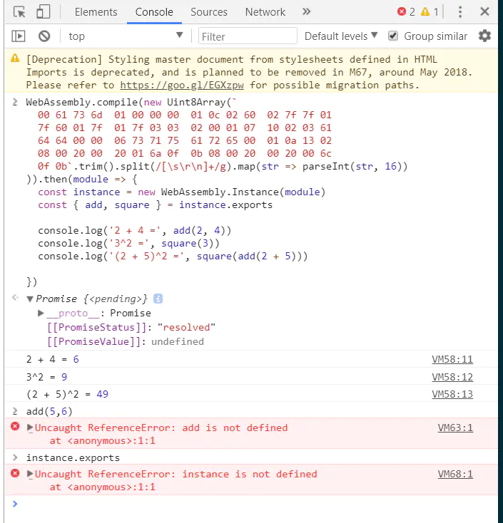

## WebAssembly是什么
<span style="color: blue">面向Web的通用二进制和文本格式</span>

[官网](http://webassembly.org/)

从名称中，可以看到他是一个Web字节码技术。现在运行在web上的动态语言代码，都是Javascript，我们可以轻轻看到网站的源代码

WebAssembly又称为wasm

## 教程
[这是一篇非常好的WebAssemable教程](https://segmentfault.com/a/1190000008402872)

本文是对这篇教程的实践笔记

## 运行wasm
首先需要一个支持wasm的浏览器，我使用的是[Chrome(Chrome Canary)](https://www.google.com/chrome/browser/canary.html)

快速体验WebAssembly
```js
WebAssembly.compile(new Uint8Array(`
  00 61 73 6d  01 00 00 00  01 0c 02 60  02 7f 7f 01
  7f 60 01 7f  01 7f 03 03  02 00 01 07  10 02 03 61
  64 64 00 00  06 73 71 75  61 72 65 00  01 0a 13 02
  08 00 20 00  20 01 6a 0f  0b 08 00 20  00 20 00 6c
  0f 0b`.trim().split(/[\s\r\n]+/g).map(str => parseInt(str, 16))
)).then(module => {
    const instance = new WebAssembly.Instance(module);
    const { add, square } = instance.exports;

    console.log('2 + 4 = ', add(2,4));
    console.log('3^2 = ', square(3));
    console.log('(2 + 5)^2', square(add(2 + 5)));
})
```
运行结果如下，这一串二进制代码，就是编译好的WebAssembly二进制源码了



这段二进制代码，导出了两个函数，add和square我们在js代码中调用这两个函数。

从这段代码中，有如下几个推论
1. 可以加密web代码了。web代码不在像以前js代码那样，以源码形式直接暴露出来了
2. WebAssembly代码可以作为js的类库引用
3. WebAssembly是二进制代码，执行效率肯定比js源代码高
4. WebAssembly不是Wie了取代js，而是俄日了增强js运行效率，是js的一个强有力的补充

## 如何编写WebAssembly
编写语言，支持C/C++

以C语言为例
```js
// math.c
int add(int x, int y) {
    return x + y;
}
int square(int x) {
    return x * x;
}
```
然后执行emcc math.c -Os -s WASM=1 -s SIDE_MODULE=1 -o math.wasm 就可以生成wasm文件了。也就是我们上面看到的一串二进制代码

这里，我们有几个推论
1. WebAssembly目前只能用Javascript调用
2. 不能使用Javascript编写(这意味着写WebAssembly需要至少懂2门语言)

还有几个疑惑
1. 需要两门语言，门槛略高
2. 编译的工具链还非常底层，步骤多而杂

## 初步结论
1. WebAssembly不是一门语言，是一个编译工具
2. 经过WebAssembly编译的二进制代码，可以运行在浏览器中，并使用Javascript进行调用
3. 编写WebAssembly的语言，目前有C/C++,以后可能会有更多(目前还没有找到其他语言的范例)
4. WebAssembly有一定程序的web代码加密作用
5. WebAssembly还处在初期开发阶段，非常的不成熟，在最新的测试版浏览器中才支持，工具链使用也相当繁琐

## 资料
[20分钟上手 webAssembly](https://juejin.cn/post/6844903661982728200)

[WebAssembly：面向 Web 的通用二进制和文本格式](https://www.infoq.cn/news/2015/06/webassembly-wasm/)

[WebAssembly：解决 JavaScript 痼疾的银弹？](https://www.infoq.cn/news/2017/07/WebAssembly-solve-JavaScript/)
