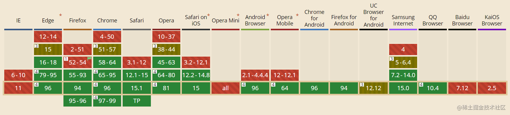
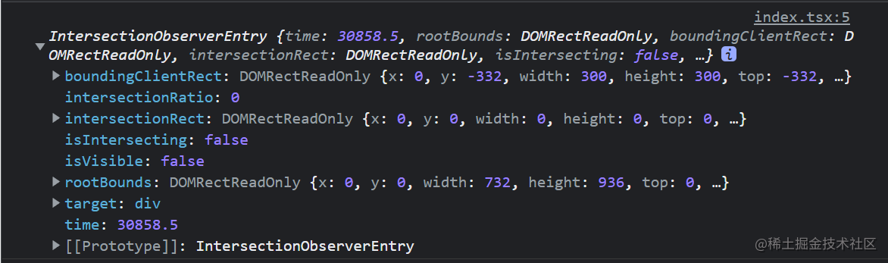

## 背景
网页开发时,不管是在移动端，还是PC端，都有个很重要的概念，叫做动态懒加载，适用于一些图片资源(或数据)特别多的场景，这时候，我们常常需要了解某个元素是否进入了『视口』(viewport)，即用户能不能看到它

<span style="color: red">传统的实现方法是，监听到scroll事件或使用setInterval来判断，调用目标元素的getBoundingClientRect()方法，得到它对应于视口左上角的坐标。这种方法的缺点是,由于scroll事件触发频率高，计算量很大，如果不做防抖节流的话，很容易造成性能问题，而setInterval由于其有间歇期，也会出现体验问题</span>

所以在几年前，Chrome率先提供了一个新的API，<span style="color: red">**就是IntersectionObserver,它可以用来自动监听元素是否进入了设备的可视区域之内，而不需要频繁的计算来做这个判断。由于可见(visible)的本质是，目标元素与视口产生了一个交叉区，所以这个这个API叫做"交叉观察期"**</span>

## 兼容性
由于这个api问世已经很多年了，所以对浏览器的支持性还是不错的，完全可以上生产环境，[点击这里](http://caniuse.com/#search=IntersectionObserver)可以看看当前浏览器对于IntersectionObserver的支持性：



## 用法
该API的调用非常简单
```js
const io = new IntersectionObserver(callback, options);
```
上面代码中,IntersectionObserver是浏览器原生提供的构造函数，接受两个参数
- <span style="color: red">callback:可见性发生变化时的回调函数</span>
- <span style="color: red">option:配置对象(可选)</span>

构造函数的返回值是一个观察器实例。实例一共有4个方法：
- <span style="color: red">observe: 开始监听特定元素</span>
- <span style="color: red">unobserve: 停止监听特定元素</span>
- <span style="color: red">disconnect: 关闭监听工作</span>
- <span style="color: red">takeRecords: 返回所有观察目标的对象数组</span>

### observe
该方法需要接收一个target参数，值是Element类型,用来指定被监听的目标元素
```js
// 获取元素
const target = document.getElementById('dom');
// 开始观察
io.observe(target);
```
### unobserve
该方法需要接收一个target参数，值为Element类型，用来指定停止监听的目标元素
```js
// 获取元素
const target = document.getElementById('dom');

// 停止观察
io.unobserve(target);
```
### disconnect
该方法不需要接收参数，用来关闭观察期
```js
// 关闭观察器
io.disconnect();
```
### takeRecords
该方法不需要接收参数，返回所有被观察的对象，返回值是一个数组
```js
// 获取被观察元素
const observerList = io.takeRecords();
```

## 注意
<span style="color: red">observe方法的参数是一个DOM节点，如果需要观察多个节点，就要多次调用这个方法</span>

```js
// 开始观察多个元素
io.observe(domA);
io.observe(domB);
io.observe(domC);
io.observe(domD)
```
## callback参数
<span style="color: red">目标元素的可见性变化时,就会调用观察器的回调函数callback</span>

<span style="color: red">**callback一般会触发两次。一次是目标元素刚刚进入视口，另一次是完全离开视口**</span>

```js
const io = new IntersectionObserver((changes, observer) => {
    console.log(changes);
    console.log(observer);
})
```
上面代码中，callback函数的参数接收两个参数changes和observer
- **changes：这是一个数组，每个成员都是一个被观察的对象**。举例来说，如果同时有两个被观察的对象的可见性发生变化，那么changes数组里面就会打印出两个元素，如果只观察一个元素，我们打印changes[0]就能获取到被观察对象
- **observer: 就是一个对象，返回我们在实例中传入的第二个参数options(如果没传，则返回默认值)**

## intersectionObserverEntry对象
上面提到的changes数组中的每一项都是一个IntersectionObserverEntry对象(下文简称io对象),对象提供目标元素的信息，一共有八个属性，我们打印这个对象
```js
// 创建实例
const io = new IntersectionObserver(changes => {
    changes.forEach(change => {
        console.log(change);
    })
})

// 获取元素
const target = document.getElementById('dom');

// 开始监听
io.observe(target);
```
运行上面代码，并且改变dom的可见性，这时控制台可以看到一个对象


每个属性的含义如下
- <span style="color: red">boundingClientRect: 目标元素的矩形区域信息</span>
- <span style="color: red">intersectionRatio: 目标元素的可见比例，即intersectionRect占boundingClientRect的比例，完全可见时为1，完全不可见是小于等于0</span>
- <span style="color: red">intersectionRect：目标元素与视口（或根元素）的交叉区域的信息</span>
- <span style="color: red">isIntersecting: 布尔值，目标元素与交集观察者的根节点是否相交</span>
- <span style="color: red">isVisible: 布尔值，目标元素是否可见（该属性还在试验阶段，不建议在生产环境中使用）</span>
- <span style="color: red">rootBounds：根元素的矩形区域的信息，getBoundingClientRect()方法的返回值，如果没有根元素（即直接相对于视口滚动），则返回null</span>
- <span style="color: red">target：被观察的目标元素，是一个 DOM 节点对象</span>
- <span style="color: red">time：可见性发生变化的时间，是一个高精度时间戳，单位为毫秒</span>

## 应用
1. 预加载(滚动加载、翻页加载、无限加载)
2. 懒加载
3. 其他

## 注意点
<span style="color: red;font-weight: bold">IntersectionObserver API 是异步的，不随着目标元素的滚动同步触发。</span>

<span style="color: red;font-weight: bold">规格写明，IntersectionObserver的实现，应该采用requestIdleCallback()，即只有线程空闲下来，才会执行观察器。这意味着，这个观察器的优先级非常低，只在其他任务执行完，浏览器有了空闲才会执行。</span>


## 资料
[Web API 接口参考](https://developer.mozilla.org/zh-CN/docs/Web/API)

[神奇的交叉观察器 - IntersectionObserver](https://juejin.cn/post/7035490578015977480#heading-3)