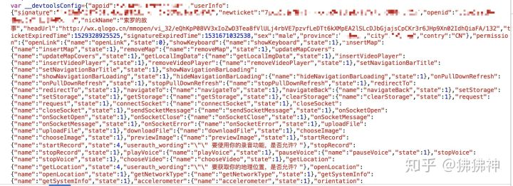

## 小程序你好
1. 从目录结构来看
    - index.js
    - index.json
    - index.wxml
    - index.wxss
    注定这是一个为前端开发者所设计的开发flow,wxml对于html,wxss对于css
2. 从调试器来看

    

    也代表了这是一个前端项目，唯一肉眼可见的不同之处是标签名不同

## 从开发的角度推测小程序架构
### ui层、逻辑层分离

小程序总体分为逻辑层和视图层，也就是说小程序框架本身就将逻辑层和视图层分开来了，而不是纯web开发，视图层和逻辑层混合，Vue和React之类的框架实际上也是做这样的事情，视图层只需要去关心UI视图，逻辑层去处理数据以及用户的操作状态等。

微信为什么要怎么干呢？引用开发指南中的话
- 快速的加载能力
- 更强大的能力
- 原生体验
- 易用且安全的微信数据开放
- 高效和简单的开发

在小程序之前，微信就提供过JS SDK去帮助开发者更高效的开发接近原生体验的引用，但是光凭SDK无法彻底解决静态资源离线、UI线程阻塞、页面切换卡顿等问题。

产生这些问题的原因是因为浏览器本身的限制，也就是UI线程和JS线程冲突，React16中的Fiber调度也在一方面是解决此类的问题。孕育而生的就是小程序的双线程模型，将逻辑层和视图层分离

我们常常在开发小程序的过程中遇到，模拟器正常但是真机不正常的情况，主要是因为下面这个表格

运行环境| 逻辑层|渲染层
---|---|---
IOS| JavaScriptCore | WKWebView
安卓|X5 JSCore | X5浏览器
小程序开发工具 | NWJS | Chrome Webview

### 组件化系统--小程序的组件化之路

现在前端开发，已经进入了组件化开发的时代，无论是三大框架还是新Web标准中的Web Components,组件化会大大提高开发效率。小程序也是在后面的更新中才提出了利用Component构造器去实现组件化，在次之前小程序是通过template模板渲染来实现组件化的

那么有了template还为什么要引入Component呢

1. 模板无法维护自身的状态。模板本身的数据需要通过页面传入data去渲染，这就让数据维护变得很复杂，无法实现真正的组件化，虽然我们在用三大框架开发的时候也会提出Container的概念，Container所做的数据注入，但是模板不仅仅是被数据注入，哪怕是最基本的状态也需要被注入，**wepy的组件化就是基于template的，所以wepy无法解决循环组件公用状态的问题，也就是一旦一个子组件的状态发生改变，另一个相同的子组件的状态也会发生改变**
2. 模板没有自身的生命周期，熟悉三大框架的同学自然知道组件声明周期的重要性，我们可以完全控制组件在什么阶段应该做什么事，这对于异步数据处理是必要的，举个例子：基于template的wepy，当组件层数较深，渲染需要依赖异步数据的时候，我们无法知道什么时候存在有效数据的，甚至会因为异步数据是undefined而出现阿伯错，template的渲染是在渲染层，和主页面渲染同步进行的

小程序开发团队可能注意到了这一点，于是引入了Component构造器，从小程序层面支持了真正的组件化开发，无论是properties还是onReady又或者是behaviors，都解决了上述的痛点

### 小程序组件化的实现
Web开发中，类似Vue之类的框架是通过VDOM或者DocumentFragment之类的去作为Component构造函数的render模板。然后每一个Component类去维护自己的状态、数据等。

这都不是我们这里的重点，因为相比于这些render模式，小程序本身并不能去通过Javascript直接去控制渲染层的，而且小程序在渲染层的模式是：wxml+wxss.

那么小程序是怎么实现组件化呢？

我们在开发者工具里看一下，当我渲染一个组件的时候，会如何渲染呢？

我创建了一个List-Item组件，并在index页面引入，我们在开发工具看下小程序是怎么渲染的

显然易见，#shadow-root 首先进入我的视线范围，这是什么东东？？查一下资料，了解一个重要的概念--Shadow DOM,现在它已经进入了新版新版Shadow DOM v1 规范，从属于Web Components，顺手大胆的预测一下，Web开发的组件化最终可能是由Web Component来实现的。因为Web Component已经支持局部作用域、slot插槽等等现有框架所提供的组件化方法，学习Web Component也是我接下来自己学习的目标之一，应该也会写博客来记录一下。

微信开发指南中对组件化系统的实现怎么说呢？
:::tip
Exparser的组件模型与WebComponents标准中的ShadowDOM高度相似。Exparser会维护整个页面的节点树相关信息，包括节点的属性、事件绑定等，相当于简化版的ShadowDOM实现
:::
也就是说其实小程序的组件就是模仿ShadowDOM，从而实现组件化。

## 从Source来看小程序架构
在web开发中，我们通过可以从Source panel中看到当前正在执行的脚本文件，小程序开发者工具同样可以，指南中这样说的
:::tip
Source panel用于显示当前页面的脚本文件，同浏览器开发不同，微信小程序框架会对脚本文件进行编译工作，所以在Sources panel中开发者看到的文件是经过处理之后的脚本文件，开发者的代码都会被包裹在difine函数中，并且对于Paage代码，在尾部会有require的主动调用
:::

当开启ES6转ES5的开关之后，每个js文件会生成一个同名的[name].js[sm],这个文件是转换前的初始文件，而[name].js就被替换成了ES5版本的代码。

进一步的，我们看到这个应用运行在本地51516端口，这个端口其实是每次重启开发者工具，随机分配的一个闲置端口。我们在浏览器中打开127.0.0.1:51516，可以看到：

简单分析一下这个html文件
打开第一个script标签，显而易见，小程序的前端代码也是通过webpack打包的

在这个script中，定义了的全局变量包括路由、当前文件、Component的构造函数、插件等等。我们顺手在控制台打印一下次数的window对象

可以发现，此时window对象上已经被挂载了很多额外的属性，这也使得我们去直接调用wx、page、Conponent等方法成为可能，与此同时，我们点开WeixinJSBridge来看

这个JSBridge主要承担的责任就是去连接JS Core和Native层，是一个典型的事件注册、监听、发布、订阅的行为

从这段代码可以看出几点
1. 小程序的渲染层确实是基于html的，也就是说wxml最终转化成就是html，这个非常类似于VDom的另一种表达形式，只是进一步
2. 这个__wxConfig是将所有页面对应的json文件以及默认配置取了并集，然后生成一个配置对象

这个__devtoolsConfig显而易见的是用户信息以及wx这个对象上所挂载的去调用Native层服务的方法，以及需要授权时的提示信息等，比较让人以外的是，我在清除所有授权之后，这里仍然能看到我的openid以及个人敏感信息，但是在实际开发中这些敏感信息其实多数都是通过前端获取code，然后从后端解密获取的，所以这一块存在安全问题，还需要进一步研究

这段代码可以看出，一开始定义的__wxRouteBegain这个变量就是去检测页面加载是否成功的。

## 资料
[浅看小程序](https://zhuanlan.zhihu.com/p/38217428)

[微信小程序template模板与component组件的区别是什么](https://www.yisu.com/zixun/164923.html)