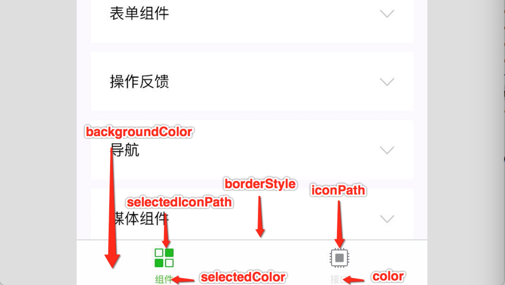

## 小程序介绍
小程序提供了一个简单、高效的应用开发框架和丰富的组件以及API，帮助开发者在微信中开发具有原生APP体检的服务；小程序是一种全新的连接用户与服务的方式，它可以在微信内被便捷的获取和传播，同事具有出色的使用体验

## 官方文档
[官方文档](https://developers.weixin.qq.com/doc/)

想要更具体了解关于框架、组件、API的详细内容，请参考对应的参考文档
- [小程序框架参考文档](https://developers.weixin.qq.com/miniprogram/dev/reference/)
- [小程序组件参考文档](https://developers.weixin.qq.com/miniprogram/dev/component/)
- [小程序API参考文档](https://developers.weixin.qq.com/miniprogram/dev/api/)
- [小程序服务端API参考文档](https://developers.weixin.qq.com/miniprogram/dev/api-backend/)

## 快速了解
- 微信小程序是腾讯公司旗下
- 微信小程序只能在微信里打开
- 微信小程序代码构成:WXML(html)，WXSS(css),JS,JSON
- 微信小程序文件构成
    - .json后缀JSON配置文件
    - .wxml后缀WXML模板文件
    - .wxss后缀WXSS样式文件
    - .js后缀，小程序脚本逻辑文件
    - .wxs后缀，小程序脚本逻辑文件
- 微信小程序上线后，请求项目接口必须是 https 协议
- 微信小程序支持：微信支付、客服系统、插件

## 整体架构介绍
<span style="color: blue">整个小程序框架系统分为两个部分：逻辑层(app Service)和视图层(View)。**小程序提供了自己的视图层描述语言WXML和WXSS以及基于Javascript的逻辑层框架，并在视图层与逻辑层提供了数据传输和事件系统，让开发者能够专注于数据与逻辑** </span>

1. 视图层View
    - 视图层由WXML与WXSS编写，由组件来进行展示
        - WXML(Weixin Markup Language)用于描述页面结构
        - WXSS(Weixin Style Sheet)用于描述页面样式
    - 组件(Component)是视图的基本组成单元
2. 逻辑层App Service
    - 小程序开发框架的逻辑层使用Javascript引擎
    - 逻辑层将数据进行处理后发送给视图层，同时接受视图层的事件反馈
    - 框架提供丰富的微信原生API，可以方便的调起微信提供的能力，如获取用户信息，扫一扫，支付功能等
    - 提供模块化能力，每个页面有独立的作用域
3. 文件结构介绍
小程序包含一个描述整体程序的app和多个描述各自页面的page。

一个小程序主体部分由三个文件组成，必须放在项目的根目录，如下：
文件|必须|作用
---|---|---
app.js|是|小程序逻辑
app.json|是|小成功公共配置
app.wxss|否|小程序公共样式表

一个小程序页面由四个文件组成，分别是
文件类型|必须|作用
---|---|---
js|是|页面逻辑
wxml|是|页面结构
json|否|页面配置
wxss|否|页面样式表

<span style="color: red">注意:为了方便开发者减少配置项，描述页面的四个文件必须具有相同的路径与文件名</span>

配置文件|描述
project.config.json | 此文件是配置微信开发者工具的，我们使用工具，无需去手动修改此文件
sitemap.json | 微信索引文件，微信现已开放小程序内搜索，开发者可以通过sitemap.json配置，或管理后台页面收录开关来配置其小程序页面是否允许微信索引

- 一个小程序可以有很多页面，每个页面承载不同的功能，页面之间可以互相跳转
- 一个页面由配置代码JSON文件、模板代码wxml文件，样式代码wxss文件以及逻辑代码Javascript文件组成
```js
wxchant  微信小程序根目录
├─pages               页面根目录
│  ├─index            index目录
│  │  ├─index.json    json配置文件
│  │  ├─index.wxml    wxml模版文件
│  │  ├─index.wxss    wxss样式文件
│  │  └─index.js      js逻辑事件文件
│  │
│  ├─logs             logs目录
│  │  ├─logs.json     json配置文件
│  │  ├─logs.wxml     wxml模版文件
│  │  ├─logs.wxss     wxss样式文件
│  └──└─logs.js       js逻辑事件文件
│
├─utils               公共模块目录
│  └─util.js          公共模块文件
│
├─app.json            公共json配置文件
├─app.wxss            公共wxss样式文件
├─app.js              小程序启动文件
├─project.config.json 开发者工具配置文件
└─sitemap.json        微信索引配置文件
```
## 小程序配置
### 1.全局配置
小程序根目录下的app.json文件用来对微信小程序进行全局配置
编号|属性|类型|必填|描述
---|---|---|---|---
1 | entryPagePath | string | 否 | 小程序默认启动首页
2 | pages | string[] | 是 | 页面路径列表
3 | window | Object | 否 | 全局的默认窗口
4 | tabBar | Object | 否 | 底部tab栏
5 | debug | boolean | 否 | 是否开启debug模式，默认关闭
6 | style | string | 否 | v2启用新版的组件样式
7 | sitemapLocation | string | 是 | 指明sitemap.json索引文件的位置

#### entryPagePath

指定小程序的默认启动路径(首页)，常见情景是从微信聊天列表页下拉启动、小程序列表启动等。如果不填，默认为pages列表的第一项。不支持带页面路径参数
```js
{
    'entryPagePath': 'page/index/index'
}
```
#### pages

<span style="color: blud">用于指定小程序由哪些页面组成，每一项都对应一个页面的路径(含文件名)信息。文件名不需要写文件后缀，框架会自动去寻找对应位置的.json,.js,.wxml,.wxss四个文件进行处理</span>

未指定entryPagePath时，数组的第一项代表小程序的初始页面(首页)。

<span style="color: blue">**小城中新增/减少页面，都需要对pages数组进行修改**</span>

如开发目录为：
```js
├── app.js
├── app.json
├── app.wxss
├── pages
│   │── index
│   │   ├── index.wxml
│   │   ├── index.js
│   │   ├── index.json
│   │   └── index.wxss
│   │── login
│   │   ├── login.wxml
│   │   ├── login.js
│   │   ├── login.json
│   │   └── login.wxss
│   └── logs
│       ├── logs.wxml
│       └── logs.js
└── utils
```
则需要在app.json中写
```js
{
    'pages': [
        'pages/index/index',
        'pages/login/login',
        'paegs/logs/logs'
    ]
}
```
#### window配置项

    用于设置小程序的状态栏、导航条、标题、窗口背景色
    编号|属性|类型|默认值|描述
    ---|---|---|---|---
    1 | navigationBarBackgroundColor | HexColor | #000 | 导航栏背景颜色，如#000
    2 | navigationBarTextStyle | string | white | 导航栏标题颜色 仅支持black/white
    3 | navigationBarTitleText | string |  - | 导航栏标题文字内容
    4 | backgroundColor | HexColor | #ffffff | 窗口背景色
    5 | backgroundTextStyle | string | dark | dark | 下拉loading的样式，仅支持dark/light
    ```js
    {
        "window": {
            "navigationBarBackgroundColor": "#ffffff",
            "navigationBarTextStyle": "black",
            "navigationBarTitleText": "微信小程序配置测试",
            "backgroundColor": "#eeeeee",
            "backgroundTextStyle": "light"
        }
    }
    ```
    
#### tabBar 配置项

如果小程序是一个多tab应用(客户端窗口的底部或顶部有tab栏可以切换页面)，可以通过tabBar配置项指定tab栏的表现，以及tab切换时显的对应页面

编号|属性|类型|必填|默认值|描述
---|---|---|---|---|---
1| color | HexColor| 是| - | tab 上的文字默认颜色，仅支持十六进制颜色
2|selectedColor |HexColor|是|- | tab上文字选中时的颜色,仅支持十六进制颜色
3|backgroundColor |HexColor|是|- | tab的背景色，仅支持十六进制颜色
4|borderStyle |string|否|black | tabbar上边框的颜色， 仅支持black/white
5|list |Array|是|- | tab的列表，详见list属性说明，最少2个，最多5个
6|position |string|否|bottom | tabBar的位置，仅支持bottom/top

其中list接受一个数组，只能配置最少两个、最多5个tab。tab按数组的顺序排序，每个项都是一个对象，其属性如下

- list 配置项

编号|属性|类型|必填|描述
---|---|---|---|---
1|pagePath|string|是|页面路径,必须在pages中先定义
2|text|string|是|tab上按钮问题
3|iconPath|string|否|图片路径，icon 大小限制为40kb，建议尺寸为 81px * 81px，不支持网络图片。当position为top时,不显示icon
4|selectedIconPath|string|否|选中时的图片路径，icon 大小限制为40kb，建议尺寸为 81px * 81px，不支持网络图片。当position为top时,不显示icon



```js
{
    "entryPagePath": "pages/login/login",
    "page": [
        "pages/index/index",
        "pages/logs/logs",
        "pages/login/login"
    ],
    "window": {
        "navigationBarBackgroundColor":"#ffffff",
        "navigationBarTextStyle": "black",
        "navigationBarTitleText": "微信小程序配置测试",
        "backgroundColor": "#eeeeee",
        "backgroundTextStyle": "light"
    },
    "tabBar": {
        "color": "#F5F5F5",
        "selectedColor": "#F44336",
        "backgroundColor": "#90CAF9",
        "borderStyle": "black",
        "position":"bottom",
        "list": [
        {
            "pagePath": "pages/index/index",
            "text": "首页",
            "iconPath": "img/1.png",
            "selectedIconPath": "img/1.1.png"
        },
        {
            "pagePath": "pages/logs/logs",
            "text": "日志"
        },
        {
            "pagePath": "pages/login/login",
            "text": "登录",
            "iconPath": "img/2.png",
            "selectedIconPath": "img/2.2.png"
        }
        ]
    },
    "style": "v2",
    "sitemapLocation": "sitemap.json"
}
```
底部选项卡Tab栏图标和选中时图标可以通过阿里图标库进行下载:iconfont字体图标库

### 2.页面配置
每个小程序页面也可以使用.json文件来对本页面的窗口进行配置。页面中配置项在当前页面会覆盖 app.json的window中相同的配置项。文件内容为一个JSON对象，有以下属性

编号|属性|类型|默认值|描述
--|---|---|---|---
1|navigationBarBackgroundColor|HexColor|#000000|导航栏背景颜色，如"#000000"
2|navigationBarTextStyle|string|white|导航栏标题颜色，仅支持 black / white
3|navigationTitleText|string|否|导航栏标题文字内容
4|backgroundColor|HexColor|#ffffff|窗口的背景色
5|backgroundTextStyle|string|dark|下拉 loading 的样式，仅支持 dark / light

页面配置中只能设置app.json中window对应的配置项，以决定本页面的窗口表现，所以无需写window这个属性
```javascript
 {
    "navigationBarBackgroundColor": "#000",
    "navigationBarTextStyle": "white",
    "navigationBarTitleText": "用户登陆",
    "backgroundColor": "#eeeeee",
    "backgroundTextStyle": "light"
 }
```
[了解更多查看官方文档](https://developers.weixin.qq.com/miniprogram/dev/reference/configuration/page.html#%E9%85%8D%E7%BD%AE%E9%A1%B9)

### JSON数据格式
JSON是一种数据格式，并不在编程语言，在小程序中，JSON扮演的静态配置角色

JSON文件都是被包裹在一个大括号{},通过key-value的方式表达数据。JSON的key必须包裹在一个双引号中，在实践中，编写JSON的时候，忘了给Key值加双引号或者把双引号写成单引号是常见错误

JSON 的值只能是以下几种数据格式，其他任何格式都会触发报错。

1. 数字，包含浮点数和整数
2. 字符串，需要包裹在双引号中
3. Bool 值，true 或者 false
4. 数组，需要包裹在方括号中 []
5. 对象，需要包裹在大括号中 {}
6. Null

还需要注意的是 JSON 文件中无法使用注释，添加注释将会引发报错。
json 数据最后一个元素，不能有,逗号。数组和对象里的最后一个元素，也不能有,逗号。

必须使用双引号，不能使用单引号会报错。

## 视图层
视图层是由WXML与WXSS编写，由组件来进行展示

WXML(Weixin Markup Language)用于标记页面的结构

WXSS(Weixin Style Sheet)用于描述页面样式

组件(Component)是视图的基本组成单元
1. wxml书写方式跟html非常相似
2. wxml的组件有开始标签和结束标签，忘写结束标签会报错
3. wxml的标签支持属性、事件
4. wxml支持逻辑语法和条件判断

### 1.什么是组件
组件是视图层的基本组成单元

组件自带一些功能与微信风格一致的样式。

一个组件通常包括开始标签和结束标签，属性用来修饰这个组件，内容在这两个标签之内

### 2. 组件
视图容器
编号|名称|功能说明
---|---|---
1|cover-image|覆盖在原生组件之上的图片是视图
2|cover-view|覆盖在原生组件之上的文本视图
3|match-media|media query 匹配检测节点
4|movable-area|movable-view的可移动区域
5|movable-view|可移动的视图容器，在页面中可以拖拽滑动
6|page-container|页面容器
7|scroll-view|可滚动视图区域
8|share-element|共享元素
9|swiper|滑块视图容器
10|swiper-item|仅可放置在swiper组件中，宽高自动设置为100%
11|view|视图容器

基础内容
编号|名称|功能说明
---|---|---
1|icon|图标
2|progress|进度条
3|rich-text|富文本
4|text|文本

表单组件
编号|名称|功能说明
---|---|---
1|button|按钮
2|checkbox|多选项目
3|checkbox-group|多项选择器，内部由多个checkbox组成
4|editor|富文本编辑器，微信小程序专有组件
5|form|表单
6|input|输入框
7|label|标签
8|picker|从底部弹起的滚动选择器
9|picker-view|嵌入页面的滚动选择器
10|picker-view-column|滚动选择器子项
11|radio|单选项目

导航
编号|名称|功能说明
---|---|---
1|navigator|页面链接

媒体组件
编号|名称|功能说明
---|---|---
1|audio|音频
2|camera|相机
3|image|图片
4|live-player|实时音视频播放
5|live-pusher|实时音视频录制
6|video|视频

地图
编号|名称|功能说明
---|---|---
1|map|地图

画布
编号|名称|功能说明
---|---|---
1|canvas|画布

开放能力
编号|名称|功能说明
---|---|---
1|open-data|开放数据
2|open-launch-app|打开小程序
3|open-location|打开地图
4|open-settings|打开设置
5|share|分享
6|start-record|开始录音
7|stop-record|停止录音
8|make-phone-call|拨打电话
9|choose-address|选择收货地址

原生组件说明

无障碍访问

导航栏

页面属性配置节点


### 3、组件属性
icon图标
编号|属性名|类型|描述|注解
---|---|---|---|---
1|type|string|---|是
2|size|number、string|23|否
2|color|stirng|---|否

```html
<view>
    <icon type="success"/>
    <icon type="warn" size="36"/>
    <icon type="warn" size="32"/>
    <icon type="warn" size="40" color="orange"/>
</view>
```

### 4. 组件公共属性

## 实战案例
 
## 逻辑层
### 1. 什么是js
js就是JavaScript的缩写，小程序的主要开发语言是 JavaScript，开发者使用 JavaScript 来开发业务逻辑以及调用小程序的 API 来完成业务需求
### 2.App注册小程序
每个小程序都需要在app.js中调用App方法注册小程序实例,绑定生命周期回调函数、错误监听和页面不存在监听函数等。

App()接受一个Object参数，其指定小程序的生命周期回调等

App()必须在app.js中调用，必须调用且只能调用依次
```js
App({})
```
App方法的所有属性
编号|属性|类型|必填|说明
---|---|---|---|---
1|onLaunch|function|否|生命周期函数--监听小程序初始化
2|onShow|function|否|生命周期函数--监听小程序启动或切前台
3|onHide|function|否|生命周期函数--监听小程序切后台
4|onError|function|否|错误监听函数
5|onPageNotFound|function|否|页面不存在监听函数
6|globalData|Object|否|全局数据
7|onUnhandledRejection|function|否|未处理的Promise拒绝石佳姐监听函数
8|onThemeChange|function|否|监听系统主体变化
9|其他|any|否|开发者可以添加任意的函数或数据变量到Object中，用this可以访问

```js
// app.js
App({
    // 小程序初始化完成触发，全局只触发一次
    onLaunch(options) {
        // do something initial when launch
    },
    // 小程序启动，或从后台进入前台显示时触发
    onSshow(options) {
        // do something when show
    },
    // 小程序从前台进入后台时触发
    onHide () {
        // Do something when hide.
    },
        // 小程序发生脚本错误或 API 调用报错时触发
    onError (msg) {
        console.log(msg)
    },
        // 小程序要打开的页面不存在时触发
    onPageNotFound(res) {
        wx.redirectTo({
        url: 'pages/...'
        }) // 如果是 tabbar 页面，请使用 wx.switchTab
    },
    globalData: 'I am global data'
})
```
整个小程序只有一个App实例，是全部页面共享的。开发者可以通过getApp方法获取到全局唯一的App实例，获取App上的数据或调用开发者注册在App上的函数

```js
// xxx.js
// 获取到小程序全局唯一的App实例
const app = getApp();

console.log(app.globalData); // I am global data
```
App方法只能有参数和方法
```js
App({
  onLaunch: function () {
    console.log(a);
  },
  onShow() {},
  ouyangke() {
    console.log("欧阳克");
  },
  globalData: {
    php: "PHP中文网",
  },
});
```
this 调用本文件的方法和参数

```js
var a = 1;
App({
  onLaunch: function () {
    this.ouyangke();
    console.log(this.globalData.php);
    // 也可以调用默认方法，但这样做没意义
    this.onThemeChange();
    console.log(a);
  },
  onShow() {
  },
  ouyangke() {
    console.log("欧阳克");
  },
  globalData: {
    php: "PHP中文网",
  },
});
```
### 3.页面注册
Page()接受一个Object类型参数，其指定页面的初始数据、生命周期回调、事件处理函数等

编号|属性|类型|必填|说明
---|---|---|---|---
1|data|Object|否|页面初始数据
2|options|Object|否|页面的组件选项，同Component构造器中的options，需要基础库版本2.10.1
3|onLoad|function|否|生命周期回调--监听页面加载
4|onShow|function|否|生命周期回调-监听页面显示
5|onReady|function|否|生命周期回调-监听页面初次渲染完成
6|onHide|function|否|生命周期回调-监听页面隐藏
7|onUnload|function | 否|生命周期回调—监听页面卸载
8|onPullDownRefresh|function|否|监听用户下拉动作
9|onReachBottom|function|否|页面上拉触底事件的处理函数
10|onShare|function|否|用户点击右上角分享
11|onAddToFavorites|function|否|用户点击右上角收藏
12|onPageScroll|function|否|页面滚动触发事件的处理函数
13|onResize|function|否|页面尺寸改变时触发
14|onTabItemTap|function|否|当前是tab页时 点击tab时触发
15|其他|any|否|开发者可以添加任意的函数或数据到Object中，在页面的函数中用this可以访问

Page方法只能有参数和方法
```js
// pages/login/login.js
Page({
	/**
	 * data 是页面第一次渲染使用的初始数据。
	 */
	data: {
		str: 'PHP中文网',
		boole: true,
		number: 2021,
		array: {
			0: 'HTMl',
			1: 'CSS',
			2: 'JavaScript',
			3: 'PHP',
			4: 'ThinkPHP',
			5: '微信小程序'
		},
		object: [
			{
				name: '欧阳克',
				gender: '男',
				age: 40
			},
			{
				name: '灭绝师太',
				gender: '女',
				age: 18
			},
			{
				name: '西门大官人',
				gender: '男',
				age: 28
			}
		]
	},
	tapName(event) {
		this.setData({
			str: '我被修改了'
		});
		console.log(event);
	},
	/**
	 * 生命周期函数--监听页面加载
	 */
	onLoad: function (options) {},
	/**
	 * 生命周期函数--监听页面初次渲染完成
	 */
	onReady: function () {},
	/**
	 * 生命周期函数--监听页面显示
	 */
	onShow: function () {},
	/**
	 * 生命周期函数--监听页面隐藏
	 */
	onHide: function () {},
	/**
	 * 生命周期函数--监听页面卸载
	 */
	onUnload: function () {},
	/**
	 * 页面相关事件处理函数--监听用户下拉动作
	 */
	onPullDownRefresh: function () {},
	/**
	 * 页面上拉触底事件的处理函数
	 */
	onReachBottom: function () {},
	/**
	 * 用户点击右上角分享
	 */
	onShareAppMessage: function () {},
	/**
	 * 当前是 tab 页时，点击 tab 时触发
	 */
	onTabItemTap(item) {
		console.log(item.index);
		console.log(item.pagePath);
		console.log(item.text);
	},
	// Event handler.
	viewTap: function () {
		this.setData(
			{
				text: 'Set some data for updating view.'
			},
			function () {
				// this is setData callback
			}
		);
	},
	customData: {
		hi: 'MINA'
	}
});
```

## 数据交互
[WXML语法参考](https://developers.weixin.qq.com/miniprogram/dev/reference/wxml/data.html#%E5%86%85%E5%AE%B9)

### 1.数据绑定
- <span style="color: red">data是页面第一次渲染使用的初始数据</span>
- <span style="color: red">页面加载时，**data将会以JSON字符串的形式由逻辑层传至渲染层**</span>
- <span style="color: red">渲染层可以通过WXML对数据进行绑定</span>
- <span style="color: red">WXML中动态数据均来自对应的Page的data</span>
    ```js
    Page({
        data: {
            str: "PHP中文网",
            boole: true,
            number: 2021,
            array: {
                0: "HTMl",
                1: "CSS",
                2: "JavaScript",
                3: "PHP",
                4: "微信小程序",
                5: "ThinkPHP",
            },
            object: [
            {
                name: "欧阳克",
                gender: "男",
                age: 40,
            },
            {
                name: "灭绝师太",
                gender: "女",
                age: 18,
            },
            {
                name: "西门大官人",
                gender: "男",
                age: 28,
            },
            ],
        },
        onLoad: function () {},
    });
    ```
- WXML通过 { {变量名} } 语法是的WXML拥有动态渲染的能力，除此之外还可以在{{}}内进行简单的逻辑运算
    ```js
    <view>字符串：{{ str }}</view>
    <view>布尔值：{{ boole }}</view>
    <view>数字：{{ number }}</view>
    <view>运算：{{ number + 100 }}</view>
    <view>数字运算：{{ 20 + 20 }}</view>
    <view>字符串运算：{{ '欧阳克' + ' ' + '朱老师' }}</view>
    ```
### 2.js获取data数据
this调用本文件的方法和参数
```js
onLoad: function() {
    console.log(data.str); // 会报错
    console.log(this.data.str);
}
```
### 3.js修改data数据
- 单向修改
    ```js
    onLoad: function () {
        this.data.str = '这里是php中文网';
        console.log(this.data.str);
    },
    onShow: function () {
        console.log(this.data.str);
    }
    ```
- 双向修改
    ```js
    onLoad: function() {
        this.setData({
            str: '这里是php中文网'
        })
        console.log(this.data.str);
    }
    ```
    在WXML中，普通的属性的绑定是单向的，例如
    ```js
    <input value="{{value}}" />
    ```
    如果使用this.setData({ value: 'leaf'})来更新value，this.data.value和输入框中的显示的值都会被更新为leaf;但如果用户修改了输入框里的值，却不会同时改变 this.data.value 

    如果需要在用户输入的同时改变 this.data.value ，需要借助简易双向绑定机制。此时，可以在对应项目之前加入 model: 前缀：
    ```js
    <input model:value="{{value}}">
    ```
    这样，如果输入框的值被改变了， this.data.value 也会同时改变。同时， WXML 中所有绑定了 value 的位置也会被一同更新， 数据监听器 也会被正常触发。
- 事件修改


## 资料
[微信小程序介绍、配置、视图层、逻辑层、页面数据交互等知识点学习归纳](https://www.php.cn/blog/detail/27658.html)