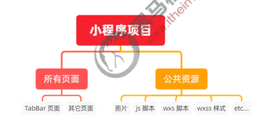
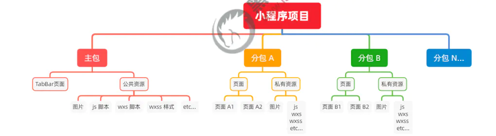
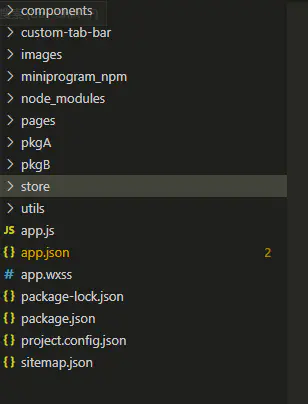
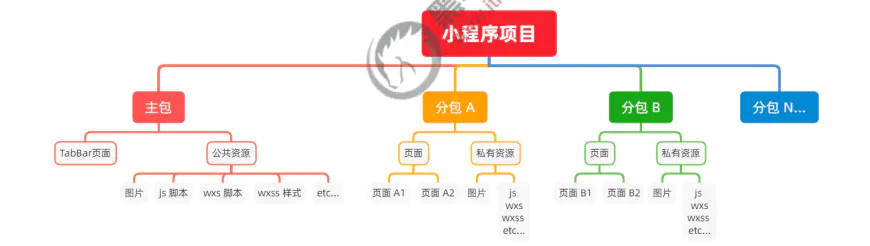
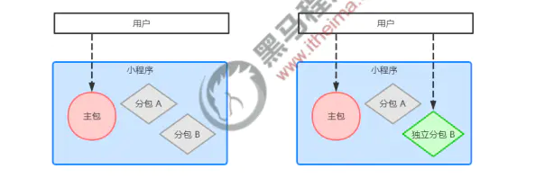
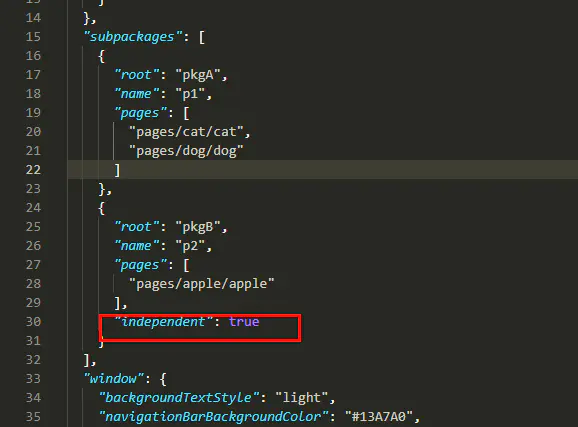
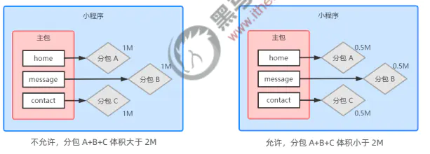

## 什么是分包
分包指的是把一个完整的小程序项目，按照需求划分为不同的子包，在构建时打包成不同的分包，用户在使用时按需进行加载。

## 分包的好处
对小程序进行分包的好处主要有一下两点:
- <span style="color: blue">可以优化小程序首次启动的下载时间</span>
- <span style="color: blue">在多团队共同开发时可以更好的解耦操作</span>

## 分包前项目的构成
分包前，小程序项目中所有的页面和资源都打包在一起，导致整个项目体积过大，影响小程序首次启动的下载时间。



## 分包后项目的构成
分包后，小程序由1个主包+多个分包组成
- <span style="color: blue">主包:一般只包含项目的启动页面或TabBar页面、以及所有分包都需要用到的一些公共资源</span>
- <span style="color: blue">分包：只包含和当前分包有关的页面和私有资源</span>



## 分包的加载规则
1. 在小程序启动时，默认会下载主包并启动主包内页面
    - tabBar页面需要放到主包内
2. 当用户进入分包内某个页面时，客户端会把对应分包下载下来，下载完成后在进行展示
    - 非tabBar页面按照功能的不同，划分为不同的分包之后，进行按需下载

## 分包的体积限制
目前，小程序的分包的大小有以下两个限制
- 整体小程序所有分包大小不超过16MB(主包+所有分包)
- 单个分包/主包大小不能超过2M

## 使用分包
1. 配置方法

    
    ```js
    "pages": [
        "pages/home/home",
        "pages/message/message",
        "pages/contact/contact"
    ],
    "preloadRule": {
        "pages/contact/contact": {
        "packages": [
            "p1"
        ],
        "network": "wifi"
        }
    },
    "subpackages": [
        {
        "root": "pkgA",
        "name": "p1",
        "pages": [
            "pages/cat/cat",
            "pages/dog/dog"
        ]
        },
        {
        "root": "pkgB",
        "name": "p2",
        "pages": [
            "pages/apple/apple"
        ],
        "independent": true
        }
    ```
2. 打包原则

    - 小程序会按subpackages的配置进行分包，subpackages以外的目录将被打包到主包中
    - 主包也可以有自己的pages(即最外层的pages字段)
    - tabBar页面必须在珠宝内
    - 分包之间不能互相嵌套
3. 引用原则
    - 主包无法引用分包内的自由资源
    - 分包之间不能互相引用私有资源
    - 分包可以应用主包内的公共资源



## 独立分包
1. 什么是独立分包

    独立分包本质上也是分包，只不过它比较特殊，可以独立于主包和其他分包而单独运行
    

2. 独立分包和普通分包区别
    
    最主要的区别：是否依赖于主包才能运行
    - 普通分包必须依赖于主包才能运行
    - 独立分包可以在不下载主包的情况下，独立运行

3. 独立分包的引用场景

    开发者可以按需，将某些具有一定功能独立性的页面配置到独立分包中。原因如下
    - 当小程序从普通分包页面启动时，需要首先下载主包
    - 而独立分包不依赖主包即可运行，可以很大程序上提升分包页面的启动速度
    > 注意:一个小程序中可以有多个独立分包

4. 独立分包的配置方法

    

5. 引用原则
    
    独立分包和普通分包以及主包之间，是项目隔绝的，不能相互引用彼此的资源!例如：
    - 主包无法引用独立分包内的私有资源
    - 独立分包之间，不能相互引用私有资源
    - 独立分包与普通分包之间，不能相互引用私有资源
    - 特别注意:独立分包中不能引用主包内的公共资源

## 分包预下载
1. 什么是分包预下载

    分包预下载指的是:在进入小程序的某个页面时，由框架自动预下载可能需要的分包，从而提升进入后续分包页面时的启动速度

2. 配置分包的预下载

    预下载分包的行为，会在进入指定的页面时触发。在app.json中，使用preloeadRule节点定义分包的预下载规则，实例代码
    ```js
    "preloeadRule": {
        "pages/contact/contact": {
            "packages": [
                "p1"
            ],
            "network": "wifi"
        }
    }
    ```
3. 分包预下载的限制

    同一个分包中的页面想有彤彤的预下载限额2M：例如
    

## 资料
[微信小程序如何使用分包做项目](http://t.zoukankan.com/ximenchuifa-p-13970864.html)