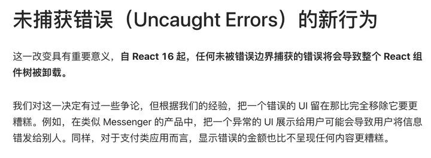

不知从什么时候开始，前端白屏问题成为一个非常普遍的话题，'白屏' 甚至成为了前端 bug 的代名词：_喂，你的页面白了。_而且，'白' 这一现象似乎对于用户体感上来说更加强，回忆起 windows 系统的崩溃 '蓝屏'：


可以说是非常相似了，甚至能明白了白屏这个词汇是如何统一出来的。那么，体感如此强烈的现象势必会给用户带来一些不好的影响，如何能尽早监听，快速消除影响就显得很重要了。

## 为什么单独监控白屏
不光光是白屏，白屏只是一种现象，我们要做的是精细化的异常监控。异常监控各个公司肯定都有自己的一套体系，集团也不例外，而且也足够成熟。但是通用的方案总归是有缺点的，如果对所有的异常都加以报警和监控，就无法区分异常的严重等级，并做出相应的响应，所以在通用的监控体系下定制精细化的异常监控是非常有必要的。这就是本文讨论白屏这一场景的原因，我把这一场景的边界圈定在了 “白屏” 这一现象。

## 方案调研
白屏大概可能的原因有两种
1. js执行过程中的错误
2. 资源错误

这两者方向不同，资源错误影响面较多，且视情况而定，故不在下面方案考虑范围内。为此，参考了网上一些实践加上自己的一些调研，大概总结出一些方案

### 一、onerror + DOM检测
原理很简单，在当前主流的SPA框架下，DOM一般挂载在一个根节点之下(比如<span style="color: orange">&lt;div id="root"&gt;&lt;/div&gt;</span>)发生白屏后通常现象是根节点下所有DOM被卸载，该方案就是通过监听全局的<span style="color: orange">onerror</span>事件，在异常发生时去检测根节点下是否挂载DOM，若无则证明白屏。我认为是非常简单暴力且有效的方案，但是也有缺点：**其一切建立在 <span style="color: orange">白屏===根节点DOM</span>被卸载成立的前提下**，实际并非如此比如一些微前端框架，当然也有后面提到的方案，这个方案和我最终方案天然冲突

### 二、[Mutation Observer Api](https://developer.mozilla.org/zh-CN/docs/Web/API/MutationObserver)
不了解的可以看下文档。其本质是监听DOM变化，并告诉你每次变化的DOM是被增加还是删除。为其考虑了多种方案
1. 搭配 <span style="color: orange">onerror</span> 使用，类似第一个方案，但是很快被我否决了，虽然其可以很好地知道DOM改变动向，但是无法和具体某个报错联系起来，两个都是事件监听，两者是没有必然联系的
2. 单独使用判断是否有大量DOM被卸载，缺点：白屏不一定是 DOM 被卸载，也有可能是压根没渲染，且正常情况也有可能大量 DOM 被卸载。完全走不通。
3. 单独使用其监听时机配合DOM检测，其缺点和方案一一样，而且我觉得不如方案一。因为它没法和具体错误联系起来，也就是没法定位。当然我和其他团队同学交流的时候他们给出了其他方向：通过追踪用户行为数据来定位问题，我觉得也是一种方法。

一开始我认为这就是最终答案，经过了漫长的心里斗争，最终还是否定掉了。不过它给了一个比较好的监听时机的选择

### 三、饿了么-Emonitor白屏监控方案
饿了么的白屏监控方案，其原理是记录页面打开4S前后html长度变化，并将数据上传到饿了么自研的时序数据库。如果一个页面是稳定的，那么页面长度变化的分布应该呈现「幂次分布」曲线的形态，p10、p20 （排在文档前 10%、20%）等数据线应该是平稳的，在一定的区间内波动，如果页面出现异常，那么曲线一定会出现掉底的情况。

### 其他
其他都大同小样，其实调研了一圈下来发现无法就两点
- 监控时机
  - onerror
  - mutation observer api
  - 轮训
- DOM 检测
  - elementsFormPoint api采样
  - 图像识别
  - 基础dom的各种数据的各种算法识别
  - ...

## 改变方向
几番尝试下来几乎没有我想要的，其主要原因是准确率 -- 这些方案都不能保证我监听到的是白屏，单从理论的推导就说不通。他们都有一个共同点：监听的是'白屏'这个现象，从现象去推导本质虽然能成功，但是不够准确。所以我真正想要监听的是造成白屏的本质。

那么回到最开始，什么是白屏？他是如何造成的？是因为错误导致的浏览器无法渲染？不，在这个 spa 框架盛行的现在实际上的白屏是框架造成的，本质是由于错误导致框架不知道怎么渲染所以干脆就不渲染。由于我们团队 React 技术栈居多，我们来看看 React 官网的一段话：



React认为把一个错误的UI保留比完全移除它更糟糕。我们不讨论这个看法的正确与否，至少我们知道了白屏的原因：<span style="color: red">渲染过程的异常且我们没有捕获异常并处理</span>

反观目前的主流框架:我们把DOM的操作托管给了框架，所以渲染的处理异常不同框架方法肯定不一样，这大概就是白屏监控难统一化产品化的原因。但大致方向是一样的。

那么关于白屏我认为可以这么定义:**<span style="color: orange">异常导致的渲染失败</span>**

那么白屏的监控方案即：**<span style="color: orange">监控渲染异常</span>**。那么对于React而言，答案就是Error Boundaries

## [Error Boundaries](https://zh-hans.reactjs.org/docs/react-component.html#the-component-lifecycle)
我们可以称之为错误边界，错误边界是什么？它其实就是一个生命周期，用来监听当前组件children渲染过程中的错误，并可以返回一个降级的UI来渲染
```javascript
class ErrorBoundary extends React.Component {
  constructor(props){
    super(props);
    this.state = { hasError: false };
  }

  static getDerivedStateFromError(error) {
    // 更新 state 使下一次渲染能够显示降级的UI
    return { hasError: true }
  }

  componentDidCatch(error, errorInfo) {
    // 我们可以将错误日志上报给服务器
    logErrorToMyService(error, errorInfo)
  }

  render() {
    if (this.state.hasError) {
      // 我们可以自定义降级后的UI并渲染
      return <h1>Something went wrong.</h1>
    }
  }
}
```
一个有责任心的开发一定不会放任错误的发生。错误边界可以包在任何位置并提供降级 UI，也就是说，一旦开发者'有责任心' 页面就不会全白，这也是我之前说的方案一与之天然冲突且其他方案不稳定的情况。 那么，在这同时我们上报异常信息，这里上报的异常一定会导致我们定义的白屏，这一推导是 100% 正确的。

100% 这个词或许不够负责，接下来我们来看看为什么我说这一推导是 100% 准确的：

### React渲染流程
我们来简单回顾下从代码到展现到页面上React做了什么？我大致分为几个阶段：render=>任务调度=>任务循环=>提交=>展示  我们绝一个简单的雷子来展示其整个过程(任务调度不在本次讨论范围故不在展示)
```javascript
const App = ({ children }) => (
  <>
    <p>hello</p>
    { children }
  </>
);
const Child = () => <p>I'm child</p>

const a = ReactDOM.render(
  <App><Child/></App>,
  document.getElementById('root')
);
```
#### 准备
首先浏览器是不认识我们的jsx语法的，所以我们通过babel编译大概能得到下面的代码
```javascript
var App = function App(_ref2) {
  var children = _ref2.children;
  return React.createElement("p", null, "hello"), children);
};

var Child = function Child() {
  return React.createElement("p", null, "I'm child");
};

ReactDOM.render(React.createElement(App, null, React.createElement(Child, null)), document.getElementById('root'));
```
babel插件将所有的jsx都转成了createElement方法，执行它会得到一个描述对象ReactElement大概长这个样子
```javascript
{
  $$typeof: Symbol(react.element),
  key: null,
  props: {}, // createElement 第二个参数 注意 children 也在这里，children 也会是一个 ReactElement 或 数组
  type: 'h1' // createElement 的第一个参数，可能是原生的节点字符串，也可能是一个组件对象（Function、Class...）
}
```
所有的节点包括原生的 &lt;a&gt;&lt;/a&gt; 、 &lt;p&gt;&lt;/p&gt; 都会创建一个 FiberNode ，他的结构大概长这样：
```javascript
FiberNode = {
    elementType: null, // 传入 createElement 的第一个参数
  key: null,
  type: HostRoot, // 节点类型（根节点、函数组件、类组件等等）
  return: null, // 父 FiberNode
  child: null, // 第一个子 FiberNode
  sibling: null, // 下一个兄弟 FiberNode
  flag: null, // 状态标记
}
```
你可以把它理解为 Virtual Dom 只不过多了许多调度的东西。最开始我们会为根节点创建一个 FiberNodeRoot 如果有且仅有一个 ReactDOM.render 那么他就是唯一的根，当前有且仅有一个 FiberNode 树。
:::tip
我只保留了一些渲染过程中重要的字段，其他还有很多用于调度、判断的字段我这边就不放出来了，有兴趣自行了解
:::
#### render
现在我们要开始渲染页面，是我们刚才的例子,执行ReactDOM.render.这里我们有个全局workInProgress对象标志当前处理的FiberNode

1. 首先我们为根节点初始化一个FiberNodeRoot，他的结构就如上面所示，并将workInProgress = FiberNodeRoot.
2. 接下来我们执行ReactDOM.render方法的第一个参数，我们得到第一个ReactElement;
```javascript
ReactElement = {
  $$typeof: Symbol(react.element),
  key: null,
  props: {
    children: {
      $$typeof: Symbol(react.element),
      key: null,
      props: {},
      ref: null,
      type: ƒ Child(),
    }
  }
  ref: null,
  type: f App()
}
```
该结构描述了&lt;App&gt;&lt;Child /&gt;&lt;/App&gt;&lt;

1. 我们为ReactElement 生成一个FiberNode 并把return指向父FiberNoder，最开始是我们的根节点，并将workInProGress = FiberNode

  ```javascript
  {
    elementType: f App(), // type 就是 App 函数
    key: null,
    type: FunctionComponent, // 函数组件类型
    return: FiberNodeRoot, // 我们的根节点
    child: null,
    sibling: null,
    flags: null
  }
  ```
  - 只要workInProgress 存在我们就要处理其指向的 FiberNode 。节点类型有很多，处理方法也不太一样，不过整体流程是相同的，我们以当前函数式组件为例子，直接执行 App(props) 方法，这里有两种情况
  - 该组件 return 一个单一节点，也就是返回一个 ReactElement 对象，重复 3 - 4 的步骤。并将当前 节点的 child 指向子节点 CurrentFiberNode.child = ChildFiberNode 并将子节点的 return 指向当前节点 ChildFiberNode.return = CurrentFiberNode
  - 该组件 return 多个节点（数组或者 Fragment ），此时我们会得到一个 ChildiFberNode 的数组。我们循环他，每一个节点执行 3 - 4 步骤。将当前节点的 child 指向第一个子节点 CurrentFiberNode.child = ChildFiberNodeList[0] ，同时每个子节点的 sibling 指向其下一个子节点（如果有） ChildFiberNode[i].sibling = ChildFiberNode[i + 1] ，每个子节点的 return 都指向当前节点 ChildFiberNode[i].return = CurrentFiberNode

2. 重复步骤直到处理全部节点，workInProgress为空
最终我们能大概得到这样一个 FiberNode 树：
```javascript
FiberNodeRoot = {
  elementType: null,
  type: HostRoot,
  return: null,
  child: FiberNode<App>,
  sibling: null,
  flags: Placement, // 待布局状态
}

FiberNode<App> {
  elementType: f App(),
  type: FunctionComponent,
  return: FiberNodeRoot,
  child: FiberNode<p>,
  sibling: null,
  flags: Placement // 待布局状态
}

FiberNode<p> {
  elementType: 'p',
  type: HostComponent,
  return: FiberNode<App>,
  sibling: FiberNode<Child>,
  child: null,
  flags: Placement // 待布局状态
}

FiberNode<Child> {
  elementType: f Child(),
  type: FunctionComponent,
  return: FiberNode<App>,
  child: null,
  flags: Placement // 待布局状态
}
```

#### 提交阶段
提交阶段简单来讲就是拿着这棵树进行深度优先遍历 child => sibling，放置 DOM 节点并调用生命周期。

那么整个正常的渲染流程简单来讲就是这样。接下来看看异常处理

#### 错误边界流程
刚刚我们了解了正常的流程现在我们制造一些错误并捕获他：
```javascript
const App = ({ children }) => (
  <>
  <p>hello</p>
  { children }
  </>
);
const Child = () => <p>I'm child {a.a}</p>

const a = ReactDOM.render(
  <App>
    <ErrorBoundary><Child/></ErrorBoundary>
  </App>,
  document.getElementById('root')
);

```
执行步骤 4 的函数体是包裹在 try...catch 内的如果捕获到了异常则会走异常的流程：
```javascript
do {
  try {
    workLoopSync(); // 上述 步骤 4
    break;
  } catch (thrownValue) {
    handleError(root, thrownValue);
  }
} while (true);
```
执行步骤 4 时我们调用 Child 方法由于我们加了个不存在的表达式 {a.a} 此时会抛出异常进入我们的 handleError 流程此时我们处理的目标是 FiberNode&lt;Child&gt; ，我们来看看 handleError :
```javascript
function handleError(root, thrownValue): void {
  let erroredWork = workInProgress; // 当前处理的 FiberNode 也就是异常的 节点
  throwException(
    root, // 我们的根 FiberNode
    erroredWork.return, // 父节点
    erroredWork,
    thrownValue, // 异常内容
  );
    completeUnitOfWork(erroredWork);
}

function throwException(
  root: FiberRoot,
  returnFiber: Fiber,
  sourceFiber: Fiber,
  value: mixed,
) {
  // The source fiber did not complete.
  sourceFiber.flags |= Incomplete;

  let workInProgress = returnFiber;
  do {
    switch (workInProgress.tag) {
      case HostRoot: {
        workInProgress.flags |= ShouldCapture;
        return;
      }
      case ClassComponent:
        // Capture and retry
        const ctor = workInProgress.type;
        const instance = workInProgress.stateNode;
        if (
          (workInProgress.flags & DidCapture) === NoFlags &&
          (typeof ctor.getDerivedStateFromError === 'function' ||
            (instance !== null &&
              typeof instance.componentDidCatch === 'function' &&
              !isAlreadyFailedLegacyErrorBoundary(instance)))
        ) {
          workInProgress.flags |= ShouldCapture;
          return;
        }
        break;
      default:
        break;
    }
    workInProgress = workInProgress.return;
  } while (workInProgress !== null);
}
```
代码过长截取一部分 先看 throwException 方法，核心两件事：

将当前也就是出问题的节点状态标志为未完成 FiberNode.flags = Incomplete
从父节点开始冒泡，向上寻找有能力处理异常（ ClassComponent ）且的确处理了异常的（声明了 getDerivedStateFromError 或 componentDidCatch 生命周期）节点，如果有，则将那个节点标志为待捕获 workInProgress.flags |= ShouldCapture ，如果没有则是根节点。
completeUnitOfWork 方法也类似，从父节点开始冒泡，找到 ShouldCapture 标记的节点，如果有就标记为已捕获 DidCapture ，如果没找到，则一路把所有的节点都标记为 Incomplete 直到根节点，并把 workInProgress 指向当前捕获的节点。

之后从当前捕获的节点（也有可能没捕获是根节点）开始重新走流程，由于其状态 react 只会渲染其降级 UI，如果有 sibling 节点则会继续走下面的流程。我们看看上述例子最终得到的 FiberNode 树：
```javascript
FiberNodeRoot = {
  elementType: null,
  type: HostRoot,
  return: null,
  child: FiberNode<App>,
  sibling: null,
  flags: Placement, // 待布局状态
}

FiberNode<App> {
  elementType: f App(),
  type: FunctionComponent,
  return: FiberNodeRoot,
  child: FiberNode<p>,
  sibling: null,
  flags: Placement // 待布局状态
}

FiberNode<p> {
  elementType: 'p',
  type: HostComponent,
  return: FiberNode<App>,
  sibling: FiberNode<ErrorBoundary>,
  child: null,
  flags: Placement // 待布局状态
}

FiberNode<ErrorBoundary> {
  elementType: f ErrorBoundary(),
  type: ClassComponent,
  return: FiberNode<App>,
  child: null,
  flags: DidCapture // 已捕获状态
}

FiberNode<h1> {
  elementType: f ErrorBoundary(),
  type: ClassComponent,
  return: FiberNode<ErrorBoundary>,
  child: null,
  flags: Placement // 待布局状态
}
```
如果没有配置错误边界那么根节点下就没有任何节点，自然无法渲染出任何内容。

ok，相信到这里大家应该清楚错误边界的处理流程了，也应该能理解为什么我之前说由 ErrorBoundry 推导白屏是 100% 正确的。当然这个 100% 指的是由 ErrorBoundry 捕捉的异常基本上会导致白屏，并不是指它能捕获全部的白屏异常。以下场景也是他无法捕获的：
- 事件处理
- 异步代码
- SSR
- 自身跑出来的错误

React SSR 设计使用流式传输，这意味着服务端在发送已经处理好的元素的同时，剩下的仍然在生成 HTML，也就是其父元素无法捕获子组件的错误并隐藏错误的组件。这种情况似乎只能将所有的 render 函数包裹 try...catch ，当然我们可以借助 babel 或 TypeScript 来帮我们简单实现这一过程，其最终得到的效果是和 ErrorBoundry 类似的。 ​

而事件和异步则很巧，虽说 ErrorBoundry 无法捕获他们之中的异常，不过其产生的异常也恰好不会造成白屏（如果是错误的设置状态，间接导致了白屏，刚好还是会被捕获到）。这就在白屏监控的职责边界之外了，需要别的精细化监控能力来处理它。

## 总结
那么最后总结下本文的几个结论:我对白屏的定义:**<span style="color: orange">异常导致的渲染失败</span>**。对应方案是：**<span style="color: orange">资源监听 + 渲染流程监听</span>**

在目前SPA框架下白屏的监控需要针对场景做精细化的处理，这里已React为例，通过监听渲染过程异常能够很好的获得白屏的信息，同事能增强开发者对异常处理的重视。而其他框架也会有响应的方法来处理这一现象

当然这个方案也有弱点，由于是从本质推到现象其实无法cover所有白屏的场景，比如我要搭配资源的监听来处理资源异常导致的额白屏。当然没有一个方案是完美的，我这里也是提供一个思路，欢迎大家讨论

## 资料
[前端白屏监控](https://zhuanlan.zhihu.com/p/383686310)

[React首次渲染过程 ](https://www.cnblogs.com/SPHmomo/p/12930360.html)

[前端异常捕获方法汇总](https://www.cnblogs.com/liuhao-web/p/13184486.html)