## 前言
项目上线后，用户如果出现错误(代码报错、资源加载失败以及其他情况),基本上没有办法复现，如果用户出了问题但是不反馈或直接不用了，对开发者或公司都是损失

由于我这个项目比较小，只是一个迷你商城，所以不需要收集很复杂的数据，只需要知道有没有资源加载失败、哪行代码报错就可以了，市面上有很多现成的监控平台比如sentry，在这里我选择通过nodejs自己搭一个服务。

## 概述
我的项目是使用Vue2写的，所以本文主要是讲Vue相关的部署过程

1. 部署后台服务（使用express）

2. 收集前端错误（主要是Vue）

3. 提交信息到后台分析源码位置及记录日志

## 异常处理
```js
function test1 () {
    console.log('test1 Start');
    console.log(a);
    console.log('test1 End');
}

function test2 () {
    console.log('test2 Start');
    console.log('test2 End');
}

test1();
test2();
```
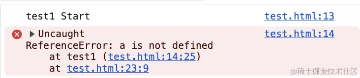

这里可以看到，当JS运行报错后，代码就不往下执行了，这是因为JS是单线程，具体可以看看事件循环，这里不做解释

接下来看看使用异步的方式执行，可以看到没有影响到代码的继续执行
```js
function test1 () {
    console.log('test1 Start');
    console.log(a);
    console.log('test1 End')
}

function test2 () {
    console.log('test2 Start');
    console.log('test2 End')
}

setTimeout(() => {
    test1();
}, 0)

setTimeout(() => {
    test2();
}, 0)
```
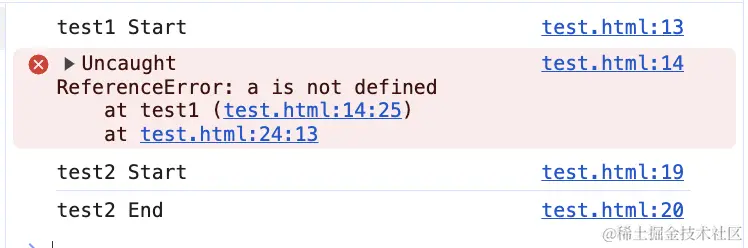

那报错之后我们如何收集错误呢？

### try catch
```js
function test1() {
    console.log('test1 start');
    console.log(a);
    console.log('test1 ent')
}
```
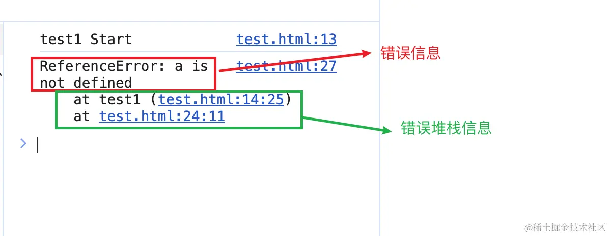

使用try catch 将代码包裹起来之后，当运行报错时，会将收集到的错误传到catch的形参中，打印之后我们可以拿到错误信息和错误的堆栈信息，但是try catch 无法捕获到异步的错误

```js
function test1 () {
    console.log('test1 Start');
    console.log(a);
    console.log('test1 End')
}

try {
  setTimeout(function() {
    test1();
  }, 100);
} catch (e) {
  console.log(e);
}
```
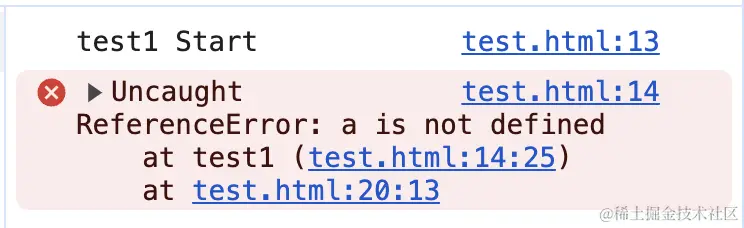

可以看到try catch是无法捕获到异步错误的，这时候要用到window的error时间

### 监听error事件
```js
window.addEventListener('error', args => {
    console.log(args);
    return true;
}, true);

function test1() {
    console.log('test1 Start');
    console.log(a);
    console.log('test1 End');
}

setTimeout(function() {
    test1()
}, 100)
```
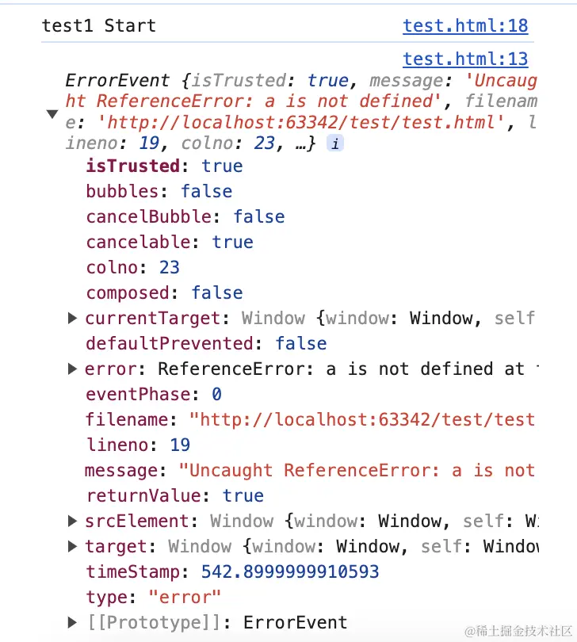

除了 window.addEventListener 可以监听 error之后，window.onerror 也可以监听errorr；
**但是window.onerror 和 window.addEventListener相比，无法监听网络异常**

### window.addEventListener
```html

<script>
    window.addEventListener('error', args => {
        console.log(args);
        return true;
    }, true); //捕获
</script>
```
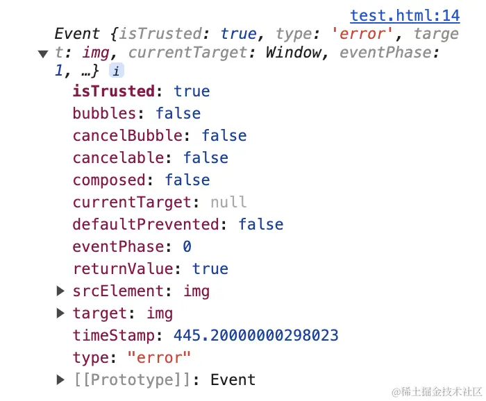

### unhandledrejection
到目前为止，Promise已经成为了开发者的标配，加上新特性引入了async await,解决了回调地狱的问题，但window.onerror和window.addEventListener，对Promise报错都是无法捕获

```js
window.addEventListener('error', error => {
    console.log('window', error);
})

new Promise((resolve, reject) => {
    console.log(a);
}).catch(error => {
    console.log('catch', error)
})
```
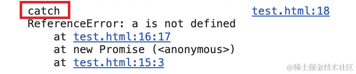

可以看到，监听window上的error事件是没有用的，可以每一个Promise写一个catch，如果觉得麻烦，要么就要使用一个新的事件，unhandledrejection

```js
window.addEventListener('unhandledrejection', error => {
    console.log('window', error);
})
new Promise((resolve, reject) => {
    console.log(a);
})
```
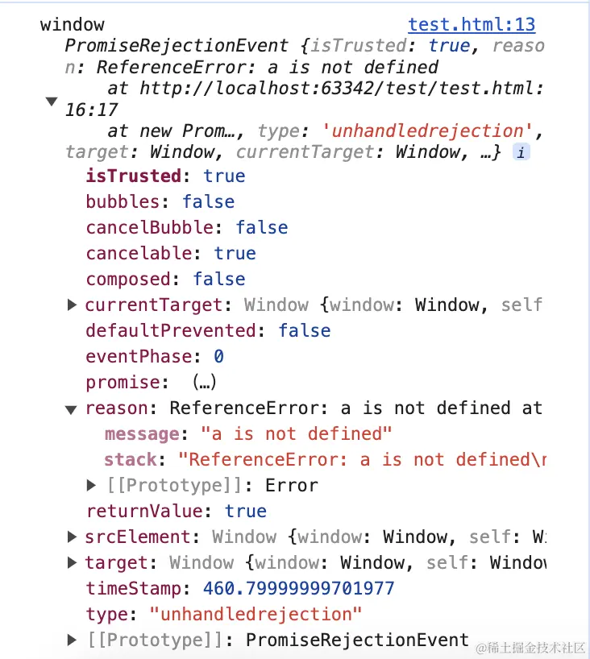

其中，reason 中存放着错误相关信息，reason.message 是错误信息，reason.stack是错误堆栈信息。

Promise错误也可以使用try catch捕获到，这里就不做演示了。

至此，js中同步、异步、资源加载、Promise、async/await都有对应的捕获方式

```js
window.addEventListener('unhandledrejection',error => {
    console.log('window', error);
    throw error.reason;
})

window.addEventListener('error', error => {
    console.log(error);
    return true;
}, true);
```
## Vue异常处理
由于我的项目使用Vue2搭建的，所以还需要处理一下vue的报错
```js
export default {
    name: 'App',
    mounted() {
        console.log(aaa);
    }
}
```
现在的项目基本都是工程化的，通过工程化工具打包出来的代码长这样，上面的代码打包后运行

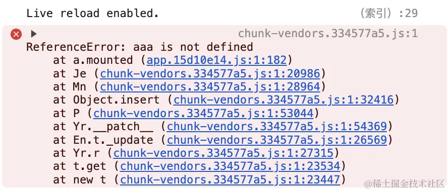

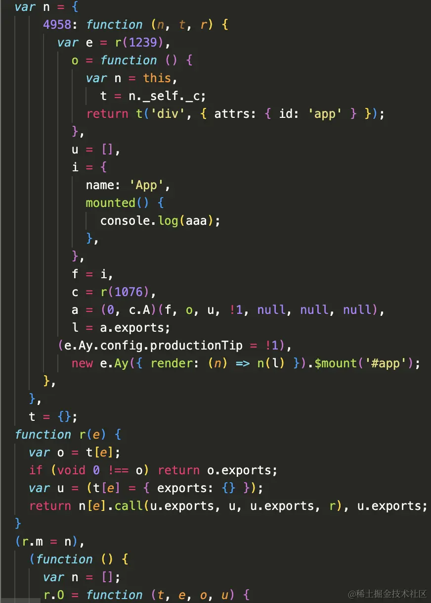

通过报错提示的js文件，查看后都是压缩混淆之后的js代码,这时候就需要打包时生成的source map文件了,这个文件中保存着打包后代码和源码对应的位置，我们只需要拿到报错的堆栈信息,通过转换，就能通过source map找到对应我们源码的文件及出错的代码行列信息

那我们怎么才能监听error事件呢？

使用Vue的全局错误处理函数 Vue.config.errorHandler

在 src/main.js 中写入以下代码

```js
Vue.config.errorHandler = (err, vm, info) => {
    console.log('Error: ', err);
    console.log('vm', vm);
    console.log('info: ', info);
}
```
现在打包vue项目

打包vue之后然后通过端口访问 index.html，不建议你双击打开，如果你没改过打包相关的东西，双击打开是不行的，可以通过vs code 装插件 live server,然后将打包文件夹通过vs code打开

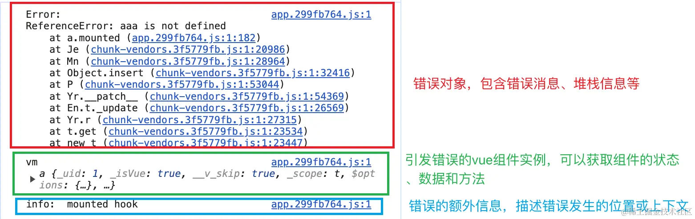

## 上报错误数据
经过上述的异常处理后，我们需要将收集的错误进行整理，将需要的信息发送到后台，我这里选择使用ajax发请求到后端，当然你也可以使用创建一个图片标签，将需要发送的数据拼接到src上

这里我选择使用 tracekit 库来解析错误的堆栈信息，axios发请求，dayjs格式化时间

```js
npm i tracekit
npm i axios
npm i dayjs
```
安装完成后在 src/main.js 中引入 tracekit、axios、dayjs

## 上报Vue错误
```js
import TraceKit from 'tracekit';
import axios from 'axios';
import dayjs from 'dayjs';

const protcol = window.location.protocol;
let errorMonitorUrl = `${protcol}//127.0.0.1:9999`;
const errorMonitorVueInterFace = 'reportVueError'; // vue错误上报接口

TraceKit.report.subscribe(error => {
    const { message, stack} = error || {};

    const obj = {
        message,
        stack: {
            column:stack[0].column,
            line: stack[0].line,
            func: stack[0].func,
            url: stack[0].url
        }
    }

    axios({
        method: 'POST',
        url: `${errorMonitorUrl}/${errorMonitorVueInterFace}`,
        data: {
            error: obj,
            data: {
                isMobile: /iPhone|iPad|iPod|Android/i.test(navigator.userAgent), // 是否移动端
                isWechat: /MicroMessenger/i.test(navigator.userAgent), // 是否微信浏览器
                isIOS: /iPad|iPhone|iPod/.test(navigator.userAgent) && !window.MSStream, // 两个都是false就是未知设备
                isAndroid: /Android/.test(navigator.userAgent) && !/Windows Phone/.test(navigator.userAgent)
            },
            browserInfo: {
                userAgent: navigator.userAgent,
                protcol: protcol
            }
        }
    }).then(() => {
        console.log('错误上报成功');
    }).catch(() => {
        console.log('错误上报失败')
    })
})

Vue.config.errorHandler = (err, vm, info) => {
    TraceKit.report(err);
}
```
如果你还需要其他的数据就自己加

打包vue之后然后通过端口访问 index.html，不建议你双击打开，如果你没改过打包相关的东西，双击打开是不行的，可以通过vs code 装插件 live server，然后将打包文件夹通过vs code 打开

现在去项目中看看发出去的请求参数是什么

可以看到我们需要的数据都已经收集到了，上报失败是肯定的，因为我们还没有写好接口

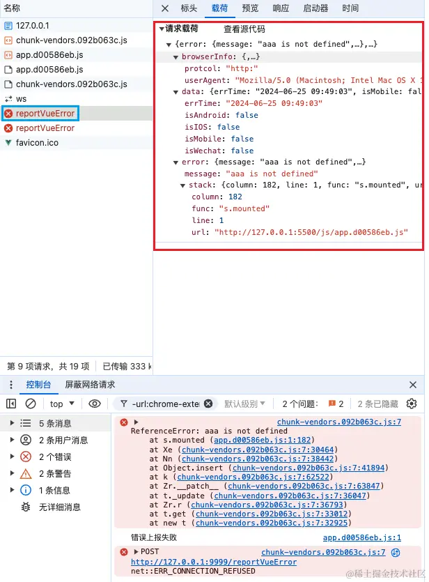

## 上报window错误
接下来在监听 window 的 error 事件，也想后台发送一个错误上报请求
```js
const errorMonitorWindowInterFace = 'reportWindowError'; // window错误上报接口
window.addEventListener('error', args => {
  const err = args.target.src || args.target.href;
  const obj = {
    message: '加载异常' + err
  };
  if (!err) {
    return true;
  }
  axios({
    method: 'POST',
    url: `${errorMonitorUrl}/${errorMonitorWindowInterFace}`,
    data: {
      error: obj,
      data: {
        errTime: dayjs().format('YYYY-MM-DD HH:mm:ss'),
        isMobile: /iPhone|iPad|iPod|Android/i.test(navigator.userAgent), // 是否移动端
        isWechat: /MicroMessenger/i.test(navigator.userAgent), // 是否微信浏览器
        isIOS: /iPad|iPhone|iPod/.test(navigator.userAgent) && !window.MSStream, // 两个都是false就是未知设备
        isAndroid: /Android/.test(navigator.userAgent) && !/Windows Phone/.test(navigator.userAgent)
      },
      browserInfo: {
        userAgent: navigator.userAgent,
        protcol: protcol
      }
    }
  }).then(() => {
    console.log('错误上报成功');
  }).catch(() => {
    console.log('错误上报失败');
  });
  return true;
}, true);
```
## 搭建监控后台
创建一个文件夹，名字随便，然后在终端中打开文件夹，初始化npm
```shell
npm init -y
```
初始化完成后创建一个server.js，这里我使用express进行搭建后端，source-map用于解析js.map文件，这些库后面会用到

```js
npm i express
npm i nodemon
npm i source-map
```
下载好包之后再server.js中输入以下代码，然后在终端输入nodemon server.js
```js
const express = require('express');
const path = require('path');
const fs = require('fs');

const PORT = 9999;

const app = express();
app.use(express.urlencoded({ extended: true }));
app.use(express.json());

app.get('/', (req, res) => {
    res.send('Hello World!').status(200);
})

app.listen(PORT, () => {
    console.log(`服务启动成功，端口号为${PORT}`);
})
```
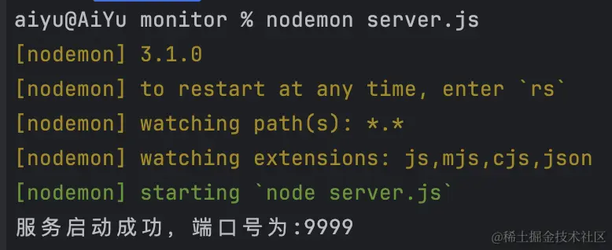

服务启动之后，访问本地的9999端口，查看是否生效，当看到屏幕上显示Hello World!表示我们的后端服务成功跑起来了，接下来就是写错误的上传接口

在这里我将为Vue和Window监控分别写一个接口（因为我懒得一个接口做判断区分，如果你觉得两个接口太麻烦，那你也可以自己优化成一个接口）

### 编写Vue错误上报接口
在server.js中继续添加
```js
const SourceMap = require('source-map');

app.post('/reportVueError', async (req, res) => {
    const urlParams = req.body;
    console.log('收到Vue错误报告');
    console.log('urlParams', urlParams);

    const stack = urlParams.error.stack;
    // 获取文件名
    const fileName = path.basename(stack.url);
    // 查找map文件
    const filePath = path.join(__dirname, 'uploads', fileName + '.map');
    const readFile = function((resolve, reject) => {
        fs.readFile(filePath, { encoding: 'utf-8' }, (err, data) => {
            if(err) {
                console.log('readFileErr', err);
                return reject(err);
            }
            resolve(JSON.parse(data));
        })
    })

    async function searchSource({ filePath, line, column }) {
        const rawSourceMap = await readFile(filePath);
        const consumer = await new SourceMap.SourceMapConsumer(rawSourceMap);
        const res = consumer.originalPositionFor({ line, column });

        consumer.destroy();
        return res;
    }

    let sourceMapParseResult = '';
    try {
        // 解析sourceMap结果
        sourceMapParseResult = await searchSource({ filePath, line: stack.line, column: stack.column });
    } catch (err) {
        sourceMapParseResult = err;
    }
    console.log('解析结果', sourceMapParseResult)
    res.send({
        data: '错误上报成功',
        status: 200,
    }).status(200);
})
```
然后 nodemon 会自动重启服务，如果你不是用 nodemon 启动的，那就自己手动重启一下

打包vue之后然后通过端口访问index.html，不建议你双击打开，如果你没改过打包相关的东西，双击打开是不行的，可以通过vs code装插件live server，然后将打包文件夹通过vs code打开，通过live server运行，此时应该会报跨域问题

### 设置允许跨域
可以自己手动设置响应头实现跨域，我这里选择使用cors库
```shell
npm i cors
```
```js
const cors = require('cors');
app.use(cors()); // 这条需要放在const app = express() 后
```
此时重新运行后台，在观察

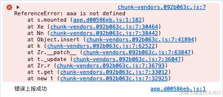

此时发现，解析map文件报错了，那是因为我们还没上传map文件

在server.js统计目录下创建一个uploads文件夹

回到打包vue打包文件目录dist，将js文件夹中所有js.map结尾的文件剪切到创建的文件夹中，如果你打包文件中没有js.map，那是因为你没有打开生成js.map的开关,**打开 vue.config.js，在defineConfig中设置属性 productionSourceMap 为true，然后宠你想你打包就可以了**
```js
module.exports = defineConfig({
  productionSourceMap: true, // 设置为true，然后重新打包
  transpileDependencies: true,
  lintOnSave: false,
  configureWebpack: {
    devServer: {
      client: false
    }
  }
})
```
:::tips
为什么剪切？如果真正的项目上线时，你把js.map文件上传了，别人拿到之后可以知道你的源码的，所以必须要剪切，或者复制之后回到dist目录删除所有js.msp
:::

这时候我们在刷新网页，然后看后台的输出，显示src/App.vue的第10行有错

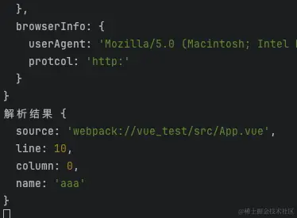

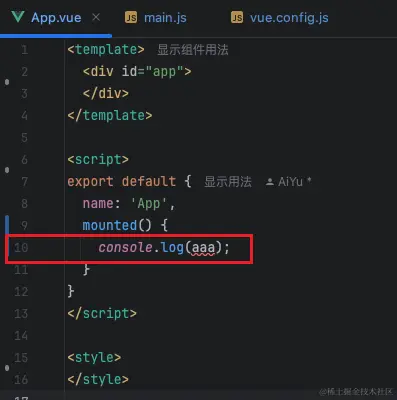

### 编写window错误上传接口
```js
// 处理window报错
app.post('/reportWindowError', async(req, res) => {
    const urlParams = req.body;
    console.log(`收到window错误报告`);
    console.log('urlParams', urlParams);

    res.send({
        data: '错误上报成功',
        status: 200
    }).status(200)
})
```
此时我们去vue项目中添加一个img标签,获取一张不存在的图片即可触发错误，由于不用解析，所以这里不在上传js.map了

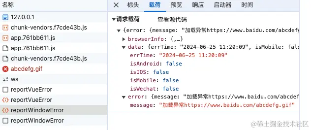

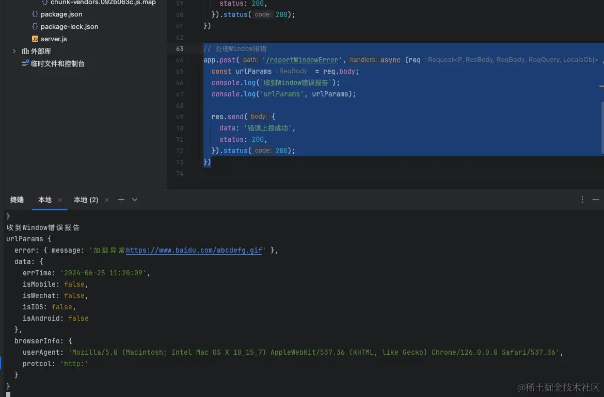

## 写入日志
错误上报之后我们还需要记录下来，接下来我们改造一下接口，收到报错之后写一下日志

我需要知道哪一天的日志报错了，所以我在node项目中也下载dayjs用来格式化时间

```bash
npm i dayjs
```
此处的日志记录内容只是我自己需要的格式，如果你需要其他格式请自己另外添加

### Vue错误写入日志
```js
// let sourceMapParseResult = '';
// try {
//  // 解析sourceMap结果
//  sourceMapParseResult = await searchSource({ filePath, line: stack.line, column: //stack.column });
//} catch (err) {
//  sourceMapParseResult = err;
//}
//console.log('解析结果', sourceMapParseResult)

// 直接将下面的内容粘贴在上面的log下面

const today = dayjs().format('YYYY-MM-DD') // 今天

const logDirPath = path.join(__dirname, 'log');
const logFilePath = path.resolve(__dirname, 'log/' + `log-${today}.txt`)

if (!fs.existsSync(logDirPath)) {
  console.log(`创建log文件夹`)
  fs.mkdirSync(logDirPath, { recursive: true });
}
if (!fs.existsSync(logFilePath)) {
  console.log(`创建${today}日志文件`)
  fs.writeFileSync(logFilePath, '', 'utf8');
}

const writeStream = fs.createWriteStream(logFilePath, { flags: 'a' });
writeStream.on('open', () => {
  // writeStream.write('UUID：' + urlParams.data.uuid + '\n');
  writeStream.write('错误类型：Window' + '\n');
  writeStream.write('错误发生时间：' + urlParams.data.errTime + '\n');
  writeStream.write('IP：' + req.ip + '\n');
  writeStream.write(`安卓: ${urlParams.data.isAndroid} IOS: ${urlParams.data.isIOS} 移动端: ${urlParams.data.isMobile} 微信: ${urlParams.data.isWechat} （安卓和ios同时为false表示未知设备）` + '\n');
  writeStream.write('用户代理：' + urlParams.browserInfo.userAgent + '\n');
  writeStream.write('错误信息：' + urlParams.error.message + '\n');
  writeStream.write('---------------------------------- \n');

  writeStream.end(() => {
    console.log('vue错误日志写入成功');
    console.log('---------------------');
    res.send({
      data: '错误上报成功',
      status: 200,
    }).status(200);
  });
})

writeStream.on('error', err => {
  res.send({
    data: '错误上报失败',
    status: 404,
  }).status(404);
  console.error('发生错误:', err);
})
```
### window错误写入日志
和vue写入的方式差不多，存在优化空间
```js
const today = dayjs().format('YYYY-MM-DD') // 今天

const logDirPath = path.join(__dirname, 'log');
const logFilePath = path.join(__dirname, 'log' + `/log-${today}.txt`)

if (!fs.existsSync(logDirPath)) {
  console.log(`创建log文件夹`)
  fs.mkdirSync(logDirPath, { recursive: true });
}
if (!fs.existsSync(logFilePath)) {
  console.log(`创建${today}日志文件`)
  fs.writeFileSync(logFilePath, '', 'utf8');
}

const writeStream = fs.createWriteStream(logFilePath, { flags: 'a' });
writeStream.on('open', () => {
  writeStream.write('错误类型：Window' + '\n');
  writeStream.write('错误发生时间：' + urlParams.data.errTime + '\n');
  writeStream.write('IP：' + req.ip + '\n');
  writeStream.write(`安卓: ${urlParams.data.isAndroid} IOS: ${urlParams.data.isIOS} 移动端: ${urlParams.data.isMobile} 微信: ${urlParams.data.isWechat} （安卓和ios同时为false表示未知设备）` + '\n');
  writeStream.write('用户代理：' + urlParams.browserInfo.userAgent + '\n');
  writeStream.write('错误信息：' + urlParams.error.message + '\n');
  writeStream.write('---------------------------------- \n');

  writeStream.end(() => {
    console.log('window错误日志写入成功');
    console.log('---------------------');
    res.send({
      data: '错误上报成功',
      status: 200,
    }).status(200);
  });
})

writeStream.on('error', err => {
  res.send({
    data: '错误上报失败',
    status: 404,
  }).status(404);
  console.error('发生错误:', err);
})
```
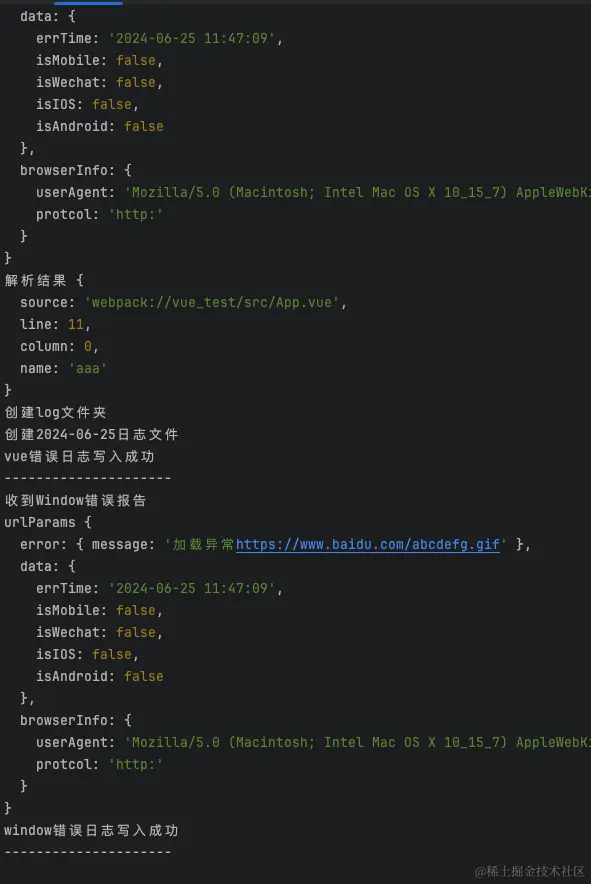

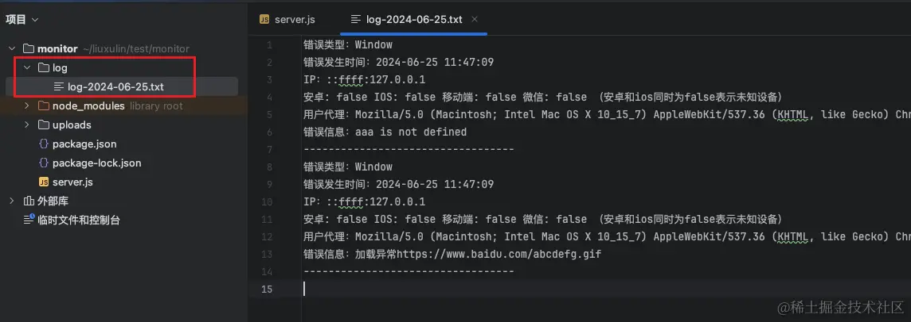

至此，收集错误，上报错误，写入日志已经全部完成
## 其他
### 错误监控持久化运行在服务器
这个可以使用 pm2,在服务器上使用node全局安装pm2库

```bash
pm2 ls # 显示所有pm2启动的应用
pm2 start /xxx/xxx # 启动/xxx/xxx应用
pm2 save # 保存当前应用列表
pm2 stop id # id 通过pm2 ls查看
pm2 logs id # 查看日志
```
### 自动上传js.map文件
如果每次打包后都手动复制js.map文件到uploads 文件夹下，似乎有些麻烦

虽然麻烦，但是我自己还是没有自动上传，原因是如果打包就自动上传，那么如果项目还未发布，但是文件已经替换掉之前的文件了，新版本未发布之前，vue的错误就无法解析了，当然，如果你每次上传都不删除以前的文件也是可以的

#### 修改vue项目
在Vue项目src下创建一个plugin目录，新建一个 UploadSourceMap.js，将下面的代码粘贴进去
```js
const glob = require('glob')
const path = require('path')
const http = require('http')
const fs = require('fs')

class UploadSourceMap {
  constructor (options) {
    this.options = options
  }

  apply (compiler) {
    console.log('UploadSourceMap')

    // 在打包完成后运行
    compiler.hooks.done.tap('UploadSourceMap', async stats => {
      const list = glob.sync(path.join(stats.compilation.outputOptions.path, '**/*.js.map'))
      for (const item of list) {
        const fileName = path.basename(item);
        console.log(`开始上传${fileName}`)
        await this.upload(this.options.url, item)
        console.log(`上传${fileName}完成`)
      }
    })
  }

  upload (url, file) {
    return new Promise((resolve, reject) => {
      const req = http.request(
        `${url}/upload?name=${path.basename(file)}`,
        {
          method: 'POST',
          headers: {
            'Content-Type': 'application/octet-stream',
            Connection: 'keep-alive',
            'Transfer-Encoding': 'chunked'
          }
        }
      )
      fs.createReadStream(file)
        .on('data', chunk => {
          req.write(chunk)
        })
        .on('end', () => {
          req.end()
          // 删除文件
          fs.unlink(file, (err) => {
            if (err) {
              console.error(err)
            }
          })
          resolve()
        })
    })
  }
}

module.exports = UploadSourceMap
```
修改vue.config.js

主要是引入UploadSourceMap，并且在configureWebpack => plugins下使用
```js
const { defineConfig } = require('@vue/cli-service')
const UploadSourceMap = require('./src/plugin/UploadSourceMap')

module.exports = defineConfig({
  productionSourceMap: true,
  transpileDependencies: true,
  lintOnSave: false,
  configureWebpack: {
    plugins: [
      new UploadSourceMap({
        url: 'http://127.0.0.1:9999' // 后面换成自己的服务器地址
      })
    ]
  }
})
```
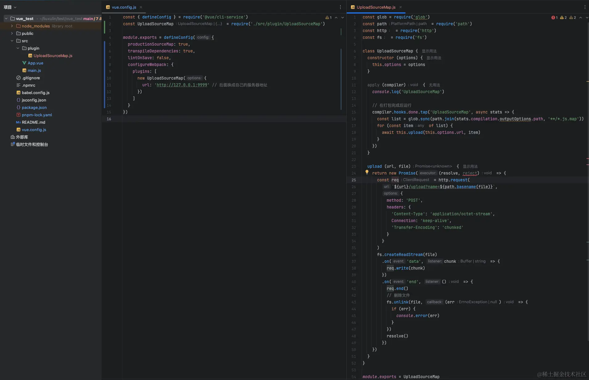

#### 修改后台
修改server.js，新增一个上传文件的接口
```js
app.post('/upload', (req, res) => {
    const fileName = req.query.name;
    const filePath = path.join(__dirname, 'uploads', fileName);

    if(!fs.existsSync(path.dirname(filePath))) {
        fs.mkdirSync(path.dirname(filePath), { recursive: true });
    }

    const writeStream = fs.createWriteStream(filePath);

    req.on('data', chunk => {
        writeStream.write(chunk);
    })

    req.on('end', () => {
        writeStream.end(() => {
            res.status(200).send(`File ${fileName} has been saved`)
        })
    })

    writeStream.on('error', err => {
        fs.unlink(filePath, () => {
            console.log(`Error writing file ${fileName}: ${err}`);
        })
    })
})
```
然后现在重新打包，观察打包输出

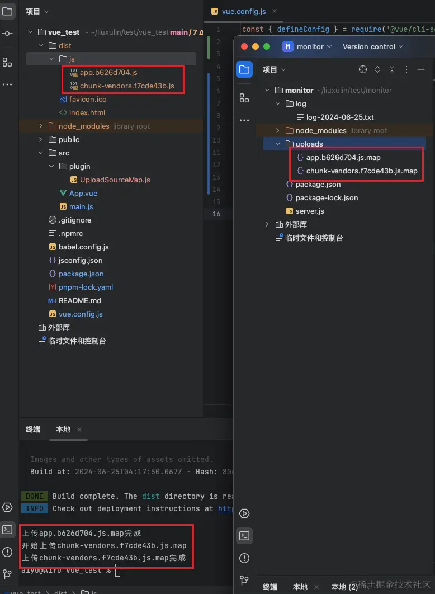

## 最后
尽量是不要开启跨域，否则谁都能发送请求到后台，如果要开跨域，那需要做好判断，主域名不符合的直接返回404终止这次请求

市面上的监控有很多，有些甚至能实现录制用户操作生成gif，本文只是实现一个基本的错误监控，如有错误请指出。

源码参考：github.com/liuxulin062…

如有错误，欢迎指正。

## 原文
[什么？原来前端错误上报这么简单！！](https://juejin.cn/post/7383955685368086562#heading-12)