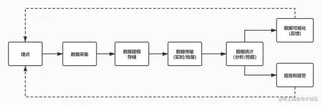

[源码仓库](https://github.com/miracle90/monitor)

## 为什么要做前端监控
- 更快的发现问题和解决问题
- 做产品的决策一句
- 为业务扩展提供了更多可能性
- 提升前端工程师的技术深度和广度，打造简历亮点

## 前端监控目标
- 稳定性 stability
    - js错误：js执行错误、promise异常
    - 资源错误：js、css资源加载异常
    - 接口错误：ajax、fetch请求异常
    - 白屏:页面空白
- 用户体验
- 业务business
    - pv: 页面浏览量和点击量
    - uv: 访问某个站点的不同ip的人数
    - 用户在每一个页面的停留时间
## 前端监控流程
1. 前端埋点
2. 数据上报
3. 加工汇总
4. 可视化展示
5. 监控报警

### 常见的埋点方案
- 代码埋点
    - 嵌入代码的形式
    - 优点：精确(任意时刻，数据量全面)
    - 缺点：代码工作量
- 可视化埋点
    - 通过可视化交互的手段，代替代码埋点
    - 将业务代码和埋点代码分离，提供一个可视化交互的页面，输入为业务代码，通过这个系统，可以在业务代码中自定义的增加埋点事件等等，最后输出的代码耦合了业务代码和埋点代码
    - 用系统来代码手工插入埋点代码
- 无痕埋点
    - 前端的任意一个事件被绑定一个标识，所有的时间都被记录下来
    - 通过定期上传记录文件，配合文件解析，解析出来我们想要的数据，并生成可视化报告供专业人员分析
    - 无痕埋点的有点是采集全量数据，不会出现不会出现漏埋和误埋等现象
    - 缺点是给数据传输和服务器增加压力，也无法灵活定制数据结构
## 编写采集脚本
### 接入日志系统
- 各公司一般都有自己的日志系统，接受数据上报例如阿里云
### 监控错误
#### 错误分类
- js错误(js执行错误，promise异常)
- 资源加载异常：监听error

#### 数据分析

## 资料
[浅谈前端监控体系搭建](https://mp.weixin.qq.com/s/EBk4cFK9AjkeQQgHnI8JrQ)