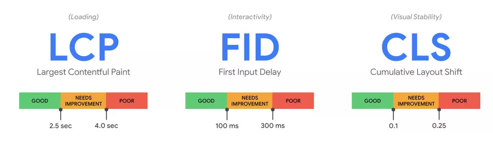
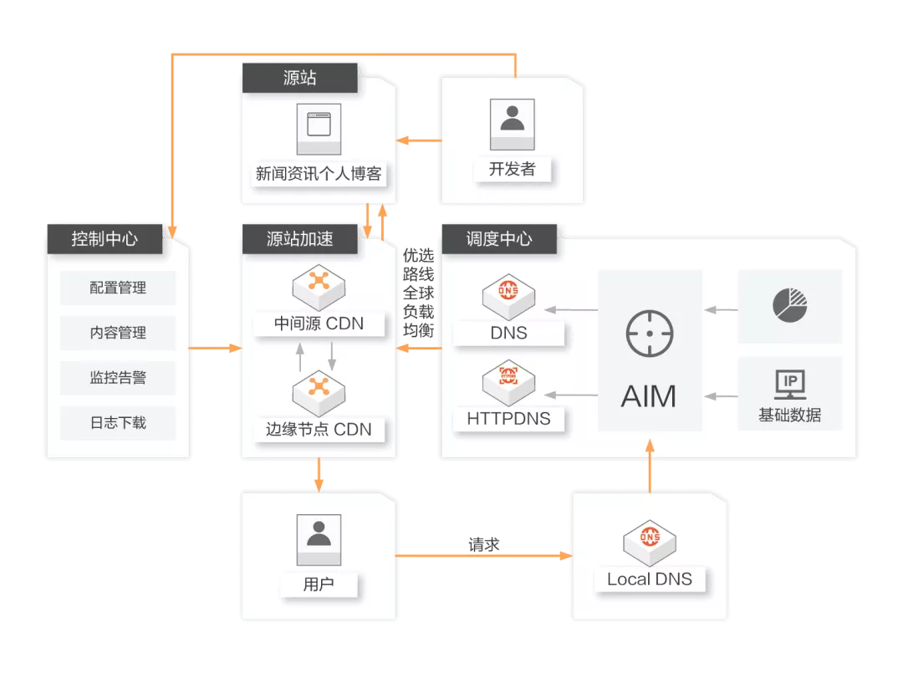
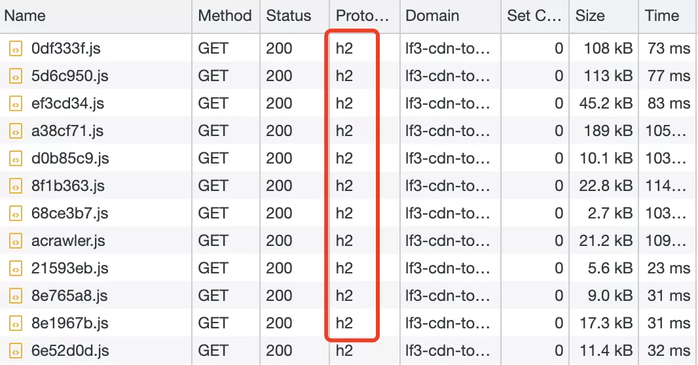
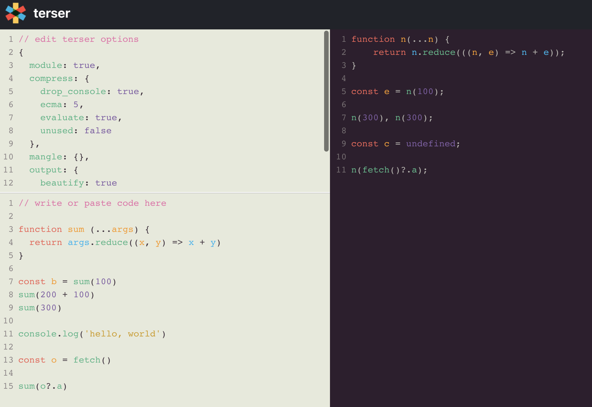
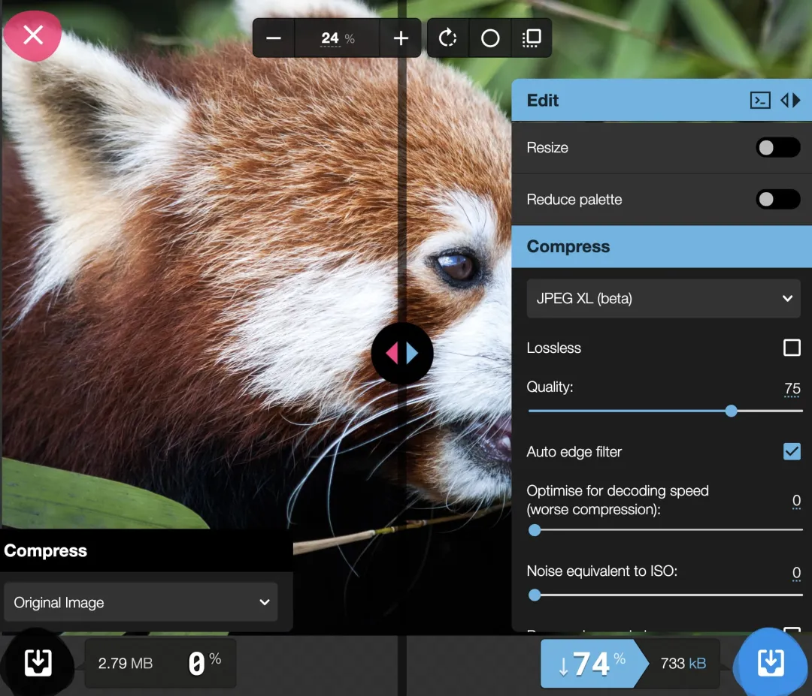

我们把性能优化的方向分为一下两个方面，有助于结构化的思考和系统分析
1. 加载性能。如何更快的把资源从服务器中拉到浏览器，如Http与资源体积的各种优化，都是旨在加载性能的提升
2. 渲染性能。如何更快的把资源在浏览器上进行渲染。如减少重绘重排，RIC等都旨在渲染性能的提升

## 核心性能指标与Performance API


- LCP: 加载性能。最大内容绘制应在2.5s内完成
- FID: 交互性能。首次输入延迟应在100ms完成
- CLS: 页面稳定性。累积布局偏移，需手动计算，CLS应保持在0.1以下。

### 计算与收集
- [web-vitals](https://web.dev/vitals/)
当收集浏览器每个用户性能指标时，可通过web-vitals收集并通过[sendBacon](https://developer.mozilla.org/zh-CN/docs/Web/API/Navigator/sendBeacon)上报到打点系统

```
import { getCLS, getFID, getLCP } from 'web-vitals';

function sendToAnalytics(metric) {
  const body = JSON.stringify(metric);
  navigator.sendBeacon('/analytics', body)
}

getCLS(sendToAnalytics);
getFID(sendToAnalytics);
getLCP(sendToAnalytics);
```

## 更快的传输：CDN
将资源分发到CDN的边缘网络节点，使用户可就近获取所需内容，大幅减少了光纤传输距离，使全球各地用户打开网站都拥有良好的网络体验


## 更快的传输：http2
http2的诸多特性决定了它更快的传输速度

1. 多路复用，在浏览器可并行发送N条请求
2. 首部压缩，更小的负载体积
3. 请求优先级，更快的关键请求

目前，网站已大多上了http2,可在控制台面板进行查看


由于http2可并行请求，解决了http1.1线头阻塞的问题，一下几个性能优化点将会过时
1. 资源合并，如 https://shanyue.tech/assets??index.js,interview.js,report.js
2. 域名分片
3. 雪碧图。将无数小图片合并成单个大图片

## 更快的传输：充分利用 HTTP 缓存
更好的资源缓存策略，对于CDN来讲可减少回源次数，对于浏览器而言可减少请求发送次数。无论哪一点，对于二次网站访问具有更好的访问体验

- 缓存策略
  - 强缓存:打包后带有hash值的资源(如/build/a3c8a8.js)
  - 协商缓存：打包后不带有hash值的资源(如 /index.html)
- 分包加载(Bundle Spliting)
  - 避免一行代码修改导致整个bundle的缓存失败

## 更快的传输：减少HTTP请求及负载
对一个网站的资源进行压缩优化，从而达到HTTP负载的目的。

- JS/CSS/images 等常规资源体积优化，这是一个大话题，在以下分别讨论
- 小图片优化，将小图标内联为Data URI,减少请求次数
- 图片懒加载
  - 新的API： IntersectionObserver API
  - 新的属性：loading=lazy

## 更小的体积：gzip/brotli
对JS、CSS、HTML等文版资源均有效，但是对图片效果不大

- gzip通过LZ77算法与Huffman编码来压缩文件，重复度越高的文件可压缩的空间越大
- brotli通过变种的LZ77、Huffman编码及二阶文件建模来压缩文件，更先进的压缩算法，比gzip有更高的性能和压缩率

可在浏览器的Content-Encoding 响应头查看该网站是否开启了压缩算法，目前知乎、掘金等已全名开启了brotli压缩。
```
# Request Header
Accept-Encoding: gzip, deflate, br

# gzip
Content-Encoding: gzip

# brotli
Content-Encoding: br
```
## 更小的体积：压缩混淆工具
Terser是JavaScript资源压缩的混淆的神器.

1. 长变量名替换端变量
2. 删除空格换行符
3. 预计算 const a = 24 * 60* 60 => const a = 86400000
4. 移除无法被执行的代码
5. 移除无用的变量和函数

可在 [Terser Repl](https://try.terser.org/)在线查看代码压缩效果。



1. [swc](https://github.com/swc-project/swc)是另外一个用以压缩JavaScript的工具，它拥有与Terser相同的API，由于它是由rust所写，因此它拥有更高的性能
2. [html-minifier-terser](https://github.com/terser/html-minifier-terser)用以压缩HTML的工具

## 更小的体积：更小的JavaScript
关于更小的Javascript，上面已总结了两条
1. gzip/brotli
2. terser(minify)

还有一下几点可以考虑
1. 路由懒加载，无需加载整个应用的资源
2. Tree Shaking: 无用导出将在生成环境进行删除
3. browserlist/babel: 及时更新browserlist，将会生产更小的垫片体积

如何分析并优化当前项目的Javascript体积？如果使用webpack那就简单很多
1. 使用webpack-bundle-analyze分析打包体积
2. 对一些库替换为更小体积的库 如：moment -> dayjs
3. 对一些库进行按需加载，如import lodash -> import lodash/get
4. 对一些库使用支持Tree Shaking 如 import lodash -> import lodash-es

## 更小的体积：更小的图片
在前端发展的现在，webp 普遍比 jpeg/png 更小，而 avif 又比 webp 小一个级别

为了无缝兼容，可选择 picture/source 进行回退处理
```
<picture>
  <source srcset="img/photo.avif" type="image/avif">
  <source srcset="img/photo.webp" type="image/webp">
  
</picture>
```
1. 更合适的尺寸: 当页面仅需显示 100px/100px 大小图片时，对图片进行压缩到 100px/100px
2. 更合适的压缩: 可对前端图片进行适当压缩，如通过 sharp 等

## 渲染优化:关键渲染路径
以下五个步骤为关键渲染路径
1. HTML->DOM,将html解析为DOM
2. CSS->CSSDOM，将CSS解析为CSSDOM
3. DOM/CSSDOM -> Render Tree，将DOM与CSSDOM合并成渲染书
4. RenderTree -> Layout,确定渲染书中每个节点的位置信息
5. Layout->Paint，将每个节点渲在浏览器中

渲染的优化很大程度上是对关键渲染路径进行优化

## preload/prefetch
preload/prefetch 可控制HTTP优先级，从而达到关键请求更快响应的目的
```
<link rel="prefetch" href="style.css" as="style">
<link rel="preload" href="main.js" as="script">
```
1. preload加载当前路由必须资源，优先极高.一般对于Bundle Spliting资源做preload
2. prefetch优先级低，在浏览器idle状态时加载资源。一般用以加载其他路由资源，如当页面出现link，可prefetch当前Link的路由资源。(next.js默认会对link做懒加载+preftech，即当某条Link出现页面中，即自动prefetch该Link指向的路由资源)

捎带说一下dns-prefetch，可对主机地址进行预解析
```
<link rel="dns-prefetch" href="//shanyue.tech">
```

## 渲染优化：防抖与节流
1. 防抖：防止抖动,单位时间内事件触发会被重置，避免事件被误伤触发多次。代码实现重在清零clearTimeout。防抖可以比坐等电梯，只要有一个人进来，就需要在等一会儿。业务场景有避免登录按钮多次点击的重复提交
2. 节流:控制流量，单位时间内事件只能触发一次，与服务器端的限流(Rate Limit)类似。代码实现重在开锁关锁timer=timerout;timer= null.节流可以比做红绿灯，每等一个红灯时间就可以过一批

无论是防抖还是节流都可以大幅度减少渲染次数，在React中还是可以使用use-debounce之类的hooks避免重新渲染
```
import React, { useState } from 'react';
import { useDebounce } from 'use-debounce';

export default funcdtion Input() {
  const [test, setText] = useState('Hello');
  // 一秒钟渲染一次，打打降低了重新渲染的频率
  const [value] = useDebounce(text, 1000);

  return (
    <div>
      <Input
        defaultValue={'Hello'}
        onChange={(e)=> {
          setText(e.target.value)
        }}
        />
        <p>Actual value: {text}</p>
        <p>Debounce value: {value}</p>
    </div>
  )
}
```
## 渲染优化：虚拟列表优化
这又是一个老生常谈的话题，一般在视口内维护一个虚拟列表(仅渲染十几条数据左右)，监听视口窗口变化，从而从视口内的虚拟列表进行控制

在React中采用一下库
1. [react-virtualized](https://github.com/bvaughn/react-virtualized)
2. [react-window](https://github.com/bvaughn/react-window)

## 渲染优化：请求及资源缓存
在一些前端系统中，当加载页面时会发送请求，路由切换出去再切换回来时又会重新发送请求，每次请求完成后会对页面重新渲染。

然而这些重新请求再大多数时是没有必要的，合理地对 API 进行缓存将达到优化渲染的目的。

1. 对每一条 GET API 添加 key
2. 根据 key 控制该 API 缓存，重复发生请求时将从缓存中取得
```
function Example() {
  // 设置缓存的 Key 为 Users:10086
  const { isLoading, data } = useQuery(['users', userId], () => fetchUserById(userId))
}
```
## Web Workers
试举一例：

在纯浏览器中，如何实现高性能的实时代码编译及转换？

1. [Babel Repl](https://rollupjs.org/repl/?version=2.64.0&shareable=JTdCJTIybW9kdWxlcyUyMiUzQSU1QiU3QiUyMm5hbWUlMjIlM0ElMjJtYWluLmpzJTIyJTJDJTIyY29kZSUyMiUzQSUyMiUyRiolMjBEWU5BTUlDJTIwSU1QT1JUUyU1Q24lMjAlMjAlMjBSb2xsdXAlMjBzdXBwb3J0cyUyMGF1dG9tYXRpYyUyMGNodW5raW5nJTIwYW5kJTIwbGF6eS1sb2FkaW5nJTVDbiUyMCUyMCUyMHZpYSUyMGR5bmFtaWMlMjBpbXBvcnRzJTIwdXRpbGl6aW5nJTIwdGhlJTIwaW1wb3J0JTIwbWVjaGFuaXNtJTVDbiUyMCUyMCUyMG9mJTIwdGhlJTIwaG9zdCUyMHN5c3RlbS4lMjAqJTJGJTVDbmlmJTIwKGRpc3BsYXlNYXRoKSUyMCU3QiU1Q24lNUN0aW1wb3J0KCcuJTJGbWF0aHMuanMnKS50aGVuKGZ1bmN0aW9uJTIwKG1hdGhzKSUyMCU3QiU1Q24lNUN0JTVDdGNvbnNvbGUubG9nKG1hdGhzLnNxdWFyZSg1KSklM0IlNUNuJTVDdCU1Q3Rjb25zb2xlLmxvZyhtYXRocy5jdWJlKDUpKSUzQiU1Q24lNUN0JTdEKSUzQiU1Q24lN0QlMjIlMkMlMjJpc0VudHJ5JTIyJTNBdHJ1ZSU3RCUyQyU3QiUyMm5hbWUlMjIlM0ElMjJtYXRocy5qcyUyMiUyQyUyMmNvZGUlMjIlM0ElMjJpbXBvcnQlMjBzcXVhcmUlMjBmcm9tJTIwJy4lMkZzcXVhcmUuanMnJTNCJTVDbiU1Q25leHBvcnQlMjAlN0JkZWZhdWx0JTIwYXMlMjBzcXVhcmUlN0QlMjBmcm9tJTIwJy4lMkZzcXVhcmUuanMnJTNCJTVDbiU1Q25leHBvcnQlMjBmdW5jdGlvbiUyMGN1YmUlMjAoeCUyMCklMjAlN0IlNUNuJTVDdHJldHVybiUyMHNxdWFyZSh4KSUyMColMjB4JTNCJTVDbiU3RCUyMiUyQyUyMmlzRW50cnklMjIlM0FmYWxzZSU3RCUyQyU3QiUyMm5hbWUlMjIlM0ElMjJzcXVhcmUuanMlMjIlMkMlMjJjb2RlJTIyJTNBJTIyZXhwb3J0JTIwZGVmYXVsdCUyMGZ1bmN0aW9uJTIwc3F1YXJlJTIwKCUyMHglMjApJTIwJTdCJTVDbiU1Q3RyZXR1cm4lMjB4JTIwKiUyMHglM0IlNUNuJTdEJTIyJTJDJTIyaXNFbnRyeSUyMiUzQWZhbHNlJTdEJTVEJTJDJTIyb3B0aW9ucyUyMiUzQSU3QiUyMmZvcm1hdCUyMiUzQSUyMmVzJTIyJTJDJTIybmFtZSUyMiUzQSUyMm15QnVuZGxlJTIyJTJDJTIyYW1kJTIyJTNBJTdCJTIyaWQlMjIlM0ElMjIlMjIlN0QlMkMlMjJnbG9iYWxzJTIyJTNBJTdCJTdEJTdEJTJDJTIyZXhhbXBsZSUyMiUzQSUyMjAwJTIyJTdE)

如果纯碎使用传统的 Javascript 实现，将会耗时过多阻塞主线程，有可能导致页面卡顿。

如果使用 Web Worker 交由额外的线程来做这件事，将会高效很多，基本上所有在浏览器端进行代码编译的功能都由 Web Worker 实现。

## WASM
1. JS性能低下
2. C++/Rust 高性能
3. 使用C++/Rust编写代码，然后在JavaScript环境运行

举例：

在纯浏览器中，如何实现高性能的图片压缩？

基本很难做到，JavaScript的性能与生态决定了实现如片压缩的艰难

而借助于WASM就相当于借用了其他语言的生态

1. [libavif](https://github.com/AOMediaCodec/libavif): c语言写的avif解码编码库
2. [libwebp](https://github.com/webmproject/libwebp): C语言写的webp解码编码库
3. [mozjpeg](https://github.com/mozilla/mozjpeg): C语言写的jpeg解码编码库
4. [oxipng](https://github.com/shssoichiro/oxipng): Rust语言写的png优化库

而由于 WASM，完全可以把这些其它语言的生态移植到浏览器中，从而实现一个高性能的离线式的图片压缩工具。

如果想了解这种的工具，请看看 [squoosh](https://squoosh.app/)



## 资料
[2022 的前端性能优化指南](https://mp.weixin.qq.com/s/EyE1ZgpmXT3lq1LNL_l7FQ)

[https://shanyue.tech/web-performance/](https://shanyue.tech/web-performance/)
