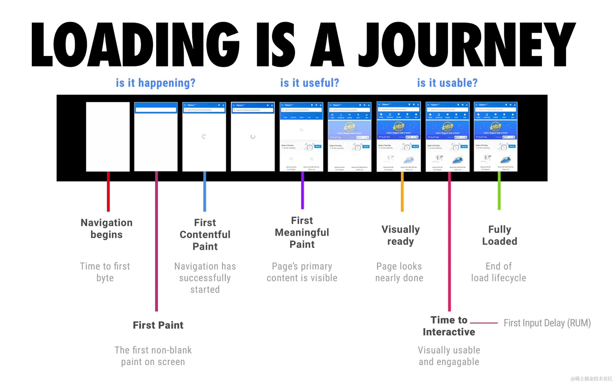
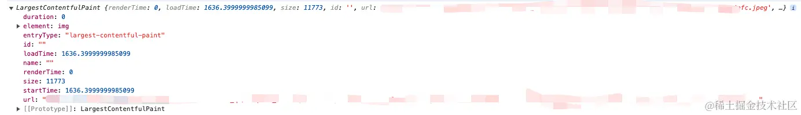
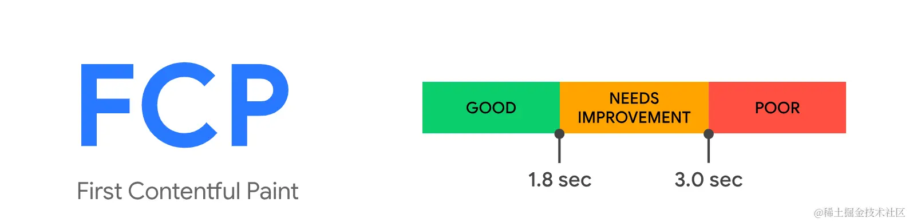

在当今数字时代，网站的性能对于吸引和保留用户至关重要。用户不愿意等地啊缓慢的加载时间，而快速响应的页面将帮助您留住访问者，提高转化率。前端性能优化是实现这一目标的关键因素之一。在本文中，我们将探讨一些重要的前端性能优化策略，以提高网站速度、交互性和用户满意度

## 衡量标准



### 测量工具
- Chrome developer tools: [lighthouse](https://developer.chrome.com/docs/lighthouse/overview),[performance](https://developer.chrome.com/docs/devtools/performance/reference)

- [WevPageTest](https://www.webpagetest.org/)

- [PerformanceObserver](https://developer.mozilla.org/en-US/docs/Web/API/PerformanceObserver)

现在将以 Performance Observer 为例，详细讨论几个重要的性能指标的具体表现

### 重要指标
#### LCP
指视图中最大图像和文本快呈现的时间。您可以通过查看截图来了解其标准。如深入了解，请点击[这里](https://web.dev/articles/lcp#how_to_measure_lcp)


LCP分析会考虑到其找到的所有内容,甚至包括已从DOM中删除的内容。每当发现新的最大内容时，它都会创建一个新的条目，因此可能会存在多个对象。然而，当发生滚动或输入事件时，LCP分析会停止搜索更大的内容。因此，一般来说，LCP数据会取最后一个找到的内容作为结果

```js
const observer = new PerformanceObserver((list) => {
  const entries = list.getEntries();
  const lastEntry = entries[entries.length - 1]; 
  console.log(lastEntry);
});
observer.observe({ type: "largest-contentful-paint", buffered: true });
```



以下是对于给定指标的解释和展示对象的描述

- element: 当前最大的内容绘制元素
- loadingTime: 加载时间
- renderTime: 渲染时间。如果是跨域请求，则为0
- size: 元素本身的面积
- startTime: 如果 renderTime 不为0，则返回 renderTime; 否则返回 loadingTime

在这个示例中，LCP为loadingTime，即1.6。根据上述度量标准，这被认为是良好的。这表示在试图中最大的内容元素(图片)在1.6秒内成功渲染，符合较好的用户体验标准

#### FCP
指的是任何内容的一部分首次在屏幕上呈现的时间。你可以通过查看截图来了解其标准。如果想升入了解，可以点击[这里](https://web.dev/articles/fcp).与之类似的指标是FP(First Paint),表示第一个像素会知道屏幕上的时间



```js
const observer = new PerformanceObserver((list) => {
  list.getEntries().forEach((entry) => {
    console.log(entry)
  });
});
observer.observe({ type: "paint", buffered: true });
```
在给定的指标中
- duration: 持续时间，这里是0
- startTime: 返回绘制发生时的时间戳

在本示例中，FCP为**startTime**,即小于1秒。根据提供的标准，这被认为是良好的

#### FID
指的是用户首次与页面交互到浏览器实际能够开始处理程序


## 资料
[原文](https://juejin.cn/post/7363830946908979239)