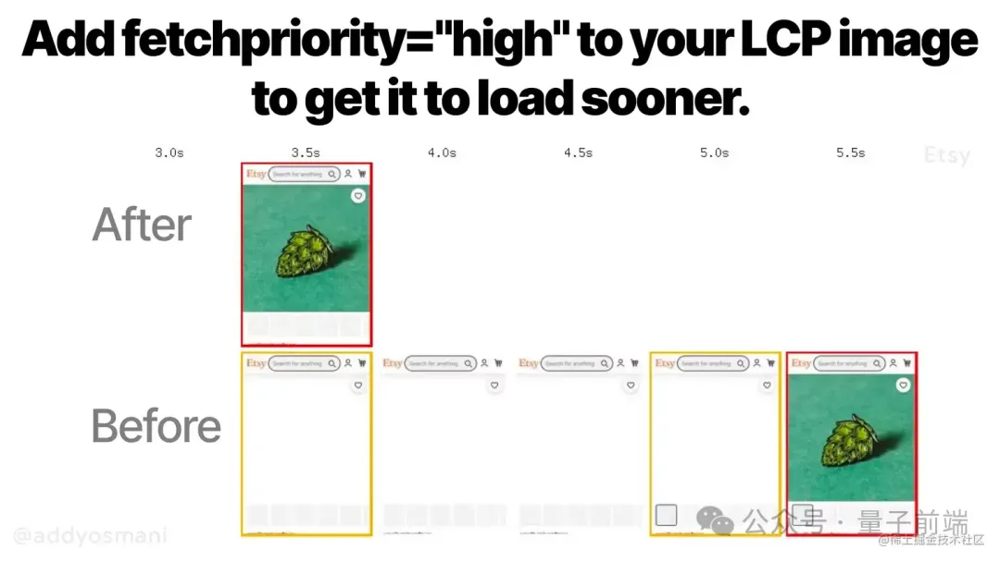

为页面中拖慢 Largest Contentful Paint(LCP)的静态资源添加 fetchpriority="high"属性，可以提高加载速速。Esty使用Priority Hints  提升了 4%的LCP时间,另外一些站点在试验测试环境中甚至可以提升20% -30%。在大多数场景下，使用 fetchpriority 足以为LCP时间带来可观的提升。



## 代码片段
Priority Hints允许你有机会调整静态资源的加载优先级，包括：images,css,fonts,scripts以及iframes。因此Priority Hints并不局限于用来提升LCP表现：
- 降低预加载scripts的优先级
- 提升或者减低body标签后段的scripts加载优先级
- 为不同的fetch请求指定不同优先级(比如后台执行的行为与用户交互行为之间的不同优先级)
- 以及其他
```html
<!-- 为影响LCP最大的图片资源提升优先级 --> 


<!-- 降低下面这张在顺序加载时最靠前的图片的加载优先级 --> 


<!-- 降低嵌入的第三方iframe资源的加载优先级 --> 
<iframe src="https://youtu.be/JfVOS4VSpmA" fetchpriority="low"></iframe>

<script> 
// 对于不太紧急的fetch请求指定低优先级
let suggestedContent = await fetch("/content/suggested", {priority: "low"}); 
</script>

<!-- 为非必须的js脚本指定低加载优先级 -->
<script src="blocking_but_unimportant.js" fetchpriority="low"></script>
```
## 常见问题
- Priority Hints与Preload属性有何不同

    rel=preload用于调整浏览器在解析文档流过程中，优先发现哪些静态文件的过程

    Priority Hints用于调整浏览器在已发现的静态文件列表中，优先加载哪个的顺序

- Priority Hints 与 loading=eager有何不同

    loading=eager通常是指与懒加载相对的概念，比如使用&lt;img src="image.jpeg" loading="lazy"&gt;对图片进行懒加载，与lazy属性值相对应，也可以使用eager(实际上loading属性的默认值)。。但即使明确指定loading方式为eager，在Chrome浏览器中图片资源仍被作为低优先级资源加载，直到浏览器完成文档布局之后，才会根据视口内判断加载哪些图片。而使用Priority Hints却可以明确指定优先加载主视觉图片。此外，鉴于脚本和 Fetch API 调用不是可视的，实际上并没有“延迟”加载它们的概念，只是在进行这些请求时会延迟。

- 浏览器不能自动判断正确的优先级？

    比如Chrome浏览器确实具备启发式的方法，尝试根据视口内的内容，编排合适优先级对资源进行加载。也就是说，在没有Priority Hints的帮助下，Chrome只能在完成布局加载之后尽量提升视口内的图片加载优先级。通常来说这个时间点已经太晚了，并且此时再进行加载会与其他请求产生竞争。另外一个使用Priority Hints的原因在于，作为页面的开发人员，他们通常更清楚优先加载什么资源对于用户体验更加重要，因此需要开发人员（以及背后的产品经理们）通知浏览器加载优先级，才能本质地优化用户首屏体验。

