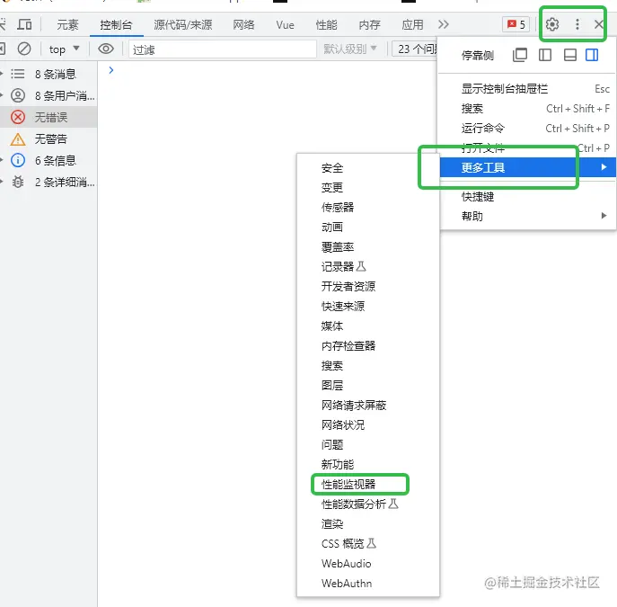

## Lighthouse 使用
Lighthouse 是由Google开发病开源的web性能测试工具，通过监控和检测应用的各方面性能表现，为开发者提供优化用户体验和网站性能提供指导建议

下面介绍两种使用Lighthouse的方式:通过Chrome插件使用和通过Node CLI使用

### 1.1 通过charome插件使用
首先现在 Lighthouse 插件(Loghthouse谷歌浏览器插件下载地址：[Lighthouse](https://chrome.google.com/webstore/detail/lighthouse/blipmdconlkpinefehnmjammfjpmpbjk/related))

然后打开Chrome开发者工具,点击右上角的【三个点】，点击【更多工具】，在点击【性能监视器】



然后点击【Lighthouse】选项卡，点击【分析网页加载情况】按钮：


几秒后，Lighthouse性能分析报错生成：


### 1.2 通过Node CLI 使用
目前Ligthhouse 已经发布了npm宝，可以在项目中集成： npm i lighthouse

如下脚本代码
```js
const run = async () => {
    const browser = await puppeteer.launch({
        headless: 'new',
        args: ['--no-sandbox', '--disable-setuid-sandbox'],
    })
    const page = await browser.newPage();
    const url = '你的网页URL';
    await page.goto(url);
    const {port} = new URL(browser.wsEndpoint());
    const {report} = await lighthouse(url, {
        port, 
        output: 'html'
    })
    await writeFile('report.html', report);
    await browser.close();
}
run();
```
运行脚本即可得到Lighthouse生成的分析报告：


分析报告和浏览器插件方式得到在内容上是的一样，只不过是英文的形式。后续可以利用在此基础上进行改善和丰富，可以优化前端工程的部署流程。

有了性能分析报告，我们可以根据各性能指标得分，优化建议和诊断结果对项目进行优化，下面具体学习一下这些性能优化指标。

## 性能优化指标
### 2.1 FCP(first Contentful Paint) 首次内容绘制


## 原文
[一次前端性能优化——性能得分从56到96](https://juejin.cn/post/7273072756156235834)