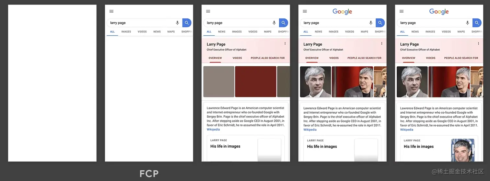
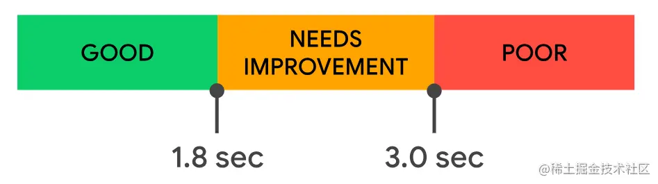
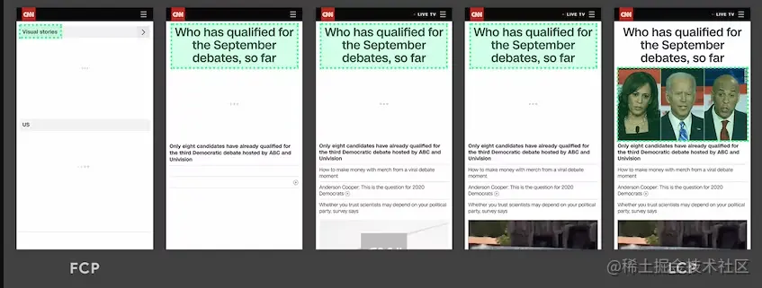
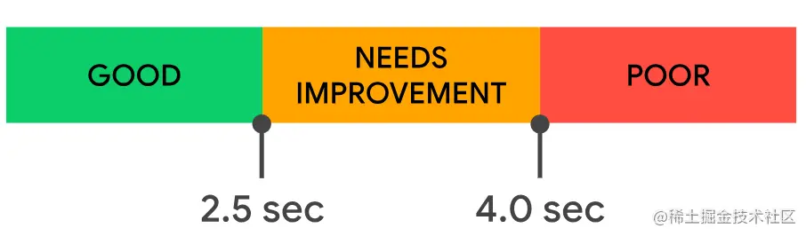
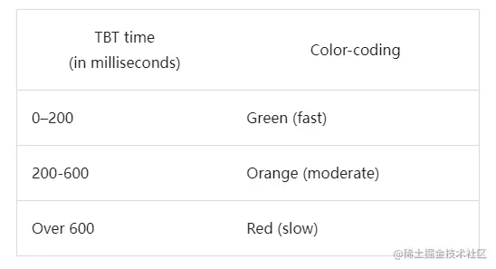
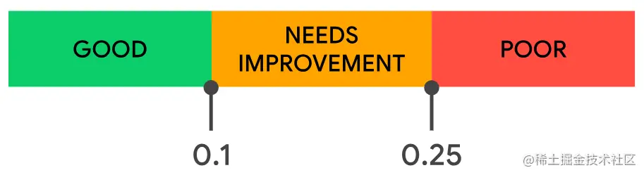
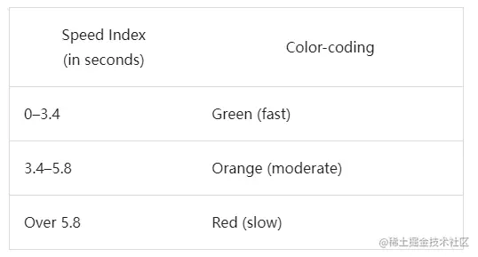

## Lighthouse 使用
Lighthouse 是由Google开发病开源的web性能测试工具，通过监控和检测应用的各方面性能表现，为开发者提供优化用户体验和网站性能提供指导建议

下面介绍两种使用Lighthouse的方式:通过Chrome插件使用和通过Node CLI使用

### 1.1 通过charome插件使用
首先现在 Lighthouse 插件(Loghthouse谷歌浏览器插件下载地址：[Lighthouse](https://chrome.google.com/webstore/detail/lighthouse/blipmdconlkpinefehnmjammfjpmpbjk/related))

然后打开Chrome开发者工具,点击右上角的【三个点】，点击【更多工具】，在点击【性能监视器】


然后点击【Lighthouse】选项卡，点击【分析网页加载情况】按钮：


几秒后，Lighthouse性能分析报错生成：


### 1.2 通过Node CLI 使用
目前Ligthhouse 已经发布了npm宝，可以在项目中集成： npm i lighthouse

如下脚本代码
```js
const run = async () => {
    const browser = await puppeteer.launch({
        headless: 'new',
        args: ['--no-sandbox', '--disable-setuid-sandbox'],
    })
    const page = await browser.newPage();
    const url = '你的网页URL';
    await page.goto(url);
    const {port} = new URL(browser.wsEndpoint());
    const {report} = await lighthouse(url, {
        port, 
        output: 'html'
    })
    await writeFile('report.html', report);
    await browser.close();
}
run();
```
运行脚本即可得到Lighthouse生成的分析报告：


分析报告和浏览器插件方式得到在内容上是的一样，只不过是英文的形式。后续可以利用在此基础上进行改善和丰富，可以优化前端工程的部署流程。

有了性能分析报告，我们可以根据各性能指标得分，优化建议和诊断结果对项目进行优化，下面具体学习一下这些性能优化指标。

## 性能优化指标
### 2.1 FCP(first Contentful Paint) 首次内容绘制


#### 2.1.1 定义
首次内容绘制时间，测量页面从开始加载到页面内容的任何部分在屏幕上完成渲染的时间

#### 2.1.2 对定义的理解
所述页面内容必须是文本、图片(包含背景图)、非白色的canvas或者svg

这是用户第一次看到页面的内容，注意是部分内容，并非所有内容.

如下图所示，**FCP发生在第二帧，因为那是首批文本和图片元素在屏幕上完成渲染的时间点**：



如上图所示，虽然部分内容已完成渲染，但并非所有内容都已经完成渲染。这是首次内容绘制时间(FCP)与**最大内容绘制时间(LCP，Larget Contentful Paint)**之间重要的区别

#### 2.1.3 评价标准


- FCP时间在0-1.8s，表示良好，颜色为绿色，FCP评分将在75~100分；
- FCP时间在1.9-3.0秒， 表示需要改进，颜色为橙色，FCP评分将在50~74分；
- FCP时间在3.1秒以上， 表示较差进，颜色为红色，FCP评分将在0~49分。

#### 2.1.4 缩短FCP时间的方法
指导方案可参照：[如何改进 FCP](https://web.dev/fcp/#%E5%A6%82%E4%BD%95%E6%94%B9%E8%BF%9B-fcp) ，本文如何做的见下文。

#### 2.1.5 注意事项
此指标对于没使用ssr技术的web项目意义并不大，因为第一绘制的时间通常JS还没加载完毕。

### 2.2 LCP(Largest ContentFul Pain) 最大内容绘制


#### 2.2.1 定义
最大内容绘制时间,根据页面首次开始加载的时间点来计算可视区域的最大图像或文本完成渲染的相对时间

#### 2.2.2 对定义的理解
LCP要考虑的元素包括：img元素以及内嵌在svg元素内的img元素，video元素，通过url加载的背景图像元素，包含文本节点或者其他内联级文本元素的块级元素。

如下图所示，最大元素随内容加载而变化，随着新内容被添加进DOM，并因此使最大元素发生了改变



#### 2.2.3 评价标准


- LCP时间在0-2.5秒， 表示良好，颜色为绿色；
- LCP时间在2.6-4.0秒， 表示需要改进，颜色为橙色；
- LCP时间在4.1秒以上， 表示较差进，颜色为红色。

#### 2.2.4 缩短LCP时间的方法
指导方案可参考：[如何改进LCP](https://web.dev/lcp/#%E5%A6%82%E4%BD%95%E6%94%B9%E8%BF%9B-lcp)，本文如何做的见下文

### 2.3 TBT(Total Blocking Time) 总阻塞时间

#### 2.3.1 定义
总阻塞时间(TBT)指标测量 First Contentful Paint 首次内容绘制(FCP)与Time to Interactive 可交互时间(TTI)之间的总时间

#### 2.3.2 对定义的理解
由定义可知: TBT涉及到了FCP和TTI这两个概念，对于FCP上文已经介绍过，这里补充一下TTI(可交互时间的定义):TTI指标测量页面从开始加载到子资源完成渲染，并能够快速、可靠的响应用户输入所需的时间。

#### 2.3.3 评价标准



[得分标准](https://developer.chrome.com/docs/lighthouse/performance/lighthouse-total-blocking-time?hl=zh-cn#how-lighthouse-determines-your-tbt-score)

为了提供良好的用户体验，网站在普通移动硬件上进行测试时，应当努力使TBT控制在300毫秒内

#### 2.3.4 缩短TBT的方法
指导方案可参考：[如何改进TBT](https://web.dev/tbt/#%E5%A6%82%E4%BD%95%E6%94%B9%E8%BF%9B-tbt)，本文如何做的见下文。

### 2.4 CLS(Cumulative Layout Shift) 累计布局偏移
#### 2.4.1 定义
CLS测量整个页面生命周期内发生的所有意外布局偏移中最大一连串的布局偏移分数

#### 2.4.2 对定义的理解
累积布局偏移(CLS)是测量视觉稳定性的一个以用户为中心的重要指标，因为该项指标有助于量化用户经历意外布局偏移的频率，较低的CLS有助于确保一个页面是令人愉悦的。

#### 2.4.3 评价标准


#### 2.4.4 缩短CLS的方法
指导方案可参照：[如何改进CLS](https://web.dev/cls/#%E5%A6%82%E4%BD%95%E6%94%B9%E8%BF%9B-cls)，本文不涉及。

### 2.5 SI(Spead Index) 速度指标

#### 2.5.1 定义
SI是一个表示页面可视区域中内容的填充速度的指标

#### 2.5.2 对定义的理解
该指标捕获的是页面出现像素点的时间。

#### 2.5.3 评价标准


#### 2.5.4 缩短SI的方法

指导方案可参照：[如何改进SI](https://developer.chrome.com/docs/lighthouse/performance/speed-index?hl=zh-cn#how-to-improve-your-speed-index-score)，本文如何做的见下文。

## 3. 具体的性能优化方法
文档[快速加载](https://web.dev/explore/fast?hl=zh-cn)总结了一些提升网站性能的技术，列出一下常用的方法
1. 消除阻塞渲染的资源: 例如对于引入三方的script标签加上 async 或者 defer
2. 缩小CSS、移除未使用的CSS: 例如使用压缩器压缩CSS.
3. 预链接到所需要的资源:例如使用&lt;link ref="preconnect"&gt;通知浏览器，页面打算预另一个源建立连接，而且希望该过程尽快开始
4. 减少服务器的响应时间:例如使用HTTP2
5. 使用缓存:例如使用HTTP缓存
6. 优化图片: 例如压缩图片,使用CDN,延迟加载等
7. 删除未使用代码:例如删除未使用的库，删除不需要的库，删除无用嗲吗，按需引入组件库
8. 减少JS负载:例如动态导入和代码拆分

下面结合笔者的项目介绍一下笔者使用的方法

### 3.1 使用vite-compression-plugin
可以使用 [vite-compression-plugin](https://github.com/nonzzz/vite-plugin-compression) 来对代码进行gzip压缩，使用方法如下

```js
// vite.config.js
import viteCompression from 'vite-plugin-compression';

export default defineConfig({
    plugins: [
        viteCompression({
            ext: '.gz',
            algorithm: "gzip",
            deleteOriginFile: false
        })
    ]
})
```
关于插件的具体配置可以查看插件的文档，选择合适的压缩算法。

### 3.2 开启nginx的gzip压缩
笔者的前端项目下有一个.devops目录，下面有一个ngnix.conf文件可以单独配置此前端工程的ngnix：

配置方法为在server下面增加如下配置：

```js
server {
  gzip on;
  gzip_buffers 32 4K;
  gzip_comp_level 6;
  gzip_min_length 100;
  gzip_types application/javascript text/plain text/css text/xml application/json application/xml application/xml+rss;
  gzip_vary on;
  listen       80;
  location / {            
    # 此处省略location相关配置
  }
}
```
### 3.3 按需自动引入 element-plus
笔者项目原来是完整引入element-plus的, main.ts文件内容：
```js
import ElementPlus from 'element-plus';
import 'element-plus/dist/index.css';
import App from './App.vue';

const app = createApp(App);

app.use(ElementPlus);
app.mount('#app')
```
这样会导致首页加载时被打包后的和element-plus相关的全部js和css资源被引入，但是按需引入时则不会一次性引入全部的css和js。

按需引入element-plus的方法为：

- 第一步：安装unplugin-auto-import和unplugin-vue-components：pnpm install unplugin-auto-import unplugin-vue-components。
- 第二步：vite.config.ts插件配置：

```ts
import AutoImport from "unplugin-auto-import/vite";
import Components from "unplugin-vue-components/vite";
import { ElementPlusResolver } from "unplugin-vue-components/resolvers";
export default defineConfig({
  plugins:[
    AutoImport({
      resolvers: [ElementPlusResolver()]
    }),
    Components({
      resolvers: [ElementPlusResolver()]
    }),
  ]
})
```
- 第三步：特殊插件的处理。对于对于命令式方式使用的组件，例如ElNotification, 如果不单独引入，则会导致其样式失效，所以需要对项目中使用到的这类组件单独全局引入一下就OK啦：

```ts
import { ElInput, ElSelect, ElDatePicker, ElTimePicker } from "element-plus";
app.use(ElInput).use(ElSelect).use(ElDatePicker).use(ElTimePicker).use(directives).use(router).use(pinia).mount("#app");
```

### 3.4 修改百度地图的引入方式
原来的引入方式是在html文件中增加script标签
```html
<!DOCTYPE html>
<html lang="en">
  <body >
    <div id="app">
    <script type="module" src="/src/main.ts"></script>
    <script charset="utf-8" src="https://api.map.baidu.com/api?v=1.0&&type=webgl&ak=***"></script>
  </body>
</html>
```
原来的使用方法如下

```js
const BMapGL: any = (window as any).BMapGL;
const map = new BMapGL.Map('container');
```
改成使用时异步调用
```ts
const LoadBaiduMapScript = () => {
  //console.log("初始化百度地图脚本...");
  const AK = "***";
  const BMap_URL = "https://api.map.baidu.com/api?v=1.0&&type=webgl&ak=" + AK + "&s=1&callback=onBMapCallback";
  return new Promise(resolve => {
    // 如果已加载直接返回
    if (typeof (window as any).BMapGL !== "undefined") {
      resolve((window as any).BMapGL);
      return true;
    }
    // 百度地图异步加载回调处理
    (window as any).onBMapCallback =  () => {
      console.log("百度地图脚本初始化成功...");
      BMapGL = (window as any).BMapGL;
      resolve((window as any).BMapGL);
    };
    // 插入script脚本
    let scriptNode = document.createElement("script");
    scriptNode.setAttribute("type", "text/javascript");
    scriptNode.setAttribute("src", BMap_URL);
    document.body.appendChild(scriptNode);
  });
};
```
### 3.5 对图片进行压缩
这里推荐一个好用的压缩工具，熊猫压缩——tinypng 。


用它把UI给的切图、背景图等压缩一下，那必然也起到一定的作用。

笔者就通过如上五种优化方法对项目优化了一下，性能得分就得到了很大的改观，是不是觉得性能优化也不难，哈哈哈~


## 其他
【1】基于lighthouse对网站进行性能优化
【2】前端性能其一：使用Lighthouse对掘金主站进行性能分析
【3】前端性能分析、性能优化方案
【4】First Contentful Paint 首次内容绘制 (FCP)
【5】Largest Contentful Paint 最大内容绘制 (LCP)
【6】Total Blocking Time 总阻塞时间 (TBT)
【7】Time to Interactive 可交互时间 (TTI)
【8】Cumulative Layout Shift 累积布局偏移 (CLS)
【9】Speed Index
【10】vue3 + vite 性能优化，详细代码说明
【11】vite-vue3优化配置（持续更新，喜欢的收藏）
【12】Vite+Vue3 加载速度优化
【13】vite构建vue3项目，打包优化
【14】Vue前端项目集成Element-Plus组件库：全局引入和按需引入


## 原文
[一次前端性能优化——性能得分从56到96](https://juejin.cn/post/7273072756156235834)