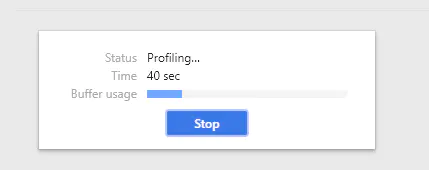
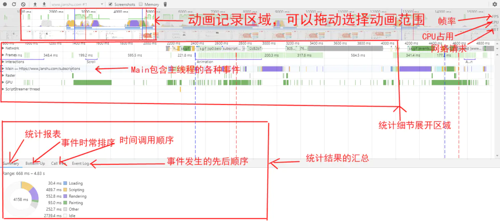
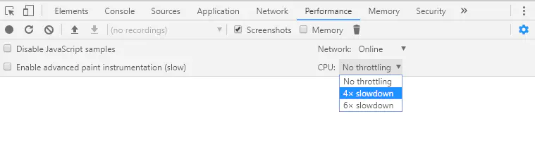

## performance 页面性能分析
本文将介绍如何使用chrome devTool的performance来对页面进行性能分析

### 操作过程
1. 进入匿名模式保证分析结果少收到其他插件的干扰(windows可使用快捷点 ctrl + shift + N）
2. 确保screenshots checkbox是选中的，然后点击controls，开始记录（windows快捷键 shift + E），这时候Devtools就开始录制各种性能指标，你可以点击页面进行各种操作，所有的操作都会被浏览器录制下来。录制期间，可以点击stop进行快速操作结果录制，然后等待显示性能报告，stop按钮位置如下

## 分析报告说明
线上测试例图

1. 首先我们将上面的示例拆分成三部分，1、上面部分是动画记录调 2、统计细节展开区域 3、统计结果汇总区域
2. 细节说明
    - FPS(帧率)在最上方动画记录区域可以看到完整的图。绿色的竖线越高，FPS越高，红色的表示长时间帧，很可能会出现卡顿，所以在测试的时候要特别注意红色的部分
    - CPU在动画区域可以看到完整的图
    - NET(网络请求)，在动画记录区域可以看到完整的图，没调色彩横线表示一种资源，越长表示检索资源所需的时间越长。每条横线浅色的地方表示等待时间
    - 统计报表说明
        - 蓝色(Loading): 网络通信和HTML解析
        - 黄色(Scripting): Javascript执行
        - 紫色(Rendering): 样式计算和布局，即重排
        - 绿色(Painting): 重绘
        - 灰色(other): 其他事件花费时间
        - 白色(Idle): 空闲时间
    - 结合Main中的详细事件统计，如果有出现红色三角区域，说明这个事件存在问题，需要特别注意。可以通过统计报表中的Call tree找到对于文件的连接，点进去排查代码
## 移动设备方面的拓展
如果想分析移动设备的页面性能，可用CPU控制器来摸你移动端CPU

1. 点击performance
2. 点击最右侧按钮（⚙），工具栏会展开更多模式，如下图选中CPU 4* slowdown，就能摸你4倍低速CPU

3. 其他分析操作同上操作过程

## 资料
[performance如何排查性能问题](https://www.cnblogs.com/cangqinglang/p/14689509.html)

[chrome调试-性能分析performance篇](https://www.jianshu.com/p/b6f87bac5381)

[chrome中性能分析工具分析页面中Idle](https://segmentfault.com/q/1010000006692888)