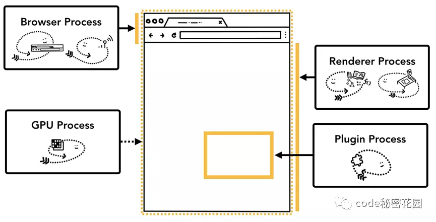
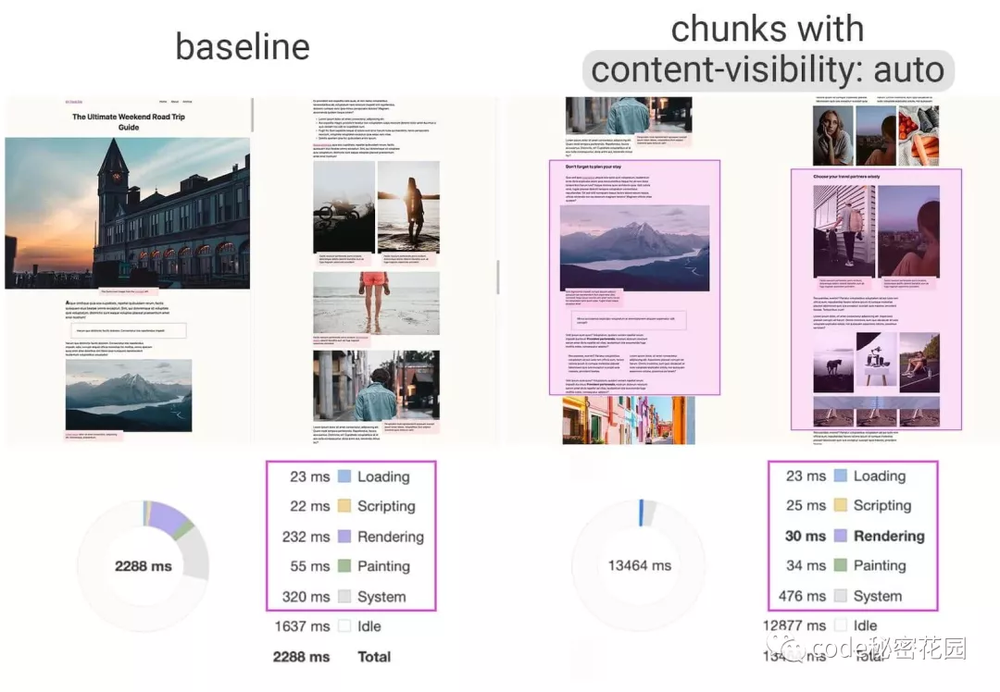

浏览器在接收到服务端返回的HTML后，需要把这段数据渲染成用户看到的页面，在开始渲染第一个元素之前可能还需要经过很多步骤。这个过程适用于整个页面，包括当前不可见的内容。

所以在首屏渲染时，是有很大一部分时间花费在用户不可见的内容上,实际上这部分数据我们没有必要在首屏就把他们渲染出来

**Chrome85**新推出的**content-visibility: auto**就是为了解决上面的问题，它可以告诉浏览器暂时跳过该元素的布局和渲染工作，直到这个元素滚动到当前窗口，从而可以加快整个页面的初始渲染，并且缩短用户和页面交互需要话费的时间

## CSS Containment
Content-visibility依赖于CSS Containement,目前只能在Chromium 85中支持content-visibility属性，但是大多数浏览器都支持CSS Containement.

CSS Containement是一种规范，它的主要目的就是在页面渲染的过程中通过忽略文档中某些子树来提高页面性能

上面我们提到，在首屏渲染时，是有很大一部分时间话费在用户不可见的内容上，实际上这部分数据我们没有必要在首屏就把他们渲染出来。作为开发者，肯定很清楚当前修改的元素是否独立或者影响其他元素。因此如果开发者能把这个信息通过CSS告诉浏览器，那么浏览器就不需要在去考虑其他元素了。CSS Containment模块中提供的contain属性就为我们提供了这种能力

css contain一共有四个属性
- size:在计算改元素盒子大小的时候会忽略其子元素
- layout:元素的内部布局不受外部影响，同时该元素以及其内容也会影响到上机
- style: 声明同时会影响这个元素和其子孙元素的属性，都在这个元素的包含范围内
- paint: 声明这个元素的子孙节点不会在它边缘外显示。同时一个元素在视窗外或因其他原因导致不可见，则同样保证它的子孙节点不会被显示

[CSS Containment](https://developer.mozilla.org/zh-CN/docs/Web/CSS/CSS_Containment)

## content-visiblity
css contain是一个很棒的属性，但是我们不太容易判断要选取它的那个值。现在，我们可以直接应用content-visibility来达到这样的效果，但是配置缺简单的多。

content-visibility属性也有多个值，但是auto这个值是一个可以立刻提高性能的属性。
```
.my-class {
  content-visibility: auto
}
```
如果一个元素具有auto这个属性，如果当前元素没有出现在屏幕上，浏览器就不会渲染它和它的子元素；当元素接近用户的可视区域时，浏览器会接触限制，并开始渲染；这可以保证元素即使被用户看到



看看上面的例子，再将content-visibility:auto设置到一些小的模块后，渲染时间直接从232提升到30ms，性能提升了7倍

## contain-intrinsic-size
如果我们给可视区域外的元素增加了content-visibility:auto属性，那么当滚动条滚到元素之后，如果这个元素很大有一定高度，那么滚动条的长度会发生变化，页面可能会发生抖动。

解决这个问题，可以先使用contains-intrinsic-size 提前给元素设置自然高度大小，比如1000px，这样元素提前占用了一些高度，就不会发生抖动现象了。

## 资料
[原文](https://mp.weixin.qq.com/s/4xNsAKrTbSiRBFMRTgC1sA)