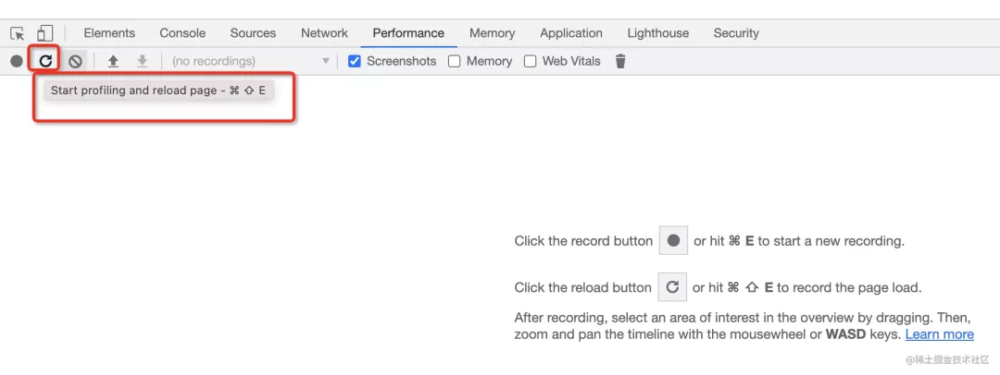
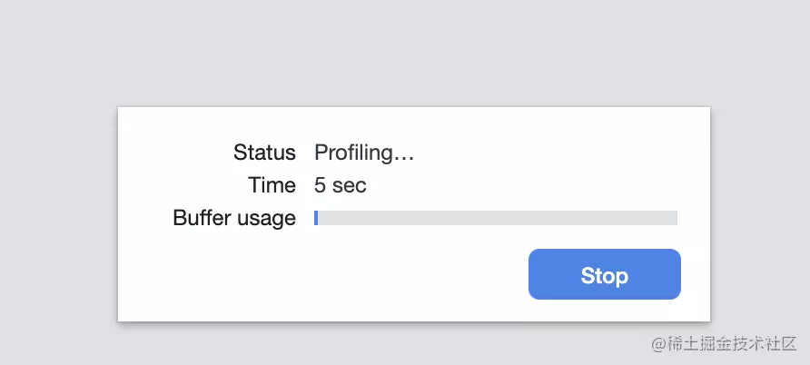
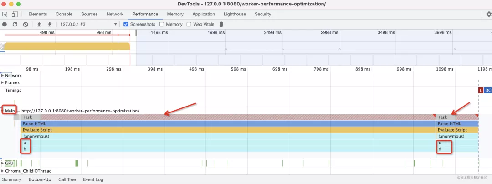
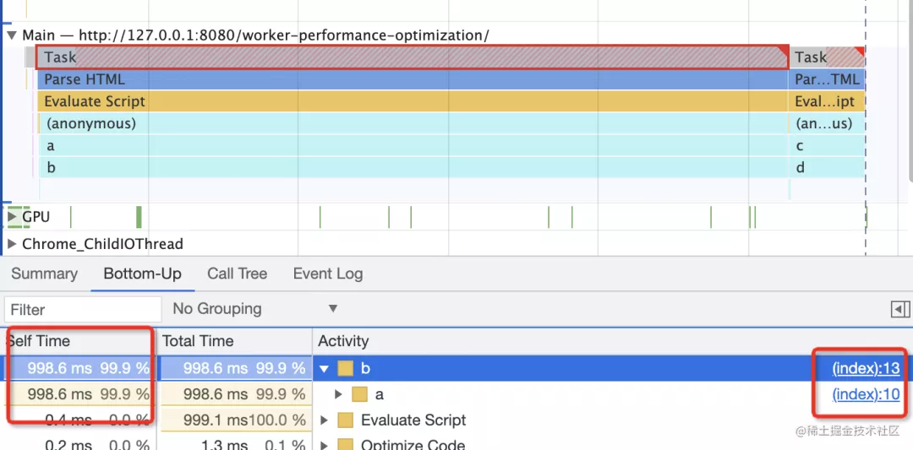
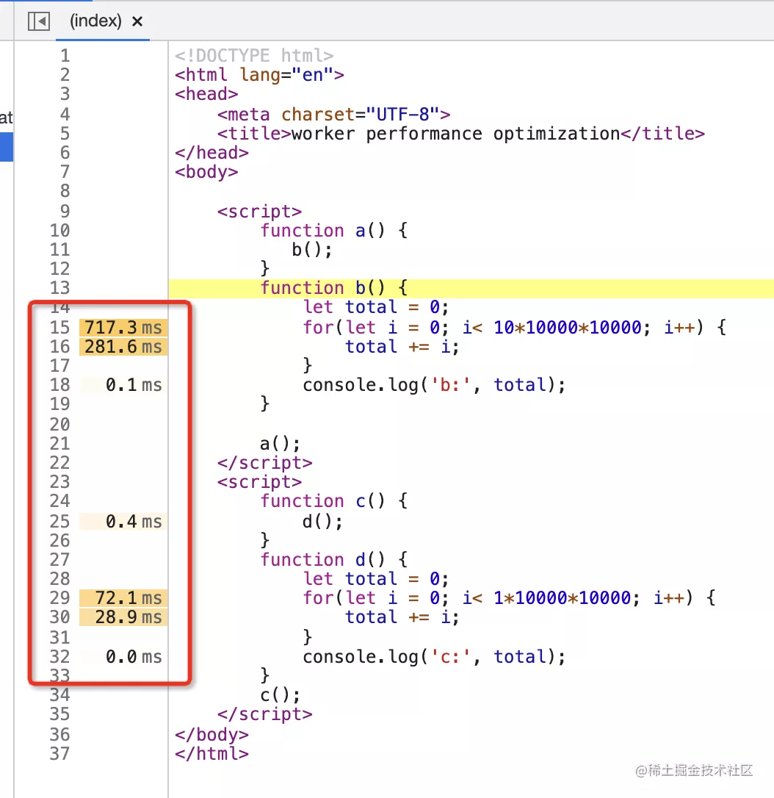
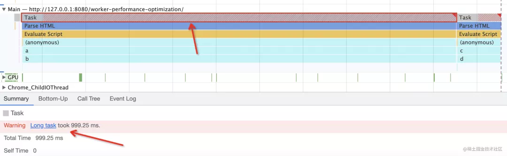
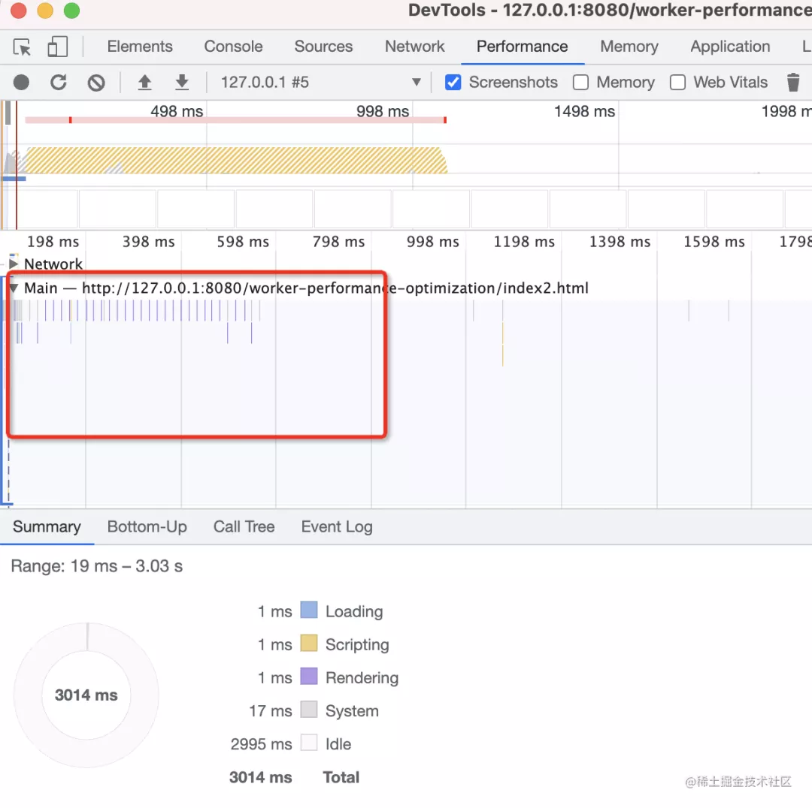
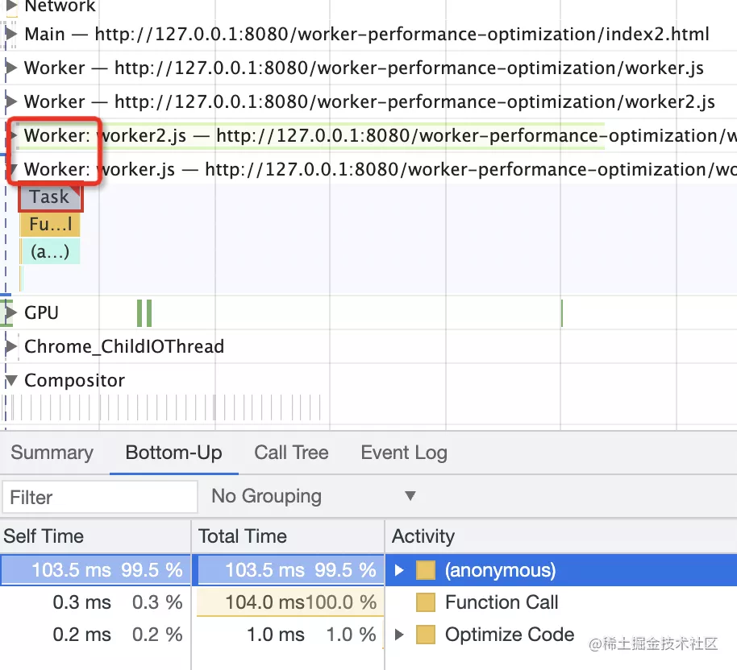
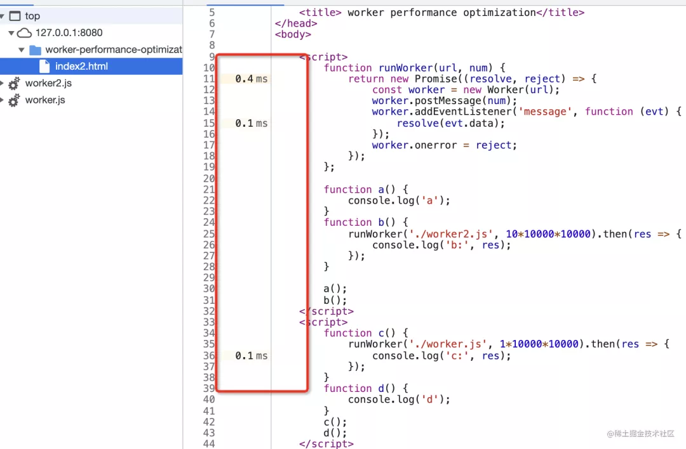

Chrome Devtools的Performance工具是性能分析和优化的利器，因为它可以记录每一段代码的耗时，进而分析处性能瓶颈，然后做针对性的优化

这么强大的工具肯定要好好掌握的，今天我们来做一个性能优化的案例来快速上手Performance吧

## 性能分析
首先，我们准备这样一段代码
```
<!DOCTYPE html>
<html lang="en">
<head>
    <meta charset="UTF-8">
    <title>worker performance optimization</title>
</head>
<body>
    <script>
        function a() {
           b();
        }
        function b() {
            let total = 0;
            for(let i = 0; i< 10*10000*10000; i++) {
                total += i;
            }
            console.log('b:', total);
        }

        a();
    </script>
    <script>
        function c() {
            d();
        }
        function d() {
            let total = 0;
            for(let i = 0; i< 1*10000*10000; i++) {
                total += i;
            }
            console.log('c:', total);
        }
        c();
    </script>
</body>
</html>
```
很明显，两个script标签是两个宏任务，第一个宏任务的调用栈是a、b,第二个宏任务的调用栈是c、d.

我们用Performance来看一下是不是这样：

首先用无痕模式打开chrome，无痕模式下没有插件，分析性能不会收到插件影响

打开 chrome devtools 的 Performance 面板，点击 reload 按钮，会重新加载页面并开始记录耗时：


过几秒结束


这时候界面就会展示出记录的信息：


图中标出的Main就是主线程

主线程是不断执行的Event Loop的，我们看到有两个Task(宏任务)，调用栈分别是a、b和c、d，和我们分析的对上了。(当然，还有一些浏览器内部的函数，比如parseHtml、evaluateScript等，这些可以忽略)

**Performance工具最重要的是分析主线程的Event Loop，分析每个Task的耗时、调用栈等信息**

当你点击某个宏任务的时候，在下面的面板会显示调用栈的详情(选择buttom-up是列表展示，call tree 树形展示)



每个函数的耗时也都显示在左侧，右侧有源码地址，点击可以调到Sources对应代码



直接展示了每行代码的耗时，太方便了！

工具介绍完了，我们来分析下代码那里有性能问题。

很明显，b和d两个函数的循环累加耗时太高了。

在Performance中可以看到Task被标红了，下面的Summary面板也显示了long task的警告



有同学可能会问：为什么要优化long task呢？

**因为渲染和JS执行都在主线程，在一个Event Loop中，会相互阻塞，如果JS有长时间执行的Task，就会阻塞渲染，导致页面卡顿。所以性能分析的主要目的是找到long task，之后消除它**

可能很多同学都不知道，其实网友的渲染也是一个宏任务，所以才会和JS执行相互阻塞。关于这点的证明可以看我前面的一篇文章

[通过Performance证明，网页的渲染是一个宏任务](https://mp.weixin.qq.com/s?__biz=Mzg3OTYzMDkzMg==&mid=2247486730&idx=1&sn=c2267ac48b09f85022c33317fbac1a91&chksm=cf00c231f8774b27ecaf61ac16683aa63ff8c115243be2bba9d8182e41aa71c25de51fec9e59&token=2021091058&lang=zh_CN&scene=21#wechat_redirect)

找到了要优化的代码，也知道了优化的目标(消除long task) 那么就开始优化吧

## 性能优化

我们优化的目标是把两个long task中耗时逻辑(循环累加)给去掉或拆分成多个task。

关于拆分task这点，可以参考React从递归渲染vodm转为链表可打断的渲染vdom的优化，也就是fiber的架构，它的目的就是为了拆分long task

但明显我们这里的逻辑没啥好迟爱芬的，它就是一个大循环

那么能不能不放在主线程炮，放到其他线程跑呢？浏览器的web worker好像就是做耗时计算的性能优化的

我们来试一下

封装这样一个函数，传入url和数字，函数会创建一个worker线程，通过postMessage传递num过去，并且监听message事件来接受返回的数据

```
function runWorker(url, num) {
  return new Promise((resolve, reject) => {
    const worker = new Worker(url);
    worker.postMessage(num);
    worker.addEventListener('message', function(evt) {
      resolve(evt.data)
    })
    worker.onerror = reject;
  })
}
```
然后b和c函数就可以改成这样了
```
function b() {
  runWorker('./woker.js', 10* 10000*10000).then(res => {
    console.log('b:', res)
  })
}
```
耗时逻辑移到了worker线程
```
addEventListener('message', function(evt) {
    let total = 0;
    let num = evt.data;
    for(let i = 0; i< num; i++) {
        total += i;
    }
    postMessage(total);
});
```
完美。我们在跑一下试试



哇！！！long task一个都没有了

然后你会发现Main下城下面多了两个Work线程



虽然Worker还有long task，但是不重要，毕竟计算量在那，只要主线程没有long task就行。

这样，我们通过计算量拆分到worker线程，充分利用了多核CPU的能力，解决了主线程的long task问题，界面交互会很流程

我们在看下Source面板



对比下之前的


这优化力度，肉眼可见！

就这样,我们一起完成了一次网页的性能优化，通过Performance分析处long task，定位到耗时代码，然后通过worker拆分计算量进行优化，成功消除了主线程的long task。

代码闯到了github，感兴趣的可以下拉来用Performance工具分析下

[https://github.com/QuarkGluonPlasma/chrome-devtools-exercise](https://github.com/QuarkGluonPlasma/chrome-devtools-exercise)

## 总结

Chrome Devtools的Performance工具是网页性能分析的利器，它可以记录一段时间内的代码执行情况,比如Main线程的Event Loop、每个Event Loop的task，每个Task的调用栈，每个函数的耗时等，还可以定位到Source中源码位置

性能优化的目标就是找到Task中的long Task，然后消除它。因为网页的渲染是一个宏任务，和JS的宏任务在同一个Event Loop中，是相互阻塞的。

我们做了一个真实的优化案例，通过 Performance 分析出了代码中的耗时部分，发现是计算量大导致的，所以我们把计算逻辑拆分到了 worker 线程以充分利用多核 cpu 的并行处理能力，消除了主线程的 long task。

做完这个性能优化的案例之后，是不是觉得 Peformance 工具用起来也不难呢？

其实会分析主线程的 Event Loop，会分析 Task 和 Task 的调用栈，找出 long task，并能定位到耗时的代码，Performance 工具就算是掌握了大部分了，常用的功能也就是这些。


## 资料
[快速掌握 Performance 性能分析：一个真实的优化案例](https://mp.weixin.qq.com/s/DGiA1Tf66IMo0LFN71bYVA)


### 需要查看的 12.30
[跨浏览器窗口通讯 ，7种方式，你还知道几种呢？](https://juejin.cn/post/7002012595200720927?utm_source=gold_browser_extension)

[nodeJS插件（yargs，inquirer，ora，chalk）-知识记录](https://blog.csdn.net/weixin_44489222/article/details/108352102)

https://www.jianshu.com/p/18b27d97a5e7


https://juejin.cn/post/6914213447169376263

https://ts.xcatliu.com/advanced/class-and-interfaces.html