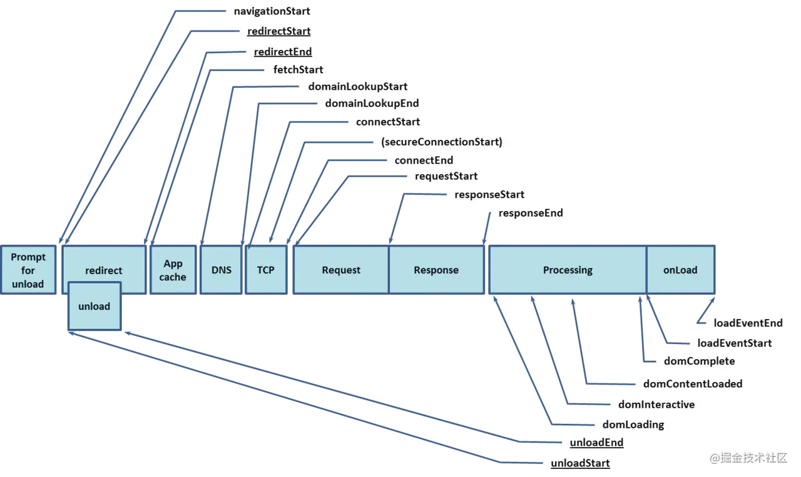
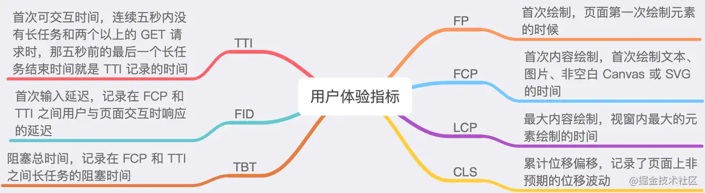

我们平时收集错误，大部分人、公司都采用的Sentry来收集，当然也有好多公司也有自研的前端监控。趁着最近刚好接入sentry，并且要根据自己的调研来做一次分享，总结一下内容

## 上报方式
1. 自动收集
    - 无感知收集
2. 手动上报，手动上报又分为

    ```javascript
    Sentry.captureException('captureException');
    Sentry.captureMessage('captureMessage');
    // 设置用户信息
    scope.setUser({'email': 'xx@xx.cn'});
    // 给事件定义标签
    scope.setTags({'api', 'api/list/get'})
    // 设置时间的严重性
    scope.setLevel('error');
    // 设置附加数据
    scope.setExtra('data', { request: {a: 1, b: 2}});
    // 添加一个面包屑
    Sentry.addBreadcrumb({
        category: 'auth',
        message: 'Authenticated user',
        level: Sentry.Severity.Info
    })
    // 添加一个scope标题？？当前事务名称用于对Performance产品中的事务进行分组，并用错误点注释错误事件
    Sentry.configureScope(scope => scope.setTransactionName('UserListView'));
    // 局部
    Sentry.widthScope(function (scope) {
        scope.setTag('my-tag', 'my value');
        scope.setLevel('warning');
        // will be tagged with my-tag="my value"
        Sentry.captureException(new Error('my error'));
    })
    // 设置上下文
    Sentry.setContext('character', {
        name: 'Mighty Fighter',
        age: 19,
        attack_type: 'melee'
    })
    ```
    而captureException和captureMessage的实现大概是这样的
    ```javascript
    // 手动触发throw一个报错，然后把报错的信息重置为用户输入的，然后调用callOnHub来触发一个上报
    function captureException(exception, captureContext) {
        var syntheticException;
        try {
            throw new Error('Sentry syntheticException') 
        } catch (exception) {
            syntheticException = exception;
        }
        return callOnHub('captureException', exception, {
            captureContext: captureContext,
            originalException: exception,
            syntheticException: syntheticException,
        })
    }
    function captureMessage(message, captureContext) {
        var syntheticException;
        try {
            throw new Error(message)
        } catch(exception) {
            syntheticException = exception;
        }
        return callOnHub('captureMessage', message，level, tslib_1.__assign({ originalException: message, syntheticException: syntheticException }, context))
    }
    ```
## 上传source map
Sentry上传source map大概分为三种方式吧
- 官方cli(sentry-cli)
    - [官方文档](https://docs.sentry.io/platforms/javascript/sourcemaps/#webpack)
- 调用HTTP API
    - [API](https://docs.sentry.io/api/)
- webpack 插件

我主要讲解一下webpack的实现方式,其他的方式请自行查看。其实sentry主要是使用@sentry/webpack-plugin这个插件进行source map上传的
```javascript
yarn add --dev @sentry/webpack-plugin

const SentryWebpackPlugin = require('@sentry/webpack-plugin');
module.export = {
    // other configuration
    configuration: {
        plugins: [
            // sentry-cli configuration
            authToken: process.env.SENTRY_AUTH_TOKEN,
            org: 'example-ort',
            project: 'example-project',
            release: process.env.SENTRY_RELEASE,
            // webpack specific configuration
            include: '.',
            ignore: ['node_module', 'webpack.config.js']
        ]
    }
}
```
### @sentry/webpack-plugin上传的原理
<span style="color:red">大概的一个过程就是在webpack的afterEmit钩子，获取到打包之后的文件。然后过滤得出文件类型是/\.js$|\.map$/结尾的就上传到sentry的服务器上。然后删除的时候只删除/\.map$/结尾的文件</span>

```javascript
 // upload sourcemaps
 apply(compiler) {
   // afterEmit在生成文件到output目录之后执行
   compiler.hooks.afterEmit.tapAsync(this.name, async (compilation, callback) => {
     const files = this.getFiles(compilation);
     try {
       await this.createRelease();
       await this.uploadFiles(files);
       console.info('\n\u001b[32mUpload successfully.\u001b[39m\n');
     } catch (error) {
       // todo
     }
     callback(null);
   });
 }

 // 获取需要上传的文件
 getFiles(compilation) {
   // 通过 compilation.assets 获取我们需要的文件信息，格式信息
       // compilation.assets {
       // 'bundle.js': SizeOnlySource { _size: 212 },
       // 'bundle.js.map': SizeOnlySource { _size: 162 }
       // }
   return Object.keys(compilation.assets)
     .map((name) => {
     if (this.isIncludeOrExclude(name)) {
       return { name, filePath: this.getAssetPath(compilation, name) };
     }
     return null;
   })
     .filter(Boolean);
 }

 // 获取文件的绝对路径
 getAssetPath(compilation, name) {
    return path.join(compilation.getPath(compilation.compiler.outputPath), name.split('?')[0]);
 }
 // 上传文件
 async uploadFile({ filePath, name }) {
   console.log(filePath);
   try {
     await request({
       url: `${this.sentryReleaseUrl()}/${this.release}/files/`, // 上传的sentry路径
       method: 'POST',
       auth: {
         bearer: this.apiKey,
       },
       headers: {},
       formData: {
         file: fs.createReadStream(filePath),
         name: this.filenameTransform(name),
       },
     });
   } catch (e) {
     console.error(`uploadFile failed ${filePath}`);
   }
 }

 // 删除 sourcemaps
 sentryDel(compiler) {
   compiler.hooks.done.tapAsync(this.name, async (stats, callback) => {
     console.log('Whether to delete SourceMaps:', this.isDeleteSourceMaps);
     if (this.isDeleteSourceMaps) {
       await this.deleteFiles(stats);
       console.info('\n\u001b[32mDelete SourceMaps done.\u001b[39m\n');
     }
     callback(null);
   });
 }
 // 删除文件
 async deleteFiles(stats) {
   console.log();
   console.info('\u001b[33mStarting delete SourceMaps...\u001b[39m\n');

   Object.keys(stats.compilation.assets)
     .filter((name) => this.deleteRegex.test(name))
     .forEach((name) => {
     const filePath = this.getAssetPath(stats.compilation, name);
     if (filePath) {
       console.log(filePath);
       fs.unlinkSync(filePath);
     } else {
       console.warn(`bss-plugin-sentry: 不能删除 '${name}', 文件不存在, 由于生成错误它可能没有创建`);
     }
   });
 }
```
但是@sentry/webpack-plugin上传完之后不支持删除source map，所以我们可以使用[webpack-sentry-plugin](https://github.com/40thieves/webpack-sentry-plugin/blob/master/src/index.js)这个插件，好像也是官方处的吧，是支持上传完之后删除source map的，使用的话可以参考文档
```javascript
export const SentryPluginConfig = {
    deleteAfterCompile: true, // 上传完 source-map 文件后要不要删除当前目录下的source-map 文件
    // Sentry options are required
    organization: '', // 组名
    project: '', // 当前项目名
    baseSentryURL: 'https://xxx', // 默认是 https://sentry.io/api/0，也即是上传到 sentry 官网上去，如果是自己搭建的 sentry 系统，那把sentry.io替换成你自己的sentry系统域名就行。
    apiKey: '',
    // Release version name/hash is required
    release: SentryRelease, // 版本
}
```
## 原理
### 异常捕获
**<span style="color: red;">前端捕获异常分为全局捕获和单点捕获</span>**
- <span style="color: blue">全局捕获代码集中，易于管理</span>
- <span style="color: blue">单点捕获作为补充，对某些特殊情况进行捕获，但分散，不利于管理</span>

1. 全局捕获
    - <span style="color: blue">通过全局的接口，将捕获代码集中写在一个地方，可以利用的接口有：</span>
        - <span style="color: blue">window.addEventListener('error')</span>
        - <span style="color: blue">window.addEventListener('unhandledrejection')</span>
        - <span style="color: blue">document.addEventListener('click')</span>
        - 等
    - <span style="color: blue">框架级别的全局监听</span>
        - <span style="color: blue">例如axios中使用interceptor进行拦击</span>
        - <span style="color: blue">vue、react都有自己的错误采集接口</span>
    - <span style="color: blue">通过对全局函数进行封装包裹，实现在在调用该函数时自动捕获异常</span>
    - <span style="color: blue">对实例方法重写(Patch), 在原有功能基础上包裹一层</span>
        - <span style="color: blue">例如对setTimeout进行重写，在使用方法不变的情况下也可以捕获异常</span>
2. 单点捕获
    - <span style="color: blue">在业务代码中对单个代码快进行包裹，活在逻辑流程中大点，实现有针对性的异常捕获</span>
    - <span style="color: blue">trye-catch</span>
    - <span style="color: blue">专门写一个函数来收集异常信息，在异常发生时，调用该函数</span>
    - <span style="color: blue">专门写一个函数来包裹其他函数，得到一个新函数，该新函数运行结果和原函数一模一样，只是在发生异常时可以捕获异常</span>

### 详细讲解
- window.onerror
    - **<span style="color:orange">监控JavaScript运行时错误(包括语法错误)和资源加载错误</span>**

    ```javascript
    window.onerror = function(message, source ,lineno, colno, error) {...}
    window.addEventListener('error', function(event) {...}, true)
    // 函数参数：
        // message：错误信息（字符串）。可用于HTML onerror=""处理程序中的event。
        // source：发生错误的脚本URL（字符串）
        // lineno：发生错误的行号（数字）
        // colno：发生错误的列号（数字）
        // error：Error对象（对象

    /**
     * 大家可以看到JS错误监控里面有个window.onError,又用了window.addEventListener('error'),其实两者并不能互相代替
    window.onError是一个标准的错误捕获接口，它可以拿到对应的这种JS错误;
    window.addEventListener('error')也可以捕获到错误，但是它拿到的JS报错堆栈往往是不完整的。
    同时window.onError无法获取到资源加载失败的情况，
    必须使用window.addEventListener('error')来获取资源加载失败的情况
    **/
    ```
- Promise
    - **<span style="color:orange">Promise的话主要是unhandledrejection事件，也就是未被catch的reject状态的promise</span>**
    
    ```javascript
    window.addEventListener('unhandledrejection', event => {
        console.wran(`UNHANDLED PROMISE REJECTION: ${event.reason}`)
    })
    ```
- setTimeout、setInterval、requestAnimationFrame等
    - **<span style="color:orange">其实就是通过代理的方式把原来的方法拦截一下在调用真实的方法之前做一些自己的事情</span>**

    ```javascript
    const prevSetTimeout = window.setTimeout;
    window.setTimeout = function(callback, timeout) {
        const self = this;
        return prevSetTimeout(function() {
            try {
                callback.call(this);
            } catch(e) {
                // 捕获到详细的错误，在这里处理日志上报等逻辑
                // ...
                throw e;
            }
        }, timeout)
    }
    ```
- Vue的Vue.config.errorHandler
    - 和上面的同理
    ```javascript
    // sentry中对Vue errorHandler的处理
    function vuePlugin(Raven, Vue) {
        var _oldOnError = Vue.config.errorHandler;
        Vue.config.errorHandler = function VueErrorHandler(error, vm, info) {
            // 上报
            Raven.captureException(error, {
            extra: metaData
            });

            if (typeof _oldOnError === 'function') {
            // 为什么这么做？
            _oldOnError.call(this, error, vm, info);
            }
        };
    }
    ```
- React的ErrorBoundary
    - **<span style="color:orange"> ErrorBoundary的定义：如果一个class组件中定义了static getDerivedStateFromError()或componentDidCatch()这两个声明周期方法中的任意一个(或两个)时，那么它就变成了一个错误边界。当抛出错误后，请使用static getDerivedStateFromError()渲染备用 UI ，使用componentDidCatch()打印错误信息</span>**

    ```javascript
    // ErrorBoundary的示例
    class ErrorBoundary extends React.Component {
        constructor(props) {
            super(props);
            this.state = {hasError: false}
        }

        componentDidCatch(error, info) {
            this.setState({ hasError: true });
            // 这里可以做异常的上报
            logErrorToMyService(error, info);
        }
         render() {
            if (this.state.hasError) {
            return <h1>Something went wrong.</h1>;
            }
            return this.props.children;
        }
    }

    <ErrorBoundary>
        <MyWidget />
    </ErrorBoundary>
    ```
- 那么Sentry是怎么实现的呢？
    ```javascript
    // ts声明的类型，可以看到sentry大概实现的方法
    /**
    * A ErrorBoundary component that logs errors to Sentry.
    * Requires React >= 16
    */
    declare class ErrorBoundary extends React.Component<ErrorBoundaryProps, ErrorBoundaryState> {
        state: ErrorBoundaryState;
        componentDidCatch(error: Error, { componentStack }: React.ErrorInfo): void;
        componentDidMount(): void;
        componentWillUnmount(): void;
        resetErrorBoundary: () => void;
        render(): React.ReactNode;
    }

    // 真实上报的地方
    ErrorBoundary.prototype.componentDidCatch = function (error, _a) {
    var _this = this;
    var componentStack = _a.componentStack;
    // 获取到配置的props
    var _b = this.props, beforeCapture = _b.beforeCapture, onError = _b.onError, showDialog = _b.showDialog, dialogOptions = _b.dialogOptions;
    withScope(function (scope) {
        // 上报之前做一些处理，相当于axios的请求拦截器
        if (beforeCapture) {
        beforeCapture(scope, error, componentStack);
        }
        // 上报
        var eventId = captureException(error, { contexts: { react: { componentStack: componentStack } } });
        // 开发者的回调
        if (onError) {
        onError(error, componentStack, eventId);
        }
        // 是否显示sentry的错误反馈组件（也是一种收集错误的方式）
        if (showDialog) {
        showReportDialog(__assign(__assign({}, dialogOptions), { eventId: eventId }));
        }
        // componentDidCatch is used over getDerivedStateFromError
        // so that componentStack is accessible through state.
        _this.setState({ error: error, componentStack: componentStack, eventId: eventId });
    });
    };
    ```
- 请求
    - **<span style="color: orange">XHR通过重写(拦截)send和open</span>**
    - **<span style="color: orange">fetch通过拦截整个方法(需要讨论，reject的情况)</span>**
    - **<span style="color: orange">axios通过请求/响应拦截器</span>**
    :::danger
    注意：sentry支持自动收集和手动收集两种错误收集方法，但是还不能捕获到异步操作、接口请求中的错误，比如接口返回404、500等信息，此时我们可以通过Sentry.caputureException()进行主动上报
    :::
    1. xhr的实现
        ```javascript
        function fill(source, name, replacementFactory) {
            var original = source[name];
            var wrapped = replacementFactory(original);
            source[name] = wrapped;
        }
        // xhr
        function instrumentXHR(): void {
        // 保存真实的xhr的原型
        const xhrproto = XMLHttpRequest.prototype;
        // 拦截open方法
        fill(xhrproto, 'open', function (originalOpen: () => void): () => void {
            return function (this: SentryWrappedXMLHttpRequest, ...args: any[]): void {
                const xhr = this;
                const onreadystatechangeHandler = function (): void {
                if (xhr.readyState === 4) {
                    if (xhr.__sentry_xhr__) {
                        xhr.__sentry_xhr__.status_code = xhr.status;
                    }
                    // // 上报sentry
                    triggerHandlers('xhr', {
                    args,
                    endTimestamp: Date.now(),
                    startTimestamp: Date.now(),
                    xhr,
                    });
                }
                };

            if ('onreadystatechange' in xhr && typeof xhr.onreadystatechange === 'function') {
            // 拦截onreadystatechange方法
            fill(xhr, 'onreadystatechange', function (original: WrappedFunction): Function {
                return function (...readyStateArgs: any[]): void {
                onreadystatechangeHandler();
                // 返回原来的方法
                return original.apply(xhr, readyStateArgs);
                };
            });
            } else {
            xhr.addEventListener('readystatechange', onreadystatechangeHandler);
            }
            // 调用原来的方法
            return originalOpen.apply(xhr, args);
        };
        });
            // fill其实就是拦截的一个封装originalSend就是原来的send方法
        fill(xhrproto, 'send', function (originalSend: () => void): () => void {
            return function (this: SentryWrappedXMLHttpRequest, ...args: any[]): void {
                // 上报sentry
                triggerHandlers('xhr', {
                args,
                startTimestamp: Date.now(),
                xhr: this,
                });
                // 返回原来方法
                return originalSend.apply(this, args);
            };
        });
        }
        ```
    2. fetch 
        ```javascript
        // 重写fetch
        function instrumentFetch() {
            if (!supportsNativeFetch()) {
                return;
            }
            fill(global$2, 'fetch', function (originalFetch) {
                return function () {
                var args = [];
                for (var _i = 0; _i < arguments.length; _i++) {
                    args[_i] = arguments[_i];
                }
                var handlerData = {
                    args: args,
                    fetchData: {
                    method: getFetchMethod(args),
                    url: getFetchUrl(args),
                    },
                    startTimestamp: Date.now(),
                };
                triggerHandlers('fetch', __assign({}, handlerData));
                // eslint-disable-next-line @typescript-eslint/no-unsafe-member-access
                return originalFetch.apply(global$2, args).then(function (response) {
                    triggerHandlers('fetch', __assign(__assign({}, handlerData), { endTimestamp: Date.now(), response: response }));
                    return response;
                }, function (error) {
                    triggerHandlers('fetch', __assign(__assign({}, handlerData), { endTimestamp: Date.now(), error: error }));
                    throw error;
                });
                };
            });
        }
        ```
    - console.xxx
        ```javascript
        function instrumentConsole() {
            if (!('console' in global$2)) {
                return;
            }
            ['debug', 'info', 'warn', 'error', 'log', 'assert'].forEach(function (level) {
                if (!(level in global$2.console)) {
                return;
                }
                fill(global$2.console, level, function (originalConsoleLevel) {
                return function () {
                    var args = [];
                    for (var _i = 0; _i < arguments.length; _i++) {
                    args[_i] = arguments[_i];
                    }
                    // 上报sentry
                    triggerHandlers('console', { args: args, level: level });
                    // this fails for some browsers. :(
                    if (originalConsoleLevel) {
                    Function.prototype.apply.call(originalConsoleLevel, global$2.console, args);
                    }
                };
                });
            });
            }
        ```
## 性能监控(建议阅读[Web Vitals](https://web.dev/vitals/))




### 关键数据获取(仅供参考)
- <span style="color: blue">首屏时间：页面开始展示的时间点-开始请求的时间点</span>
- <span style="color: blue">白屏时间：responseEnd - nvigationStart</span>
- <span style="color: blue">页面总下载时间：loadEventEnd - navigationStart</span>
- <span style="color: blue">DNS解析耗时: domainLookupEnd - domainLookupStart</span>
- <span style="color: blue">TCP链接耗时: connetEnd - connectStart</span>
- <span style="color: blue">首包请求耗时: responseEnd - responmseStart</span>
- <span style="color: blue">dom解释耗时：domComplete - domInteractive</span>
- <span style="color: blue">用户可操作时间： domContentLoadedEventEnd - navigationStart</span>
:::danger
**注意**：由于window.performance.timing是一个在不同阶段，被不停修正的一个参数对象，所以，建议在window.onload中进行性能数据读取和上报
:::
```javascript
// 收集性能信息
export const getPerformance = () => {
    if(!window.performance) return null;
    const {timing} = window.performance;
    if ((getPerformance as any).__performance__) {
        return (getPerformance as any).__performance__;
    }
    const performance = {
        // 重定向耗时
        redirect: timing.redirectEnd - timing.redirectStart,
        // 白屏时间 html head script执行开始时间
        whiteScreen: window.__STARTTIME__- timing.navigationStart,
        // DOM渲染耗时
        dom: timing.domComplete - timing.domLoading,
        // 页面加载耗时
        load: timing.loadEventEnd - timing.naavigationStart,
        // 请求耗时
        request: timing.responseEnd - timing.requestStart,
        // 获取性能信息时当前时间
        time: new Date().getTime(),   
    };
    (getPerformance as any).__performance__ = performance;
    return performance;
}
```
**sentry的性能监控其实主要依靠web-vitals这个包，主要依靠PerformanceObserver()实现**

## 上报方式
- <span style="color:blue">通过xhr上报(Sentry采用的方式)</span>
    - 判断使用什么方式上报，首先判断是否支持fetch，不支持的话就使用xhr
    ```javascript
    BrowserBackend.prototype._setupTransport = function () {
        if (!this._options.dsn) {
                // We return the noop transport here in case there is no Dsn.
                // 没有设置dsn，调用BaseBackend.prototype._setupTransport 返回空函数
                return _super.prototype._setupTransport.call(this);
        }
        var transportOptions = __assign({}, this._options.transportOptions, { dsn: this._options.dsn });
        if (this._options.transport) {
                return new this._options.transport(transportOptions);
        }
        // 支持Fetch则返回 FetchTransport 实例，否则返回 XHRTransport实例，
        // 这两个构造函数具体代码在开头已有提到。
        if (supportsFetch()) {
                return new FetchTransport(transportOptions);
        }
        return new XHRTransport(transportOptions);
    };
    ```
- <span style="color:blue">fetch方式发送请求</span>
    ```javascript
    FetchTransport.prototype.sendEvent = function (event) {
        var defaultOptions = {
                body: JSON.stringify(event),
                method: 'POST',
                referrerPolicy: (supportsReferrerPolicy() ? 'origin' : ''),
        };
        return this._buffer.add(global$2.fetch(this.url, defaultOptions).then(function (response) { return ({
                status: exports.Status.fromHttpCode(response.status),
        }); }));
    };
    ```
- <span style="color:blue">xhr发送请求</span>
    ```javascript
    class XHRTransport extends BaseTransport {
        sendEvent(event) {
            return this._sendRequest(eventToSentryRequest(event, this._api), event);
        }
        _sendRequest(sentryRequest, originalPayload) {
            // 如果超过限制的数量%就不发送
            if (this._isRateLimited(sentryRequest.type)) {
            return Promise.reject({
                event: originalPayload,
                type: sentryRequest.type,
                reason: `Transport locked till ${this._disabledUntil(sentryRequest.type)} due to too many requests.`,
                status: 429,
            });
            }
            return this._buffer.add(new SyncPromise((resolve, reject) => {
            const request = new XMLHttpRequest();
            request.onreadystatechange = () => {
                if (request.readyState === 4) {
                const headers = {
                    'x-sentry-rate-limits': request.getResponseHeader('X-Sentry-Rate-Limits'),
                    'retry-after': request.getResponseHeader('Retry-After'),
                };
                this._handleResponse({ requestType: sentryRequest.type, response: request, headers, resolve, reject });
                }
            };
            request.open('POST', sentryRequest.url);
            for (const header in this.options.headers) {
                if (this.options.headers.hasOwnProperty(header)) {
                request.setRequestHeader(header, this.options.headers[header]);
                }
            }
            request.send(sentryRequest.body);
            }));
        }
        }

        this._buffer.add(task) {
        if (!this.isReady()) {
            return SyncPromise.reject(new SentryError('Not adding Promise due to buffer limit reached.'));
        }
        if (this._buffer.indexOf(task) === -1) {
            this._buffer.push(task);
        }
        task
            .then(() => this.remove(task))
                .then(null, () => this.remove(task).then(null, () => {
            // We have to add this catch here otherwise we have an unhandledPromiseReject      
                    // because it's a new Promise chain      
                })
                );
        return task;
        }
    ```
- <span style="color:blue">new Image()上报</span>
    ```javascript
    var REPORT_URL  = 'xxx'; // 数据上报接口
    var img = new Image; // 创建img标签
    img.onload = img.onerror = function() { // img加载完成或加载src失败时的处理
        img = null; // img置空，不会循环触发onload/onerror
    }
    img.src = REPORT_URL  + Build._format(params); // 数据上报接口地址冰洁上报餐朱作为img的src
    // 或者
    
    ```
:::tip
- 拓展
    比如我们的一些打点之类的，我们有些数据上报都是采用new Images()的方式去上报的，那么真的就只是随便一个资源就可以吗？
    1. 为什么不能用请求其他的文件资源(js/css/ttf)的方式进行上报？
        - 这个浏览器的特性有关。通常，创建资源节点后只有将对象注入到浏览器DOM树后，浏览器才会实际发送资源请求。反复操作DOM不仅会引发性能问题，而且载入js/css资源还会阻塞页面渲染，影响用户体验
        - 但是图片资源例外。图片打点不仅不用插入DOM，只要在js中new出Image对象就能发起请求，而且还没有阻塞问题，在没有js的浏览器环境中也能通过img标签正常打点，这是其他类型的资源请求所做不到的。所以，在所有通过文件资源进行打点的方案中，使用图片是最好的解决方案。
    2. 同样都是图片，上报选用了1X1的透明GIF,而不是其他的PNG/JPEG/BMP文件？
        - 原因其实不太好想，需要分开来看。首先，1x1像素是最小的合法图片。而且，因为是通过图片打点，所以图片最好是透明的，这样一来不会影响页面本身展示效果，二是表述图片透明只要使用一个二进制位标记图片是透明色即可，不用存储彩色空间数据，可以解决体积
        - 运维需要透明色，所以可以直接排除JPEG(BMP32格式可以支持透明)。然后剩下的BMP、PNG和GIF,但是为什么会选GIF呢？因为体积小！同样的响应，GIF可以比BMP节约41%的流量，比PNG节约35%的流量
    
**总结：**使用img元素发送不会影响页面的展示、性能和体验这些，就不会带来副作用，还有一个使用GIF的格式是因为体积小
:::

## more
### 录制
- 除了报错和性能，其实sentry还可以录制屏幕的信息，来更快的帮助开发者定位错误[官方文档](https://docs.sentry.io/platforms/javascript/configuration/integrations/rrweb/),sentry的错误录制其实主要依赖[rrweb](https://link.juejin.cn/?target=https%3A%2F%2Fwww.npmjs.com%2Fpackage%2Frrweb)这个包实现
    - <span style="color: blue">大概的流程就是首先保存一个一开始完整的dom的快照，然后为每个节点生成一个唯一的id.</span>
    - <span style="color: blue">当dom变化的时候通过MutationObserver来监听具体是哪个DOM的哪个属性发生了什么变化，保存起来。</span>
    - <span style="color: blue">监听页面的鼠标和键盘的交互事件来记录位置和交互信息，最后用来模拟实现用户的操作。</span>
    - <span style="color: blue">然后通过内部的解析方法来解析(这一步是最难得)</span>
    - <span style="color: blue">通过渲染dom并用RAF来播放，就好像在看一个视频一样</span>
### sentry获取url的方式(通过dsn)
- 这里我把sentry获取上报的url的代码给精简逻辑拼接起来了，方便大家理解
    ```javascript
    // 匹配DSN的正则
    const DSN_REGEX = /^(?:(\w+):)\/\/(?:(\w+)(?::(\w+))?@)([\w.-]+)(?::(\d+))?\/(.+)/;
    const dsn = 'https://3543756743567437634345@sentry.com/430'; // 假的dsn
    // 获取到正则匹配到的分组信息
    const match = DSN_REGEX.exec(dsn);
    const [protocol, publicKey, pass = '', host, port = '', lastPath] = match.slice(1);
    const obj = {
    'protocol': protocol,
    'publicKey': publicKey,
    'pass': pass,
    'host': host,
    'port': port,
    'lastPath': lastPath,
    'projectId': lastPath.split('/')[0],
    }
    // 打印信息
    console.log('obj', JSON.stringify(obj));
    // {
    //     protocol: "https",
    //     publicKey: "3543756743567437634345",
    //     pass: "",
    //     host: "sentry.com",
    //     port: "",
    //     lastPath: "430",
    //     projectId: "430",
    // }

    function getBaseApiEndpoint() {
    const dsn = obj;
    const protocol = dsn.protocol ? `${dsn.protocol}:` : '';
    const port = dsn.port ? `:${dsn.port}` : '';
    return `${protocol}//${dsn.host}${port}${dsn.path ? `/${dsn.path}` : ''}/api/`;
    }
    console.log('getBaseApiEndpoint', getBaseApiEndpoint());
    // https://sentry.com/api/

    // 不同的事件类型发送到不同的域名
    function getIngestEndpoint(target) {
    const eventType = event.type || 'event';
    const useEnvelope = eventType === 'transaction';
    target = useEnvelope ? 'envelope' : 'store';
    const base = this.getBaseApiEndpoint();
    const dsn = obj;
    return `${base}${dsn.projectId}/${target}/`;
    }
    console.log('getIngestEndpoint', getIngestEndpoint());
    // https://sentry.com/api/430/store/

    function getStoreOrEnvelopeEndpointWithUrlEncodedAuth() {
    return `${this.getIngestEndpoint()}?${this.encodedAuth()}`;
    }
    // 获取到认证的信息，可以理解为一个凭证
    function encodedAuth() {
    const dsn = obj;
    const auth = {
        // We send only the minimum set of required information. See
        // https://github.com/getsentry/sentry-javascript/issues/2572.
        sentry_key: dsn.publicKey,
        sentry_version: SENTRY_API_VERSION = 7, // 写死的7,不同的版本不一样
    };
    return urlEncode(auth);
    }

    // 格式化url
    function urlEncode(object) {
    return Object.keys(object)
        .map(key => `${encodeURIComponent(key)}=${encodeURIComponent(object[key])}`)
        .join('&');
    }
    // 最后获取到的完整的url
    console.log('getStoreOrEnvelopeEndpointWithUrlEncodedAuth', getStoreOrEnvelopeEndpointWithUrlEncodedAuth());
    // https://sentry.com/api/430/store/?sentry_key=3543756743567437634345&sentry_version=7
    ```
- store和envelopes的不同我也不是很理解，**按照表现来看的话就是上报的数据格式不一样，而且store的有响应返回，envelopes的无响应放回**
- 具体可以参考：[store](https://develop.sentry.dev/sdk/store/)、[envelopes](https://develop.sentry.dev/sdk/envelopes/) 有了解的可以在评论区告诉我哦

### Vue2.x中对errorHandle的处理src/core/util/error.js

```javascript
// @flow
import config from '../config';
import { warn } from './debug';
import { inBrowser, inWeex } from './env';
import { isPromise } from 'shared/util'
import { pushTarget, popTarget } from '../observer/dep'
```

### sentry中检测是否支持fetch
### 路由和组件性能
### 扩展

## 名词解释
- [docs.sentry.io/product/per…](https://docs.sentry.io/product/performance/web-vitals/)
- [docs.sentry.io/product/per…](https://docs.sentry.io/product/performance/metrics/)
- [性能指标](https://juejin.cn/post/6850037270729359367)

## 资料
[Sentry原理--收集错误、上报](https://juejin.cn/post/6957475955858210823#heading-15)

[sentry性能监控之入门(翻译)](https://juejin.cn/post/6860332652818513927)

[Sentry Web 前端监控 - 官方最佳实践教程](https://juejin.cn/post/7007607369962094599)

[sentry + vue实现错误日志监控](https://blog.csdn.net/sinat_36065456/article/details/93045793)
